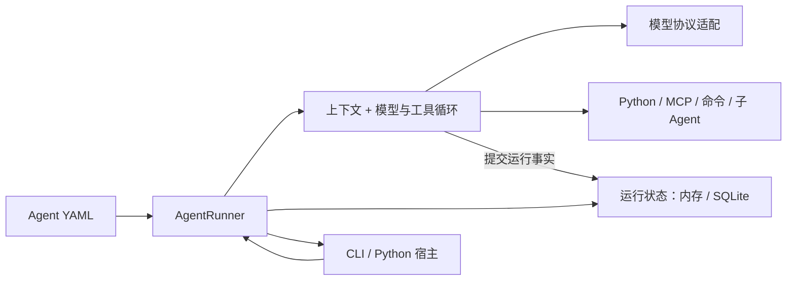

# Iris

**用 YAML 声明 Agent，用 Python 接入自己的应用。**

Iris 是面向 Python 开发者的本地优先 Agent Kit。它把模型调用、工具执行、上下文管理、人工交互和运行状态组织在一个可组合的内核中，让你从终端里的第一个助手开始，再接入自己的脚本或界面。

[开始使用](docs/getting-started/quickstart.md) · [理解设计](docs/design/architecture.md) · [文档首页](docs/index.md) · [参与贡献](docs/contributing/index.md)

## 为什么使用 Iris

- **配置与应用代码分工清楚。** YAML 声明模型、系统要求和工具，Python SDK 控制输入、运行结果和资源生命周期；CLI 与自己的宿主复用同一份 Agent 配置。
- **围绕本地项目工作。** 配置、workspace、Skill 和模板保存在文件中，运行状态可选择进程内存储或 SQLite，无需先部署远程状态服务。
- **按需要组合能力。** 接入 Python/MCP 工具、子 Agent、命令环境、图片和语音转录；长期记忆、Goal、项目经验与观测均有明确的启用和接入边界。
- **完整运行有可解释的状态。** 模型与工具循环之外，还提供人工等待、取消、恢复、历史分支及上下文压缩，宿主不必从聊天消息重新推测任务进度。

适合本地项目助手、文件与工具驱动的任务，以及需要将 Agent 嵌入 Python 应用的场景。本地优先不等于模型推理离线：模型和联网工具仍可使用远程服务。Iris 提供 Kit 与集成接口，UI、Web 服务和模型部署由宿主选择。

## 最小体验

需要 Python 3.12+、uv 和可用的模型凭据。以下从源码安装，在仓库根目录运行：

```powershell
git clone https://github.com/Tsubaki-01/Iris.git
cd Iris
uv sync
```

创建 `agent.yaml`：

```yaml
name: first-agent
model: deepseek/deepseek-flash
system: 你是一个中文助手，清楚说明依据，不编造项目事实。
```

PowerShell 中设置凭据并启动：

```powershell
$env:IRIS_PROVIDER_API_KEYS__DEEPSEEK = "替换为你的 API key"
uv run iris chat agent.yaml
```

输入问题即可开始，`/exit` 退出。也可使用 `--env-file .env.local` 显式加载凭据。模型默认使用 Responses，其他服务或协议的设置见[配置参考](docs/reference/configuration.md)。

接下来按[快速开始](docs/getting-started/quickstart.md)增加文件工具与 SQLite，或将同一 YAML [接入 Python](docs/getting-started/python-sdk.md)。安装步骤依据本仓库，不假定公共包仓库中的同名包就是本项目。

## 整体如何工作



Runner 拥有完整任务的创建、继续和结算；runtime 推进一次激活；store 保存权威状态。宿主负责界面和进程资源。详情见[架构总览](docs/design/architecture.md)。

## 从任务进入文档

| 你想做什么 | 入口 |
| --- | --- |
| 配置模型、背景与工具 | [配置 Agent](docs/cookbook/configure-agent.md)、[工具开发](docs/cookbook/tools.md)、[MCP](docs/cookbook/mcp.md) |
| 处理会话、人工回答、取消与恢复 | [会话管理](docs/cookbook/sessions.md)、[人工交互与恢复](docs/cookbook/hitl-recovery.md) |
| 控制长对话上下文 | [使用指南](docs/cookbook/context.md)、[设计总览](docs/design/context-engineering.md) |
| 执行命令、使用 Skill 或子 Agent | [命令环境](docs/cookbook/commands.md)、[Skill 与委派](docs/cookbook/skills-subagents.md) |
| 管理长期知识与持续任务 | [记忆](docs/cookbook/memory.md)、[Goal/Todo](docs/cookbook/goals-todos.md)、[项目经验](docs/cookbook/evolution.md) |
| 接入媒体、流式界面与观测 | [图片/ASR](docs/cookbook/media.md)、[流式宿主](docs/cookbook/streaming.md)、[观测](docs/cookbook/observability.md) |
| 查参数、接口和命令 | [参考手册入口](docs/index.md#查询精确规则) |
| 系统理解或介绍项目 | [项目讲解路线](docs/project-tour.md) |

## 参与贡献

从[贡献指南](docs/contributing/index.md)准备环境，用[源码地图](docs/contributing/source-map.md)找到职责和入口，针对改动运行相关测试。设计解释、公开契约和可运行配方共同构成项目的查阅手册。

项目采用 [MIT License](LICENSE)。
