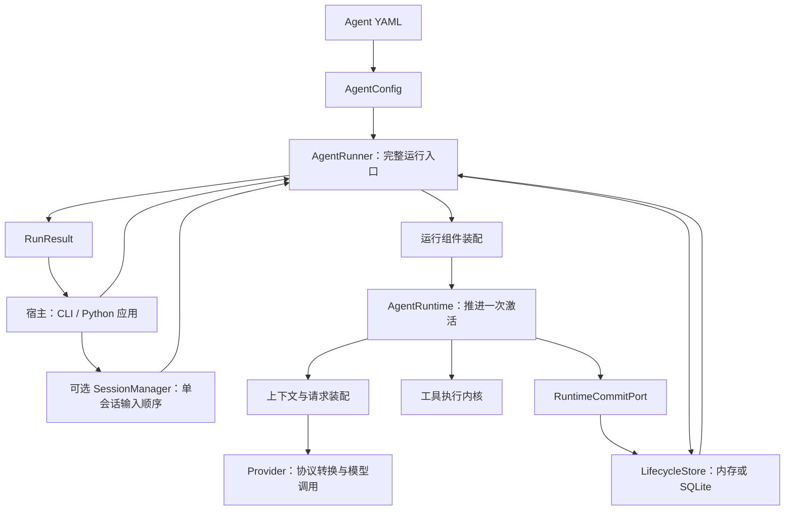

# 从配置到一次完整运行

Iris 面向希望把 Agent 放进自己 Python 项目的开发者：用 YAML 声明模型、上下文和工具，用 Python SDK 控制任务，按需要启用本地持久化、记忆、命令环境或观测。宿主可以先是终端，之后再换成自己的界面。

它解决的核心问题是：怎样让同一个 Agent 定义既容易启动，又能在需要人工回答、执行工具、保存进度和恢复任务时保留清楚的控制边界。

## 先看最小结构

这张图表示职责，不要求使用者手工构造每个组件。`AgentRunner.from_config_path()` 已完成标准装配；`RuntimeFactory` 是低层使用入口，普通应用无需先创建它再交给 Runner。

## 沿一次项目问答理解调用链

假设用户提出：“读取项目配置，解释如何启动。”

**先装配能力。** 配置层解析 YAML，得到已校验的模型路由、工具声明和 workspace。Runner 根据配置选取 lifecycle store，装配 provider、工具、上下文及可选服务。此时知道 Agent 能做什么，还没有开始执行用户任务。

**宿主提交输入。** Runner 为 Session 创建一个 logical Run，固定其运行选项和限制。CLI 通过 SessionManager 接收输入；最小 Python 程序可以直接调用 `runner.start()`。

**准备一次模型请求。** Runtime 取得本次激活所需状态，申请模型步骤，从历史、系统要求、当前快照和已选工具定义构造 `LLMRequest`。完整请求共用输入预算，必要时先减载或摘要。

**模型决定调用工具。** Provider 把请求转换为选定的 Responses 或 Chat Completions 协议。收到完整的标准响应后，模型步骤先成为可提交事实。工具调用再经工具执行路径处理，而不是由 provider 自行操作项目。

**结果回到下一步。** 工具执行结果与对应调用关联，并通过提交端口保存。下一次请求使用这些结果继续推理。如果需要用户确认，当前 Run 进入等待，宿主展示 typed interaction；继续时仍是同一个逻辑任务。

**完整运行返回宿主。** 当模型给出最终回答，或运行因其他明确原因停止，Runner 结算状态并返回 `RunResult`。宿主依据结果展示成功、等待或错误，而不只检查有没有一段文字。

## 为什么把 Runner 与 runtime 分开

模型循环关注“下一步如何推进”；完整运行还需要处理谁创建任务、谁拥有持久状态、谁能恢复、怎样取消并收尾。将这些事情全部塞进一个模型循环，会让 CLI、后台任务和恢复脚本都依赖循环的内部细节。

Iris 把完整任务的控制放在 harness，把一次 activation 的推进放在 runtime。Runtime 通过 `RuntimeCommitPort` 提交精确事实，不选择数据库；`LifecycleStore` 定义和保存状态，不负责何时再次调用模型。

这种拆分让宿主面对稳定的 Runner 接口，也让测试可以分别验证执行推进与持久化契约。代价是系统有 Session、Run、activation 等几个必须区分的概念，需要在[生命周期设计](lifecycle.md)中说明。

## 本地优先体现在哪里

项目配置与工作文件在本地目录中；进程内存储可以直接启动，SQLite 可以保存会话和运行事实；长期记忆、Skill、Todo 和项目模板也有明确的本地来源。使用基本 Agent 不要求另建一套远程状态服务。

这些材料并非都用同一种存储：lifecycle 与长期记忆各有领域数据，Todo 的当前清单直接来自 Markdown，图片保存在文件中。保留不同来源是因为它们的修改和查询方式不同，不需要为了“统一”再加一层数据库。

模型推理、MCP 或联网检索仍可能调用远程服务。本地优先不意味着离线推理；部署模型和宿主 UI 也仍由应用选择。

## 扩展能力怎样接进来

| 扩展需求 | 对应边界 |
| --- | --- |
| 执行新动作 | Python 工具、MCP、命令工具 |
| 增加每步当前状态 | `ContextSource` |
| 复用方法说明或委派工作 | Skill / 子 Agent |
| 在固定事件执行动作 | Hook |
| 包裹一次工具 body | Middleware |
| 观察提交事件或调用耗时 | RunEventObserver / OTel |
| 增加界面与网络接入 | SessionManager / streaming gateway |

扩展有各自能影响的范围。Hook 不是通用工作流引擎，observer 不接管运行恢复，子 Agent 也不自动继承父任务所有上下文。清楚说明这些边界，比列出更多扩展名称更有助于应用集成。

## 推荐深入顺序

先读[运行与持久化](lifecycle.md)，再读[上下文工程](context-engineering.md)和[工具执行](tool-execution.md)。随后按需求选择[记忆](memory.md)、[Goal 与 Todo](goals.md)、[消息与媒体](messages-media.md)或[流式与观测](streaming-observability.md)。

源码入口：[配置模型](../../src/iris/agents/config/base.py)、[Runner](../../src/iris/harness/runner.py)、[共享装配](../../src/iris/runtime/_assembly.py)、[runtime](../../src/iris/runtime/runtime.py)、[store 协议](../../src/iris/lifecycle/store.py)。
