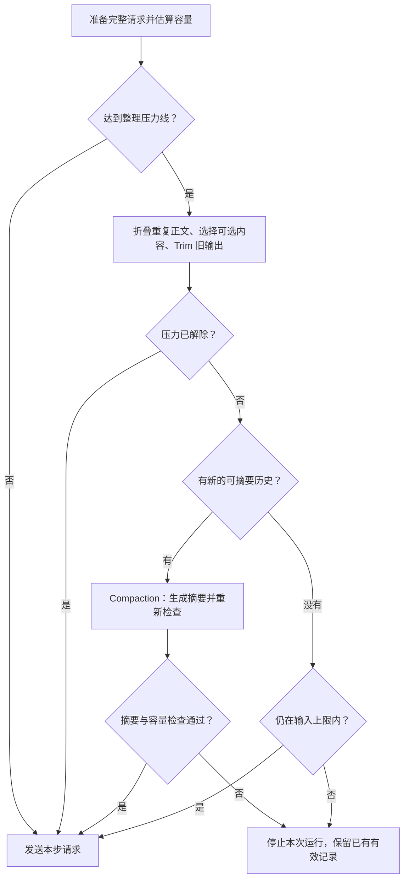

# Iris Context Engineering 实现机制

运行时还可通过 `ContextPreparation` 观察本次真实选材、计量与压缩过程；诊断不会重新
执行选择或增加 token 估算。阶段候选、正式采用和 provider usage 的区别见
[Context 参考](../reference/context.md#观察真实准备过程)。

这篇总览解释 Iris 如何在有限窗口中保留任务方向、选择当前材料并回读原文。默认读者已了解模型、工具和一次 Agent 循环；需要实际配置时先看[上下文配方](../cookbook/context.md)，字段与默认值查 [Context 参考](../reference/context.md)。

贯穿的区别是：**已经保存的任务事实，与这一步实际提供给模型的视图，是两份不同的东西。** 下文的裁剪和选材大多改变后者，不意味着删除前者。

## 目录

- [实现概览](#overview)
- [Compaction：历史摘要压缩](#compaction)
- [Offload：大结果外置与回读](#offload)
- [Pruning 与 Trim：工具结果减载](#pruning)
- [Dynamic Context：动态上下文](#dynamic-context)
- [Context Budgeting：统一上下文预算](#budgeting)
- [Tool Discovery：工具发现与按需披露](#tool-discovery)
- [其他上下文工程机制](#related-mechanisms)
- [机制之间的协作](#cooperation)

## 实现概览

Iris 通过以下机制控制模型每一步接收到的信息，同时保留任务经过和可回看的原始材料。

| 机制 | 主要解决的问题 | Iris 的做法 |
| --- | --- | --- |
| **Compaction** | 长任务的历史持续增长 | 将较早经历整理成摘要，结合当前任务和近期内容继续工作 |
| **Offload 与回读** | 一次工具结果特别大 | 保存完整结果，先展示预览，需要时分段取回 |
| **Tool Result Pruning** | 重复正文和旧工具输出占据空间 | 对完全重复的结果折叠展示，对较早正文进行 Trim |
| **Dynamic Context** | 应用状态不断变化 | 每个主模型步骤获取当前状态，不沿用过时快照 |
| **Context Budgeting** | 不同来源的内容共同挤占窗口 | 对完整请求统一计量，并协调选材、裁剪和摘要 |
| **Tool Discovery** | 大量工具说明占用上下文 | 先发现相关工具，再提供选中工具的完整说明 |

结构化上下文、记忆按需召回、技能渐进加载和子任务上下文隔离，也参与 Iris 的上下文组织。

## Compaction：历史摘要压缩

Compaction 把较早的任务经历整理成摘要，让模型用“历史摘要 + 当前任务要求 + 保留的近期内容”继续工作。

当对话、工具调用和中间结论持续累积，其他减载方式仍不足时，Iris 会使用模型总结较早的历史。摘要需要保留继续执行所需的进展和线索，例如已经完成什么、形成了哪些结论，以及还有哪些问题没有解决。

### 摘要什么，保留什么

Iris 保留任务发起背景、用户原始要求和最新补充要求的原文，避免任务目标只能依赖摘要转述。较早历史可以被概括，同时尽量保留近期原文。

有已保存摘要时，模型准备只读取未被摘要覆盖的后缀及仍需保留的任务原文，不反复加载全部旧消息。完整历史仍可查询和回读；尚无摘要时，所需后缀仍然是全部历史。

工具调用及其结果作为完整的一组处理，不把尚未完成的交互拆开摘要。摘要材料来自已经保存的历史，不使用本步临时裁剪后的版本，也不把当前应用快照直接写进历史摘要。

### 何时继续，何时停止

| 情况 | 处理方式 |
| --- | --- |
| 整理后已经有足够空间 | 直接继续，不额外生成摘要 |
| 仍有容量压力，且存在可摘要的旧历史 | 生成摘要，重新检查完整请求是否缩小到要求范围 |
| 没有新的可摘要历史，但仍在输入上限内 | 保留当前内容继续 |
| 必要内容已超出输入上限，又无法进一步缩减 | 报告容量不足，不擅自删除任务要求 |
| 摘要生成失败，或摘要后仍不满足容量要求 | 停止本次运行，保留原始历史和上一次有效摘要 |

有效摘要会随任务状态保存。任务恢复时可以继续使用；需要精确细节时，仍可回看原始材料。

## Offload：大结果外置与回读

Offload 处理的是**单次特别大的工具结果**。完整内容保存在上下文之外，模型先看到预览和查阅线索，需要时再读取其中的部分。

例如，工具返回一份很长的检查报告，模型可以先了解报告的大致内容，再分段读取与当前问题有关的正文。

### 结果如何保留

| 情况 | 处理方式 |
| --- | --- |
| 结果较短 | 正文直接保留在历史中 |
| 结果过大 | 保存完整文本，用预览和回读入口替代全文展示 |
| 外部工具还带有需要保留的原生内容 | 原始返回材料与处理后提供给模型的文本分开保存 |

### 回读的含义

回读取得的是**当时保存的结果**，不会重新访问数据来源或再次执行原工具。外部资料后来发生变化，也不会改变那次任务已经保存的依据。

一页内容不足时可以继续读取；原文已经不可用时，报告材料不可用，不以重新执行来冒充历史回读。模型也可以先在会话历史中寻找线索，再展开对应材料；历史搜索不会自动搜索所有外置全文。

Offload 不能独自解决“大量中等长度结果逐渐占满窗口”的问题，因为它们可能始终没有大到需要单独外置。这类累积压力由 Pruning、Trim 和 Compaction 继续处理。

## Pruning 与 Trim：工具结果减载

在 Iris 中，**Pruning 是工具结果减载的整体策略，Trim 是其中一种裁短正文的动作**。这套策略包含两条分支：重复结果折叠，以及旧输出 Trim。两者都按规则调整本步展示，不需要模型重新撰写内容。

用处理报告的场景来看，三种动作的区别是：

| 场景 | 采用的动作 | 模型看到的变化 |
| --- | --- | --- |
| 同一工具以相同条件多次查询，完整结果没有变化 | 重复折叠 | 较早的重复正文可以换成引用，每次调用的记录仍在 |
| 查询了多份不同报告，较早报告暂时不必全文展示 | Trim | 将符合裁剪条件的旧正文换成预览和回读入口 |
| 报告分析已经持续很多轮，需要概括整段任务进展 | Compaction | 由模型生成摘要，说明已经完成什么、发现了什么、还要做什么 |

Trim 保留的是原文片段和查阅入口，不判断整段经历应该总结成什么结论。Compaction 才负责概括含义。

### 重复结果折叠

相同工具使用相同查询条件时，仍然真实执行，因为外部状态可能已经变化。

调用完成后，只有工具、查询条件和完整结果都相同，才可能在容量紧张时折叠较早的重复正文。结果变化了，就按不同结果保留；只有预览相同，不能作为结果相同的依据。

### Trim：旧输出裁短

旧结果不必重复，也不必曾经触发 Offload。只要这些结果持续累积，Iris 就可能在容量紧张时，把允许裁剪的旧正文改为短预览，并保留原文入口。

### 哪些情况允许裁剪

| 情况 | 处理方式 |
| --- | --- |
| 较早、已完成且成功的观察类结果，明确允许裁剪 | 可以参与重复折叠或 Trim |
| 受到近期保护的结果、错误结果、尚未结束的工具交互 | 不参与这一步正文裁剪 |
| 明确要求保留的正文 | 不参与 Pruning；后续是否外置或摘要由相应机制处理 |
| 本步无法调用历史回读能力 | 不新增依赖回读的正文折叠或 Trim |
| 改成预览反而没有减少完整请求占用 | 保留原有展示 |

两条分支都只改变本步模型看到的内容。原始历史、调用次数及每次调用的结果不会被删除。

## Dynamic Context：动态上下文

Dynamic Context 让应用在每个主模型步骤前提供当前状态，例如正在打开的文档、选中的内容和任务进度。

任务开始时的背景解释“为什么发起这项任务”，动态上下文描述“现在是什么情况”。例如，用户最初要求检查报告 A，之后在应用里打开报告 B：原始目标仍然是检查 A，当前状态则更新为正在打开 B。

### 状态如何更新

| 情况 | 处理方式 |
| --- | --- |
| 本步获取到新的状态 | 本步使用这份状态，下一步重新获取 |
| 应用接入了动态状态，但本步返回空状态 | 明确当前没有提供的状态，不沿用上一步内容 |
| 应用没有接入动态状态 | 使用其他已有上下文，不自行猜测应用状态 |
| 同一步需要反复安排容量或生成摘要 | 沿用本步已经获取的状态，不反复采集 |
| 从暂停处继续执行已有工具操作 | 延续该操作；到下一个主模型步骤时再获取新状态 |

动态快照不直接追加为会话历史。需要以后精确回看的材料，应作为任务材料另行保存。

### 必需内容与可选内容

应用决定提供什么，并区分哪些内容必须保留、哪些可以省略及其保留优先级。Iris 不自行判断某条用户要求是否可以删除。

可选内容可能因为容量压力退出本步上下文；同一步内不会在摘要完成后又被重新填回。下一步获取新状态时，再重新考虑需要哪些内容。

## Context Budgeting：统一上下文预算

**统一预算，就是把一次模型请求中实际提供的全部内容放在一起计算，让它们共用同一个输入容量上限。**

这里的预算指模型能够接收多少内容，通常用 token 衡量。应用确定可用输入容量时，需要先为模型回答预留空间。

这个额度按每次请求分别检查，不是整个任务累计可以使用的总字数，也不是费用或模型调用次数。

### “统一”计算哪些内容

| 输入组成 | 包含的内容 |
| --- | --- |
| 固定要求与背景 | 系统要求、固定背景、已采用的知识概览和技能目录 |
| 对话与任务历史 | 用户输入、任务背景、模型回复、工具结果，或它们在本步的摘要与预览 |
| 当前状态 | 应用为本步提供的动态内容 |
| 工具说明 | 本步实际提供给模型的工具完整定义 |
| 输出形式要求 | 对回答结构或格式的说明 |

Iris 对最终组合起来的请求进行估算。已经包含在历史中的用户输入或工具结果，不会再作为另一份材料重复计算。保存但没有放进本次请求的报告全文和旧历史，不占本次输入容量；实际提供的摘要、预览、引用和回读片段则需要计入。

假设本次输入可用容量是 100 个单位：

| 本次准备提供的内容 | 占用空间 |
| --- | ---: |
| 对话与任务历史 | 70 |
| 工具说明 | 20 |
| 固定要求与当前状态 | 20 |
| **合计** | **110** |

只检查历史，会得到“70，没有超限”；统一检查完整请求，才会发现总量 110 已经放不下。接下来需要减少可省略的内容、裁短旧正文或生成摘要，而不能直接把整份请求发给模型。

### 容量紧张时怎样分配

Iris 先尝试折叠重复正文，然后移除应用声明可省略的动态内容，再撤下可选工具说明；仍有压力时，继续 Trim 较早的工具正文，最后才尝试 Compaction。

每次调整后重新检查完整请求。压力解除后停止缩减，不要求所有减载动作都执行一遍。

这里有两层容量判断：

- **整理压力线**：提前开始减载，为任务继续推进留下空间。
- **输入容量上限**：本次请求不能超过的上限。

因此，达到压力线不等于请求已经无法发送。没有可摘要的新历史，但仍在输入上限内时，可以继续；真正超过上限又无法缩减时，则明确报告容量不足。已经启动的摘要还需要满足自己的缩减目标，不能用无效摘要继续发送。

### 哪些内容不能为了凑容量而删除

用户约束、应用声明的必需状态、必要工具说明都要保留。框架不会从完整系统要求里随意抽掉文字，也不会把应用强制指定的工具说明撤下。

## Tool Discovery：工具发现与按需披露

工具按需披露处理的是工具说明本身的占用。基础工具可以直接提供，其他工具先保持可发现状态，等任务需要时再展开完整说明。

模型根据工具名称、描述、标签和分组寻找相关候选。搜索完成后，Iris 在下一个模型请求中加入选中工具的完整说明，使模型能够了解并使用它们。候选名称和简介只是发现线索，不能替代完整工具定义。

### 搜索与选择的主要分支

| 情况 | 处理方式 |
| --- | --- |
| 搜索发现相关工具 | 在下一次请求中提供选中工具的完整说明；搜索首项保留到下一次已记录的主模型回应，之后再按需选择 |
| 搜索没有候选 | 返回无匹配结果，不因此开放其他工具 |
| 可选候选过多、容量紧张 | 结合搜索相关性和近期使用情况保留更需要的工具，撤下其他可选说明 |
| 应用明确要求调用某个工具 | 该工具的完整说明成为本步必需内容 |
| 指定的工具不存在或不在允许范围内 | 报告问题，不擅自换成其他工具 |

### 执行与恢复的一致性

模型本步看到的工具集合，与处理这一批调用时认可的集合保持对应。工具操作暂停等待确认后，继续执行仍保留产生该操作时的工具范围，并继续检查执行权限。

不同会话分别管理各自发现的工具。一个会话搜索到了某个工具，不会因此改变另一个会话正在执行的操作。

发现和成功使用记录随消息提交增量更新，后续请求直接使用会话状态选工具。已发现工具可跨轮复用；搜索返回条数不等于活跃工具数量上限。

这项机制处理“调用前提供哪些能力说明”；Offload 处理“调用后怎样保存和展示大结果”。两者分别控制工具交互的输入与输出。

## 其他上下文工程机制

### Structured Context：结构化上下文装配

Iris 分开组织持续有效的系统要求、固定背景材料和当前输入前的任务背景，再与会话历史共同形成模型输入。

任务开始时的背景随输入保存，后续继续任务时不重复追加；动态状态则在每步重新提供。这样，“原始任务背景”和“当前应用状态”保持各自的含义。

### Memory Retrieval：记忆按需召回

启用长期记忆后，Iris 先提供已采用的知识概览，再由模型根据任务需要搜索相关记忆。搜索片段足以回答时，可以直接使用；需要完整记录时，再进一步读取。

没有可用概览时，任务仍可继续，只是当前窗口暂不使用长期记忆。新会话或成功摘要时可以采用新概览，普通工具步骤沿用当前窗口的概览。

记忆召回寻找跨任务积累的知识；历史回读寻找当前会话当时使用的材料。

### Skill Progressive Disclosure：技能渐进加载

模型先看到技能名称和用途，相关时再读取正文；不相关的技能不必展开。技能提供任务方法和指引，工具说明则介绍可调用的能力。

读取技能正文不会自动执行其中的操作，模型仍需结合当前任务决定下一步行动。

### Context Isolation：子任务上下文隔离

主任务可以把局部工作委派给子智能体。子任务使用独立会话和工作上下文，主任务通过委派内容说明它需要完成什么。

子任务的中间探索记录保留在自己的上下文中，最终任务结果返回主任务；父任务的动态快照不会自动带入子任务。这样，局部调查产生的大量过程材料不会全部进入主任务窗口。

## 机制之间的协作

这些机制发生在不同时间点：Offload 在大结果产生时保存材料，回读由后续任务需要触发；动态状态采集、工具定义选择和容量处理发生在准备模型请求时。一次请求的容量处理按以下流程推进：

确定性减载先尝试缩减本步展示；仍有压力且存在新的可摘要历史时，才调用模型生成摘要。每一步都重新检查完整请求，压力解除就停止处理。减载与摘要投影不改写已经保存的原始历史。

## 从总览进入实现与使用

| 想继续了解什么 | 阅读入口 |
| --- | --- |
| 配置静态背景和每步动态状态 | [上下文配方](../cookbook/context.md) |
| 查询预算、slot、选材和模板默认值 | [Context 参考](../reference/context.md) |
| 工具定义如何披露，结果如何执行和保存 | [工具生命周期](tool-execution.md) |
| 记忆概览何时采用，搜索和完整读取如何分工 | [记忆设计](memory.md) |
| 摘要、历史与恢复状态由谁持有 | [运行与持久化设计](lifecycle.md) |
| 图片怎样在普通调用、摘要和回读间保留 | [消息与媒体设计](messages-media.md) |

需要阅读源码时，从[请求装配器](../../src/iris/runtime/assembler.py)、[确定性选材与正文投影](../../src/iris/runtime/_context_projection.py)、[完整消息组与摘要切点](../../src/iris/runtime/compaction.py)和[动态快照契约](../../src/iris/context/source.py)开始。摘要执行、结果验收与提交由 [runtime](../../src/iris/runtime/runtime.py) 协调；原始历史和已提交摘要的权威状态仍在 lifecycle store。
