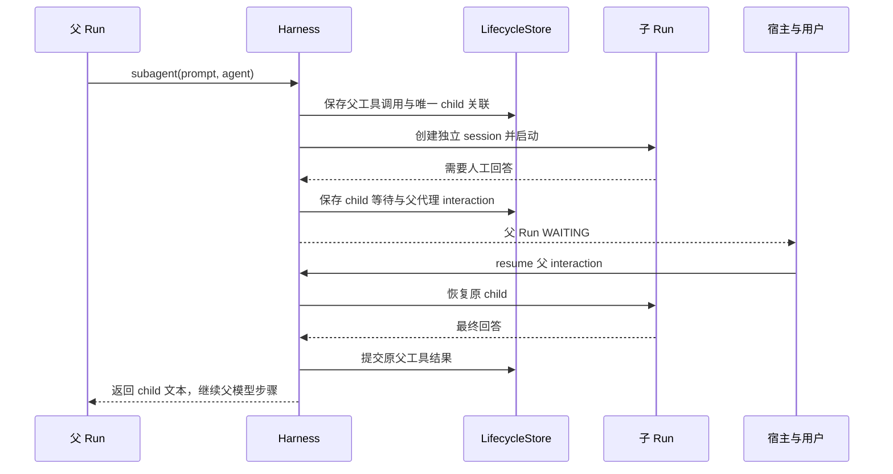

# Skill、委派与命令资源的边界

复杂任务常需要复用方法、交给另一个 Agent 分析、或者运行程序。这三种需求的资源成本和状态完全不同。Iris 分别用 Skill、subagent 和 command 表达它们，避免把所有扩展都包装成另一个模型循环。

## 复用方法不需要创建 Agent

Skill 的核心是一份带名称和描述的 Markdown。启动时发现目录，模型先看到精简 catalog；用到时调用 `load_skill` 读取当前正文。正文如何影响后续任务，由当前 Agent 的模型理解和执行，加载器不执行脚本、不注册工具、不创建 session。

例如“调研后必须区分事实与推断”可以写成 Skill，多个任务在需要时采用。它保持本地文件可编辑、变更可检查，也避免每次请求塞入全部方法正文。代价是目录与正文具有不同生效时机：目录是构造期快照，正文按需读取；新增 Skill 后需要重建 Agent。

## 委派需要独立运行事实

如果一个分析任务需要另一套模型、prompt 或工具，父 Agent 调用 `subagent`。父配置引用一个 catalog，catalog 描述可选角色，选定后再装配 child。父只传一份明确 prompt，child 从独立 session 开始；这既减少无关历史，也要求父把必要材料写清楚。

父子共享权威 store，使用普通 runner 驱动各自生命周期。这样 child 的中断、恢复和终态无需一套平行状态机；父工具调用与唯一 child 的 durable link 防止恢复时重复创建子任务。父侧只接收最终文本和定位信息，child 的详细历史与 usage 留在自己的 run。

当 child 等待用户回答时，等待不是一条给模型看的“工具成功”结果。父也进入 WAITING，通过代理 interaction 把子问题交给同一个宿主；回答后继续原 child，最后才结算原父工具调用。这使宿主始终面对一个统一的运行/交互接口，而不必自行管理子 Agent 的内部流程。

当前委派是受控的一层调用：child 不开放递归 subagent 入口。它不是动态任意生成角色的多 Agent 调度平台，也不自动继承父消息。父子配置与资源关系见[使用指南](../cookbook/skills-subagents.md)。

## 命令资源为什么由 root 拥有

程序执行有不同于会话的生命周期。一个 session 启动的服务可能需要另一个 session 复用；把容器绑到单次工具调用会丢失环境，把进程直接绑到数据库记录又无法管理真实资源。

Iris 让 root runner 拥有命令配置、服务和环境说明。session 与 child 借用这个 binding，工具只提交“运行这段 shell/Python、在这个目录、使用这个期限”。Native/Docker 后端负责进程或容器；工具负责单命令期限与结果；harness 负责 run 停止前的资源结算；sandbox 负责 Docker 物理资源。

正常 run 完成或等待人工交互时保留环境，以便后续使用。root 关闭时清理自有资源。Docker 在同一个 root 下共享容器与工作目录，能复用依赖文件和服务，但一次 run 异常触发整体停止时也可能影响其他活动命令。独立 root 不共享这一环境。

## 停止进程与完成结算不是同一时刻

命令可以已经被物理停止，但 stdout/stderr 读取任务、旧调用返回和工具结果提交还没有结束。如果在命令 body 内等待“所有 body 都已退出”，就会等待自己；如果刚停止就允许新命令进入，旧收尾又可能误伤新环境。

因此停止操作区分两个完成点：`wait_stopped` 确认物理停止并产生收据；`wait_drained` 等待旧调用排空。工具先交还已知结果与收据，外层 harness 再完成排空和终态提交。收据是当前 live service 的事实，不能作为进程重启后的持久资源句柄。

这套分工允许系统如实区别“命令非零退出”“本次命令超时”“共享环境连带中断”与“操作结果未知”。停止不回滚文件，也不会自动恢复后台服务。这里的复杂性来自运行中断的真实生命周期，不来自给每一个普通函数增加资源管理。

前往[命令与 Python 指南](../cookbook/commands.md)观察真实闭环，或查[命令服务参考](../reference/tools.md#命令环境)。整体关系见[架构总览](architecture.md)。源码入口：[Skill 加载](../../src/iris/skill/tool.py)、[child 控制器](../../src/iris/harness/_subagent.py)、[命令协议](../../src/iris/command/service.py)、[资源结算](../../src/iris/harness/_command_lifecycle.py)。
