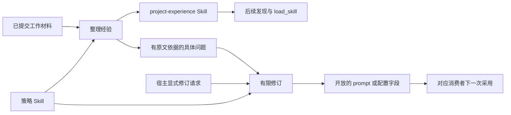

# 项目经验如何沉淀与采用

长期记忆回答“已经知道哪些事实”；项目经验更关心“在这个项目里该怎样工作”。例如，某次修改发现必须同时更新一组调用方，或用户指出某种检查方式无助于验证结果。Iris 的 Evolution 把这类实际反馈整理为 Skill；必要时，还能针对明确开放的 prompt 或配置字段修订行为。

它不是修改任意源码的通用代理，也不在每次回答之后自动证明自己变得更聪明。理解这项能力，需要把材料、经验、修订和后续采用分开。

## 两种维护工作

开头“修改接口时要同时更新调用方”的反馈，适合沉淀为 Skill 中的工作步骤，供模型后续读取。若材料进一步指出某个生成阶段的提示或运行参数可能有问题，修订才把请求落到相应开放目标上。前者提供可复用的工作方法，后者改变消费者实际读取的 prompt 或配置；一条经验可以只更新 Skill，无需产生修订。

经验整理使用当前 Skill、选中的完整消息材料、正文额度和开放目标，一次生成完整 Skill 正文或 `no_change`。发布路径和固定 frontmatter 由程序决定，模型不选择任意输出位置。如果材料揭示具体机制问题，整理阶段还可以附带问题及逐字证据引用，交给修订阶段；普通事实缺失不会被强制变成配置问题。

修订从一个有界请求开始。来源可以是经验整理提出的问题，也可以是宿主的明确请求。它读取本轮磁盘文件和目标契约，生成三种候选之一：不修改、替换一个 prompt、修改主 YAML 中的一组开放叶字段。没有开放的字段就不能成为候选目标。

两者都会读取策略 Skill：默认使用包内 `self-evolution/SKILL.md`，也可配置项目自己的策略文件。策略只参与生成提示；固定响应协议、发布目标和配置字段范围仍由程序持有。

## 经验不是又一份记忆数据库

Memory 和 Evolution 可以各自启用。Memory 将条目作为可按需查询的数据；Evolution 发布的是既有 Skill 系统能发现、加载的工作方法。Evolution 使用独立的 `.iris/evolution/evolution.db` 保存来源登记、捕获块、请求、消费进度和发布档案，作用是支持维护推进，并不提供另一套记忆 Search/Fetch。

存储分别维护每个来源的连续捕获位置、消费位置与已观察终点。某个后段先带着终态到达，
不代表前面的消息都已经保存；只有缺口补齐才封闭来源。每次捕获只更新当前来源，选材先筛选
合格来源再读取所需区间，消费后只清理本次推进范围内的完整捕获块正文。请求调度也先用短
元数据判断资格，选中后才加载证据，使普通维护不必随着历史积累重读全部正文与收据。

两者使用同一类已提交原文来源。捕获层对 `memory_search`、`memory_fetch`、`load_skill` 的读回保留定位和查询信息，不把读回正文再次当作新的独立证据。否则“系统曾经告诉自己某条经验”会在下一轮被误计作经验得到验证。用户后续反馈与真实执行结果仍能成为材料。

源 Run 的历史实际 prompt/config 没有被完整快照进这些材料。修订看到的当前文件只证明“现在磁盘上是这样”，不能反推贡献材料的旧 Run 当时使用了相同设置。这也限制了自动归因的力度。

## 为什么共享调度，分开执行

Memory 和 Evolution 都需要在前台安静时使用模型，但它们有不同的内容、存储和发布目标。`MaintenanceCoordinator` 因而共享宿主空闲计时和来源资格，却为两类维护分别保留任务、worker 和锁：一个宿主最多同时有一个记忆维护作业和一个项目经验作业，同类资源轮流处理。

已有 Run 必须终态；关联会话若有 WAITING，则该来源暂不消费。显式请求没有虚构的 Run 身份，关联 session 是可选的；有关联时按真实 session lane 检查等待状态。前台进入会撤销后台生成，已经发出的短 IO 仍要收取结果并排空。

跨进程互斥分别按记忆数据库/namespace 和项目 workspace 建立。生成期间用户改了目标文件，会返回冲突而非覆盖人工编辑。工作材料的消费位置只有在发布或确认无需改动时才推进；失败不会靠“再猜一次已处理到哪里”恢复。

发布档案由原 owner 保存：写文件前保留基线与候选，写入返回后才记录确认状态和发布时间，
已确认正文直接由候选投影，不重复保存全文。材料消费或请求结算与档案收尾在一个 SQLite 事务中完成；
实际文件写入与数据库确认仍不是同一个事务。已确认的发布可以在同一项目锁内补结算，
无需重跑模型。重启后缺少确认的记录保持 unconfirmed，只补充当前观察正文，不把“当前等于候选”
当作过去成功的证明。已消费材料与完成请求的描述、证据保留在数据库中，历史读取不依赖待处理正文清理时机。
历史列表只读取摘要，打开详情时才按 ID 读取正文和证据。每次经验整理档案保存本批材料，
证据列表从材料正文投影；修订档案引用不可变的原请求，读取时在同一数据库快照中组装请求和
证据，不再重复保存这些正文。经验整理提出的问题仍在发布前随候选持久保存，成功或确认无需
修改后才与消费进度一起转成待处理请求，保留中断后的恢复依据。每次档案仍保留独立的完整基线与候选，
不依赖补丁链还原；目标文件仍按原契约完整读取和发布。

runner 只借用协调器和服务。宿主显式构建、绑定和关闭资源，CLI 是这一模式的一个现成宿主。把调度留在 harness，使领域生成逻辑可独立使用，也避免子 Agent 私自建立第二个项目学习调度器。

## 发布与生效有不同时间

Skill 的名称、描述和路径在 runner 构建时固定为目录，正文则在 `load_skill` 时读取。这解释了为什么首次生成 Skill 和更新已有 Skill 正文有不同的生效时间；其他产物则按各自消费者读取文件的时机采用。

| 产物 | 后续采用规则 |
| --- | --- |
| 首次生成的 `project-experience` Skill | 新 runner 构建时发现 |
| 已被 registry 发现的 Skill 正文更新 | 下一次 `load_skill` 读取新正文，旧消息保留旧正文 |
| Memory 生成 prompt | 下一次显式生成操作或自动维护周期固定新快照 |
| 项目经验整理 prompt | 下一次整理采用 |
| 压缩 prompt | 下一次完整压缩采用，进行中的压缩保留原快照 |
| 主 `agent.yaml` 配置字段 | 只有新 runner 采用；原 runner 的新 session 和自动续跑也不热更新 |

这张表直接影响验证方法。文件更新只证明发布成功；要证明被采用，还需创建相应的新消费者或触发下一次加载，并观察实际请求。已有确定性集成测试覆盖“真实 Run 材料 → 经验文件 → 后续 runner 加载”和“配置修订 → 仅新 runner 采用”等链路，但这些测试没有证明修订比原策略更优。

## 解释项目价值时怎样保持准确

可复述的设计点是：**将真实工作材料转成有版本和采用边界的可复用产物，并把有限修订纳入同一宿主生命周期。** 这比只让模型说“下次注意”多了持久产物、来源、处理进度和实际加载路径。

需要进一步研究的则是效果：什么经验值得保留、修订是否真的改善任务、是否增加成本，以及长期是否积累错误。当前候选检查解决文件能否被对应消费者使用，不代替任务评估或等预算比较。介绍时应把机制实现和改进效果分别给证据。

下一步：跟随[经验与修订配方](../cookbook/evolution.md)完成配置、主动整理和显式修订；字段与结果见[长期能力参考](../reference/memory-goals.md)。

源码与验证入口：[经验生成](../../src/iris/evolution/service.py)、[有限候选与发布](../../src/iris/evolution/revision.py)、[宿主装配](../../src/iris/harness/evolution.py)、[采用链路测试](../../tests/harness/test_evolution_integration.py)、[独立维护并发测试](../../tests/harness/test_evolution_memory_concurrency.py)。
