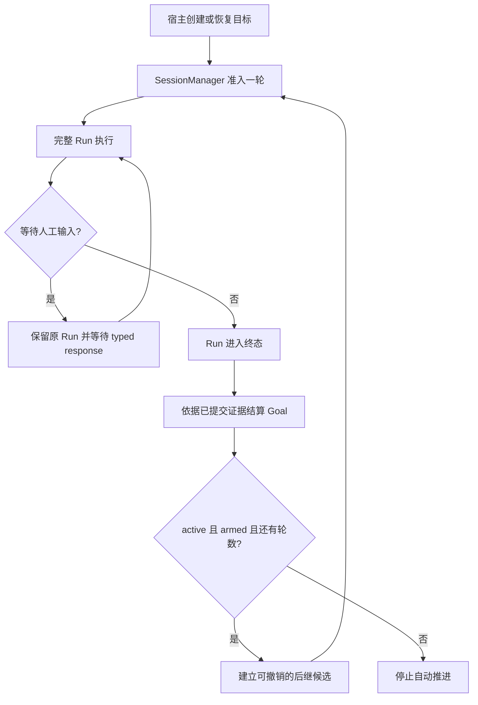

# Goal 与 Todo 如何配合

“继续把这项工作做完”包含两个不同的问题：下一次该做什么，以及本轮结束后是否再启动一轮。Todo 记录工作项，Goal 持有跨 Run 的目标和持续推进状态。将二者拆开，才能允许清单调整、人工暂停和进程恢复，同时不把一个文件勾选动作当作调度指令。

以“整理项目笔记并核对遗漏”为例：一个 Run 可能先读文件、输出阶段结果；目标仍未完成，宿主再启动下一轮核对。两轮使用同一个 session 和清单，但各自有独立运行记录、预算与结果。

## 四个不同的对象

| 对象 | 回答的问题 | 权威位置 |
| --- | --- | --- |
| Goal | 最终要达成什么，目标当前处于何种状态 | Lifecycle store 内的 Goal 记录 |
| 续跑意图 | 当前宿主是否明确获准，再尝试准入下一轮 | SessionManager 持有的进程状态 |
| Run | 这一轮是否执行、等待、终止，产生了什么结果 | Lifecycle store |
| Todo | 当前会话有哪些条目，分别进行到哪里 | Workspace 中的 Markdown 文件 |

Goal 持久状态有 `active`、`paused`、`blocked` 和 `completed`。进程内还有一个 `armed` 意图：新建 manager 默认没有自动推进许可，即使数据库中的目标仍是 active，也不会擅自启动模型。宿主调用 `create()` 或 `resume()` 才明确允许推进。

GoalService 解析和变更领域状态，不运行模型。SessionManager 统一处理用户输入、人工恢复、中断与下一轮准入。AgentRunner 仍是完整 Run 的执行 owner；store 原子记录目标轮数和新 Run 的绑定。Goal 没有再建立第二套 Run 状态机。

## 一轮如何结束，下一轮如何开始

模型通过 `get_goal` 读取最新目标和 revision，通过 `report_goal` 申报 `complete`、`blocked` 或 `continue`。申报是普通工具结果，它不会结束 Run，也不立即更改目标。模型还要结束这一轮，store 才依据已提交事实结算。

这一顺序解决了一个正常情况：模型先申报完成，之后又做了工作，或者收到新的用户输入。旧报告不能继续代表更新后的结果。结算检查最新报告是否属于当前目标版本，以及报告之后是否有新工作工具、用户输入或人工回答；过时报告让目标保持待继续，而不是提前完成。完成和阻塞报告应在工作完成后单独一步调用。

Run 只有正常完成时才可能用模型报告结算；失败、取消、步骤额度耗尽等非正常完成会暂停 Goal，等待显式恢复。有效完成报告能完成目标；没有有效终止报告且尚有轮数时，目标继续。轮数用尽会暂停，并说明 `round_limit`。

下一轮先是可撤销候选，再竞争 SessionManager 的准入边界。用户 follow-up、当前 lane 占用、暂停或关闭都可能使候选不能启动；只有真正准入才增加 `rounds_started`。因此“准备继续”不是另一个已经执行的 Run，重复终态通知也不应该消耗多轮额度。

真正开始下一轮时，Runner 根据当前目标生成续跑输入，仍使用同一个 Session，因此前几轮已提交的工作沿正常历史和摘要路径进入上下文。每个模型步骤还会读取该 Run 绑定的当前 Goal，加入动态上下文；启用 Todo 时，再提供同一会话的当前清单。这样，新一轮有独立的执行预算，同时能接续已有工作。

## Todo 为什么保持为文件

任务清单天然适合人和普通文件工具共同维护。Iris 每个获准的模型步骤读取一次 `.iris/todos/<session key>.md`，将路径、完整条目或诊断作为 required 动态上下文提供给模型。它没有专用写工具，也不把 Todo 内容复制进数据库成为第二个权威版本。

清单缺失视为空；格式错误返回整份诊断，避免模型在一个只解析了一半的计划上工作。文件只有标题、空行和三种状态的单行条目，读者不需要学习复杂任务协议。SDK 与 CLI `/todo` 也按需读取同一文件。

模型给出无工具的结束响应时，如果当前快照有未完成项或格式错误、仍有模型步骤且未超过期限，runtime 最多安排一次结束自查。自查在同一 Run 的下一模型步骤出现，不是用户消息，也不会自动完成 Goal。checkpoint 只保存提醒目标步骤编号；恢复后继续读当前文件，不恢复一份过期清单副本。

如果自查后模型真的执行文件读写，那么先前 Goal 完成报告可能过时，需要在新工作之后重新申报。若只是阅读动态自查提示并给出最终文字，则提示本身不使报告失效。测试专门覆盖这一交互，避免把“提醒到了”误当成“又有一个用户任务”。

## 额度和恢复如何理解

Goal 的总额度是自动顶层 Run 的 `max_rounds`；Run 自己有 `max_model_steps`、截止时间和人工等待超时。恢复原 Run 继续使用原轮次，不另扣目标轮数。目标当前没有跨轮累计 token 预算，主模型、工具与维护的 usage 也应按其各自记录解释。

`pause`、`complete`、`clear` 控制后续推进，不取消已经准入的 Run；立即停止当前工作使用 `interrupt`。`edit` 修改目标并暂停，再由用户明确恢复。`clear` 解除当前选择但保留历史，之后可以创建新目标；不能直接覆盖尚未完成的当前目标。

进程恢复时，先看目标、session lane、Run 和人工交互的真实状态。原 Run 正等待回答，就回答它；原 Run 已被当前进程执行，就附着它；持久 ACTIVE 没有本地执行任务，则需要明确 activation ID 接管。不能因为目标还没完成就直接另开一轮，留下原执行状态无人负责。

这些边界让长任务由多次有限、可观察的执行推进。它仍需要模型合理分解工作和准确申报，并不保证任意目标最终完成，也不是一个脱离宿主独立运行的任务调度服务。

下一步：通过[目标与清单配方](../cookbook/goals-todos.md)启动一个任务；恢复细节见[HITL 与恢复](../cookbook/hitl-recovery.md)，方法和状态字段见[长期能力参考](../reference/memory-goals.md)。

源码与验证入口：[Goal driver](../../src/iris/goal/driver.py)、[会话接入](../../src/iris/harness/_goal.py)、[结算规则](../../src/iris/goal/settlement.py)、[Todo 解析](../../src/iris/todo/document.py)、[二者交互测试](../../tests/goal/test_todo_integration.py)。
