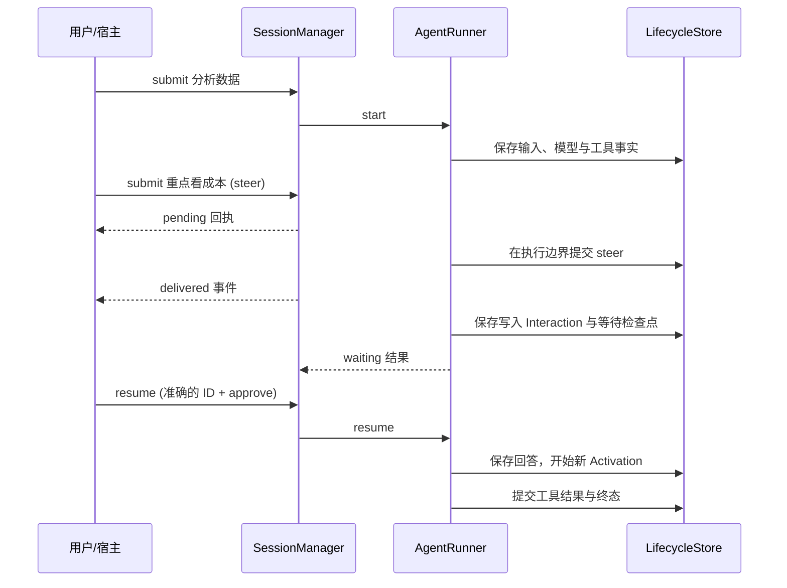

# 人工回答与运行中输入为什么分开

Agent 正在分析报告时，用户可能说“重点看成本”，也可能点击“允许写文件”，或者补充“做完之后再写摘要”。这三种输入看起来都是用户发来的消息，但应该改变不同的运行事实。Iris 分别使用 steer、HITL response 和 follow-up，避免宿主把所有输入都塞成下一条聊天消息。

使用方式见[会话配方](../cookbook/sessions.md)和[人工输入与恢复](../cookbook/hitl-recovery.md)；参数见[运行与会话 SDK](../reference/runtime.md)。

## 先区分输入的意图

| 输入 | 作用对象 | 到达后的行为 |
| --- | --- | --- |
| 普通首次输入 | 空闲 Session | 创建新 Run |
| steer | 正在推进或等待的当前 Run | 排队，在可接收边界提交为用户消息 |
| follow-up | 当前 Run 之后的工作 | 排队，当前 Run 真正结束后创建下一 Run |
| HITL response | 当前具体 Interaction | 解决这次批准请求或问题，再继续同一 Run |
| interrupt | 当前 Run | 提交取消请求，进入停止与结算流程 |

“重点看成本”不应该自动批准一个写文件请求；“允许这次写入”也不应该启动一轮无关对话。Interaction ID 和 typed response 把用户的决定绑定到准确的等待事项。

## 一条贯穿流程

假设用户提交“分析销售数据并生成报告”。模型调用读取工具后，又提出写入文件，当前配置要求确认。

SessionManager 接收输入的时间与 Runtime 消费输入的时间不同。即时回执 `pending` 只说明成功入队；`delivered` 才说明输入到达了持久化边界。对 steer 来说，它已进入 Session 消息；对 follow-up 来说，新 Run 已创建。这仍不等于 Agent 已完成用户要求。

## SessionManager 只管理本进程的准入

SessionManager 绑定一个确定的 Runner 对象和一个 Session ID，用一把异步锁安排 submit、resume、interrupt、close 的先后。它让宿主在模型尚未返回时继续接收输入，而不用自己拼接多组正在运行的协程。

它不拥有持久化状态。输入队列、SubmissionEvent、回执追踪和事件读取水位只存在于当前进程。进程退出后，未投递的排队输入不会从 SQLite 自动重建；创建一个同名 SessionManager 也不会自动接管原有 `active` 或 `waiting` Run。跨进程处理仍要使用 Runner 的查询、`resume()` 或 `recover()`。

这保持了两个边界：Runner/Store 管“已经承诺了什么”，Manager 管“现在有哪些输入在排队”。简单的顺序 SDK 调用只需 Runner；需要实时交互的宿主才增加 Manager。

## steer 在哪一刻进入模型历史

steer 不会改写已经发出的模型请求，也不直接打断正在执行的工具体。Runtime 在能完整提交当前结果的边界取队首输入，例如无工具的模型响应完成时，或普通工具批次结束时；提交当前结果与 steer 后，再让后续模型步骤看见新指令。

每次取一条，保持先后顺序。当前 Run 已终态、正在取消或输入提交失败时，未投递的 steer 会产生失败事件。等待人工回答期间可以排队，但它本身不会解决 Interaction；必须先完成 typed response，执行才有机会继续到接收边界。

steer 仍属于原 Run，沿用其模型步数、deadline 和工具策略。它不能携带新的运行选项，也不获得额外预算。如果任务已接近步数上限，需要理解“输入已送达”和“还有足够步骤完成它”是两回事。

## follow-up 为什么使用另一条队列

follow-up 等待当前 Run 到达真正终态，再创建下一 Run，具有独立的选项和预算。`waiting` 不满足这个条件；取消请求也不满足，必须等待结算。

steer 和 follow-up 各自保持 FIFO。将它们拆成两条队列，是因为较早提交的下一轮任务不应该挡住后来对当前任务的修正。例如先排队“最后写摘要”，再补充“本轮重点看成本”，后者仍可以先进入当前 Run。

interrupt 会使当前 Run 的待投递 steer 失败，但保留 follow-up 等待终态。这适合“停掉当前尝试，之后做下一件事”。宿主要完全退出时使用 `close(cancel_run=True)`，它会停止新任务准入并清理排队输入。

## HITL 把等待表示为数据

HITL（human in the loop，人工参与）包含两种公开响应：

- `PermissionInteractionResponse(decision="approve" | "reject")`：决定一个具体工具调用是否获准继续。
- `QuestionInteractionResponse(answer="...")`：回答一个具体问题；问题可以有展示选项，最终答案仍是文本。

Interaction 保存请求、工具调用快照、状态、版本与可选过期时间。`HumanInteractionService` 只负责构造、校验和投影这些值；保存回答和切换 Run 状态由 Store 命令完成，UI 渲染归宿主。

批准会投影为一次具体调用的授权，执行前仍使用当前权限判断；拒绝则形成 `USER_REJECTED` 工具错误结果。问题回答形成对应工具结果。这些结果按照 Run 的 `tool_error_policy` 继续反馈模型或结束任务，拒绝本身不等同于取消整个 Run。

人工等待没有永久占用一个阻塞的 Python 输入函数。UI 可在本进程立即回答，也可在后续进程读取相同 SQLite 数据库，再提交相同 Interaction 的响应。相同已保存回答可以按接口规则重试；冲突的回答不能覆盖之前的决定。

## 子 Agent 等待如何呈现给父任务

子 Agent 可能需要人工回答，但宿主通常正在处理父 Run。Iris 使用父侧 Interaction 代理记录 child Run 和 child Interaction 的来源，宿主按父侧返回的请求回答，harness 再把决定路由到正确子任务。

子任务继续后可能再次等待，也可能返回结果。父侧分别更新当前等待事项，或将子任务结果提交为父工具调用的结果后继续。宿主不用绕过父任务直接修改子任务状态，也不应缓存旧 Interaction ID 来回答后续问题。子 Agent 的使用入口见[Skill 与子 Agent](../cookbook/skills-subagents.md)。

## 事件与界面如何衔接

默认 `manager.events()` 是一个单消费者混合流：包含 Store 已提交的 `RunEvent`、进程内的 `SubmissionEvent`，以及启用 Goal 后的 `GoalChanged`。RunEvent 有每 Run 的持久序号，另外两类不能套用这个序号来做数据库重放。

队列和观察缓冲区都有容量限制，宿主应持续消费事件；无法接纳新输入时，Manager 直接报告错误，不无界堆积。需要多客户端或 SSE/WebSocket 的宿主使用[流式接入](../cookbook/streaming.md)中的 broker/gateway 组合，不能给同一个 `events()` 建多个消费者。

关闭 Manager 默认只停止它的准入和观察，不取消底层 Run；真正关闭应用则先 `close(cancel_run=True)`，等待其任务结算，再 `runner.aclose()`。这个明确选择让“用户关闭一个观察面板”和“应用结束整个任务”有不同语义。

实现入口：[SessionManager](../../src/iris/harness/session_manager.py)、[HITL 模型](../../src/iris/hitl/models.py)、[无状态交互服务](../../src/iris/hitl/service.py)、[Runtime 的执行边界](../../src/iris/runtime/runtime.py)。
