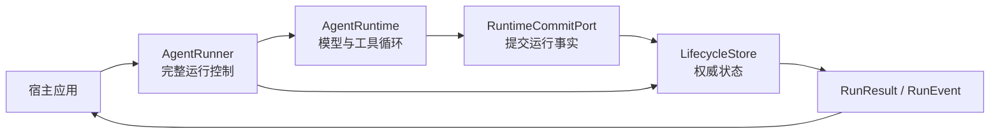

# 为什么一次 Agent 运行需要独立的生命周期

一次对话可能只调用一次模型，也可能经过多轮工具执行、等待人工回答，再在另一个进程里继续。保存聊天记录能回答“说过什么”，却不能回答“哪个工具已经执行”“本轮还剩几步”“当前到底在等谁”。Iris 把这些运行事实与消息一起管理，让宿主可以通过同一套 SDK 启动、查询、取消和恢复任务。

本文沿着“Agent 查询资料，准备写文件，等待确认后继续”的任务解释设计。操作代码见[人工输入与恢复](../cookbook/hitl-recovery.md)，精确接口见[运行与会话 SDK](../reference/runtime.md)。

## 四个概念分别解决什么问题

| 概念 | 表达的事实 | 例子 |
| --- | --- | --- |
| Session（会话） | 多轮共享的已提交消息、摘要及上下文窗口 | 同一用户持续讨论一份报告 |
| Run（逻辑运行） | 一次输入触发的完整任务及固定预算 | “查资料并更新报告” |
| Activation（执行段） | 某个执行者从当前位置推进 Run 的一次过程 | 首次执行，或用户批准后的继续执行 |
| Checkpoint（检查点） | 已提交事实对应的下一执行位置 | 哪个模型步、哪批工具、下一项工具、会话版本 |

一个 Session 可以依次包含多个 Run；一个 Run 可以因人工等待或恢复经历多个 Activation。`resume()` 改变 Activation，不创建新的 Run，也不会重置这次 Run 的步数预算。

同一 Session 的非终态 Run 占据唯一运行位置，包括正在执行的 `active` 和等待人工输入的 `waiting`。因此“已返回 waiting 结果”不表示会话已经空闲。下一轮普通任务要等它结束，或进入另一个 Session。

## 谁负责推进，谁保存事实

`AgentRunner` 是完整运行的公开入口。它创建 Run、驱动 Activation、处理人工继续、取消和恢复，并把一次执行结算为可读取的结果。`AgentRuntime` 只负责内部的模型—工具循环，通过 commit port 提交输入、模型响应、工具结果和检查点；它不自行选择数据库，也不拥有公开恢复入口。

`LifecycleStore` 保存 Session、Run、Activation、Checkpoint、工具调用、人工交互、事件和结果。内存实现与 SQLite 实现提供同一协议：前者方便进程内使用，后者保留跨进程运行事实。“权威”表示查询和恢复以这里的已提交事实为准，并不意味着使用内存实现也能跨重启恢复。

宿主拥有界面、输入渠道、事件循环和资源关闭。终端、WebSocket 或桌面 UI 都可嵌入同一个 Runner；它们不需要再维护一套独立的 Run 状态机。

## 从输入到人工等待

1. 宿主调用 `start()`。Runner 原子创建 Run、首个 Activation 和初始 Checkpoint，并占用该 Session 的运行位置。
2. Runtime 把用户输入提交到会话。模型调用前先预留一步预算；完整模型响应成功后，消息、用量、待执行工具和下一检查点一起提交。
3. 如果模型要求写文件，工具执行系统先确定是否需要人工确认。需要时，保存本次工具调用对应的 Interaction 和等待检查点，Run 进入 `waiting`，这段 Activation 结束。
4. `start()` 返回 `RunResult`，其中有 `pending_interaction`。Python 协程已经返回；任务在持久状态上仍未结束。UI 可以展示请求，进程也可以退出。
5. 宿主随后用 `resume(run_id, interaction_id=..., response=...)` 提交 typed response。Runner 保存回答，创建新的 Activation，再从等待位置推进。

这个流程把“等待人”变成可保存的状态，而不是在工具函数里无限等待 `input()`。问题可以由终端回答，也可以由网页按钮回答；业务执行不依赖某个 UI 一直在线。

## 工具为什么有 prepared、claimed 和 committed

模型提出调用时，工具处于 `prepared`；在执行真实工具体前登记 `claimed`；拿到确定结果并提交后成为 `committed`。

这区分了三个容易混淆的时刻：模型想调用、执行已经开始、结果已经可靠记录。例如写文件后进程立即崩溃，数据库可能只有 claim，而没有结果。恢复时无法仅凭聊天记录判断文件是否写完，也不能假设重新执行没有影响。

因此，发现未结算的 `claimed` 工具时，恢复会将 Run 结算为 `outcome_unknown`，不会自动重放该工具。它表达的是“已经开始的操作，其最终结果不可证明”，不是普通工具报错，也不是成功。集成者需要结合实际外部结果决定后续任务。

这个取舍避免把“可以恢复模型循环”误说成“任意外部操作都能恰好执行一次”。Iris 保存足以继续或明确停止的事实；外部系统的事务语义仍取决于工具本身。

## 恢复如何判断下一步

恢复由宿主显式触发，不靠读取数据库就自动启动任务。对遗留的 `active` Run，调用者先读取 `current_activation_id`，再将它作为 `expected_activation_id` 传给 `recover()`。Store 比较当前版本与 Activation 身份，保证接管的是调用者刚才看到的执行段；旧执行段后续提交不能覆盖新执行者。

| 已提交事实 | 恢复行为 |
| --- | --- |
| 可继续的检查点，没有未结算工具 claim | 新建恢复 Activation，从已提交位置继续 |
| 完整输出已经提交，只差最终结算 | 直接形成终态，不再调用模型 |
| 存在未结算工具 claim | 结算为 `outcome_unknown`，不重放工具 |
| Run 已终态 | 返回现有结果 |
| 普通人工等待 | 使用 `resume()` 提交对应回答 |

已到期的等待会按取消、截止时间或交互期限结算。子 Agent 的回答已经持久化但父子继续过程未完成时，另有明确的恢复路径；这不改变普通 waiting 使用 `resume()` 的规则。

模型调用也可能在故障后重发：若请求已发送但完整响应尚未提交，检查点仍在模型步之前。恢复复用已经预留的步数，不把同一逻辑步骤重复计入预算，但这不等于服务商只收到过一次请求。

恢复保存的是任务事实，而不是整个 Python 环境。新 Runner 使用当前配置重新组装 system、provider 和工具；已创建 Run 的请求及运行选项仍来自 Store。若要复现同一行为，宿主应提供相同的配置和工作区资源。

## 取消不是立即宣告完成

`request_cancel()` 先写入取消请求，再通知本进程正在运行的 Activation。取消请求只说明“应该停下”，不说明工具已经停止、清理已经完成。

`cancel()` 在此基础上等待 Store 出现终态结果。它的 `settlement_timeout` 是观察期限：超时抛出观察异常，不会凭空把 Run 写成 cancelled。普通工具的清理、命令资源的停止和已知工具结果的提交都可能影响实际结算时间；无法确定工具结果时仍可能得到 `outcome_unknown`。

宿主要关闭事件循环时，还需要等待原执行任务退出。使用 SessionManager 的应用可调用 `close(cancel_run=True)` 统一收回它持有的任务，再关闭 Runner。取消、停止资源和关闭 UI 是有关联但不同的步骤。

## 失败输出与实时展示的边界

受控的 provider、context 或工具执行错误通常形成 `RunResult`：查看 `stop_reason`、`error.source`、`error.code` 和 `error.message`。参数、状态冲突、持久化失败等错误可能直接抛出，不能把所有 Python 异常都解释成“这次 Run 已可靠失败”。

流式输出尤其需要这个区分。界面可能已显示部分文字，随后上游报错或流意外结束；这次不完整模型响应不会作为成功消息提交，也不会执行其未完成的工具调用。最终显示状态应以 Store 中的结果为准，临时文字按失败展示处理。详见[流式输出与观测参考](../reference/streaming-observability.md)。

## 历史分支保留什么

`SessionHistory.fork()` 从某个**终态顶层 Run**的消息截点创建独立 Session。它复制截至该点的已提交消息及当时摘要，不复制旧 Run、工具执行状态、Checkpoint、预算或待回答 Interaction，也不执行任何模型调用。新的上下文窗口在分支首次输入时重新采用。

因此，历史分支适合“保留这段讨论，换个方向继续”；`recover()` 适合“接手这次尚未完成的执行”。即使原 Session 正在进行后续 Run，也能从更早的合格截点创建分支，两者不会互相回滚。

## 继续阅读与实现入口

- [管理会话与运行中输入](../cookbook/sessions.md)：多轮、输入队列、历史预览和分支。
- [人工交互与输入准入设计](human-interaction.md)：为什么回答、steer 与 follow-up 要区分。
- [运行与会话参考](../reference/runtime.md)：状态、结果、Store 扩展协议。
- 实现入口：[Runner](../../src/iris/harness/runner.py)、[Lifecycle 模型与命令](../../src/iris/lifecycle/)、[Store](../../src/iris/store/)、[Runtime](../../src/iris/runtime/runtime.py)。
