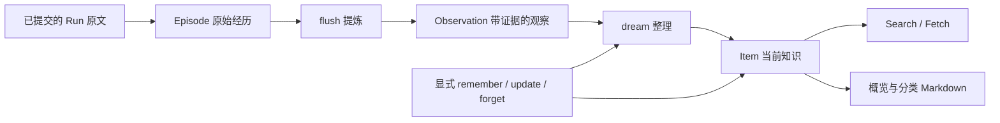

# 记忆如何进入下一次工作

一次对话结束后，聊天记录还在，并不等于下一次工作能够可靠地利用它。直接把所有历史塞给模型会不断增加输入；只保留一段总结，又难以区分原始事实、整理结论和过时信息。Iris 将这些职责分开：保存材料，提炼知识，发布概览，再按需读取。

以一个项目约定为例：用户先说“文档用中文”，后面补充“代码标识符仍用英文”。系统需要保留两次真实表达，形成当前适用的约定，并让下一次文档工作找到它。

## 从材料到当前知识

**Episode 保存发生了什么。** 捕获从当前 Run 的原文起点开始，记录消息和工具事实的稳定定位，不重复捕获继承的旧历史。它是不可变材料，还不是供 Search 返回的知识。独立 SDK 也可以用 `observe()` 提交材料。

**Observation 保存从材料里观察到了什么。** `flush` 在自己的输入/输出预算内读取一批材料，提炼带原因、适用条件和原文证据的观察。消费位置按原文记录及字符区间保存；观察提交与本批进度一起落入存储，重试不需要依靠“模型应该记得已经看过哪里”。

**Item 保存当前正式知识。** `dream` 结合观察、相关正式条目及显式写入事件，决定新增、修改、合并、删除或补充支持证据。同一批操作与观察去向原子提交；条目版本变化时，本轮候选可能发生冲突，不覆盖更新后的事实。

`flush` 面对的是本批原文，`dream` 面对的是这些观察与已有知识的关系。保留 Observation 这一中间层，就可以先提炼出“代码标识符仍用英文”，再在整理时决定如何补充已有的“文档用中文”条目、是否已有重复内容。因此 `flush` 完成只表示材料已提炼；这部分观察经 `dream` 整理成 Item 后，才会进入 Search/Fetch。

在例子里，原始两次表达可以保留为 Episode/证据，当前 Item 则表达完整约定。未来纠正它时，修改的是正式知识；已有历史消息和原始证据不会被改写成“当时就知道最新规则”。

显式 `remember()` 是另一条入口：用户或宿主已经明确要保存一个事实时，可以直接创建 Item，不必先调用两个生成阶段。显式写入的变化仍可进入后续整理，帮助处理重复、修正与关联。

## 谁拥有数据，谁拥有时间

| 角色 | 拥有的职责 |
| --- | --- |
| Lifecycle store | 会话消息、Run 状态、checkpoint 和运行结果 |
| Harness 捕获层 | 从已提交原文读取增量，为记忆登记真实来源 |
| MemoryService / MemoryStore | Episode、Observation、Item、版本和生成结果；执行 flush/dream |
| FileMemoryMirror | 从权威条目发布分类正文和模型生成的概览 |
| MaintenanceCoordinator | 宿主空闲计时、来源资格、资源锁、取消与排空 |
| Runtime | 在确定的采用边界把概览放入模型视图 |

默认 MemoryStore 是本地 SQLite。Markdown 是可查阅的投影，不能通过编辑投影反向改变数据库。这个选择让检索、条目更新、证据和消费进度有统一事实来源，同时保留可读文件，代价是必须说明文件的新鲜度。

正式条目版本、完整正文投影版本和概览来源版本分别记录。数据库写入成功而文件刷新失败时，条目仍然有效；Search/Fetch 读数据库，文件读取可以提示陈旧。概览生成期间数据又变了，也不能把旧输入生成的概览标成最新版本。

完整 Episode 和阶段历史仍从 MemoryStore 读取。Mirror 在实际写入处保存发布记录与当时正文，
概览或分类文件后来被覆盖也能回看。记录区分完整发布、部分写入失败、版本冲突和未确认结果，
Item 前后值继续复用原 MemoryEvent；文件发布和后续 Run 真正采用哪个概览是两种事实。

维护不是 runtime 每轮回答附带的一长串模型调用。新一批自动原文学习默认同时要求宿主持续
空闲 300 秒，以及同一数据库/namespace 有十个已终态、完整捕获有效原文且来源会话没有 WAITING
的合格新 Run；多页 Episode 不重复计数。达到门槛后将当时合格来源持久准入，仍按原预算分轮
处理。例如十个 Run 只处理完三个，余下七个下一轮或重启后继续，新来的 Run 则累计下一批。

数量门槛只管新原文批次。已有 Observation、显式记忆变更、无 Run 的显式 observe、投影和
概览修复照原顺序处理；全空材料可以无模型收尾。每轮优先 dream 已有观察或变更，否则 flush
一批获准 Episode，再修复必要投影和概览。生成前和消费前仍核对实际来源，某个会话 WAITING
不必阻止另一个合格会话。数量不足不会因时间久而放行；手动整理或配置门槛为 1 可提前处理。

前台重新开始时，后台让出；真实 IO 排空后才释放工作位置与锁。模型生成和本地 IO 的生命周期在 harness 中协调，记忆领域不持有会话调度权。这是可嵌入宿主的重要边界：打开记忆不等于库悄悄拥有一个永不停止的后台进程。

## 先知道有什么，再决定读什么

概览有两部分：少量核心事实，以及涵盖已知主题的知识范围。它帮助模型判断“数据库可能有文档约定”，而不是把所有 Item 正文常驻每次请求。

新会话首次输入采用已发布概览；成功压缩时再采用当前概览，并把选中的窗口保存进会话状态。正常后续 Run、恢复和 HITL resume 重用已经采用的窗口。保存的是本次真正采用的文本及来源信息，而不是每次恢复都重新读一个已经变化的文件。

全部 namespace 共用一个比例预算，默认输入预算的 2%。Iris 先尝试“核心事实 + 知识范围”，超额时改用完整知识范围；连知识范围都超额则报错，避免裁掉未知主题后还让模型误以为这就是全部目录。

随后模型自主决定是否调用 `memory_search`。本地默认使用 SQLite 全文检索，返回条目 ID、namespace、分类、类型、片段和片段是否完整。片段已经足够时可以直接回答；不够时用 `memory_fetch` 读取当前完整活跃条目。Fetch 不依赖先前 Search 的内容快照，所以能读取期间已经发生的更新。

可选 Decision 召回保持同一个工具 schema：先按 namespace、分类、类型及 `required_terms` 限定候选，再一次评分剩余完整正文。它没有改变记忆写入与持久化的 owner，独立成本也不会混成主模型 usage。精确差异见[参考](../reference/memory-goals.md)。

## 这个设计解决了什么，没有证明什么

材料与知识分离，使失败尝试、纠正来源和当前结论可以同时存在；数据库与投影分离，使文件可读性不成为事实一致性的前提；概览与查询分离，使输入规模不必随全部历史线性增长。

这些机制仍依赖模型正确提炼、整理和决定检索，输入预算也可能使一批材料暂时无法处理。`blocked` 生成状态、独立阶段结果和 usage 用于观察这种情况。实现中存在证据关联、版本冲突处理和确定性测试，不等于已经证明所有任务上的记忆质量或成本优势。

下一步：用[长期记忆配方](../cookbook/memory.md)运行读写与维护；想比较项目经验的职责，继续读[Evolution 设计](evolution.md)。

源码与验证入口：[生成逻辑](../../src/iris/memory/generation.py)、[记忆服务](../../src/iris/memory/service.py)、[维护协调器](../../src/iris/harness/maintenance.py)、[窗口与恢复测试](../../tests/harness/test_auto_memory.py)、[Search/Fetch 集成测试](../../tests/harness/test_memory_read_tools.py)。
