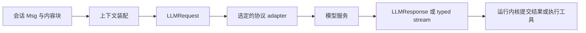

# 消息、模型协议与媒体如何分工

把 Agent 接到另一个模型服务时，理想情况是只更换模型配置，而不是重写历史、工具执行和图片存储。Iris 为此在运行内核与服务商协议之间保留自己的消息模型。

这层抽象统一调用形状，不能凭空补齐某个模型不支持的视觉、工具或输出能力。集成者仍需要选择实际支持所需能力的服务。

## 一次调用经过什么边界

`Msg` 表示系统、用户、助手与工具消息。正文可以是文字，也可以包含图片、工具调用和工具结果。`Conversation` 组织消息列表；它不会直接生成某家厂商的 payload。

`LLMRequest` 表示一次完整模型请求，包含选定历史、工具定义和请求参数。它与长期会话不同：会话可能保存很多原文，本次请求只携带装配后需要的视图。

Provider 将此请求转换为所选协议，再把返回值解析成 Iris 的 `LLMResponse`。运行内核因此可以统一判断“有工具调用，需要继续”或“有最终回答，可以结束”，不必理解 LiteLLM 的原始对象。

## 为什么协议在构造时确定

逻辑 provider 用于查凭据和服务配置；`api_style` 选择 Responses 或 Chat Completions；`litellm_provider` 决定底层传输标识。这三者相关但职责不同。

当前默认选择 Responses，也能显式使用 Chat Completions。固定 adapter 使请求投影、输入估算与响应解析采用同一种协议。失败后不自动切换，是为了让错误和运行行为可解释：换协议可能改变消息格式、工具语义和服务能力，不是一次无差别的重试。

代价是集成者需要正确配置服务支持的协议。具体选项见[模型配置](../reference/configuration.md#模型与协议)。

## 图片保存与请求编码分开

一张图片进入 Runner 时，先保存原始副本，必要时得到尺寸和字节量受控的模型副本。`ImageBlock` 保存 `original` 与 `model` 的文件引用和图片信息，历史与 SQLite 保存这个 typed 结构。

普通模型调用读取 `model` 版本；只有 provider 编码请求时才将文件转换为协议需要的图片输入。因此，历史中没有反复复制大段 base64，工具结果中的图片也能沿同一条类型路径进入模型。

这样的分工使原图可保留、历史可序列化、不同协议可以采用各自的图片封装。相应代价是会话不再只依赖数据库：缓存文件也是恢复所需材料，fork 后还可能继续引用源目录。

压缩时，文字摘要保存已经表达出来的视觉结论和图片引用。摘要不能重新创造未描述的图像细节；后续任务需要精确细节时，应回读图片。图片 token 是估算值，最终用量仍取决于服务响应。

## 流式数据暂时展示，完整结果才能提交

Provider 把服务流转换为 started、block delta、usage 和 completed/failed/cancelled 等 typed 事件。`delta` 表示本次变化，`snapshot` 表示对应通道当前全文。

文字已经显示，并不证明模型请求完成。完整响应成功后，runtime 才能把它作为模型步骤事实提交；半截工具参数也不能提前交给工具执行。失败后的部分文字可以帮助界面说明发生了什么，却不能充当一个成功的持久回答。

模型流的 sequence 只在该模型流内有意义，和整个 Run 的持久事件序号不同。宿主如何处理这两类内容，见[流式输出与观测](streaming-observability.md)。

## 语音是宿主输入适配

语音转录采用独立的 `SpeechAdapter` 和 `SpeechClient`。ASR 接收 PCM，返回当前全文与最终完成标志；宿主确认完成后，把最终文字交给通常的 Agent 输入路径。

这样可以更换语音供应商而不改变 Agent 历史与工具循环，也可以仅使用转录能力，不启动 Agent。录音、转码、提交按钮和音频播放留在宿主，因为这些工作依赖具体界面与设备。

继续阅读：[媒体操作](../cookbook/media.md) · [消息与 provider 接口](../reference/media.md)。实现入口：[消息模型](../../src/iris/message/message.py)、[ProviderClient](../../src/iris/providers/client.py)、[图片处理](../../src/iris/utils/images.py)、[SpeechClient](../../src/iris/speech/client.py)。
