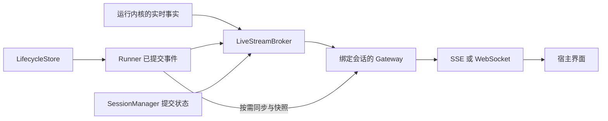

# 流式输出、持久事件与观测为什么分开

一个界面可以在模型说完前逐字显示回答。但如果网络随后中断，已经显示的半段话不能证明任务成功；如果界面断线，后台也不应因为少了一个观察者就自动停止。

Iris 因此将运行事实、实时展示和诊断记录分别交给不同组件。

## 三种信息回答不同问题

| 信息 | 回答的问题 | 保存与权威 |
| --- | --- | --- |
| lifecycle 状态与 RunEvent | 哪一步已经提交，任务是否等待、完成或失败？ | LifecycleStore；恢复和最终结果的依据 |
| live facts 与模型增量 | 此刻正在输出什么，界面可以展示什么？ | 进程内 broker 的有界缓存；不是持久历史 |
| OTel trace | 模型、工具与维护花了多久，输入输出和错误在哪里？ | 外部观测后端；不驱动运行恢复 |

它们可以描述同一次操作，却不能互相替代。一个 span 结束不等于工具副作用已经被生命周期存储确认，一个 delta 到达也不等于完整响应已成功。

## 展示链路如何嵌入宿主

Broker 统一分配 live 序号、维护有限的 replay ring 和订阅。Gateway 绑定具体 runner、manager 和 session，把命令交给正确 owner，并通过 Runner 查询持久状态。传输适配器只负责 framing 和连接内收发，不创建网络路由，也不接管业务执行。

一次正常输出中，模型增量先经 Broker 和 Gateway 到达界面，供界面更新临时正文。完整模型响应成功后，Runtime 才提交这一模型步骤，已提交事件也进入展示链路；如果响应包含工具调用，Run 还会继续推进工具和后续模型步骤。界面可以提前显示内容，同时依据持久事件和最终结果判断任务进度。

这样的分工让桌面应用、终端与 Web 宿主可以使用同一个运行内核。代价是宿主需要自行提供 HTTP/WebSocket 服务和界面状态管理，不能把库的 transport adapter 当成一个现成网站。

## 为什么需要两套游标

live sequence 属于某个 broker epoch 和 run/session scope；它用于当前进程中的有限重放。durable sequence 属于具体 Run，来自 store，可跨进程读取。

模型每个 token 的增量数量与一次模型步骤的提交数量不同，因此两种序号不可能简单对齐。客户端重连时可以先用 live cursor 尝试补齐，但收到 gap 后必须按已知 Run 的 durable cursor 同步已提交事件，必要时读取状态快照。

容量有限也意味着慢消费者不能让后台缓存无限增长。同一内容通道的待交付 partial 可以合并成最新快照，也可以在压力下让出位置；这些中间变化不保证逐条保留，也不一定产生 gap。界面应使用事件中的 snapshot 替换当前全文，而不是依赖收到每一个 delta。关键事件仍无法交付时，订阅才通过明确的缺口或终态告诉客户端需要重新同步。

## 回执、结果和取消不同

`submit` / `resume` 的 accepted 回执表示输入被准入，不是运行完成。最终状态通过事件和 Runner 查询取得。WebSocket 断线、SSE 停止迭代或关闭一个 subscription 只结束观察；取消任务需要显式命令。

关闭整个宿主时，则需要处理正在推进的任务，再关闭 Runner 及自己拥有的共享服务。输入准入与后台任务的关系见[人工交互设计](human-interaction.md)。

## 观测记录实际执行区间

一次 logical Run 可能跨越人工等待和多次 activation。观测以实际执行区间为单位记录模型、工具、恢复控制和维护，不需要维持一个跨进程、跨等待的永久活动 span。

标准 OTel 关联信息将 Run、Session、activation 与模型用途联系起来。维护协调器产生的后台工作有自己的周期，不应挂到已经结束的前台任务上。正文是否采集由固定策略决定，业务层在知道实际结果的位置记录事实。

观测服务不另存一份可恢复执行状态，也不因为记录失败改变业务结果或替业务重试。采用 OTel/OTLP 使宿主可以连接自己的后端；Iris 核心不依赖某个看板产品的运行语义。

继续阅读：[流式接线](../cookbook/streaming.md) · [启用观测](../cookbook/observability.md) · [接口参考](../reference/streaming-observability.md)。实现入口：[broker](../../src/iris/streaming/broker.py)、[gateway](../../src/iris/streaming/gateway.py)、[观测服务](../../src/iris/observability/service.py)。
