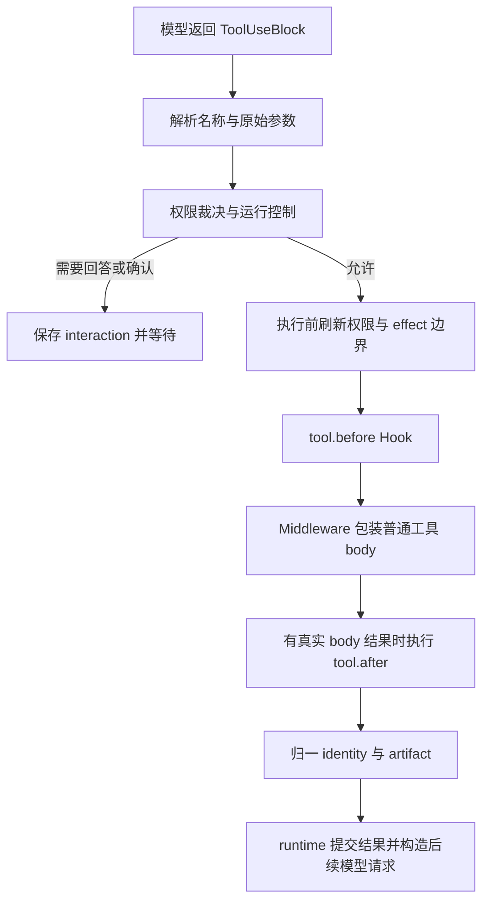

# 工具如何从定义走到结果

Agent 接入业务系统的难点不仅是把函数交给模型。一次真实操作还要回答：模型看到哪个 schema，参数在哪里解析，何时可以执行，结果怎样回到历史，以及长结果如何查回。Iris 把这些职责拆开，使 Python 函数、内置文件工具和 MCP 工具能进入同一条执行路径。

## 定义、目录和当前请求是三层对象

`ToolDefinition` 描述名称、说明、输入 schema、能力标签和结果策略；`BaseTool` 提供实际执行入口。函数工具由 `CallableTool` 将类型注解与 docstring 变成定义，并把返回值归一成 `ToolResult`。MCP 则将服务端目录映射成相同的工具定义，同时保留真实 server/wire identity。

`ToolRegistry` 保存完整工具对象，处理名称与别名冲突；`ToolRegistryView` 只读地过滤某个使用范围。registry 中存在一个工具，不等于它应该出现在每一次模型请求中。当前模型请求最终携带的是 provider-neutral 的 `ToolSpec`，供应商协议包装由 provider 完成。业务工具不必知道它被编码成 Chat Completions 还是 Responses 的结构。

这个分工使装配和执行独立：YAML 与 registrar 决定有哪些能力，runtime 决定本步披露哪些定义，executor 决定本次调用能否执行。

## 沿一次读取与修改任务看执行过程

假设用户要求“读取配置，把日志级别改为 INFO”。模型先发出 `read_file`，读到当前内容后再发出 `edit_file`。

模型参数是外部输入。函数工具在这里用同一输入模型完成解析；下游收到类型化参数，不重复猜测和验证。默认权限策略允许普通只读能力，写入与执行分别遵循配置。需要人工确认时，runtime 把等待事实交给 lifecycle/store，宿主收到 WAITING 并呈现交互；executor 本身不读取终端，也不保存完整 run。

真正进入副作用前还要使用当前权限与运行 identity。原因是准备调用和获得人工回答之间可能经过一段时间，原先的判断不能替代操作时刻的状态。这个检查属于执行边界，与反复校验同一份 Pydantic 参数不同。

文件工具另外拥有“先读后改”的职责：编辑已有文件使用读取观测判断它是否在读取后变化。模型给出的旧片段必须唯一匹配当前内容。运行状态归 harness，文件内容一致性归文件服务，二者不互相冒充权威。

## 并发只用于可并行的调用窗口

executor 可以并行执行相邻且满足只读、可并发声明的工具。遇到写入、执行、人工交互等调用时，需要按批次顺序收拢。能力标签只是判定输入之一，自定义工具还可覆盖 `is_read_only`、`is_concurrency_safe`。同步 callable 的线程放置是另一件事：放在线程执行不自动说明业务并发是正确的。

这样既允许独立读取同时进行，也保留“先读，再写，再读”的顺序。不能仅因为模型在同一条响应中返回多个调用，就无条件全部 `gather`。

## 结果有三种面向

`ToolResult` 同时支持模型正文、宿主结构化信息与文件产物。文本与图片块进入模型内容投影；`data` 和统计供宿主读取；artifact 保存较大的正文或已发布文件。错误也成为结构化结果，供模型按运行策略继续处理，而不是统一包装成一条“成功”字符串。

结果太长时保存正文并返回预览，后续用 `read_file` 查回。另一个上下文机制会把旧的 observation 类工具结果降为短预览，再通过历史访问入口查原始记录。前者处理单个结果过大，后者处理长对话增长；都应保留查回入口，但不能混称为同一个截断算法。详见[上下文工程](context-engineering.md)。

显式发布产物保存独立副本，解决“生成文件后来被覆盖，用户下载的不是当时结果”的问题。图片能否被模型理解还取决于 `ImageBlock` 和 provider 请求投影，不能只检查 artifact 文件存在。

## 延迟发现为何分两步

工具目录大时，持续附上所有 schema 会占用输入预算。Iris 可以只先披露 eager 工具和 `tool_search`，把专业能力标记为 deferred。模型先用自然语言提出一个或多个独立意图，搜索返回逐意图选择及候选摘要；随后 runtime 按上下文预算加载完整 schema。

发现结果不是即时执行授权。模型只能调用当前请求实际提供的工具定义；搜索命中可能因预算没有在下一步装入。披露状态由 runtime 保存到上下文状态，executor 认证真实搜索 body 产生的工具身份，普通文本或包装器返回值不会自行扩展可用工具集合。

默认后端使用本地元数据相关性排序，无需索引服务。可选 Decision 后端把同一允许目录与所有意图组成一次结构化判断，请它从候选中选择或返回无匹配。二者共享模型输入和输出结构；Decision 不接管权限、执行或运行循环，也不包含 eager 工具、Skill、subagent。精确规则在[工具发现参考](../reference/tools.md#工具发现)统一维护。

这种选择减少了基础部署依赖，也留下清楚的代价：本地检索依赖工具说明质量，远程判断增加网络延迟和费用，延迟披露需要额外模型步骤。目录很小时，直接暴露通常更简单。

从[编写工具](../cookbook/tools.md)开始实践；外部工具见 [MCP](../cookbook/mcp.md)，调用包装见[扩展设计](extensions.md)。源码入口：[registry](../../src/iris/tools/registry.py)、[executor](../../src/iris/tools/executor.py)、[discovery](../../src/iris/tools/discovery.py)、[artifact](../../src/iris/tools/artifacts.py)。
