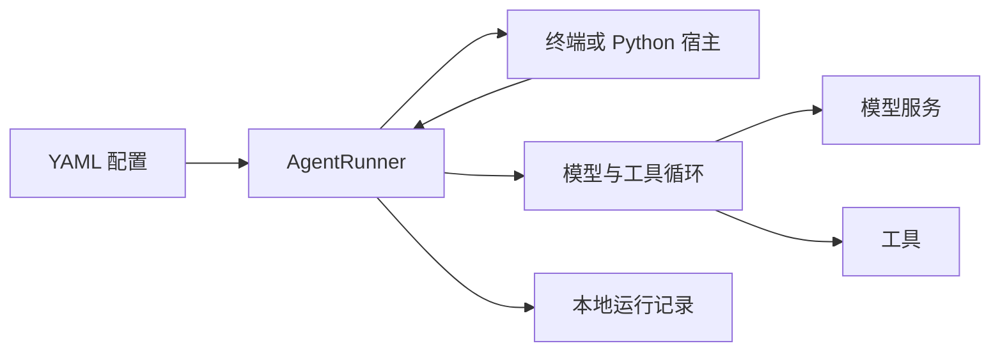

# 理解后续文档需要的几个概念

假设你让 Iris“读取项目，整理改进建议”。一次任务可能需要多次模型调用：模型先要求列出文件，Iris 执行工具；模型根据结果继续读取，最后给出建议。这就是最基本的 Agent 循环。

模型决定下一步，框架负责让这一步真的发生，并保存足以解释和继续运行的状态。Iris 把这两部分分开，使同一个 Agent 能由终端、Python 脚本或其他宿主应用使用。

## 配置、宿主与运行内核

**Agent 配置**声明模型、系统要求、工具和可选能力。YAML 是主要入口，不是执行脚本：声明一个工具不代表启动时就执行它。

**宿主应用**负责用户界面和进程生命周期。`iris chat` 是一个现成宿主；你写的 Python 程序也可以成为宿主。它决定用户何时输入、怎样展示问题，以及何时释放资源。

**AgentRunner** 是宿主使用的完整运行入口。它创建和继续任务，将运行事实提交到存储，再给宿主返回结果。底层 `AgentRuntime` 执行一次激活中的模型与工具循环。普通应用先用 Runner，无需自行组装 runtime。

## 会话与一次任务不同

| 概念 | 对项目阅读助手意味着什么 |
| --- | --- |
| Session（会话） | 连续讨论同一个项目的历史与上下文 |
| Run（一次逻辑运行） | 从“整理改进建议”开始，到完成、失败、取消等终态的一次任务；期间可以等待人工输入 |
| Model step（模型步骤） | 一次模型请求与响应；一个 Run 可能有多步 |
| Activation（激活） | 当前执行者推进 Run 的一段执行；等待后继续会产生新的激活，Run 仍是原来的任务 |

因此，用户回答一个工具确认问题不是另起一个无关任务，而是继续原 Run；用户在上一轮完成后提出新问题，则在同一 Session 中启动新 Run。持久化保存的不只是聊天文本，见[运行与状态设计](../design/lifecycle.md)。

## 模型看到的上下文不等于全部历史

**历史**记录已经发生的输入、回答与工具结果；**上下文**是这一模型步骤实际收到的内容，还包括系统要求、当前状态和工具说明。

读取一个长文件后，原始结果可以保存在本地，本步只展示预览。历史变长后，早期部分可以由摘要代表。两种情况下，“模型这次没看到全文”都不等于“全文被删掉了”。[上下文工程](../design/context-engineering.md)解释这些机制怎样配合。

长期记忆又是另一件事：它保存可跨任务采用的知识，由概览引导模型检索。它不替代会话历史，也不要求把每段对话永久塞入未来所有请求。

## 工具、Skill 和子 Agent 各自做什么

- **工具**是可执行能力，例如读文件、搜索或调用外部服务。模型提交结构化参数，工具执行后产生结果。
- **Skill**是可按需读取的方法说明。读取一份 Skill 不会自动执行其中的命令。
- **子 Agent**是接受委派任务的独立执行单元。它有自己的会话与过程，父 Agent 接收其任务结果。

三者可以组合：子 Agent 读取 Skill，再使用工具完成工作。配置和边界见[Skill 与子 Agent](../cookbook/skills-subagents.md)。

## 可选能力按需求增加

第一个 Agent 无需开启记忆、Goal、Docker 或观测。需要跨进程保留运行事实时使用 SQLite；需要持续推进目标时启用 Goal；需要执行命令的容器环境时选择 Docker。

“本地优先”描述的是项目配置、工作文件和状态的组织方式。模型或联网工具仍可能使用远程服务。Iris 是供宿主组合的 Agent Kit，不是已经替你提供所有 UI、后台服务和模型部署的完整应用。

下一步：[Python 集成](python-sdk.md) · [任务配方目录](../index.md#按任务查找) · [项目讲解路线](../project-tour.md)
