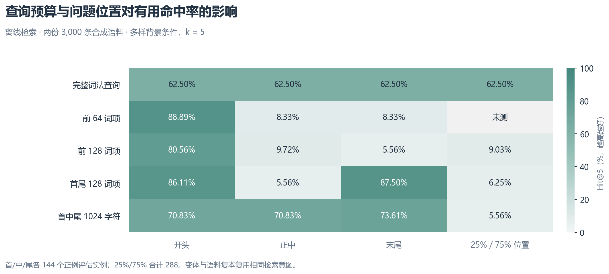
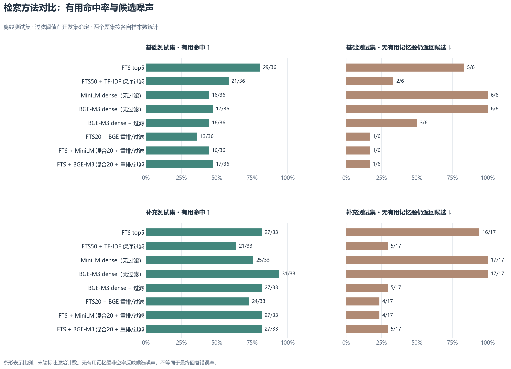
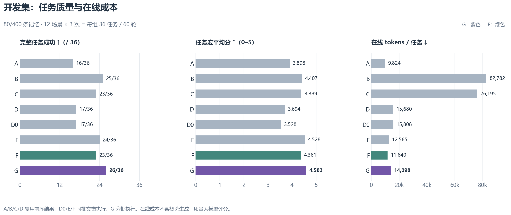
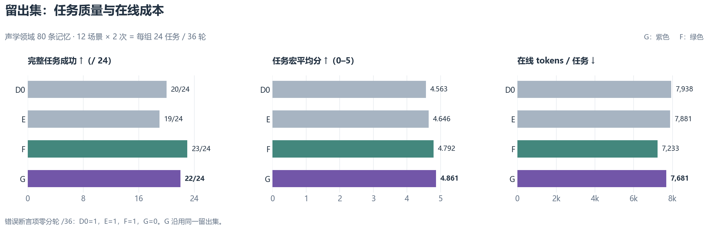

# Iris Memory 系统实验评估报告

评估日期：2026-09-21

本报告评估 Iris 长期记忆系统的检索质量、任务完成质量与运行成本，比较自动召回、文件读取和模型自主 Search/Fetch 三类方案，并分析查询预算、概览容量、读取指引及词组约束的影响。

项目采用 **G 方案：记忆概览 + 模型自主 Search/Fetch + 必要词组约束**。SQLite 继续作为记忆的权威存储，检索使用 FTS5/BM25；概览生成输出上限为 4,096 tokens，system 中的 memory 增量预算为可用输入预算的 2%。当前不引入向量数据库、常驻 embedding 模型、神经重排服务等重组件。

## 1. 实验范围与评价方法

实验分为离线检索评估和 Agent 端到端评估。离线实验考察有用记忆的命中情况；端到端实验考察模型能否选择、读取并正确使用记忆完成任务。

| 阶段 | 数据与比较范围 | 评价内容 |
| --- | --- | --- |
| 中英文词法与查询预算 | 36 个相关问题模板、6 个无相关记忆模板，336 个变体；两份 3,000 条记忆库；补充非居中位置测试及 300/3,000/30,000 条规模测试 | 分词、查询截断位置、词项预算与检索耗时 |
| 检索方法对比 | 3,000 条基础库、3,018 条补充库；194 条输入，其中 11 条为上下文诊断题；按主题划分开发集与测试集 | FTS、向量检索、混合检索、重排及过滤 |
| 小模型查询改写 | 同一批 194 条输入，由 Qwen3.5-0.8B 生成查询 | 自动改写的检索收益与生成成本 |
| 简单任务 A/B | 20 个正式场景，各重复 3 次；每组 78 个评分轮次 | 自动召回与文件读取的回答质量和成本 |
| 简单与复杂任务 A/B/C | 重新执行简单基准；复杂集包含 6 类任务、8/80/400 条记忆规模，各重复 3 次；每组 54 任务、90 轮 | 读取指引、复杂任务表现与规模效应 |
| Search/Fetch D | 执行 D，复用 A/B/C 相同题目的答案、成本与评分 | 数据库片段读取的端到端表现 |
| D0/E/F/G 优化 | 开发集：80/400 条库，12 场景各重复 3 次，每组 36 任务、60 轮；声学领域留出集：12 场景各重复 2 次，每组 24 任务、36 轮 | 概览容量、搜索指引、词组约束及跨领域表现 |

### 1.1 指标定义

| 指标 | 定义 |
| --- | --- |
| 有用命中率（Hit@5） | 对存在有用记忆的问题，前 5 条检索结果至少包含一条有用记忆的比例 |
| 无有用记忆题非空率 | 对库中没有有用记忆的问题，检索仍返回候选的比例；用于衡量候选噪声，不等同于最终回答错误率 |
| 任务均分 | 按固定评分规则给出 0–5 分，先平均任务内轮次，再对重复和场景等权计算 |
| 严格任务成功 | 所有轮次正常完成、满足全部关键检查项，且没有已知错误断言；检查项包括事实、格式和交付完整性 |
| 在线 tokens | 问答期间全部请求的累计输入与输出 tokens，包含工具循环和实际发生的上下文压缩 |
| 在线耗时 | Runner 执行问答的耗时，不含数据准备、进程启动、历史预置和离线概览生成 |

在线成本与概览生成成本分别统计。累计 tokens 是多次请求的总量，不代表单次上下文长度。概览生成成本按各阶段的实际任务数另行摊销。

Agent 回答使用 DeepSeek，配置路由为 `deepseek/deepseek-chat`，响应记录的型号为 `deepseek-flash`。质量由 GPT-6 Astra/max 在独立上下文中按固定规则评审，属于模型评分。每条答案评分一次，失败样本纳入统计。全部测试使用受控合成数据，重复执行用于观察运行差异，不增加独立场景数量。

## 2. 中英文词法与查询预算

初始实现将自然语言直接提交给 SQLite MATCH，并在错误或无结果时使用整句 LIKE。在完整自然语言问题测试中，两条路径的 Hit@5 均为 0；MATCH 的 672 次评估中有 584 次语法错误。该结果对应完整问题输入，不代表合法关键词查询的表现。

统一词法后，索引与查询均使用中文相邻双字词及英文、数字连续词；查询词项去重后以 OR 连接。完整查询的 Hit@5 提升至 68.92%。此次变化同时涉及分词、索引和匹配语义。

| 查询方式 | 正例 Hit@5 | 结果分析 |
| --- | ---: | --- |
| 完整词法查询 | 68.92% | 保留全部问题内容，长背景仍会影响排序 |
| 前 64 / 128 / 256 词项 | 44.62% / 46.01% / 44.27% | 扩大前缀预算未形成稳定收益，末尾问题易被截断 |
| 前 256 / 1,024 / 4,096 字符 | 36.81% / 32.29% / 41.32% | 字符预算与有效检索词项数量不成固定比例 |
| 首尾 128 词项 | 66.84% | 改善首尾问题覆盖，中间问题仍有遗漏 |
| 首尾 / 首中尾 1,024 字符 | 57.81% / 75.87% | 三段采样依赖问题位置，在非居中位置测试中仅为 5.56% |



完整查询在中文、英文和混合问题上的 Hit@5 分别为 60.42%、58.85% 和 87.50%。这些结果受测试措辞与题目分布影响，不作为语言能力排名。各词法策略在 96 个无相关记忆评估实例中均有 94 个返回候选，表明查询截断未能有效解决候选相关性问题。

在 30,000 条记忆库、13 类混合负载下，完整查询的检索耗时 p50/p95 为 114.74/661.48 ms，首尾 128 词项策略为 103.26/227.01 ms。约 12,000 字中文压力负载的对应值为 565.94/735.44 ms 和 108.30/142.56 ms；首尾策略合并去重后实际为 83 个词项。上述耗时仅覆盖本机 SQLite 检索路径。

项目采用统一词法和完整查询，不设置 64/128 词项截断。正常检索由主模型生成聚焦的查询，减少无关背景对排序和耗时的影响。

## 3. 检索方法对比

实验比较了 FTS/BM25、二值 TF-IDF、MiniLM/BGE-M3 向量检索、RRF 混合检索，以及 BGE 重排与过滤。过滤阈值在开发集确定，结果在测试集统计；11 条上下文诊断题不计入主表。

向量检索按语义相似度召回；混合检索合并词法与向量候选；重排模型对候选重新排序。FTS/BM25 在 SQLite 内完成词项匹配和排序，重排方案中的 20/50 表示候选池大小。



BGE-M3 在补充测试集的 Hit@5/20/50 分别为 31/33、32/33、33/33，FTS 均为 27/33。向量检索在部分跨语言题目中提高了候选覆盖率。但在基础测试集中，BGE-M3 对短查询命中 17/18，加入长背景后降至 0/18，即使保留全部输入也会受背景主题干扰。

重排与过滤同样存在召回损失。基础测试的 36 道正例问题中，FTS20 命中 32 道；经 BGE 重排取前 5 条后命中 20 道，阈值过滤后命中 13 道。损失分别发生在排序和过滤阶段。

FTS50 + TF-IDF 保序过滤将补充集的无有用记忆题非空数从 16/17 降至 5/17，同时将有用命中数从 27/33 降至 21/33。基础集上，TF-IDF 重排后过滤的命中数为 20/36，保序过滤为 21/36。Dice 保序过滤在基础集、补充集的命中数分别为 17/36、21/33，非空数分别为 2/6、10/17。各过滤方法均需在候选噪声与有效召回之间取舍。

| 检索管线 | 本机 p50 / p95 | 额外模型资源 |
| --- | ---: | --- |
| FTS（CPU） | 2.6 / 88.3 ms | 无 |
| MiniLM 向量检索（GPU） | 25.7 / 33.8 ms | 约 0.47 GB 权重 |
| BGE-M3 向量检索（GPU） | 61.3 / 107.7 ms | 约 2.27 GB 权重 |
| FTS20 + BGE 重排（GPU） | 409 / 2,423 ms | 约 2.27 GB 重排权重 |
| FTS50 + BGE 重排（GPU） | 575 / 6,640 ms | 同上 |

耗时包含查询编码与检索、排序，不含条目向量预计算、初始化和主模型回答。CPU 重排仅完成两个短题测量，耗时约 8 秒，未形成完整的分位数统计。第二组背景数据只复测了词法路径，神经检索方案未进行对应重复。

人工编写的理想查询用于分析查询表达的影响：FTS 在基础集的有用命中数由 29/36 提升至 32/36，补充集由 27/33 提升至 30/33；非空数分别为 4/6、16/17。该结果说明查询表达具有优化空间，但不代表系统已具备同等自动改写能力。

综合命中情况、延迟和部署成本，项目保留 SQLite FTS 作为候选检索层。向量检索与重排在部分题目上有效，但本次结果不足以支持其成为默认依赖。

## 4. 小模型查询改写

Qwen3.5-0.8B 对全部 194 条输入生成查询。模型仅接收当前文本，不读取记忆库、标准答案或人工查询；采用贪心解码，关闭 thinking，输入不截断，输出上限为 192 tokens。该上限仅用于模型生成，与 FTS 词项预算无关。

| 管线 | 基础集有用命中 / 36 | 基础集非空 / 6 | 补充集有用命中 / 33 | 补充集非空 / 17 |
| --- | ---: | ---: | ---: | ---: |
| 原始查询 → FTS | 29 | 5 | 27 | 16 |
| Qwen 改写 → FTS | 22 | 4 | 27 | 16 |
| 原始查询 → TF-IDF 重排/过滤 | 20 | 2 | 21 | 5 |
| Qwen 改写 → TF-IDF 重排/过滤 | 22 | 2 | 21 | 5 |

基础数据的 84 条输入中，13 条发生 JSON 解析失败，其中 11 条达到输出上限。基础测试集的 7 条失败按空检索计入，未回退原查询。补充测试集无解析失败，检索质量与对应基线持平。

单次运行的生成耗时 p50/p95 为基础测试集 6.09/32.93 秒、补充测试集 1.93/2.65 秒。Windows 测试环境使用较慢的参考 kernel，绝对耗时存在实现相关性。此次改写未带来稳定质量收益，且增加了生成开销，因此不纳入默认流程。

## 5. Agent 方案与简单任务评估

| 方案 | 记忆读取方式 |
| --- | --- |
| A | 每轮自动 FTS 召回，同时保留 memory tools |
| B | 在上下文中提供记忆概览，由模型按需使用文件工具读取正文 |
| C | 与 B 共享概览和文件内容，调整读取时机与正文使用指引 |
| D | 在上下文中提供记忆概览，由模型通过 Search/Fetch 查询数据库和读取条目 |

### 5.1 简单任务 A/B

首批正式实验包含 20 个场景，各重复 3 次，每组 78 个评分轮次。

| 方案 | 场景宏平均分 / 5 | 在线 tokens / 轮 | 在线秒 / 轮 |
| --- | ---: | ---: | ---: |
| A | 4.667 | 2,570 | 1.300 |
| B | 4.754 | 3,285 | 1.681 |

B 的评分提高 0.0875 分，tokens 增加 27.8%。B 正常完成 77/78 轮；一轮因上下文压缩达到 1,600 tokens 输出上限而产生空答案，计为 0 分。10 轮预实验与环境调试未计入正式成绩。

### 5.2 简单任务 A/B/C

第二批重新执行简单基准，主回答输出上限统一为 1,600 tokens，并重新生成概览。B 与 C 在同一批次中比较读取指引；跨批次差异同时包含输出预算和概览变化。

| 方案 | 均分 / 5 | 在线 tokens / 轮 | 在线秒 / 轮 | 模型请求数 |
| --- | ---: | ---: | ---: | ---: |
| A | 4.833 | 2,526 | 1.276 | 98 |
| B | 4.800 | 3,124 | 1.572 | 118 |
| C | 4.867 | 2,479 | 1.241 | 94 |

C 相比 B 节省约 21% 的 tokens 和耗时，评分接近。简单任务的质量差异较小，主要体现了读取指引对工具调用成本的影响。

## 6. 复杂任务与记忆规模

复杂集包含多约束发布、隐含交接偏好、跨条目关联、语义改写、多轮诊断和中途更新六类任务，在 8/80/400 条记忆规模下分别运行。每组包含 54 个完整任务、90 个用户轮次。D 复用 A/B/C 的题目和评分规则，A/B/C 结果来自前一批次。

| 方案 | 均分 / 5 | 严格成功 / 54 | 在线 tokens / 任务 | 在线秒 / 任务 |
| --- | ---: | ---: | ---: | ---: |
| A：自动 FTS | 4.142 | 28 | 8,484 | 4.600 |
| B：概览 + 文件 | 4.463 | 37 | 58,284 | 7.112 |
| C：文件读取指引优化 | 4.370 | 34 | 52,335 | 6.213 |
| D：概览 + Search/Fetch | 4.074 | 33 | 12,725 | 6.940 |

B/C 的完整任务成功数高于 A，但累计 tokens 明显增加。C 相比 B 降低读取成本，严格成功数减少 3 个。D 相比 B/C 分别减少约 78%/76% 的 tokens，模型请求数却由 188/158 增至 202，耗时未随上下文成本同比下降。

| 库规模（每组 18 任务） | A 成功 / tokens | B 成功 / tokens | C 成功 / tokens | D 成功 / tokens |
| --- | ---: | ---: | ---: | ---: |
| 8 条 | 12 / 5,804 | 12 / 9,289 | 11 / 4,614 | 16 / 6,816 |
| 80 条 | 8 / 8,755 | 16 / 29,803 | 12 / 30,551 | 9 / 14,136 |
| 400 条 | 8 / 10,893 | 9 / 135,760 | 11 / 121,840 | 8 / 17,224 |

表中 tokens 为每完整任务的在线均值。80/400 条库的 B/C/D 概览生成均达到 1,024 tokens 输出上限，未能完整生成。B/C 仍有程序生成的文件导航，D 没有已发布概览，因此三者在这些规模下的信息条件存在差异。

结果反映出两项主要限制：概览生成容量不足，以及文件读取随记忆规模增长带来的正文开销。400 条库下，C 的 tokens 仍约为 A 的 11.2 倍。2% 预算只限制常驻 system 概览，工具正文进入历史后的累计开销不受该比例约束。

D 在简单组的均分为 4.888，在线成本为 2,368 tokens/轮、1.535 秒/轮。该批记忆条目最长仅 169 字符，Search 可完整返回全部条目，未覆盖长正文 Fetch 场景。无已发布概览的 60 个评分轮次中，48 轮仍发生检索，说明模型对概览范围指令的执行也存在偏差。

## 7. Search/Fetch 优化实验

### 7.1 方案设置

| 方案 | 实验变化 |
| --- | --- |
| D0 | 在新批次重新执行 D；开发集沿用未成功生成概览的状态 |
| E | 将概览生成输出上限从 1,024 提高至 4,096 tokens |
| F | 在 E 基础上增加搜索指引：证据充分即停止；`has_more` 不要求继续查询；片段够用时不重复 Fetch |
| G | 在 F 基础上增加 `required_terms`，由模型显式指定必须匹配的词组，通过 FTS AND 约束候选 |

E/F/G 共享相同的概览内容，system 中 memory 的预算保持 2%。各方案沿用同一主模型配置、1,600 tokens 回答输出上限和最多 8 步的运行限制。历史 A 的自动召回采用 4,000 字符预算，与概览预算不同。

### 7.2 开发集结果

开发集选取 80/400 条库的共同场景，每组 12 场景各重复 3 次，共 36 个完整任务、60 轮。A/B/C/D 使用相同场景的历史结果；D0/E/F 在同批次交错执行，G 在后续批次执行。



| 方案 | 均分 / 5 | 严格成功 / 36 | 在线 tokens / 任务 | 在线秒 / 任务 | 模型请求数 |
| --- | ---: | ---: | ---: | ---: | ---: |
| A | 3.898 | 16 | 9,824 | 4.670 | 83 |
| B | 4.407 | 25 | 82,782 | 7.942 | 134 |
| C | 4.389 | 23 | 76,195 | 7.339 | 125 |
| D | 3.694 | 17 | 15,680 | 7.813 | 154 |
| D0 | 3.528 | 17 | 15,808 | 7.101 | 156 |
| E | 4.528 | 24 | 12,565 | 5.835 | 126 |
| F | 4.361 | 23 | 11,640 | 5.642 | 120 |
| **G** | **4.583** | **26** | **14,098** | **5.751** | **132** |

提高概览生成容量后，E 的两份开发概览分别在输出 1,712/2,207 tokens 后成功发布。相较 D0，E 的质量提高，tokens 与请求数同时下降。

F 相比 E 减少 7.4% 的在线 tokens，严格成功数减少 1 个。Fetch 从 38 次降至 18 次，减少的 20 次均为 Search 已返回完整正文后的重复读取；按已知 ID 核对更新值的 6 次 Fetch 得到保留。

G 相比 F 增加 3 个严格成功任务。逐任务配对中，6 次结果改善、3 次回退；在线 tokens 增加 21.1%，模型请求数增加 10%。均分由 4.361 提高至 4.583，错误断言检查项为零分的轮次由 11/60 降至 6/60。该组无空答案，零分项对应评审识别的错误断言。

### 7.3 留出集结果

留出集使用声学领域的 80 条记忆，包含长条目、相似实体、多轮诊断、记录更新、无答案和无关主题。12 个场景各重复 2 次，每组共 24 个任务、36 轮，其中两个长条目的正文分别为 696/917 字符。

G 的实验配置在读取前序留出结果前确定，随后沿用相同留出集。因此该组可用于跨领域比较，但不属于额外独立的终验数据。



| 方案 | 均分 / 5 | 严格成功 / 24 | 在线 tokens / 任务 | 在线秒 / 任务 | 模型请求数 | 错误断言项零分轮 / 36 |
| --- | ---: | ---: | ---: | ---: | ---: | ---: |
| D0 | 4.563 | 20 | 7,938 | 3.820 | 71 | 1 |
| E | 4.646 | 19 | 7,881 | 3.481 | 68 | 1 |
| F | 4.792 | 23 | 7,233 | 3.239 | 64 | 1 |
| **G** | **4.861** | **22** | **7,681** | **3.341** | **64** | **0** |

G 的均分最高，未出现评审判定的错误断言；严格成功数比 F 少 1 个。G 的两次失败均来自同一诊断场景，各满足 6/7 个关键项，遗漏了将独立计数测得的速率与容器声明值核对的步骤。F/G 的配对结果为 22 对均成功、1 对均失败、1 对仅 F 成功。G 的在线 tokens 比 F 增加 6.2%，模型请求数相同。

D0 的概览再次达到 1,024 tokens 上限，E 在输出 3,187 tokens 后成功。开发集与留出集中，三个使用 4,096 上限的概览均成功生成，但每库仅执行一次。E/F/G 在两组实验中实际载入的均为知识范围摘要（`knowledge_scope`），未载入完整核心事实。

长条目测试中，D0/E/F 均在两个长任务的首轮先 Search 再 Fetch。F 的 6 次 Fetch 中，4 次用于长正文，2 次用于读取已知 ID 的当前值。G 在开发集 132 次 Search 中有 45 次使用必要词组，在留出集 43 次 Search 中有 11 次使用，均未出现空结果或 Search 错误；过严约束或别名导致空结果后的修正能力尚未覆盖。

## 8. G 方案的选型依据

G 在保留本地 SQLite 架构的前提下，提高了复杂任务表现，并为模型提供了明确收紧检索范围的能力。

**复杂任务质量。** 开发集严格成功数为 26/36，均分为 4.583，均高于 F 的 23/36 和 4.361。留出集均分达到 4.861，未出现评审判定的错误断言。留出集严格成功数为 22/24，低于 F 的 23/24，说明 G 的收益主要体现在平均回答质量和部分复杂任务上，尚不构成全面优势。

**查询表达能力。** 普通 OR 查询增加词项后不一定缩小候选范围。`required_terms` 允许模型指定必须出现的组件、对象或词组，将关键约束直接交给检索层执行，减少依靠反复改写长查询来收紧范围的需要。

```text
普通查询： (词项 A OR 词项 B OR 词项 C)
词组约束： (词项 A OR 词项 B OR 词项 C) AND 必要词组 1 AND 必要词组 2
```

必要词组使用现有分词器形成有序、相邻的 FTS phrase，并非原文逐字子串匹配。未填写时保持普通 OR 查询；不设置 64/128 词项截断，也不在无结果时自动放宽约束。

**运行成本。** G 相比 F 的在线 tokens 在开发集增加 21.1%，留出集增加 6.2%。该成本用于换取更强的检索表达能力与已观测的质量收益。相比整类文件读取，G 通过片段检索和按条目 Fetch 控制正文进入上下文的规模。

**部署与维护。** G 复用现有 SQLite 索引、BM25 排序和 Search/Fetch 接口，无需增加向量数据库、embedding 服务或重排模型，符合 Iris 本地优先、轻量部署的定位。

当前方案的主要配置与行为如下：

| 项目 | 采用方式 |
| --- | --- |
| 权威存储与检索 | SQLite + FTS5/BM25 |
| 记忆读取决策 | 模型依据概览按需调用 Search/Fetch |
| 候选收紧 | 可选 `required_terms`，与普通查询取 AND |
| 概览生成输出上限 | 4,096 tokens |
| system memory 增量预算 | 可用输入预算的 2% |
| 工具调用指引 | 证据充分即停止；正文片段不足或需核对当前值时 Fetch |
| 重型检索组件 | 当前不引入 |

## 9. 实验调用量与生成成本

| 执行批次 | 模型请求数 | 累计 tokens | 统计范围 |
| --- | ---: | ---: | --- |
| 简单 A/B 批次 | 240 | 579,000 | 正式运行、预实验、准备、压缩和概览生成；另有环境调试 4 次、5,166 tokens，未计入此行及成绩 |
| 简单与复杂 A/B/C | 812 | 7,321,376 | 528 个会话 run、11 次共享概览生成，包含两次不完整生成 |
| D | 323 | 1,013,625 | 预实验、准备、在线问答及 11 次概览生成；不重复计入 A/B/C |
| D0/E/F/G 优化 | 805 | 2,792,912 | 240 任务、384 轮；801 次在线请求和 4 次新增概览生成，不重复计入已共享的概览和 D |

以上统计为回答模型的实际 token 用量，不包含评分模型消耗。缓存命中、推理 tokens 等细分数据不完整，因此不换算货币成本。

共享概览在执行总量中只计一次。评估单个方案的部署成本时，需将生成成本按使用次数摊销：

| 方案与题集 | 在线 tokens / 任务 | 含概览摊销 tokens / 任务 |
| --- | ---: | ---: |
| F 开发集 | 11,640 | 13,779 |
| G 开发集 | 14,098 | 16,237 |
| F 留出集 | 7,233 | 7,909 |
| G 留出集 | 7,681 | 8,357 |

开发集按每库 18 个任务摊销，留出集按 24 个任务摊销。实际单位成本随概览复用次数变化。

## 10. 测量局限

- **数据覆盖。** 实验使用人工构造语料和两个合成任务领域，尚未覆盖生产流量、长期使用、自动写入与提炼质量，或其他回答模型。
- **样本规模。** 开发集和留出集分别包含 12 个场景，重复执行不增加独立题目数量。当前差异未经过统计显著性检验。
- **执行批次。** A/B/C/D 与优化方案非同期运行，G 与 F 也分批执行。tokens 和请求数可直接核算，耗时还受模型服务负载影响。
- **模型评分。** 标签以外的附加事实可能被标记为不确定，未必全部核实。部分相同可见输入存在评分波动。G 开发集评分未完全匿名，留出集使用匿名材料与独立上下文。
- **版本范围。** 本报告反映固定实验版本的结果。正式实现对工具指引进行了局部措辞调整，尚未重跑真实模型实验验证其效果。
- **未覆盖场景。** 4,096 tokens 概览生成每库仅测一次；必要词组造成空结果后的查询修正、更大记忆规模及长期交互表现仍需进一步评估。
