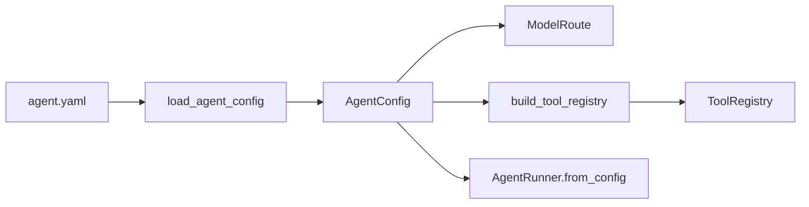

[中文](README.md)

# `iris.agents`

`iris.agents` owns config-first agent declarations. It parses `agent.yaml` into typed models and
builds a `ToolRegistry`; it does not call a model, assemble context, run a tool loop, or persist a
session. `iris.runtime` consumes the resulting configuration.

## Architecture

`AgentConfig.mcp` uses `AgentMCPConfig` and `MCPServerOverride`, both exported from `iris.agents`.
`mcp.path` resolves relative to the agent YAML. Loading YAML does not connect; shared assembly
reads declarations, and the runner prepares and publishes tools before execution. See
[MCP configuration](../mcp/README.en.md). For example:

```yaml
mcp:
  path: mcp.json
  overrides:
    local-server:
      required: true
      trust_annotations: false
```

`tools.subagent: subagents.yaml` declares an optional internal Sub Agent catalog, disabled by
default. The path is relative to the parent YAML. Catalog `default` must exactly match an
`agents` kebab-case key; each entry supplies a catalog-relative `path` and nonblank `description`.
The internal loader reads only the catalog and freezes its routes without loading child YAML.
`build_tool_registry()` continues to handle only builtin/Python tools.
The runner reads the catalog once at startup and loads only the selected child YAML on execution.
CHILD excludes subagent and never reads a nested catalog. See the complete three-file example in
the [harness README](../harness/README.en.md).



## Quick start

```python
from iris.agents import build_tool_registry, load_agent_config

config = load_agent_config("agent.yaml")
route = config.to_model_route()
registry = build_tool_registry(config.tools)
```

```yaml
name: notes-agent
model:
  provider: openai
  name: gpt-4o-mini
  temperature: 0.2
  max_tokens: 512
system: |
  You are a local notes assistant.
skills:
  enabled: true
  root: .agents/skills
  require:
    - review-python
tools:
  builtin:
    - file.read
    - file.list
    - file.grep
    - human.ask
  python:
    functions:
      - my_project.tools:search_notes
    registrars:
      - my_project.tools:register_tools
permissions:
  workspace: .
  writes: confirm
session:
  backend: sqlite
```

`system` and `context` are mutually exclusive and exactly one is required. Structured context uses:

```yaml
name: notes-agent
model: openai/gpt-4o-mini
context:
  path: context.yaml
```

The agent loader resolves `context.path` relative to `agent.yaml` but does not open the context
file. `RuntimeFactory` later validates it through `load_context_build_input()`.

## Public models and APIs

`iris.agents` exports `AgentConfig`, `AgentContextConfig`, `AgentSkillsConfig`, `CompactionConfig`, `ModelConfig`,
`PermissionsConfig`, `PythonToolsConfig`, `SessionConfig`, `ToolsConfig`, `load_agent_config()`, and
`build_tool_registry()`.

- `ModelConfig` accepts structured fields or the `provider/model` shorthand. `to_model_route()`
  returns a provider route; `to_llm_request_options()` returns only request-level fields. The active
  provider path uses only LiteLLM Chat Completion and exposes no `api_style` configuration field.
  Streaming is selected by host injection of the runner's `live_publisher`; model configuration
  has no `stream` field.
- `ToolsConfig.builtin` supports `file.read`, `file.list`, `file.grep`, `file.write`, `file.edit`, and
  `human.ask`. The latter exposes model tool name `ask_question`.
- `tools.python.functions` imports a callable `module:function` and registers it. `registrars`
  imports a callable receiving the registry. Inline Python and mixed lists are rejected.
- `PermissionsConfig` defaults to workspace `.` and writes `confirm`; enforcement belongs to the
  tool executor.
- `SessionConfig` supports `none` and `sqlite`; SQLite defaults to `.iris/session.db`.

`AgentConfig.compaction` defaults to `CompactionConfig`, exported from both `iris.agents` and
`iris.agents.config`:

```yaml
compaction:
  input_budget_tokens: 96000
  keep_recent_ratio: 0.15
  summary_ratio: 0.05
  timeout_seconds: 300
```

The input budget already excludes output reservation; Iris does not subtract `model.max_tokens`
again. The trigger and post-compaction acceptance limit are fixed at 80% of this budget, rounded
down. Recent-text retention and summary output limits multiply the budget by their respective
ratios, rounded up. Recent-text retention is a soft target, so the two ratios need not sum to less
than 80%. The input budget and timeout must be positive; both ratios must be between 0 and 1.

To customize summary instructions and output format, provide a separate Jinja2 file:

```yaml
compaction:
  prompt: ./prompts/summary.j2
```

`prompt` resolves relative to `agent.yaml`. Omitting it or using `null` selects the bundled
[default seven-heading prompt](../prompts/compaction.j2). The file supplies the summary request's
system message. Iris provides the previous summary and current history batch in the user message;
the template needs no data variables. Custom instructions may change the headings and wording.
Iris still wraps the summary body in `<summary>` when adding it to the main request.

Files use the existing `iris.context` Jinja2 renderer, including static includes and caching after
the first read. Create a new runtime to pick up edits. Config loading resolves only the path; the
first compaction reads the file. With the Python SDK, relative paths use the directory of
`config_path`, or the current working directory when it is omitted.

`load_agent_config()` and `AgentConfig` validate these values without calling a model or tokenizer.
The existing `RuntimeEnvironment.agent_config` carries the resulting configuration. Before each
main model call, runtime automatically summarizes old history when the full input reaches 80%,
including committed steps in the current run while preserving task anchors and recent text.
Summaries use the current model; `summary_ratio` caps generation output and may include reasoning.
The resulting full request must be no larger than 80% and strictly smaller than before. Once started,
a failed compaction ends the current run while preserving raw history and the last committed summary.
Main usage and `RunUsage.compaction` accumulate separately. See
[providers](../providers/README.en.md) for estimation limits and [runtime](../runtime/README.en.md)
for execution and recovery.

`AgentConfig.mcp` also defaults to `None`; `AgentMCPConfig` references a JSON/JSONC/TOML file
and supplies local server overrides as described above.

`AgentConfig.skills` is optional and defaults to `None`. `AgentSkillsConfig` has:

- strict boolean `enabled`, defaulting to `false`; disabled configuration bypasses discovery;
- `root`, defaulting to `.agents/skills` and resolving inside `permissions.workspace`;
- `require`, defaulting to an empty tuple and accepting lowercase kebab-case names only. When
  enabled, any missing required Skill becomes an `IrisConfigError` in `RuntimeFactory`.

See [`iris.skill`](../skill/README.en.md) for the directory and `SKILL.md` contract. A non-empty
discovery result makes `RuntimeFactory` register `load_skill` automatically with the same registry
as the context catalog. `load_skill` is not a `tools.builtin` entry and must not be declared there.

`load_agent_config()` reads UTF-8 YAML, rejects unknown fields, and wraps file/YAML/model failures as
`IrisConfigError`. `build_tool_registry()` creates one shared file service for configured file tools,
then loads Python functions and registrars; invalid names/references also become `IrisConfigError`.

To build a runnable agent:

```python
from iris.harness import AgentRunner

runner = AgentRunner.from_config_path("agent.yaml")
```

This package does not implement loops, automatic model calls, long-term memory, Redis, a vector
database, or an ORM.

## Maintenance

| Change | Main location | Tests |
| --- | --- | --- |
| `agent.yaml` loading and relative context paths | `config/base.py`, `../runtime/factory.py` | `tests/runtime/test_factory.py` |
| Compaction budgets and summary instructions | `config/compaction.py`, `config/base.py` | `tests/agents/test_compaction_config.py`, `tests/runtime/test_compaction_prompt.py` |
| Skill config and factory integration | `config/base.py`, `../runtime/factory.py` | `tests/agents/test_skill_config.py`, `tests/runtime/test_factory_skills.py` |
| Built-ins and Python references | `config/tools.py` | `tests/agents/test_tools_config.py` |

```bash
uv run pytest tests/agents tests/runtime/test_factory.py
uv run ruff check src/iris/agents tests/agents
```
