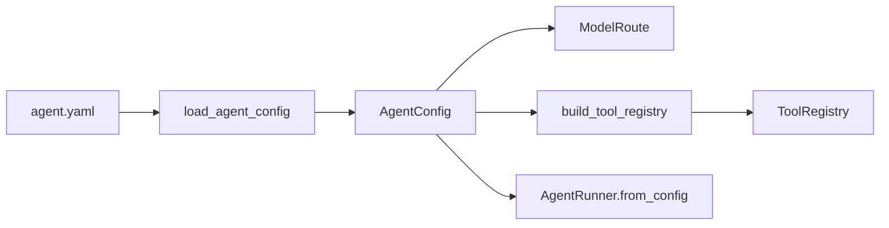

[中文](README.md)

# `iris.agents`

`iris.agents` owns config-first agent declarations. It parses `agent.yaml` into typed models and
builds a `ToolRegistry`; it does not call a model, assemble context, run a tool loop, or persist a
session. `iris.runtime` consumes the resulting configuration.

## Architecture



## Quick start

```python
from iris.agents import build_tool_registry, load_agent_config

config = load_agent_config("agent.yaml")
route = config.to_model_route()
registry = build_tool_registry(config.tools)
```

```yaml
name: notes-agent
model:
  provider: openai
  name: gpt-4o-mini
  temperature: 0.2
  max_tokens: 512
system: |
  You are a local notes assistant.
tools:
  builtin:
    - file.read
    - file.list
    - file.grep
    - human.ask
  python:
    functions:
      - my_project.tools:search_notes
    registrars:
      - my_project.tools:register_tools
permissions:
  workspace: .
  writes: confirm
session:
  backend: sqlite
```

`system` and `context` are mutually exclusive and exactly one is required. Structured context uses:

```yaml
name: notes-agent
model: openai/gpt-4o-mini
context:
  path: context.yaml
```

The agent loader resolves `context.path` relative to `agent.yaml` but does not open the context
file. `RuntimeFactory` later validates it through `load_context_build_input()`.

## Public models and APIs

`iris.agents` exports `AgentConfig`, `AgentContextConfig`, `ModelConfig`, `PermissionsConfig`,
`PythonToolsConfig`, `SessionConfig`, `ToolsConfig`, `load_agent_config()`, and
`build_tool_registry()`.

- `ModelConfig` accepts structured fields or the `provider/model` shorthand. `to_model_route()`
  returns a provider route; `to_llm_request_options()` returns only request-level fields. The active
  provider path rejects `stream: true` and non-chat `api_style` at call time.
- `ToolsConfig.builtin` supports `file.read`, `file.list`, `file.grep`, `file.write`, `file.edit`, and
  `human.ask`. The latter exposes model tool name `ask_question`.
- `tools.python.functions` imports a callable `module:function` and registers it. `registrars`
  imports a callable receiving the registry. Inline Python and mixed lists are rejected.
- `PermissionsConfig` defaults to workspace `.` and writes `confirm`; enforcement belongs to the
  tool executor.
- `SessionConfig` supports `none` and `sqlite`; SQLite defaults to `.iris/session.db`.

`load_agent_config()` reads UTF-8 YAML, rejects unknown fields, and wraps file/YAML/model failures as
`IrisConfigError`. `build_tool_registry()` creates one shared file service for configured file tools,
then loads Python functions and registrars; invalid names/references also become `IrisConfigError`.

To build a runnable agent:

```python
from iris.harness import AgentRunner

runner = AgentRunner.from_config_path("agent.yaml")
```

This package does not implement loops, automatic model calls, long-term memory, Redis, a vector
database, or an ORM.

## Maintenance

| Change | Main location | Tests |
| --- | --- | --- |
| `agent.yaml` loading and relative context paths | `config/base.py`, `../runtime/factory.py` | `tests/runtime/test_factory.py` |
| Built-ins and Python references | `config/tools.py` | `tests/agents/test_tools_config.py` |

```bash
uv run pytest tests/agents tests/runtime/test_factory.py
uv run ruff check src/iris/agents tests/agents
```
