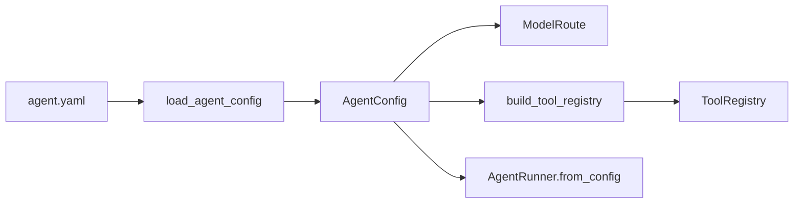

[中文](README.md)

# `iris.agents`

`iris.agents` owns config-first agent declarations. It parses `agent.yaml` into typed models and
builds a `ToolRegistry`; it does not call a model, assemble context, run a tool loop, or persist a
session. `iris.runtime` consumes the resulting configuration.

## Architecture

`AgentConfig.decision` accepts optional `AgentDecisionConfig(path)` (exported from `iris.agents`).
The path is relative to the agent YAML and names a separate Decision configuration. Its
`tools.discovery` switch enables one batched Choice for deferred tool discovery; `memory.recall`
enables one batched Score for direct memory recall. Both default to false and work independently.
`build_tool_registry(memory_decision_client=...)` passes the evaluator only to Search, leaving the
shared service, Fetch and write tools unchanged. Shared assembly validates dependencies and borrows or creates the evaluator; YAML loading
does not connect. See [Decision configuration](../decision/README.md).

`todo.enabled` defaults to false. Enabling it provides SDK access to per-session Markdown Todo
lists and a fresh snapshot for each model step. It
requires `context_policy.enabled=true`; it does not register file tools or change permissions.
`TodoConfig` is exported from `iris.todo`. See the [Todo documentation](../todo/README.md).

`AgentConfig.mcp` uses `AgentMCPConfig` and `MCPServerOverride`, both exported from `iris.agents`.
`mcp.path` resolves relative to the agent YAML. Loading YAML does not connect; shared assembly
reads declarations, and the runner prepares and publishes tools before execution. See
[MCP configuration](../mcp/README.en.md). For example:

```yaml
mcp:
  path: mcp.json
  overrides:
    local-server:
      required: true
      trust_annotations: false
```

`tools.subagent: subagents.yaml` declares an optional internal Sub Agent catalog, disabled by
default. The path is relative to the parent YAML. Catalog `default` must exactly match an
`agents` kebab-case key; each entry supplies a catalog-relative `path` and nonblank `description`.
The internal loader reads only the catalog and freezes its routes without loading child YAML.
`build_tool_registry()` continues to handle only builtin/Python tools.
The runner reads the catalog once at startup and loads only the selected child YAML on execution.
CHILD excludes subagent and never reads a nested catalog. See the complete three-file example in
the [harness README](../harness/README.en.md).


```mermaid
flowchart LR
    YAML["agent.yaml"] --> Loader["load_agent_config"]
    Loader --> Config["AgentConfig"]
    Config --> Route["ModelRoute"]
    Config --> Tools["build_tool_registry"]
    Tools --> Registry["ToolRegistry"]
    Config --> Harness["AgentRunner.from_config"]
```

## Quick start

```python
from iris.agents import build_tool_registry, load_agent_config

config = load_agent_config("agent.yaml")
route = config.to_model_route()
registry = build_tool_registry(config.tools)
```

```yaml
name: notes-agent
model:
  provider: openai
  name: gpt-4o-mini
  temperature: 0.2
  max_tokens: 512
system: |
  You are a local notes assistant.
skills:
  enabled: true
  root: .agents/skills
  require:
    - review-python
tools:
  builtin:
    - file.read
    - file.list
    - file.grep
    - human.ask
  python:
    functions:
      - my_project.tools:search_notes
    registrars:
      - my_project.tools:register_tools
permissions:
  workspace: .
  writes: confirm
session:
  backend: sqlite
```

`system` and `context` are mutually exclusive and exactly one is required. Structured context uses:

```yaml
name: notes-agent
model: openai/gpt-4o-mini
context:
  path: context.yaml
```

The agent loader resolves `context.path` relative to `agent.yaml` but does not open the context
file. `RuntimeFactory` later validates it through `load_context_build_input()`.

## Public models and APIs

`iris.agents` exports `AgentConfig`, `AgentContextConfig`, `AgentSkillsConfig`, `CompactionConfig`, `ContextPolicyConfig`, `ModelConfig`,
`PermissionsConfig`, `CommandConfig`, `PythonToolsConfig`, `SessionConfig`, `ToolsConfig`, `load_agent_config()`, and
`build_tool_registry()`.

- `ModelConfig` accepts structured fields or the `provider/model` shorthand. `to_model_route()`
  returns a provider route; `to_llm_request_options()` returns only request-level fields. The active
  API protocol is selected at construction through `model.api_style`: `responses` by default or explicit
  `chat_completions`. This field is excluded from request options and cannot be set through
  `provider_options`. Forced tool choice is `{name: read_file}`; response format is `text`,
  `json_object`, or `{name, schema, strict?}`. Protocol wrappers belong to providers.
  Streaming is selected by host injection of the runner's `live_publisher`; model configuration
  has no `stream` field.
- `ToolsConfig.builtin` supports `file.read`, `file.list`, `file.grep`, `file.write`, `file.edit`,
  and optional `file.publish`. The latter exposes `publish_artifact(file_path)`, copies the selected
  file into local result storage, and needs no command service or Docker. `human.ask`, `exec.command`,
  and `exec.python` expose `ask_question`, `exec_command`, and `run_python` respectively.
- `tools.python.functions` imports a callable `module:function` and registers it. `registrars`
  imports a callable receiving the registry. Inline Python and mixed lists are rejected.
- `PermissionsConfig` defaults to workspace `.`, writes `confirm`, and execute `confirm`; enforcement belongs to the
  tool executor.
- `SessionConfig` supports `none` and `sqlite`; SQLite defaults to `.iris/session.db`.
- `AgentConfig.prompts` uses `PromptConfig`; its single directory setting defaults to
  `root: .iris/prompts` for all named project prompts.
- `AgentConfig.speech` uses `iris.speech.SpeechConfig` and is disabled by default. When enabled,
  it declares an adapter, endpoint, and speech model. The host explicitly calls
  `create_speech_client(config.speech)`; the runner does not record audio or open an ASR connection.
  The [speech SDK guide](../speech/README.md) includes complete Doubao and Alibaba YAML examples,
  separate credentials, and final-text submission semantics.

### Hooks and tool middleware

`AgentConfig.hooks` defaults to an empty sequence. `middleware.tools` also defaults to empty;
only ordinary tool middleware is supported.

```yaml
hooks:
  - name: check-command
    event: tool.before
    tools: [exec_command]
    timeout_seconds: 10
    handler:
      type: command
      command: python scripts/check.py
  - name: feedback
    event: tool.after
    handler:
      type: python
      factory: my_extensions:create_feedback
      options:
        text: Explain the verification result.
middleware:
  tools:
    - factory: my_extensions:create_logging
      options: {}
```

The four events are `run.started`, `run.finished`, `tool.before`, and `tool.after`. The optional
`tools` filter is a nonempty list, applies only to tool events, and matches the actual call name.
For example, builtin key `exec.command` loads `exec_command`; filters do not resolve aliases.
Names identify handlers without deduplication. Each handler has its own positive, finite
`timeout_seconds`, defaulting to 10.

Python handlers declare only `type: python`, `factory`, and optional `options`; command handlers
declare only `type: command` and `command`. A Python reference is an importable `module:attribute`.
The sole construction protocol is synchronous `factory(**options)`, returning an async callable
for hooks or a `ToolMiddleware` instance for middleware. The factory interprets its own options.
Command scripts run in the existing Native/Docker environment and workspace, receive event JSON
over UTF-8 stdin, and return one event-specific JSON object on stdout.

Loading YAML validates declarations without importing extensions. Assembly constructs each factory
once before resource preparation; import, construction, or returned-object errors raise
`IrisConfigError`. Handlers are never called for validation. A callable that returns a non-awaitable
fails when actually invoked. Instances are shared by sessions using the same Agent assembly;
keep temporary call state local.

Both `AgentRunner.from_config*()` and `RuntimeFactory.from_config*()` accept `hooks=` and
`tool_middlewares=`, appended after YAML entries without replacement or deduplication. Children
use their own YAML and do not inherit parent SDK additions. See the [Hooks guide](../hooks/README.md)
for factories, SDK examples, script protocol, and lifecycle limits, and the
[tool guide](../tools/README.en.md) for the wrapping contract.
`HookConfig`, `PythonHookHandlerConfig`, `CommandHookHandlerConfig`, `HookHandlerConfig`,
`ToolMiddlewareConfig`, and `MiddlewareConfig` are exported from `iris.agents`.

`AgentConfig.goal` uses `iris.goal.GoalConfig`, with `enabled: false` and `max_rounds: 20`
by default. Enabling it requires `context_policy.enabled: true`; the round limit must be positive.
Loading YAML only parses this declaration and does not create a goal.

```yaml
context_policy:
  enabled: true
goal:
  enabled: true
  max_rounds: 20
```

Use `AgentRunner.from_config*()` for this configuration. The runner's lifecycle store supplies
GoalService; assembly registers the non-deferred `get_goal` / `report_goal` tools and composes
the existing `context_source`. Disabling Goal omits its service, tools, and projection. Standalone
`RuntimeFactory` and children explicitly enabling Goal raise configuration errors during assembly.
The switch is fixed at construction, without hot switching. See the
[complete Goal SDK example](../goal/README.md#从配置到执行). Automatic continuation requires
SessionManager. max_rounds is a creation default; admission consumes a round and resume never
resets it. Run options must enable tools, with effective tool_choice None/auto after runtime overrides.

`AgentConfig.context_policy` uses `ContextPolicyConfig` with these defaults:

```yaml
context_policy:
  enabled: true
  preserve_recent_tool_groups: 2
  old_result_preview_chars: 512
  deferred_tools: false
```

The complete `AgentRunner` registers `context_read` and `context_search` to read committed messages
and saved tool results from the current session. They require neither long-term memory nor an
explicit `file.read` tool. Setting `enabled: false` omits both tools, the new history-body reductions,
and dynamic injection; existing artifact handling and LLM compaction remain available. Supplying
`context_source` in this mode raises `IrisConfigError` during assembly instead of ignoring host input.

`preserve_recent_tool_groups` keeps the latest two closed tool batches verbatim during deterministic
reduction; zero is allowed. It does not change the existing LLM summary's soft recent-history target.
`old_result_preview_chars` defaults to 512 body characters, split into a 384-character head and
128-character tail. Notices and refs are counted separately; zero retains only the notice and ref.
Both settings require nonnegative integers. Only successful results declared `observation` by the
tool author are eligible.

At the existing 80% full-request threshold, runtime first folds exact duplicate bodies, then removes
explicitly optional host contributions by priority and removable deferred tool definitions, then shortens
older results in history order.
Body replacements are accepted only when they reduce the complete request's token estimate;
existing LLM compaction follows if needed. Every actual tool call still executes and raw
history stays unchanged. See [runtime](../runtime/README.en.md#history-projection-and-summary-construction)
for read-availability and protection rules.

Configuration loading does not read history. Runner supplies the store-bound access service;
direct `RuntimeFactory.from_config*()` callers with this policy enabled must pass `context_access`,
or assembly raises `IrisConfigError`. See [context reads](../tools/README.en.md#current-session-context-reads)
for parameters, pagination, and reference scope.

Both `AgentRunner` and `RuntimeFactory` support `context_source=` in their `from_config*()` SDK
entry points; callbacks are not configured in YAML. The source returns complete current state per
main model step, unlike BCI archived once at input. Required entries remain; only explicitly optional
entries can be selected out. See the [context protocol and example](../context/README.en.md#dynamic-host-snapshots).

`deferred_tools` defaults to `false`, preserving eager/deferred visibility. Enabling it requires
`enabled: true` and automatically registers `tool_search`. Python tools retain their author's
`deferred` declaration; MCP tools become deferred, while MCP still connects and discovers its complete
catalog before execution. Existing eager tools, context read tools, and `load_skill` stay directly
visible. After a successful search result commits, the next request selects candidate tool definitions
with full parameter JSON Schema within its budget. The selected names are saved with that batch's calls; see
[runtime](../runtime/README.en.md#deferred-tool-definitions) for the detailed rules.

`AgentConfig.maintenance` uses `MaintenanceConfig`, exported from `iris.agents` and `iris.agents.config`.
Its `idle_seconds` is the host-wide quiet interval: 300 seconds by default, with zero allowed.
`memory.generation` no longer accepts an idle interval. The CLI creates and binds the host coordinator;
SDK hosts explicitly bind `MaintenanceCoordinator` and `MemoryMaintenanceBinding` before prepare/run.
Multiple runners borrow that one coordinator; see [harness](../harness/README.en.md).

Automatic learning consumes terminal, fully captured Runs and excludes only the WAITING session's
pending materials. If an in-memory lifecycle loses its source state on restart, those materials remain
pending; use SQLite lifecycle for automatic continuation across restarts.

`AgentConfig.memory` reuses `iris.memory.MemoryConfig` and defaults to `enabled: false`.
Enable it to connect the service, published overview, and both read tools:

```yaml
memory:
  enabled: true
  read_namespaces: [project]
  write_namespace: project
tools:
  builtin:
    - memory.remember
    - memory.update
    - memory.forget
```

Enabling memory automatically registers Search/Fetch; declare only the write tools as needed.
The old `memory.backend` setting and manual `memory.search/fetch` Agent declarations are rejected.
The model chooses Search/Fetch using the adopted overview; queries retain all terms.
The old recall_mode, max_query_terms, and mirror settings are no longer accepted. The host generates
core facts and knowledge scope explicitly; new sessions and successful compaction adopt an overview
within 2% of the available input budget across all namespaces. Unmentioned topics are treated as
absent; without an overview, chat continues without long-term memory use. See
[memory](../memory/README.en.md) for the complete contract.

Loading YAML does not open a database. Runtime first resolves the effective workspace and provider,
then builds one service shared by overview generation and tools. Its database is `.iris/memory/memory.db` within that
workspace. Agents in the same project can share the default `project` namespace; different
workspaces use separate databases. When enabled, an explicitly injected `memory_service` takes
precedence over configured construction; when disabled, it is not attached. CLI uses the same assembly path. Each child uses its own configuration and
narrowed effective workspace and adopts its own window without inheriting the parent's service.
Initialization failures propagate from assembly.

The switch is fixed when constructing the Agent. Rebuild it and start a new session after changing
the setting; hot switching is not supported. Static context memory and existing history remain.
`include_tools=False` still controls whether a request includes tool definitions.

`build_tool_registry(config, *, memory_service=None, memory_config=None, memory_decision_client=None, prompt_snapshot=None, command_binding=None)` registers Search/Fetch
when given a resolved service, then declared builtins and Python extensions. Explicit memory writes
require a service; manual read declarations are rejected at this assembly boundary. `memory_config`
binds read and write namespaces, defaulting to `MemoryConfig()`; this helper does not recheck enabled.
`memory_decision_client` and the construction-time `prompt_snapshot` go only to Search, leaving
the shared service, Fetch, and write tools unchanged. Decision recall requires the project snapshot;
local search does not.
Actual name or alias conflicts
remain registry errors. This helper neither resolves a workspace nor opens databases; use the
complete runner or RuntimeFactory to construct services from YAML.
An explicit `exec.command` or `exec.python` requires an already assembled `CommandBinding`, otherwise this helper
raises `IrisConfigError`. It never creates, prepares, or closes command services.

`AgentConfig.compaction` defaults to `CompactionConfig`, exported from both `iris.agents` and
`iris.agents.config`:

```yaml
compaction:
  input_budget_tokens: 96000
  keep_recent_ratio: 0.15
  summary_ratio: 0.05
  timeout_seconds: 300
```

The input budget already excludes output reservation; Iris does not subtract `model.max_tokens`
again. The trigger and post-compaction acceptance limit are fixed at 80% of this budget, rounded
down. Recent-text retention and summary output limits multiply the budget by their respective
ratios, rounded up. Recent-text retention is a soft target, so the two ratios need not sum to less
than 80%. The input budget and timeout must be positive; both ratios must be between 0 and 1.

Named prompts, including summary instructions, share one project directory:

```yaml
prompts:
  root: .iris/prompts
```

`prompts.root` resolves relative to the effective root workspace and stays fixed after construction,
not relative to `agent.yaml` or a child's narrower workspace. Loading configuration creates no
directory. Constructing a runnable Agent adds missing default templates and preserves existing
files. Edit the project's `compaction.j2` to change headings and wording; `compaction_input.j2`
uses `previous_summary_or_none` and `serialized_history` for the user message. Summaries remain
natural-language text wrapped in `<summary>` in the main request. The old `compaction.prompt`
and SDK `CompactionConfig.prompt_path` have been removed and are rejected.

Each compaction freezes both templates and their dependencies in memory for all batches and retries;
the next compaction adopts edits. Goal, Todo, Memory context guidance, Skill catalog, Decision
instructions, and system/context templates freeze at runner construction while call data remains
dynamic. `system` / `context` keep their existing declaration paths; `prompts` does not duplicate
system configuration. The shared [`TemplateRenderer`](../utils/README.md) disables autoescape by
default; XML can use `` or `|e`. See [prompts](../prompts/README.md) for source
and adoption boundaries.

`load_agent_config()` and `AgentConfig` validate these values without calling a model or tokenizer.
The existing `RuntimeEnvironment.agent_config` carries the resulting configuration. Before each
main model call, runtime first attempts deterministic body reduction under `context_policy`. If the
full input still reaches 80%, it summarizes old history, including committed steps in the current
run, while preserving task anchors and recent text.
Summaries use the current model; `summary_ratio` caps generation output and may include reasoning.
The resulting full request must be no larger than 80% and strictly smaller than before. Once started,
a failed compaction ends the current run while preserving raw history and the last committed summary.
Main usage and `RunUsage.compaction` accumulate separately. See
[providers](../providers/README.en.md) for estimation limits and [runtime](../runtime/README.en.md)
for execution and recovery.

`AgentConfig.mcp` also defaults to `None`; `AgentMCPConfig` references a JSON/JSONC/TOML file
and supplies local server overrides as described above.

`AgentConfig.skills` is optional and defaults to `None`. `AgentSkillsConfig` has:

- strict boolean `enabled`, defaulting to `false`; disabled configuration bypasses discovery;
- `root`, defaulting to `.agents/skills` and resolving inside `permissions.workspace`;
- `require`, defaulting to an empty tuple and accepting lowercase kebab-case names only. When
  enabled, any missing required Skill becomes an `IrisConfigError` in `RuntimeFactory`.

See [`iris.skill`](../skill/README.en.md) for the directory and `SKILL.md` contract. A non-empty
discovery result makes `RuntimeFactory` register `load_skill` automatically with the same registry
as the context catalog. `load_skill` is not a `tools.builtin` entry and must not be declared there.

`load_agent_config()` reads UTF-8 YAML, rejects unknown fields, and wraps file/YAML/model failures as
`IrisConfigError`. `build_tool_registry()` creates one shared file service for configured file tools,
then loads Python functions and registrars; invalid names/references also become `IrisConfigError`.

To build a runnable agent:

```python
from iris.harness import AgentRunner

runner = AgentRunner.from_config_path("agent.yaml")
```

This package does not implement loops, automatic model calls, long-term memory, Redis, a vector
database, or an ORM.

## Command environment

`AgentConfig.command` defaults to native execution with a 120-second command limit. Selecting a
mode does not register a tool; declare `exec.command` and/or `exec.python` explicitly. They expose
`exec_command` and `run_python` and share the root service. Ordinary tools, including Python SDK
extensions, still run on the host. `CommandConfig` is exported from both Agent configuration entry
points. Import `DockerConfig` from [`iris.sandbox`](../sandbox/README.md); the YAML
`command.docker` structure is unchanged.

```yaml
command:
  mode: docker
  timeout_seconds: 120
  docker:
    image: iris-command:local
    network: none
    cpus: 2
    memory_mb: 1024
    pids_limit: 128
    environment: {}
permissions:
  workspace: .
  writes: confirm
  execute: confirm
tools:
  builtin: [file.read, exec.command]
```

Docker mode may omit the docker block to use these defaults. It requires the sandbox extra, a
local Linux engine, and an image built explicitly from the repository root with
`docker build --load -t iris-command:local .`. Iris does not build or pull images, or fall back to the host.
The optional endpoint accepts only a local Unix socket or Windows named pipe, defaulting to
`unix:///var/run/docker.sock` or `npipe:////./pipe/docker_engine`. Native mode has no Docker
dependency and rejects a docker block.

The root owns the startup configuration and service. Children may register commands but cannot
declare a command override. They share the root mount and environment; their workspace only
sets default command cwd and native file-tool scope. A Docker child's `writes: deny` does not make
its commands read-only; the root bind controls writes and effective execute controls authorization.
Native has no read-only mount, so registering commands in an effectively write-denied scope fails
at assembly. Native cwd is not an OS access boundary. See [command](../command/README.md) and
[command tools](../tools/README.en.md#explicit-command-execution) for limits and results.

## Maintenance

| Change | Main location | Tests |
| --- | --- | --- |
| `agent.yaml` loading and relative context paths | `config/base.py`, `../runtime/factory.py` | `tests/runtime/test_factory.py` |
| Compaction budgets and summary instructions | `config/compaction.py`, `config/base.py` | `tests/agents/test_compaction_config.py`, `tests/runtime/test_compaction_prompt.py` |
| Skill config and factory integration | `config/base.py`, `../runtime/factory.py` | `tests/agents/test_skill_config.py`, `tests/runtime/test_factory_skills.py` |
| Memory config and ROOT/CHILD assembly | `config/base.py`, `config/tools.py`, `../runtime/_assembly.py` | `tests/agents/test_memory_config.py`, `tests/runtime/test_memory_assembly.py` |
| Built-ins and Python references | `config/tools.py` | `tests/agents/test_tools_config.py` |

```bash
uv run pytest tests/agents tests/runtime/test_factory.py
uv run ruff check src/iris/agents tests/agents
```
