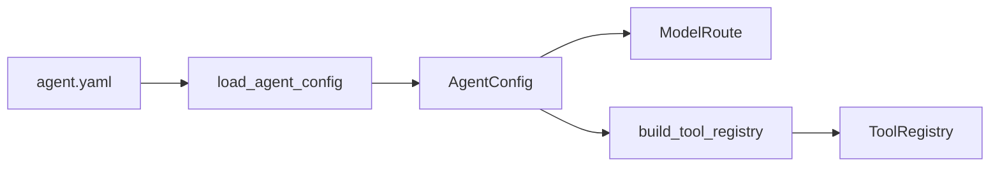

# iris.agents

`iris.agents` 目前提供 config-first agent 的配置加载和工具注册入口。它负责把
`agent.yaml` 解析成强类型配置，并根据配置创建 `ToolRegistry`。本模块不实现 agent
loop，也不负责模型调用调度。

## 架构



## 快速入门

```python
from iris.agents import build_tool_registry, load_agent_config

config = load_agent_config("agent.yaml")
route = config.to_model_route()
registry = build_tool_registry(config.tools)
```

`load_agent_config()` 只读取 YAML 并校验结构。后续 agent loop 可以复用返回的
`AgentConfig`、`ModelRoute` 和 `ToolRegistry`，但 loop 本身不在本包内。

## 配置示例

```yaml
name: notes-agent
model:
  provider: openai
  name: gpt-4o-mini
system: |
  你是一个本地笔记助手。
tools:
  builtin:
    - file.read
    - file.list
    - file.grep
  python:
    functions:
      - my_project.tools:search_notes
    registrars:
      - my_project.tools:register_tools
permissions:
  workspace: .
  writes: confirm
session:
  backend: sqlite
```

`model` 推荐使用结构化对象。为了兼容简单配置，也可以写成 route string：

```yaml
model: openai/gpt-4o-mini
```

## 核心定义

### `AgentConfig`

顶层 agent 配置模型，字段包括：

- `name`: agent 名称，不能为空。
- `model`: `ModelConfig`，也兼容 `provider/model` route string。
- `system`: system prompt，不能为空。
- `tools`: `ToolsConfig`，默认不注册任何工具。
- `permissions`: `PermissionsConfig`，默认 `workspace: .`、`writes: confirm`。
- `session`: `SessionConfig`，默认 `backend: none`。

### `ModelConfig`

模型路由配置：

- `provider`: provider 名称，例如 `openai`。
- `name`: 模型名称，例如 `gpt-4o-mini`。
- `api_style`: 可选 API 风格。
- `base_url`: 可选自定义 endpoint。

调用 `to_model_route()` 可转换为 core/providers 层使用的 `ModelRoute`。

### `ToolsConfig`

`tools.builtin` 使用 Iris 内置工具名：

- `file.read`
- `file.list`
- `file.grep`
- `file.write`
- `file.edit`

`tools.python` 必须使用结构化对象，不支持混合列表：

```yaml
tools:
  python:
    functions:
      - my_project.tools:search_notes
    registrars:
      - my_project.tools:register_tools
```

`functions` 是默认推荐路径。Iris 会导入 `module:function` 指向的 Python 函数，并用
`ToolRegistry.register_function()` 注册为工具。

`registrars` 是高级路径。Iris 会导入 registrar，并调用
`registrar(registry)`，由它批量注册多个工具。

YAML 中不支持 inline Python 脚本。Python 扩展必须通过可导入的模块引用提供。

### `PermissionsConfig`

当前只承载配置形状：

- `workspace`: 文件工具工作区路径。
- `writes`: 写入策略，取值为 `confirm`、`allow` 或 `deny`。

具体执行权限仍由工具层的 permission policy 和 executor 决定。

### `SessionConfig`

`backend` 目前支持：

- `none`: 不启用持久化。
- `sqlite`: 使用 SQLite，本地默认路径为 `.iris/session.db`。

## API

### `load_agent_config(path)`

读取 UTF-8 YAML 文件并返回 `AgentConfig`。配置缺失、YAML 格式错误、字段类型错误、
未知字段、不可读路径都会包装为 `IrisConfigError`。

### `build_tool_registry(config)`

根据 `ToolsConfig` 构建 `ToolRegistry`：

1. 注册 `tools.builtin` 中声明的内置工具。
2. 注册 `tools.python.functions` 中的直接函数引用。
3. 调用 `tools.python.registrars` 中的批量注册入口。

未知内置工具、错误引用格式、模块不存在、函数不存在、引用对象不可调用、registrar
签名不兼容都会抛出 `IrisConfigError`。

## 边界

本模块只固定配置契约和工具注册方式。它不做以下事情：

- 不实现 agent loop。
- 不自动调用模型。
- 不提供长期记忆系统。
- 不引入 Redis、向量数据库或 ORM。
