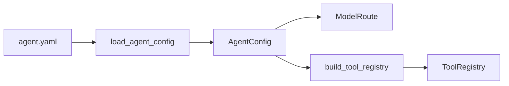

[English](README.en.md)

# iris.agents

`iris.agents` 提供 config-first agent 的配置加载和工具注册入口。它负责把
`agent.yaml` 解析成强类型配置，并根据配置创建 `ToolRegistry`。本模块不直接调用模型；
模型调用、context 组装、工具桥接和 session 写入由 `iris.runtime` 消费这些配置后完成。

## 架构

`AgentConfig.mcp` 使用 `AgentMCPConfig` 文件引用与 `MCPServerOverride` 本地策略模型，
均从 `iris.agents` 导出。`mcp.path` 相对 agent YAML 解析；加载 YAML 不连接外部服务。
shared assembly 读取 MCP 声明，runner 首次执行前准备并发布工具。外部格式见
[MCP 包说明](../mcp/README.md)。例如：

```yaml
mcp:
  path: mcp.json
  overrides:
    local-server:
      required: true
      trust_annotations: false
```

`tools.subagent: subagents.yaml` 可声明内部 Sub Agent catalog，默认不启用。
路径相对 parent YAML；catalog 的 `default` 必须命中 `agents` 的 exact kebab-case key，
每个 entry 包含相对 catalog 的 `path` 和非空 `description`。内部 loader 只读取 catalog、
冻结路由，不加载 child YAML。`build_tool_registry()` 仍只处理 builtin/Python 工具。
Runner 启动只读一次 catalog，选择执行时才懒加载对应 child YAML；CHILD 不注册 subagent，
也不读取 nested catalog。完整三个 YAML 示例见 [harness README](../harness/README.md)。


```mermaid
flowchart LR
    YAML["agent.yaml"] --> Loader["load_agent_config"]
    Loader --> Config["AgentConfig"]
    Config --> Route["ModelRoute"]
    Config --> Tools["build_tool_registry"]
    Tools --> Registry["ToolRegistry"]
```

## 快速入门

```python
from iris.agents import build_tool_registry, load_agent_config

config = load_agent_config("agent.yaml")
route = config.to_model_route()
registry = build_tool_registry(config.tools)
```

`load_agent_config()` 只读取 YAML 并校验结构。运行时入口可以复用返回的
`AgentConfig`、`ModelRoute` 和 `ToolRegistry`，但 loop 本身仍不在本包内。

## 配置示例

```yaml
name: notes-agent
model:
  provider: openai
  name: gpt-4o-mini
  temperature: 0.2
  max_tokens: 512
system: |
  你是一个本地笔记助手。
skills:
  enabled: true
  root: .agents/skills
  require:
    - review-python
tools:
  builtin:
    - file.read
    - file.list
    - file.grep
    - human.ask
  python:
    functions:
      - my_project.tools:search_notes
    registrars:
      - my_project.tools:register_tools
permissions:
  workspace: .
  writes: confirm
session:
  backend: sqlite
```

结构化 context 模式使用独立 `context.yaml`：

```yaml
name: notes-agent
model: openai/gpt-4o-mini
context:
  path: context.yaml
tools:
  builtin:
    - file.read
```

`system` 和 `context` 必须二选一，不能同时配置。`load_agent_config()`
只校验 `context.path` 字段并把相对路径按 `agent.yaml` 所在目录解析为绝对路径；
它不会读取或校验该 context 文件。context 文件存在性、内容结构和模板路径由
`iris.runtime.RuntimeFactory` 调用 `iris.context.load_context_build_input()` 时校验。

`model` 推荐使用结构化对象。为了兼容简单配置，也可以写成 route string：

```yaml
model: openai/gpt-4o-mini
```

## 核心定义

### `AgentConfig`

顶层 agent 配置模型，字段包括：

- `name`: agent 名称，不能为空。
- `model`: `ModelConfig`，也兼容 `provider/model` route string。
- `system`: 简单模式的 system prompt，和 `context` 互斥。
- `context`: `AgentContextConfig`，声明独立 context 配置路径，和 `system` 互斥。
- `skills`: 可选的 `AgentSkillsConfig`；默认 `None`，不启用 Skill。
- `mcp`: 可选的 `AgentMCPConfig`；引用 JSON/JSONC/TOML 文件，默认 `None`。
- `compaction`: 默认构造的 `CompactionConfig`，声明自动压缩的预算与超时。
- `tools`: `ToolsConfig`，默认不注册任何工具。
- `permissions`: `PermissionsConfig`，默认 `workspace: .`、`writes: confirm`。
- `session`: `SessionConfig`，默认 `backend: none`。

### `AgentContextConfig`

结构化 context 配置声明：

- `path`: 独立 `context.yaml` 文件路径。相对路径按 `agent.yaml` 所在目录解析。

`AgentContextConfig` 只保存路径声明，不读取 context 文件。

### `CompactionConfig`

`CompactionConfig` 从 `iris.agents` 和 `iris.agents.config` 导出，所有 agent 默认使用：

```yaml
compaction:
  input_budget_tokens: 96000
  keep_recent_ratio: 0.15
  summary_ratio: 0.05
  timeout_seconds: 300
```

`input_budget_tokens` 是已扣除输出预留的可用输入预算，不再自动减去 `model.max_tokens`。
触发和压缩后验收额度固定为预算的 80%（向下取整）；近期原文目标与摘要输出上限分别为
预算乘以对应比例（向上取整）。近期原文只是软目标，不要求两个比例之和小于 80%。
输入预算与超时必须为正数，两个比例必须位于 0 与 1 之间。

配置仍由 `load_agent_config()` 或 `AgentConfig` 校验，随后通过
`RuntimeEnvironment.agent_config` 传递；加载时不调用模型或 tokenizer。每次主模型调用前，
runtime 在完整输入达到 80% 时自动摘要旧历史，包括当前 run 已提交的步骤，并保留当前任务
锚点与近期原文。摘要使用当前模型；`summary_ratio` 是生成输出上限，可能包含模型 reasoning。
压缩后的完整请求必须不超过 80% 且严格缩小。已开始的压缩失败会结束当前 run，原文与上次
已提交摘要保留。主调用 usage 与 `RunUsage.compaction` 分开累计；provider 估算边界见
[providers 说明](../providers/README.md)，执行与恢复见 [runtime](../runtime/README.md)。

### `ModelConfig`

模型路由配置：

- `provider`: provider 名称，例如 `openai`。
- `name`: 模型名称，例如 `gpt-4o-mini`。
- `base_url`: 可选自定义 endpoint。
- `temperature`、`top_p`、`max_tokens`、`tool_choice`、`response_format`、
  `timeout`、`provider_options`、`metadata`: 可选请求级参数，会由 runtime 透传给
  `LLMRequest`。
- Streaming 由 host 给 runner 注入 `live_publisher` 开启，模型配置不声明 `stream`。
- 调用契约固定为 LiteLLM Chat Completion，不提供 `api_style` 配置字段。

调用 `to_model_route()` 可转换为 providers 层使用的 `ModelRoute`。
调用 `to_llm_request_options()` 可得到 `LLMRequest` 支持的请求级参数；`provider`、
`name` 和 `base_url` 不会进入该结果。

### `ToolsConfig`

`tools.builtin` 使用 Iris 内置工具名：

- `file.read`
- `file.list`
- `file.grep`
- `file.write`
- `file.edit`
- `human.ask`

`human.ask` 向模型暴露的工具名是 `ask_question`。它只声明人工问题；实际呈现问题、
收集回答与调用 `AgentRuntime.resume()` 仍由 runtime 和宿主 adapter 完成。

`tools.python` 必须使用结构化对象，不支持混合列表：

```yaml
tools:
  python:
    functions:
      - my_project.tools:search_notes
    registrars:
      - my_project.tools:register_tools
```

`functions` 是默认推荐路径。Iris 会导入 `module:function` 指向的 Python 函数，并用
`ToolRegistry.register_function()` 注册为工具。

`registrars` 是高级路径。Iris 会导入 registrar，并调用
`registrar(registry)`，由它批量注册多个工具。

YAML 中不支持 inline Python 脚本。Python 扩展必须通过可导入的模块引用提供。

### `AgentSkillsConfig`

项目级 Skill 发现配置：

- `enabled`: 严格布尔值，默认 `false`。关闭时 runtime 完全绕过 Skill discovery。
- `root`: 默认 `.agents/skills`，相对 `permissions.workspace` 解析，且不得越出 workspace。
- `require`: 默认空元组；每个名称必须是小写 kebab-case，启用后缺少任一必需 Skill 都会让
  `RuntimeFactory` 抛出 `IrisConfigError`。

Skill 目录约定和 `SKILL.md` 格式见 [`iris.skill`](../skill/README.md)。启用且发现结果非空时，
`RuntimeFactory` 会自动注册 `load_skill`，并让它与 context catalog 共用同一个 registry。
`load_skill` 不是 `tools.builtin` 配置项；不要在 `tools.builtin` 中声明它。

### `PermissionsConfig`

当前只承载配置形状：

- `workspace`: 文件工具工作区路径。
- `writes`: 写入策略，取值为 `confirm`、`allow` 或 `deny`。

具体执行权限仍由工具层的 permission policy 和 executor 决定。

### `SessionConfig`

`backend` 目前支持：

- `none`: 不启用持久化。
- `sqlite`: 使用 SQLite，本地默认路径为 `.iris/session.db`。

## API

### `load_agent_config(path)`

读取 UTF-8 YAML 文件并返回 `AgentConfig`。配置缺失、YAML 格式错误、字段类型错误、
未知字段、不可读路径都会包装为 `IrisConfigError`。

### `build_tool_registry(config)`

根据 `ToolsConfig` 构建 `ToolRegistry`：

1. 注册 `tools.builtin` 中声明的内置工具。
2. 注册 `tools.python.functions` 中的直接函数引用。
3. 调用 `tools.python.registrars` 中的批量注册入口。

未知内置工具、错误引用格式、模块不存在、函数不存在、引用对象不可调用、registrar
签名不兼容都会抛出 `IrisConfigError`。

## 边界

本模块只固定配置契约和工具注册方式。它不做以下事情：

- 不实现 agent loop。
- 不自动调用模型。
- 不提供长期记忆系统。
- 不引入 Redis、向量数据库或 ORM。

需要从 `agent.yaml` 创建完整 logical-run agent 时，使用 `iris.harness.AgentRunner`：

```python
from iris.harness import AgentRunner

runner = AgentRunner.from_config_path("agent.yaml")
```

## 维护与验证

| 修改内容 | 主要位置 | 对应测试 |
| --- | --- | --- |
| `agent.yaml` 加载与相对 context 路径 | `config/base.py`, `../runtime/factory.py` | `tests/runtime/test_factory.py` |
| 压缩预算配置 | `config/compaction.py`, `config/base.py` | `tests/agents/test_compaction_config.py` |
| Skill 配置与 factory 集成 | `config/base.py`, `../runtime/factory.py` | `tests/agents/test_skill_config.py`, `tests/runtime/test_factory_skills.py` |
| 内置工具与 Python 引用加载 | `config/tools.py` | `tests/agents/test_tools_config.py` |

```bash
uv run pytest tests/agents tests/runtime/test_factory.py
uv run ruff check src/iris/agents tests/agents
```
