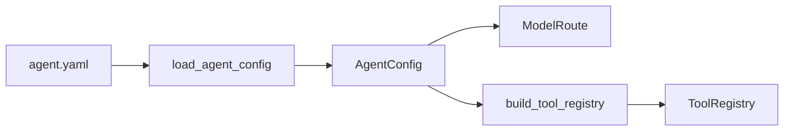

[English](README.en.md)

# iris.agents

`iris.agents` 提供 config-first agent 的配置加载和工具注册入口。它负责把
`agent.yaml` 解析成强类型配置，并根据配置创建 `ToolRegistry`。本模块不直接调用模型；
模型调用、context 组装、工具桥接和 session 写入由 `iris.runtime` 消费这些配置后完成。

## 架构

`AgentConfig.mcp` 使用 `AgentMCPConfig` 文件引用与 `MCPServerOverride` 本地策略模型，
均从 `iris.agents` 导出。`mcp.path` 相对 agent YAML 解析；加载 YAML 不连接外部服务。
shared assembly 读取 MCP 声明，runner 首次执行前准备并发布工具。外部格式见
[MCP 包说明](../mcp/README.md)。例如：

```yaml
mcp:
  path: mcp.json
  overrides:
    local-server:
      required: true
      trust_annotations: false
```

`tools.subagent: subagents.yaml` 可声明内部 Sub Agent catalog，默认不启用。
路径相对 parent YAML；catalog 的 `default` 必须命中 `agents` 的 exact kebab-case key，
每个 entry 包含相对 catalog 的 `path` 和非空 `description`。内部 loader 只读取 catalog、
冻结路由，不加载 child YAML。`build_tool_registry()` 仍只处理 builtin/Python 工具。
Runner 启动只读一次 catalog，选择执行时才懒加载对应 child YAML；CHILD 不注册 subagent，
也不读取 nested catalog。完整三个 YAML 示例见 [harness README](../harness/README.md)。


```mermaid
flowchart LR
    YAML["agent.yaml"] --> Loader["load_agent_config"]
    Loader --> Config["AgentConfig"]
    Config --> Route["ModelRoute"]
    Config --> Tools["build_tool_registry"]
    Tools --> Registry["ToolRegistry"]
```

## 快速入门

```python
from iris.agents import build_tool_registry, load_agent_config

config = load_agent_config("agent.yaml")
route = config.to_model_route()
registry = build_tool_registry(config.tools)
```

`load_agent_config()` 只读取 YAML 并校验结构。运行时入口可以复用返回的
`AgentConfig`、`ModelRoute` 和 `ToolRegistry`，但 loop 本身仍不在本包内。

## 配置示例

`observability` 声明默认关闭的采集策略：`enabled=false`、`capture_content=false`、
`max_content_chars=65536`。导出 endpoint/headers 属于全局 `Config.observability`，
不放进 Agent YAML。加载配置不会创建 SDK；启用的 SDK/CLI 装配统一创建或借用观测服务。
见 [observability](../observability/README.md)。

项目经验自动维护默认关闭，可独立于 Memory 启用：

```yaml
skills:
  enabled: true
evolution:
  enabled: true
  skill_max_chars: 8000
  input_budget_tokens: 32000
  output_budget_tokens: 8000
maintenance:
  idle_seconds: 300
```

`evolution.enabled` 要求 `skills.enabled=true`，默认只维护
`<skills.root>/project-experience/SKILL.md`。可用 `evolution.policy_skill` 指定相对 workspace
的策略文件；省略时读取内置策略。加载配置不启动维护；SDK 宿主必须显式绑定共享协调器，
`iris chat` 自动完成宿主装配。生成的经验首次进入 catalog 需要新 runner，已登记 Skill
下次加载会读取当前文件；不自动刷新 registry。见 [evolution](../evolution/README.md)。

按需开放自动修订目标，例如：

```yaml
evolution:
  enabled: true
  prompt_targets: [memory_flush, compaction_input]
  config_targets: [compaction.keep_recent_ratio, system]
```

两个列表默认空。支持范围固定，未实现的流程不能靠新增 YAML 字段获得。
配置候选与文件加载共用 `parse_agent_config(raw_config, config_path=...)`，写盘前按原文件
基准校验，不将已解析模型回写成全部默认值。`system` 只修改已采用简单模式的文本。
Config 改动只由新 runner 采用，旧 runner 创建新 session 仍使用原配置。

```yaml
name: notes-agent
model:
  provider: openai
  name: gpt-4o-mini
  temperature: 0.2
  max_tokens: 512
system: |
  你是一个本地笔记助手。
skills:
  enabled: true
  root: .agents/skills
  require:
    - review-python
tools:
  builtin:
    - file.read
    - file.list
    - file.grep
    - human.ask
  python:
    functions:
      - my_project.tools:search_notes
    registrars:
      - my_project.tools:register_tools
permissions:
  workspace: .
  writes: confirm
session:
  backend: sqlite
```

结构化 context 模式使用独立 `context.yaml`：

```yaml
name: notes-agent
model: openai/gpt-4o-mini
context:
  path: context.yaml
tools:
  builtin:
    - file.read
```

`system` 和 `context` 必须二选一，不能同时配置。`load_agent_config()`
只校验 `context.path` 字段并把相对路径按 `agent.yaml` 所在目录解析为绝对路径；
它不会读取或校验该 context 文件。context 文件存在性、内容结构和模板路径由
`iris.runtime.RuntimeFactory` 调用 `iris.context.load_context_build_input()` 时校验。

`model` 推荐使用结构化对象。为了兼容简单配置，也可以写成 route string：

```yaml
model: openai/gpt-4o-mini
```

## 核心定义

### `AgentConfig`

顶层 agent 配置模型，字段包括：

- `name`: agent 名称，不能为空。
- `model`: `ModelConfig`，也兼容 `provider/model` route string。
- `system`: 简单模式的 system prompt，和 `context` 互斥。
- `context`: `AgentContextConfig`，声明独立 context 配置路径，和 `system` 互斥。
- `skills`: 可选的 `AgentSkillsConfig`；默认 `None`，不启用 Skill。
- `mcp`: 可选的 `AgentMCPConfig`；引用 JSON/JSONC/TOML 文件，默认 `None`。
- `compaction`: 默认构造的 `CompactionConfig`，声明自动压缩的预算与超时。
- `prompts`: `PromptConfig`，项目命名提示的唯一目录入口，默认 `root: .iris/prompts`。
- `context_policy`: 默认构造的 `ContextPolicyConfig`，控制当前会话回读、动态快照选材、历史正文减载和可选的按需工具披露。
- `memory`: 复用 `iris.memory.MemoryConfig`，默认 `enabled: false`，不接入长期记忆服务。
- `maintenance`: 宿主共享维护的 `idle_seconds`，默认 300 秒，允许 0；不属于 Memory 生成预算。
- `goal`: 复用 `iris.goal.GoalConfig`，默认关闭，控制跨 Run 目标能力与默认自动轮数。
- `todo`: 复用 `iris.todo.TodoConfig`，默认关闭，启用会话 Markdown 清单的 SDK 读取与每步动态投影；要求 `context_policy.enabled=true`，不自动注册文件工具。见 [Todo 说明](../todo/README.md)。
- `speech`: 复用 `iris.speech.SpeechConfig`，默认关闭；启用时声明 adapter、endpoint 和语音 model。宿主通过 `create_speech_client(config.speech)` 装配转录客户端，Runner 不自动录音或连接。豆包与阿里完整 YAML、专属凭据和最终文字提交见 [语音 SDK](../speech/README.md)。
- `decision`: 可选 `AgentDecisionConfig(path)`，引用相对 Agent YAML 的独立配置。`tools.discovery` 为 deferred 工具启用一次批量 Choice，`memory.recall` 为记忆直接召回启用一次批量 Score；两开关独立且默认关闭。结构加载不联网，shared assembly 校验依赖并借用或构造客户端。见 [Decision 配置](../decision/README.md)。
- `tools`: `ToolsConfig`，声明 builtin/Python 工具，默认声明为空；框架自动注册的工具由对应功能开关控制。
- `hooks`: 有序 `HookConfig` 序列，默认空，声明四种事件的 Python 或命令处理器。
- `middleware`: `MiddlewareConfig`，默认 `tools: []`，仅声明普通工具的包装链工厂。
- `permissions`: `PermissionsConfig`，默认 `workspace: .`、`writes: confirm`、`execute: confirm`。
- `command`: `CommandConfig`，默认 native 与 120 秒命令期限；不自动注册命令工具。
- `session`: `SessionConfig`，默认 `backend: none`。

### Hooks 与工具 Middleware

```yaml
hooks:
  - name: check-command
    event: tool.before
    tools: [exec_command]
    timeout_seconds: 10
    handler:
      type: command
      command: python scripts/check.py
  - name: feedback
    event: tool.after
    handler:
      type: python
      factory: my_extensions:create_feedback
      options:
        text: 请说明验证结果。
middleware:
  tools:
    - factory: my_extensions:create_logging
      options: {}
```

`event` 只接受 `run.started`、`run.finished`、`tool.before` 和 `tool.after`。
`tools` 仅用于工具事件，必须是非空列表，省略时匹配全部普通工具；它匹配实际调用名，
例如 `tools.builtin: [exec.command]` 对应 `tools: [exec_command]`，不做别名转换。
`name` 用于定位处理器，重复名称不会覆盖或去重。`timeout_seconds` 默认为 10，必须为正有限值。

`handler.type` 为 `python` 时只允许 `factory` 和 `options`；为 `command` 时只允许
`command`。Python 引用采用可导入的 `module:attribute`，唯一构造协议是同步
`factory(**options)`：Hook 工厂返回异步 callable，Middleware 工厂返回 `ToolMiddleware`
实例。`options` 原样交由工厂解释，不建立另一份 Iris 配置。命令脚本相对当前 workspace 执行，
使用已有 Native/Docker 环境；事件 JSON 经 UTF-8 stdin 传入，stdout 按事件返回一个 JSON object。

加载 YAML 只校验结构，不导入扩展。`AgentRunner.from_config*()` 和
`RuntimeFactory.from_config*()` 在资源准备前构造工厂对象；导入、构造或返回对象类型错误为
`IrisConfigError`。不会提前运行 handler，错误的同步回调在真正调用时按 Hook 失败处理。
每次装配保留一份实例，同 Agent 的 session 复用；调用临时状态应放局部变量。

四个构造入口都接受 `hooks=` 和 `tool_middlewares=`，追加在 YAML 列表后，不覆盖、不去重。
child 使用自己的 YAML，父级 SDK 项不会隐式继承。完整工厂、SDK、命令协议及运行时边界见
[Hooks 使用说明](../hooks/README.md)；工具包装契约见 [工具说明](../tools/README.md)。
配置模型 `HookConfig`、`PythonHookHandlerConfig`、`CommandHookHandlerConfig`、
`HookHandlerConfig`、`ToolMiddlewareConfig` 和 `MiddlewareConfig` 均从 `iris.agents` 导出。

### `AgentContextConfig`

结构化 context 配置声明：

- `path`: 独立 `context.yaml` 文件路径。相对路径按 `agent.yaml` 所在目录解析。

`AgentContextConfig` 只保存路径声明，不读取 context 文件。

### `ContextPolicyConfig`

`context_policy` 默认配置：

```yaml
context_policy:
  enabled: true
  preserve_recent_tool_groups: 2
  old_result_preview_chars: 512
  deferred_tools: false
```

完整 `AgentRunner` 根据这个开关注册 `context_read` 与 `context_search`，读取当前会话的已提交
消息和当时保存的工具结果；不依赖长期 memory，也不需要显式配置 `file.read`。设为 `false`
时不注册这两个工具，也不进行新增的历史正文裁剪或动态注入；现有工具 artifact 和 LLM
compaction 继续工作。同时传入 `context_source` 会在装配时报 `IrisConfigError`，不会忽略宿主输入。

`preserve_recent_tool_groups` 是确定性裁剪时完整保留的最近已闭合工具批次数，默认 2，允许
设为 0；不改变原有 LLM 摘要的近期原文软目标。`old_result_preview_chars` 默认 512，按
384 字符开头与 128 字符结尾保留旧观察正文，说明与引用另外计量；设为 0 时只留说明和引用。
两项均须为非负整数。只有工具作者声明为 `observation` 的成功结果可以参与裁剪。

完整请求达到既有 80% 压力线时，runtime 先尝试精确重复正文折叠，再按优先级移除宿主明确
标为可选的动态贡献及可撤下的 deferred 工具定义，最后按历史顺序短化旧结果。
正文替换仅采用能减少完整请求 token 估算的候选；不足时继续原有 LLM compaction。每次实际工具调用
照常执行，已提交原文保持不变。具体回读可用条件与保护规则见
[runtime 说明](../runtime/README.md#历史投影与摘要构造)。

配置加载不读取历史。Runner 提供绑定 lifecycle store 的读取服务；直接使用
`RuntimeFactory.from_config*()` 且启用该策略时，必须传入 `context_access`，否则装配报告
`IrisConfigError`。参数、分页和引用范围见 [tools 说明](../tools/README.md#当前会话上下文回读)。

动态状态由 Python SDK 的 `context_source=` 注入，`AgentRunner` 与 `RuntimeFactory` 的两个
`from_config*()` 入口均支持；不在 YAML 中配置 callback。source 每主模型步骤返回完整当前
快照，与输入阶段一次归档的 BCI 不同。required 条目保持，只有显式 optional 条目参与选材；
协议与示例见 [context 说明](../context/README.md#宿主动态快照)。

`deferred_tools` 默认 `false`，保持原有 eager/deferred 可见性；设为 `true` 必须同时保持
`enabled: true`。开启后自动注册 `tool_search`，Python 工具仍按作者的 `deferred` 声明，
MCP 工具统一标记 deferred；MCP 仍在执行前完整连接和发现。已有 eager 工具、回读工具及
`load_skill` 保持直接可见。成功搜索结果提交后，下一请求按预算披露候选的逻辑工具定义及完整参数 JSON Schema；
已选工具名与该批调用一起保存，具体规则见 [runtime 说明](../runtime/README.md#按需工具定义)。

### `CompactionConfig`

`CompactionConfig` 从 `iris.agents` 和 `iris.agents.config` 导出，所有 agent 默认使用：

```yaml
compaction:
  input_budget_tokens: 96000
  keep_recent_ratio: 0.15
  summary_ratio: 0.05
  timeout_seconds: 300
```

`input_budget_tokens` 是已扣除输出预留的可用输入预算，不再自动减去 `model.max_tokens`。
触发和压缩后验收额度固定为预算的 80%（向下取整）；近期原文目标与摘要输出上限分别为
预算乘以对应比例（向上取整）。近期原文只是软目标，不要求两个比例之和小于 80%。
输入预算与超时必须为正数，两个比例必须位于 0 与 1 之间。

命名提示通过一个项目目录统一配置，摘要也使用这一来源：

```yaml
prompts:
  root: .iris/prompts
```

`prompts.root` 相对已解析的 root workspace，构造后固定；不是相对 `agent.yaml`，child
也不会按缩窄后的 workspace 重新解释。配置加载只校验声明，不创建目录；首次构造可运行
Agent 时补齐缺少的默认模板，保留已有文件。手工修改项目目录中的 `compaction.j2` 可改变
摘要栏目和措辞，`compaction_input.j2` 使用 `previous_summary_or_none` 与 `serialized_history`
组织 user 消息。摘要仍是自然语言，由框架包裹 `<summary>` 注入主请求。旧
`compaction.prompt` 和 SDK `CompactionConfig.prompt_path` 已删除，传入会报配置错误。

每次压缩开始固定两份模板及依赖的内存源，全部分块与重试共用，下一次压缩才采用文件修改。
Goal、Todo、Memory 概览指引、Skill catalog、Decision 指令和 system/context 模板则在 runner
构造时固定正文，调用数据继续动态传入。`system` / `context` 保留原声明入口，不在 `prompts`
下另配一份系统指令。模板使用共享的 [`TemplateRenderer`](../utils/README.md)，默认不转义；
XML 可显式使用 `` 或 `|e`。来源和各采用边界见 [prompts](../prompts/README.md)。

配置仍由 `load_agent_config()` 或 `AgentConfig` 校验，随后通过
`RuntimeEnvironment.agent_config` 传递；加载时不调用模型或 tokenizer。每次主模型调用前，
runtime 先按 `context_policy` 尝试确定性正文减载；完整输入仍达到 80% 时才自动摘要旧历史，
包括当前 run 已提交的步骤，并保留当前任务
锚点与近期原文。摘要使用当前模型；`summary_ratio` 是生成输出上限，可能包含模型 reasoning。
压缩后的完整请求必须不超过 80% 且严格缩小。已开始的压缩失败会结束当前 run，原文与上次
已提交摘要保留。主调用 usage 与 `RunUsage.compaction` 分开累计；provider 估算边界见
[providers 说明](../providers/README.md)，执行与恢复见 [runtime](../runtime/README.md)。

### `GoalConfig`

`goal` 默认 `enabled: false`、`max_rounds: 20`。启用时要求
`context_policy.enabled: true`，轮数必须为正数；加载 YAML 只解析配置，不创建目标。

```yaml
context_policy:
  enabled: true
goal:
  enabled: true
  max_rounds: 20
```

通过 `AgentRunner.from_config*()` 使用此配置。Runner 的同一生命周期存储提供 GoalService，
装配自动注册非 deferred 的 `get_goal` / `report_goal`，并组合已有 `context_source`。
关闭时不挂载 Goal 服务、工具或投影；独立 `RuntimeFactory` 与显式启用 Goal 的 child
在装配时报告配置错误。开关在构建时确定，不支持热切换。目标状态与申报契约见
[Goal SDK 完整示例](../goal/README.md#从配置到执行)。完整自动推进需要 SessionManager；
`max_rounds` 是创建默认值，准入成功才消耗轮数，resume 不重置。每 Run 的运行选项要求
include_tools=True，运行覆盖后的有效 tool_choice 为 None/auto。

### `MemoryConfig`

通过 `memory` 启用项目记忆；配置模型从 `iris.memory` 导入：

```yaml
memory:
  enabled: true
  read_namespaces: [project]
  write_namespace: project
tools:
  builtin:
    - memory.remember
    - memory.update
    - memory.forget
```

`memory.enabled` 同时接入服务、概览和自动注册的 Search/Fetch；写工具仍按需声明。旧
`memory.backend` 和手工 `memory.search/fetch` 声明不再接受。模型根据当前概览自主选择
Search/Fetch，查询使用全部词项；旧 recall_mode/max_query_terms/mirror 配置不再接受。
概览通过宿主显式生成，内容为核心事实和知识范围，新会话或成功压缩时采用，
全部 namespace 合计使用可用输入预算的 2%。概览未提及的主题默认没有，无概览时正常聊天但
暂不使用长期记忆。完整规则见 [memory 说明](../memory/README.md)。

YAML 加载不打开数据库。Runtime 确定 effective workspace 和 provider 后构建一个 service，
供概览及记忆工具使用。默认数据库为该 workspace 的 `.iris/memory/memory.db`；同项目默认
`project` namespace 可共享，不同 workspace 使用各自数据库。开启时显式传入的 `memory_service`
优先于配置构造；关闭时不挂载注入对象。CLI 使用同一装配链；child 根据自己的配置和收窄后的 effective workspace
构建服务和自己的概览窗口，不继承父 Agent 的 service。数据库初始化错误直接沿装配入口报告。

开关在构建 Agent 时确定，改配置后重建 Agent 并使用新会话，暂不支持热切换。静态
`context.yaml` memory 与已有历史不受关闭影响；`include_tools=False` 仍控制当次请求是否包含工具定义。

### `MaintenanceConfig`

```yaml
maintenance:
  idle_seconds: 300
memory:
  enabled: true
  generation:
    enabled: true
```

`maintenance.idle_seconds` 是唯一的空闲计时入口，`memory.generation` 不接受计时字段。
CLI 自动创建并绑定宿主协调器；SDK 宿主须在首次 prepare/run 前显式绑定
`MaintenanceCoordinator` 和 `MemoryMaintenanceBinding`，多个 runner 借用同一协调器。
见 [harness](../harness/README.md) 的装配与关闭示例。

自动维护只消费已结束且捕获完整的 Run，WAITING 仅排除该会话的未处理材料。
纯内存 lifecycle 重启丢失来源状态后保留 pending；跨重启自动继续维护需使用 SQLite lifecycle。

### `ModelConfig`

模型路由配置：

- `provider`: provider 名称，例如 `openai`。
- `name`: 模型名称，例如 `gpt-4o-mini`。
- `api_style`: 默认 `responses`；显式 `chat_completions` 选择 Chat Completions。只在 provider 构造时使用。
- `base_url`: 可选自定义 endpoint。
- `temperature`、`top_p`、`max_tokens`、`tool_choice`、`response_format`、
  `timeout`、`provider_options`、`metadata`: 可选请求级参数，会由 runtime 透传给
  `LLMRequest`。
- Streaming 由 host 给 runner 注入 `live_publisher` 开启，模型配置不声明 `stream`。
- 两种协议共用逻辑请求：强制选择使用 `tool_choice: {name: read_file}`；
  `response_format` 使用 `text`、`json_object` 或 `{name, schema, strict?}`。协议包装由 providers 生成。
- `provider_options` 不接受 `api_style`，也不能通过 run 请求覆盖协议。

调用 `to_model_route()` 可转换为 providers 层使用的 `ModelRoute`。
调用 `to_llm_request_options()` 可得到 `LLMRequest` 支持的请求级参数；`provider`、
`name`、`base_url` 和 `api_style` 不会进入该结果。

### `ToolsConfig`

`tools.builtin` 使用 Iris 内置工具名：

- `file.read`
- `file.list`
- `file.grep`
- `file.write`
- `file.edit`
- `file.publish`
- `human.ask`
- `exec.command`
- `exec.python`
- `web.search`
- `web.fetch`
- `memory.remember`、`memory.update`、`memory.forget`

`human.ask` 向模型暴露的工具名是 `ask_question`。它只声明人工问题；实际呈现问题、
收集回答与调用 `AgentRuntime.resume()` 仍由 runtime 和宿主 adapter 完成。

`file.publish` 暴露 `publish_artifact(file_path)`，沿用 registry 的文件服务与 READ 权限，
将指定文件复制为本地结果产物。它不依赖命令服务或 Docker，也不隐式包含在默认文件工具集合中。

`web.search` 和 `web.fetch` 分别暴露 `web_search`、`web_fetch`，使用 Tavily Search/Extract。
两者固定 basic，可独立启用，不增加专用 Web 配置块：

```yaml
tools:
  builtin:
    - web.search
    - web.fetch
    - file.read
```

注册 Web 工具前，host 需要通过现有 `init_config()` 初始化全局配置。凭据来自
`Config.provider_api_keys["tavily"]`，对应环境变量 `IRIS_PROVIDER_API_KEYS__TAVILY`；
也可在初始化时传入 `provider_api_keys`。需要 dotenv 时显式传 `env_file`。缺少 Tavily key
会抛出 `IrisConfigError`，不会改用聊天模型的通用 key。

两个具体 Web builtin 在默认策略下自动执行，自定义策略仍然生效。默认 context policy 提供
`context_read`，可按历史引用继续读取长网页结果；`file.read` 是需要显式启用的文件工具。
检索筛选、批量 URL、正文/摘录和错误
行为见 [Web 工具说明](../tools/README.md#web-搜索与网页读取)。

`tools.python` 必须使用结构化对象，不支持混合列表：

```yaml
tools:
  python:
    functions:
      - my_project.tools:search_notes
    registrars:
      - my_project.tools:register_tools
```

`functions` 是默认推荐路径。Iris 会导入 `module:function` 指向的 Python 函数，并用
`ToolRegistry.register_function()` 注册为工具。

`registrars` 是高级路径。Iris 会导入 registrar，并调用
`registrar(registry)`，由它批量注册多个工具。

YAML 中不支持 inline Python 脚本。Python 扩展必须通过可导入的模块引用提供。

### `AgentSkillsConfig`

项目级 Skill 发现配置：

- `enabled`: 严格布尔值，默认 `false`。关闭时 runtime 完全绕过 Skill discovery。
- `root`: 默认 `.agents/skills`，相对 `permissions.workspace` 解析，且不得越出 workspace。
- `require`: 默认空元组；每个名称必须是小写 kebab-case，启用后缺少任一必需 Skill 都会让
  `RuntimeFactory` 抛出 `IrisConfigError`。

Skill 目录约定和 `SKILL.md` 格式见 [`iris.skill`](../skill/README.md)。启用且发现结果非空时，
`RuntimeFactory` 会自动注册 `load_skill`，并让它与 context catalog 共用同一个 registry。
`load_skill` 不是 `tools.builtin` 配置项；不要在 `tools.builtin` 中声明它。

### `PermissionsConfig`

当前只承载配置形状：

- `workspace`: 文件工具工作区路径。
- `writes`: 写入策略，取值为 `confirm`、`allow` 或 `deny`。
- `execute`: 独立命令执行策略，默认 `confirm`，另可取 `allow` 或 `deny`。

具体执行权限仍由工具层的 permission policy 和 executor 决定。

### `CommandConfig`

`CommandConfig` 从 `iris.agents` 和 `iris.agents.config` 导出；容器配置 `DockerConfig` 从
[`iris.sandbox`](../sandbox/README.md) 导入，YAML 的 `command.docker` 层级不变。只有显式
声明 `exec.command` / `exec.python` 才分别暴露 `exec_command` / `run_python`；普通文件、Web、Memory
以及通过 Python SDK 注册的自定义工具仍在宿主运行。两种执行入口可以单独启用，也可以共存。

```yaml
command:
  mode: docker
  timeout_seconds: 120
  docker:
    image: iris-command:local
    network: none
    cpus: 2
    memory_mb: 1024
    pids_limit: 128
    environment: {}
permissions:
  workspace: .
  writes: confirm
  execute: confirm
tools:
  builtin: [file.read, exec.command]
```

默认 `mode: native` 不依赖 Docker，在宿主执行；native 不能同时声明 `docker` 块。
`mode: docker` 省略该块时使用以上默认值，需要 sandbox extra、本地 Linux engine，并先在仓库
根目录执行 `docker build --load -t iris-command:local .`。Iris 不自动构建、拉取镜像或回退宿主。
`docker.endpoint` 可指定本地 unix socket / Windows named
pipe；默认分别为 `unix:///var/run/docker.sock`、`npipe:////./pipe/docker_engine`。

root 在构造时拥有配置和服务，child 不得显式声明自己的 `command`，但可自行注册入口。
child 借用 root 的环境和整个挂载项目；窄 workspace 只确定命令默认 cwd 与原生文件范围。
Docker child 的 `writes: deny` 只限制原生文件工具，不保证命令只读；命令写入取 root bind，
授权仍取 effective execute。Native 没有只读挂载能力，因此 effective writes deny 的 scope
注册任一命令工具会在装配时报配置错误。cwd 不构成 Native 的 OS 访问边界。
后端范围与共享环境约定见 [command](../command/README.md)，工具参数见
[tools](../tools/README.md#显式命令执行)。

### `SessionConfig`

`backend` 目前支持：

- `none`: 不启用持久化。
- `sqlite`: 使用 SQLite，本地默认路径为 `.iris/session.db`。

## API

### `load_agent_config(path)`

读取 UTF-8 YAML 文件并返回 `AgentConfig`。配置缺失、YAML 格式错误、字段类型错误、
未知字段、不可读路径都会包装为 `IrisConfigError`。

### `build_tool_registry(config, *, memory_service=None, memory_config=None, memory_decision_client=None, prompt_snapshot=None, command_binding=None)`

`memory_decision_client` 和构造时的 `prompt_snapshot` 仅透传给 `MemorySearchTool`，不写入
共享 service，不改变 Fetch/写工具。Decision 召回须提供项目快照，本地搜索无需它。

根据 `ToolsConfig` 构建 `ToolRegistry`：

1. 有有效 memory service 时先注册 Search/Fetch，再按 `tools.builtin` 注册其它内置工具。
2. 注册 `tools.python.functions` 中的直接函数引用。
3. 调用 `tools.python.registrars` 中的批量注册入口。

未知内置工具、错误引用格式、模块不存在、函数不存在、引用对象不可调用、registrar
签名不兼容都会抛出 `IrisConfigError`。
显式 memory 写工具要求提供 service；手工 Search/Fetch 声明在本装配边界报配置错误。
`memory_config` 绑定工具的 read/write namespaces，不传时使用 `MemoryConfig()` 默认范围；
此处只消费来源工厂已解析的 service，不重新判断 enabled。实际工具名称或别名冲突继续
由 `ToolRegistry` 报错。需要按 YAML 自动创建服务时使用完整 runner
或 RuntimeFactory；此函数不解析 workspace 或打开数据库。
显式 `exec.command` 或 `exec.python` 必须传入已装配的 `CommandBinding`，否则直接报 `IrisConfigError`；
此函数不创建、准备或关闭命令服务，仅选择模式也不会增加这些工具。

## 边界

本模块只固定配置契约和工具注册方式。它不做以下事情：

- 不实现 agent loop。
- 不自动调用模型。
- 不提供长期记忆系统。
- 不引入 Redis、向量数据库或 ORM。

需要从 `agent.yaml` 创建完整 logical-run agent 时，使用 `iris.harness.AgentRunner`：

```python
from iris.harness import AgentRunner

runner = AgentRunner.from_config_path("agent.yaml")
```

## 维护与验证

| 修改内容 | 主要位置 | 对应测试 |
| --- | --- | --- |
| `agent.yaml` 加载与相对 context 路径 | `config/base.py`, `../runtime/factory.py` | `tests/runtime/test_factory.py` |
| 压缩预算与摘要指令配置 | `config/compaction.py`, `config/base.py` | `tests/agents/test_compaction_config.py`, `tests/runtime/test_compaction_prompt.py` |
| Skill 配置与 factory 集成 | `config/base.py`, `../runtime/factory.py` | `tests/agents/test_skill_config.py`, `tests/runtime/test_factory_skills.py` |
| Memory 配置与 ROOT/CHILD 装配 | `config/base.py`, `config/tools.py`, `../runtime/_assembly.py` | `tests/agents/test_memory_config.py`, `tests/runtime/test_memory_assembly.py` |
| 内置工具与 Python 引用加载 | `config/tools.py` | `tests/agents/test_tools_config.py` |

```bash
uv run pytest tests/agents tests/runtime/test_factory.py
uv run ruff check src/iris/agents tests/agents
```
