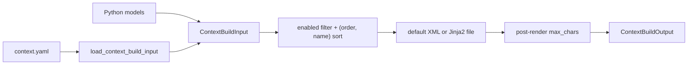

[中文](README.md)

# `iris.context`

`iris.context` renders declarative YAML or Python models into three fixed message positions:

- required system message;
- optional memory user message with `sender="context"`;
- optional before-current-input user message with `sender="context"`.

`ContextBuilder` owns these three fixed message positions. The package also provides typed host
snapshots and their rendering. Runtime collects and selects them, appends the temporary message
after history, and assembles the complete `LLMRequest`.

## Architecture



`models.py` defines contracts, `config.py` loads YAML and resolves template paths, `builder.py`
orchestrates sections, and `renderer.py` implements XML rendering. File templates use the shared
[`iris.utils.TemplateRenderer`](../utils/README.md).
[`source.py`](source.py) defines `ContextSource` and frozen snapshot dataclasses. It neither reads
the store nor owns model calls, run control, or the total token budget.

## Quick start

```python
from iris.context import ContextBuilder, ContextBuildInput, ContextSection, ContextSlot

input_data = ContextBuildInput(
    system=ContextSection(
        slots=[ContextSlot(name="instructions", content="Be concise.")]
    ),
    memory=ContextSection(
        slots=[ContextSlot(name="memory", content="The user prefers short answers.")]
    ),
)
output = ContextBuilder().build(input_data)
```

Default roots are `<system_context>`, `<memory_context>`, and
`<before_current_input_context>`. The optional sections return `None` when absent, empty, or without
an enabled slot.

Equivalent YAML:

```yaml
system:
  max_chars: 2000
  slots:
    - name: instructions
      content: Be concise.
      order: 10
memory:
  slots:
    - name: memory
      content: The user prefers short answers.
before_current_input:
  slots:
    - name: environment_state
      content:
        cwd: /workspace
        dirty: false
```

```python
from iris.context import ContextBuilder, load_context_build_input

output = ContextBuilder().build(load_context_build_input("context.yaml"))
```

The YAML root accepts only `system`, `memory`, and `before_current_input`; system is required.

## Dynamic host snapshots

Pass a Python implementation of `ContextSource` as `context_source=` to
`AgentRunner.from_config/from_config_path` to supply current application state for each main model
step. This SDK interface is separate from the three `context.yaml` sections; the host chooses its content:

```python
from iris.context import ContextBuildScope, ContextContribution, ContextSnapshot


class EditorContext:
    """按 session 提供当前编辑器状态。"""

    def __init__(self, active_documents: dict[str, str]) -> None:
        """绑定宿主维护的当前文档表。"""
        self.active_documents = active_documents

    async def collect(self, scope: ContextBuildScope) -> ContextSnapshot:
        """返回本步骤的完整状态，缺失时返回空快照。"""
        document = self.active_documents.get(scope.session_id)
        if document is None:
            return ContextSnapshot()
        return ContextSnapshot(
            contributions=(
                ContextContribution(key="active_document", text=document),
                ContextContribution(
                    key="workspace",
                    text=str(scope.workspace_root),
                    required=False,
                    priority=20,
                ),
            )
        )


source = EditorContext({"session-a": "report.md"})
```

After the host updates `source.active_documents`, the next main model step collects the new state.
Budget planning and the final request within one step reuse one collected snapshot; summarization
and retries do not recollect.
No source means no snapshot message. An empty snapshot means no current entries, without retaining
previous values. Changing the active document does not itself change the user's original task.

| Interface | Fields and contract |
| --- | --- |
| `ContextBuildScope` | `session_id`, `run_id`, `step_index`, `workspace_root: Path`, `run_input: str` |
| `ContextContribution` | `key`, `text`, `required=True`, `priority=100`; the source keeps keys unique within a snapshot |
| `ContextSnapshot` | `contributions: tuple[ContextContribution, ...] = ()`, representing complete current state |
| `ContextSource` | Async `collect(scope) -> ContextSnapshot`; sessions sharing a runner may collect concurrently |

Only `required=False` entries may be omitted under request pressure. Higher priorities are retained
first; ties favor entries returned earlier. Runtime does not infer which constraints can be dropped.
Selected content becomes one user message after complete history, with `sender="context"` and
`metadata.context_kind="runtime_snapshot"`, leaving the stable system message unchanged.

BCI is built at run input and archived with the user message as the task's initial background.
Dynamic snapshots describe the current step and enter neither raw history, checkpoints, nor summary
material. Hosts preserve facts needed for exact later recall through ordinary tool results or files.
Recovery at `before_model` recollects; children do not inherit their parent's source. See
[runtime](../runtime/README.en.md#dynamic-host-context-and-selection) for budgets, cancellation, and failures.

## Contracts and rendering

`ContextSlot(name, content, order=100, attributes={}, enabled=True)` requires XML-safe names matching
`^[A-Za-z_][A-Za-z0-9_.-]*$`. Enabled slots sort by `(order, name)`. The XML renderer escapes text
and attributes, renders booleans as lowercase, maps dict/list elements to `<item>`, recursively
handles nested containers, and self-closes `None`. It does not remove invisible control characters;
the output structures LLM input and is not guaranteed to parse as strict XML.

`ContextSection(template=None, max_chars=None, slots=[])` requires an absolute template path when
constructed directly and a positive non-boolean `max_chars`. System must have at least one enabled
slot. During `build()`, empty optional sections do not touch a configured template path.

`ContextBuildInput.with_memory_slots()` returns a copy with runtime slots appended; it does not
mutate the loaded object and creates an empty memory section when needed.

Runtime passes the adopted memory overview through `ContextBuilder.build(..., system_addendum=...)`.
The addendum follows the complete default XML or custom-template output, before the system
`max_chars` check. Templates need no new slot, and the result remains one system message.
Runtime/lifecycle owns overview loading, selection, and persistence; this package renders the supplied
text. Static `context.yaml` memory and `with_memory_slots()` remain independent capabilities.

BCI messages produced by `build()` carry
`metadata.context_kind=before_current_input` so compaction can identify the original input group.
`build_before_current_input(section)` prepares BCI on its own for input archival, without rendering
fixed context sections until the model request.

When `template` is set, `iris.utils.TemplateRenderer` receives exactly one variable, `slots`: an ordered,
JSON-mode list of slot dictionaries. Jinja2 uses `StrictUndefined` with autoescape disabled by default,
preserving plain text and Markdown. XML templates must enable `` or apply `|e`
to the relevant variables. The default `ContextXmlRenderer` still escapes text and attributes itself.
The builder strips leading and trailing whitespace from template output before using it as prompt text.
It converts template loading and rendering errors to `IrisContextError`; non-serializable slot values
also raise `IrisContextError`.

`TemplateRenderer` reuses a Jinja Environment per resolved entry directory, retains
FileSystemLoader, and calls `get_template()` for each render. Jinja's default in-memory compiled
cache and `auto_reload=True` detect changes to the entry and used dependencies by file mtime.
Unchanged templates reuse compiled code while each render uses current data. Runs on the same
runner share this cache; final prompts are not cached or stored in the Store or SQLite.

`include` / `import` / `extends` accept native Jinja dynamic filenames, and dependencies load only
when their branch executes. Newly added optional files and preferred candidates can take effect on
the next render. Invalid, missing, or undefined content in a used template raises `IrisContextError`
without falling back to old content. Template sources are not frozen for the duration of a run.

`build()` returns `None` for optional sections without enabled slots and does not read their
templates. `StrictUndefined` and `max_chars` apply only during actual rendering.

`max_chars` is checked after complete rendering, including tags, attributes, fixed template text,
whitespace, and newlines. Equal length passes; excess raises with section, limit, and actual length.
No automatic truncation occurs.

`load_context_build_input(path)` reads UTF-8 YAML, requires an object root, resolves relative template
paths against the context file, preserves absolute paths, and applies the same Pydantic validation.
Unknown fields are rejected and no legacy migration runs.

## Public API

`iris.context` exports `CONTEXT_SENDER`, `ContextSlot`, `ContextSection`,
`ContextBuildInput`, `ContextBuildOutput`, `ContextBuilder`, `ContextXmlRenderer`,
`load_context_build_input`, `ContextBuildScope`, `ContextContribution`, `ContextSnapshot`, and
`ContextSource`. Import `TemplateRenderer` from `iris.utils` for file templates.

The builder accepts optional renderer instances and exposes `build(input_data)` and
`render_section(section_name, section)` for rendering one of its defined section types.
The XML renderer exposes `render_section()` and `render_slot()`;
the template renderer exposes `render_file()`.

File/YAML/template/build errors use `IrisContextError`. Direct Pydantic construction errors surface
as `pydantic.ValidationError` with the underlying context validation information.

The package does not assemble the full prompt/history, build tool schemas or requests, query a
memory store, estimate tokens, allocate cross-section budgets, or maintain compatibility layers.

## Maintenance

| Change | Main location | Tests |
| --- | --- | --- |
| Slot/section contracts, ordering, roles, limits, and XML rendering | `models.py`, `builder.py`, `renderer.py` | `tests/context/test_context_builder.py` |
| YAML, template paths, and Jinja2 integration | `config.py`, `builder.py` | `tests/context/test_context_config.py` |
| Template loading, reloading, and escaping | `../utils/templating.py` | `tests/utils/test_templating.py` |
| Dynamic snapshot interfaces and message rendering | `source.py` | `tests/context/test_source.py` |

```bash
uv run pytest tests/context
uv run ruff check src/iris/context tests/context
```
