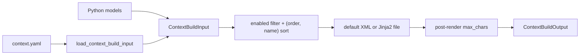

[中文](README.md)

# `iris.context`

`iris.context` renders declarative YAML or Python models into three fixed message positions:

- required system message;
- optional memory user message with `sender="context"`;
- optional before-current-input user message with `sender="context"`.

It does not assemble history, current input, tools, or `LLMRequest`; runtime owns final ordering.

## Architecture



`models.py` defines contracts, `config.py` loads YAML and resolves template paths, `builder.py`
orchestrates sections, and `renderer.py` implements XML and Jinja2 rendering.

## Quick start

```python
from iris.context import ContextBuilder, ContextBuildInput, ContextSection, ContextSlot

input_data = ContextBuildInput(
    system=ContextSection(
        slots=[ContextSlot(name="instructions", content="Be concise.")]
    ),
    memory=ContextSection(
        slots=[ContextSlot(name="memory", content="The user prefers short answers.")]
    ),
)
output = ContextBuilder().build(input_data)
```

Default roots are `<system_context>`, `<memory_context>`, and
`<before_current_input_context>`. The optional sections return `None` when absent, empty, or without
an enabled slot.

Equivalent YAML:

```yaml
system:
  max_chars: 2000
  slots:
    - name: instructions
      content: Be concise.
      order: 10
memory:
  slots:
    - name: memory
      content: The user prefers short answers.
before_current_input:
  slots:
    - name: environment_state
      content:
        cwd: /workspace
        dirty: false
```

```python
from iris.context import ContextBuilder, load_context_build_input

output = ContextBuilder().build(load_context_build_input("context.yaml"))
```

The YAML root accepts only `system`, `memory`, and `before_current_input`; system is required.

## Contracts and rendering

`ContextSlot(name, content, order=100, attributes={}, enabled=True)` requires XML-safe names matching
`^[A-Za-z_][A-Za-z0-9_.-]*$`. Enabled slots sort by `(order, name)`. The XML renderer escapes text
and attributes, renders booleans as lowercase, maps dict/list elements to `<item>`, recursively
handles nested containers, and self-closes `None`. It does not remove invisible control characters;
the output structures LLM input and is not guaranteed to parse as strict XML.

`ContextSection(template=None, max_chars=None, slots=[])` requires an absolute template path when
constructed directly and a positive non-boolean `max_chars`. System must have at least one enabled
slot. During `build()`, empty optional sections do not touch a configured template path.

`ContextBuildInput.with_memory_slots()` returns a copy with runtime slots appended; it does not
mutate the loaded object and creates an empty memory section when needed.

Long-term memory results should first become `MemoryContextBundle`, then be mapped by runtime to
fixed-name context slots. Prompt-facing attributes retain category/kind/level semantics but should
not expose retrieval score or storage source.

Runtime uses `ContextBuilder.render_section()` to render each dynamic fragment as a separate history
message instead of adding it to the fixed memory section. BCI messages produced by `build()` carry
`metadata.context_kind=before_current_input` so compaction can identify the original input group.
`build_before_current_input(section)` prepares BCI on its own for input archival, without rendering
fixed context sections until the model request.

When `template` is set, `ContextTemplateRenderer` receives exactly one variable, `slots`: an ordered,
JSON-mode list of slot dictionaries. Jinja2 uses XML autoescape and `StrictUndefined`; rendered text
is preserved as prompt text. Missing templates, encoding/dependency/render errors, and non-serializable
slot values raise `IrisContextError`.

`ContextTemplateRenderer` reuses a Jinja Environment per resolved entry directory, retains
FileSystemLoader, and calls `get_template()` for each render. Jinja's default in-memory compiled
cache and `auto_reload=True` detect changes to the entry and used dependencies by file mtime.
Unchanged templates reuse compiled code while each render uses current data. Runs on the same
runner share this cache; final prompts are not cached or stored in the Store or SQLite.

`include` / `import` / `extends` accept native Jinja dynamic filenames, and dependencies load only
when their branch executes. Newly added optional files and preferred candidates can take effect on
the next render. Invalid, missing, or undefined content in a used template raises `IrisContextError`
without falling back to old content. Template sources are not frozen for the duration of a run.

`build()` returns `None` for optional sections without enabled slots and does not read their
templates. `StrictUndefined` and `max_chars` apply only during actual rendering.

`max_chars` is checked after complete rendering, including tags, attributes, fixed template text,
whitespace, and newlines. Equal length passes; excess raises with section, limit, and actual length.
No automatic truncation occurs.

`load_context_build_input(path)` reads UTF-8 YAML, requires an object root, resolves relative template
paths against the context file, preserves absolute paths, and applies the same Pydantic validation.
Unknown fields are rejected and no legacy migration runs.

## Public API

`iris.context` exports exactly `CONTEXT_SENDER`, `ContextSlot`, `ContextSection`,
`ContextBuildInput`, `ContextBuildOutput`, `ContextBuilder`, `ContextXmlRenderer`,
`ContextTemplateRenderer`, and `load_context_build_input`.

The builder accepts optional renderer instances and exposes `build(input_data)` and
`render_section(section_name, section)` for rendering one of its defined section types.
The XML renderer exposes `render_section()` and `render_slot()`;
the template renderer exposes `render_file()`.

File/YAML/template/build errors use `IrisContextError`. Direct Pydantic construction errors surface
as `pydantic.ValidationError` with the underlying context validation information.

The package does not assemble the full prompt/history, build tool schemas or requests, query a
memory store, estimate tokens, allocate cross-section budgets, or maintain compatibility layers.

## Maintenance

| Change | Main location | Tests |
| --- | --- | --- |
| Slot/section contracts, ordering, roles, limits, and XML rendering | `models.py`, `builder.py`, `renderer.py` | `tests/context/test_context_builder.py` |
| YAML, template paths, and Jinja2 rendering | `config.py`, `renderer.py` | `tests/context/test_context_config.py` |
| Template loading and reloading | `renderer.py` | `tests/context/test_template_renderer.py` |

```bash
uv run pytest tests/context
uv run ruff check src/iris/context tests/context
```
