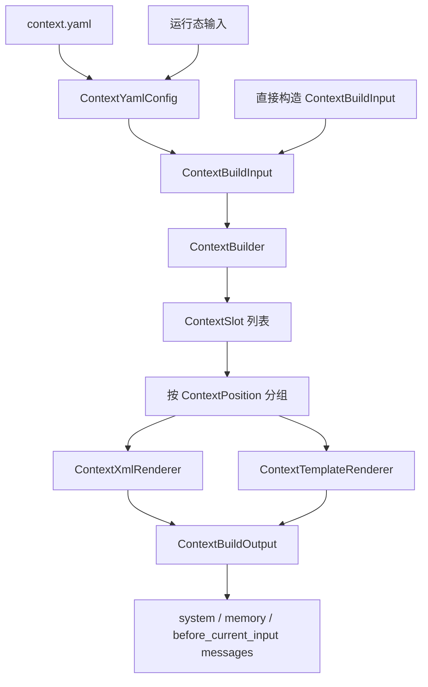

# iris.context

`iris.context` 负责把配置和运行态上下文转换为可插入 OpenAI API `messages` 的消息增量。它不生成完整 prompt，不接管 history、current input、tools 或 `LLMRequest`，只输出以下三类 context 消息：

1. `system_message`: 放在最前面的 `system` 消息。
2. `memory_messages`: 放在 system 后、history 前的 `user` 消息，`sender="context"`。
3. `before_current_input_messages`: 放在 history 后、current input 前的 `user` 消息，`sender="context"`。

推荐消息顺序由外层负责组装：

```text
system -> memory -> history -> before_current_input -> current input
```

## 架构设计

核心流程是：调用方可以直接传入 `ContextBuildInput`，也可以先从 `context.yaml` 读取 `ContextYamlConfig`，再转换为 `ContextBuildInput`。`ContextBuilder` 生成 slot，按固定位置分组，再通过默认 XML 渲染器或 Jinja2 模板渲染为 `Msg`。



模块职责：

- `models.py`: 定义 `ContextBuildInput`、`ContextBuildOutput`、`ContextSlot` 等数据契约。
- `config.py`: 读取 `context.yaml`，校验配置，并转换为 `ContextBuildInput`。
- `builder.py`: 将输入转换为 slot，并输出 API 原生 `Msg` 增量。
- `renderer.py`: 提供默认 XML slot 渲染与 `.xml.j2` 模板渲染。
- `__init__.py`: 导出稳定公共 API。

## 快速入门

### 直接构造输入

```python
from iris.context import (
    ContextBuilder,
    ContextBuildInput,
    MemoryContextInput,
    MemoryContextItem,
    SystemPromptSpec,
)

output = ContextBuilder().build(
    ContextBuildInput(
        agent_id="file-agent",
        system=SystemPromptSpec(inline="你是一个本地文件助手。"),
        memory=MemoryContextInput(
            entries=[MemoryContextItem(id="mem_1", source="sqlite", text="用户偏好简洁回答。")],
            warnings=["记忆可能过期。"],
        ),
        environment_state={"cwd": "J:/repo"},
        turn_constraints=["不要猜测未读取的文件内容。"],
        current_input="请总结 README。",
    )
)

messages = [
    output.system_message,
    *output.memory_messages,
    # ...history 由外层已有逻辑插入...
    *output.before_current_input_messages,
    # current input 由外层已有逻辑插入
]
```

### 从 `context.yaml` 读取

```python
from iris.context import ContextBuilder, load_context_build_input

input_data = load_context_build_input(
    "context.yaml",
    agent_id="file-agent",
    environment_state={"cwd": "J:/repo"},
    turn_constraints=["不要猜测未读取的文件内容。"],
    current_input="请总结 README。",
)

output = ContextBuilder().build(input_data)
```

`load_context_build_input()` 默认使用 `context.yaml` 所在目录作为模板基准目录，因此 YAML 中的相对模板路径可以直接相对于配置文件编写。

## `context.yaml`

`context.yaml` 用来放用户可维护的 context 内容和模板路径。运行态状态仍由调用方传入，避免把每轮变化的数据写死进配置文件。

```yaml
version: 1

templates:
  system: templates/system.xml.j2
  memory: templates/memory.xml.j2
  before_current_input: templates/runtime.xml.j2

system:
  # 可选。未填写时，如果存在 system 模板路径则走 template，否则走 inline。
  mode: template
  # 可选。优先级高于 templates.system。
  template_path: templates/system.xml.j2
  identity: 你是一个本地文件助手。
  behavior_rules:
    - 不要猜测未读取的文件内容。
    - 明确区分事实、推断和建议。
  response_style:
    - 使用简洁中文回答。
  capability_boundary:
    - 不自行构造 tools。
    - 不接管 history 和 current input。
  variables:
    project_name: Iris

memory:
  enabled: true
  warnings:
    - 记忆内容可能过期，必要时应重新验证。
  entries:
    - id: mem_1
      source: yaml
      text: 用户偏好简洁回答。

before_current_input:
  environment_state:
    sandbox: workspace-write
  turn_constraints:
    - 当前轮必须遵守用户最新指令。

slots:
  - name: project_state
    position: before_current_input
    order: 30
    content:
      branch: main
      dirty: false

metadata:
  owner: local
```

读取入口：

- `load_context_config(path)`: 只读取并校验 YAML，返回 `ContextYamlConfig`。
- `ContextYamlConfig.to_build_input(...)`: 把配置和运行态参数合并为 `ContextBuildInput`。
- `load_context_build_input(path, ...)`: 一步读取 YAML 并转换为 `ContextBuildInput`。

合并规则：

- `system.template_path` 优先于 `templates.system`。
- YAML 中的 `memory.entries` 会排在运行态传入的 `memory_items` 前面。
- YAML 中的 `environment_state` 会被运行态 `environment_state` 同名字段覆盖。
- YAML 中的 `turn_constraints` 会排在运行态 `turn_constraints` 前面。
- YAML 中的 `metadata` 会被运行态 `metadata` 同名字段覆盖。

## 重要定义

### `ContextPosition`

固定的 context 位置枚举：

- `SYSTEM = "system"`
- `MEMORY = "memory"`
- `BEFORE_CURRENT_INPUT = "before_current_input"`

这三个位置分别渲染到默认 XML 根标签：

- `system` -> `<system_context version="...">`
- `memory` -> `<memory_context version="...">`
- `before_current_input` -> `<runtime_context version="...">`

### `ContextSlot`

```python
class ContextSlot(BaseModel):
    name: str
    position: ContextPosition
    content: Any
    order: int = 100
    attributes: dict[str, str] = Field(default_factory=dict)
    enabled: bool = True
```

slot 是进入 XML 渲染的最小结构化片段。`name` 会成为 XML 标签名，`attributes` 会成为 XML 属性。标签名和属性名必须是安全 XML 名称，格式为字母或下划线开头，后接字母、数字、下划线、点或短横线。

`enabled=False` 的 slot 会被构建器过滤。

### `SystemPromptSpec`

```python
class SystemPromptSpec(BaseModel):
    mode: Literal["inline", "template"] = "inline"
    inline: str | None = None
    template_path: str | Path | None = None
    variables: dict[str, Any] = Field(default_factory=dict)
```

- `inline` 模式必须提供非空 `inline`，构建器会把它放入 `base_instructions` slot。
- `template` 模式必须提供 `template_path`，构建器会用该模板渲染 system message。
- `variables` 会注入模板上下文的 `system` 字段。

### `ContextTemplateSpec`

```python
class ContextTemplateSpec(BaseModel):
    system: str | Path | None = None
    memory: str | Path | None = None
    before_current_input: str | Path | None = None
```

用于为每个 context 位置指定可选 `.xml.j2` 模板。模板路径必须是相对路径，并且不能包含 `..`。相对路径会基于 `ContextBuildInput.template_base_dir` 或 `workspace_root` 解析；直接构造 `ContextBuildInput` 时必须显式提供其中之一，`load_context_build_input()` 会默认使用 `context.yaml` 所在目录。

### `MemoryContextItem` 与 `MemoryContextInput`

```python
class MemoryContextItem(BaseModel):
    text: str
    id: str = ""
    source: str = ""
    score: float | None = None
    metadata: dict[str, Any] = Field(default_factory=dict)
```

```python
class MemoryContextInput(BaseModel):
    enabled: bool = True
    entries: list[MemoryContextItem] = Field(default_factory=list)
    query_from_current_input: bool = False
    warnings: list[str] = Field(default_factory=list)
```

本包不负责 memory store 检索，只消费调用方已经传入或 YAML 中声明的 `entries`。

`iris.context` 不在 `MemoryContextInput` 或 `ContextSlot` 上提供局部预算字段。预算由 `ContextBuildInput.budget` 统一管理，默认 XML 与模板渲染都只能读取预算后的 context 数据。

`warnings` 是传给模型看的上下文可信度提示，不是 Python warning。它适合表达“记忆可能过期”“来源不完整”“需要优先验证”等信息，会渲染为 `memory_warnings` slot。

### `ContextBuildInput`

```python
class ContextBuildInput(BaseModel):
    agent_id: str
    session_id: str | None = None
    workspace_root: Path | None = None
    template_base_dir: Path | None = None

    system: SystemPromptSpec
    templates: ContextTemplateSpec = Field(default_factory=ContextTemplateSpec)
    memory: MemoryContextInput | None = None
    environment_state: dict[str, Any] = Field(default_factory=dict)
    turn_constraints: list[str] = Field(default_factory=list)
    slots: list[ContextSlot] = Field(default_factory=list)

    current_input: str | None = None
    version: int = 1
    metadata: dict[str, Any] = Field(default_factory=dict)
```

`current_input` 只作为信号存在，默认渲染和模板上下文都不会暴露原文。模板中只能看到 `current_input_available` 布尔值，避免模板意外复制用户当前输入。

### `ContextBuildOutput`

```python
class ContextBuildOutput(BaseModel):
    system_message: Msg
    memory_messages: list[Msg] = Field(default_factory=list)
    before_current_input_messages: list[Msg] = Field(default_factory=list)
    slots: list[ContextSlot] = Field(default_factory=list)
    metadata: dict[str, Any] = Field(default_factory=dict)
    warnings: list[str] = Field(default_factory=list)
```

输出只包含 context 产生的消息增量。history、current input、tools 和 `LLMRequest` 仍由外层已有逻辑负责。

### `ContextYamlConfig`

```python
class ContextYamlConfig(BaseModel):
    version: int = 1
    templates: ContextTemplateSpec = Field(default_factory=ContextTemplateSpec)
    system: SystemContentConfig
    memory: MemoryContextInput | None = None
    before_current_input: BeforeCurrentInputConfig = Field(default_factory=BeforeCurrentInputConfig)
    slots: list[ContextSlot] = Field(default_factory=list)
    metadata: dict[str, Any] = Field(default_factory=dict)
```

它是 `context.yaml` 的顶层模型。它不会直接生成消息，而是通过 `to_build_input()` 转换为 builder 使用的输入对象。

## 模板准备

如果采用模板模式，建议至少准备 3 个 `.xml.j2` 文件，分别对应固定消息位置：

```text
templates/
  system.xml.j2
  memory.xml.j2
  runtime.xml.j2
```

对应关系：

```text
system               -> system.xml.j2  -> Msg.system(...)
memory               -> memory.xml.j2  -> Msg.user(..., sender="context")
before_current_input -> runtime.xml.j2 -> Msg.user(..., sender="context")
```

### `system.xml.j2`

用于 system message。建议放稳定身份、行为规则、输出风格和能力边界等长期规则。

```xml
<system_context version="{{ version }}">
  <identity>{{ system.identity }}</identity>

  <behavior_rules>
  
    <rule>{{ rule }}</rule>
  
  </behavior_rules>

  <response_style>
  
    <rule>{{ rule }}</rule>
  
  </response_style>
</system_context>
```

### `memory.xml.j2`

用于记忆上下文。只渲染调用方已经提供的记忆，以及记忆相关提示。

```xml
<memory_context version="{{ version }}">

  <memory id="{{ item.id }}" source="{{ item.source }}">
    {{ item.text }}
  </memory>



  <memory_warnings>
  
    <warning>{{ warning }}</warning>
  
  </memory_warnings>

</memory_context>
```

### `runtime.xml.j2`

用于 current input 前的运行态上下文。建议放 `environment_state` 和本轮 `turn_constraints`。

```xml
<runtime_context version="{{ version }}">
  <environment_state>
  
    <item name="{{ key }}">{{ value }}</item>
  
  </environment_state>

  <turn_constraints>
  
    <constraint>{{ constraint }}</constraint>
  
  </turn_constraints>
</runtime_context>
```

模板上下文目前包含：

- `version`
- `agent_id`
- `session_id`
- `workspace_root`
- `system`
- `memory`
- `environment_state`
- `before_current_input`
- `slots`
- `metadata`
- `current_input_available`

模板中不会暴露 current input 原文，只暴露 `current_input_available` 布尔值。

## API

### `ContextBuilder`

```python
class ContextBuilder:
    def __init__(
        self,
        *,
        xml_renderer: ContextXmlRenderer | None = None,
        template_renderer: ContextTemplateRenderer | None = None,
    ) -> None: ...

    def build(self, input_data: ContextBuildInput) -> ContextBuildOutput: ...
```

`build()` 的执行流程：

1. 生成 system、memory、runtime 三类 slot。
2. 合并调用方传入的额外 `slots`。
3. 过滤 `enabled=False` 的 slot。
4. 按 `position`、`order`、`name` 排序。
5. 按位置渲染为 XML 或 `.xml.j2` 模板输出。
6. 返回 `ContextBuildOutput`。

生成规则：

- inline system 会生成 `base_instructions` slot。
- memory item 会生成 `memory` slot。
- memory warnings 会生成 `memory_warnings` slot。
- `environment_state` 会生成 `environment_state` slot。
- `turn_constraints` 会生成 `turn_constraints` slot。
- 没有 memory slot 时不输出 `memory_messages`。
- 没有 runtime slot 时不输出 `before_current_input_messages`。

### `ContextXmlRenderer`

```python
class ContextXmlRenderer:
    def render_position(
        self,
        position: ContextPosition,
        slots: list[ContextSlot],
        *,
        version: int,
    ) -> str: ...

    def render_slot(self, slot: ContextSlot) -> str: ...
```

默认 XML 渲染器支持 `str`、`bool`、`int`、`float`、`dict`、`list`、`tuple` 和 `None`。文本和属性会进行 XML 转义。

### `ContextTemplateRenderer`

```python
class ContextTemplateRenderer:
    def render_file(self, template_path: Path, context: dict[str, Any]) -> str: ...
```

使用 Jinja2 渲染模板文件，启用 XML autoescape 与 `StrictUndefined`。模板不存在、路径不是文件、缺少 Jinja2 或模板渲染失败时抛出 `IrisContextError`。

## Slot 设计语义

`ContextSlot` 的语义是：一个可被渲染进某个固定 context 消息位置的结构化内容块。它不是 API message，也不是完整 prompt，而是模板或默认 XML 渲染器的输入单元。

可以按三层理解：

```text
message position  = 放在哪条 context message 里
slot              = 这条 message 里的一个 XML 子块
template/xml      = slot 最终怎么变成文本
```

例如：

```python
ContextSlot(
    name="project_state",
    position=ContextPosition.BEFORE_CURRENT_INPUT,
    content={
        "branch": "main",
        "dirty": True,
        "last_commit": "abc123",
    },
    order=30,
)
```

含义是：本次调用临时增加一个 `<project_state>` 块，放在 current input 前面的 runtime context message 里。它属于运行时可扩展块，也就是不想写死进 `ContextBuildInput` 字段，但又想在某次请求中动态加入 context 的结构化信息。

### 没有模板时

如果某个位置没有配置 `.xml.j2` 模板，builder 会使用默认 XML renderer。默认 renderer 会把同一 `position` 下的所有 slot 按 `order` 排序，然后把每个 slot 渲染成 XML 子块。

```xml
<runtime_context version="1">
  <project_state>
    <item name="branch">main</item>
    <item name="dirty">true</item>
    <item name="last_commit">abc123</item>
  </project_state>
</runtime_context>
```

### 有模板时

如果某个位置配置了 `.xml.j2` 模板，builder 不再使用默认 XML renderer，而是把模板上下文交给 Jinja2 渲染。此时 `slots` 会作为模板变量传入。模板必须显式使用 `slots`，slot 才会出现在输出里。

```jinja2
<runtime_context version="{{ version }}">


  <project_state>
    <branch>{{ slot.content.branch }}</branch>
    <dirty>{{ slot.content.dirty }}</dirty>
    <last_commit>{{ slot.content.last_commit }}</last_commit>
  </project_state>


</runtime_context>
```

建议使用规则：

- 固定、明确的模板字段，优先使用明确变量。
- 不想写死进 `ContextBuildInput`、只在某次运行中动态加入的块，使用 `ContextSlot`。
- 没有模板时，slot 是默认 XML renderer 的核心输入。
- 有模板时，slot 是可选扩展数据；模板必须主动使用它。

## 边界

`iris.context` 不做以下事情：

- 不拼接完整 prompt。
- 不组装完整 `messages`。
- 不插入 history。
- 不复制 current input 原文。
- 不生成 tools schema。
- 不构建 `LLMRequest`。
- 不主动查询 memory store。
