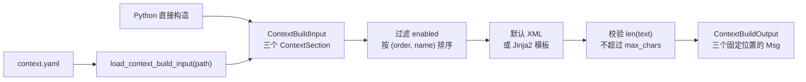

# iris.context

`iris.context` 把声明式 YAML 或 Python 对象渲染为三条固定位置的 context
消息：

- `system`：必定输出的 system 消息。
- `memory`：可选的 user 消息，`sender="context"`。
- `before_current_input`：可选的 user 消息，`sender="context"`。

本包只产生这三类消息，不组装 history、current input、tools 或
`LLMRequest`。完整请求及消息顺序由外层运行时负责。

## 架构与流程



`models.py` 定义 slot、section、输入和输出；`config.py` 负责 YAML
加载与模板路径解析；`builder.py` 负责编排过滤、排序、渲染和字符上限；
`renderer.py` 提供默认 XML 与文件模板渲染。

## 快速入门

### Python

```python
from iris.context import (
    ContextBuilder,
    ContextBuildInput,
    ContextSection,
    ContextSlot,
)

input_data = ContextBuildInput(
    system=ContextSection(
        slots=[
            ContextSlot(
                name="base_instructions",
                content="你是一个本地文件助手。",
            )
        ]
    ),
    memory=ContextSection(
        slots=[
            ContextSlot(
                name="memory",
                content="用户偏好简洁回答。",
                attributes={"source": "sqlite"},
            )
        ]
    ),
    before_current_input=ContextSection(
        slots=[
            ContextSlot(
                name="environment_state",
                content={"cwd": "J:/repo", "dirty": False},
            )
        ]
    ),
)

output = ContextBuilder().build(input_data)

print(output.system.text)
if output.memory is not None:
    print(output.memory.text)
if output.before_current_input is not None:
    print(output.before_current_input.text)
```

默认渲染结果的根元素分别为：

```xml
<system_context>...</system_context>
<memory_context>...</memory_context>
<before_current_input_context>...</before_current_input_context>
```

根元素不附带额外属性。

### YAML

```yaml
system:
  max_chars: 2000
  slots:
    - name: base_instructions
      content: 你是一个本地文件助手。
      order: 10

memory:
  max_chars: 1000
  slots:
    - name: memory
      content: 用户偏好简洁回答。
      attributes:
        source: yaml

before_current_input:
  slots:
    - name: environment_state
      content:
        cwd: J:/repo
        dirty: false
```

```python
from iris.context import ContextBuilder, load_context_build_input

input_data = load_context_build_input("context.yaml")
output = ContextBuilder().build(input_data)
```

YAML 顶层只允许 `system`、`memory`、`before_current_input`。`system`
必填，另外两段可选。

### 运行时追加 memory slot

使用 `with_memory_slots()` 可以在不修改已加载配置的情况下追加运行态内容。
如果 `memory` 缺失，方法会自动补成空 section：

```python
from iris.context import (
    ContextBuilder,
    ContextSlot,
    load_context_build_input,
)

loaded = load_context_build_input("context.yaml")
runtime_memory = ContextSlot(
    name="runtime_memory",
    content="本轮检索到的记忆。",
    attributes={"source": "runtime"},
)
runtime_input = loaded.with_memory_slots(runtime_memory)

output = ContextBuilder().build(runtime_input)
if output.memory is not None:
    print(output.memory.text)
```

## 数据契约

### `ContextSlot`

```python
class ContextSlot(BaseModel):
    name: str
    content: Any
    order: int = 100
    attributes: dict[str, str] = Field(default_factory=dict)
    enabled: bool = True
```

- `name` 是默认 XML 的标签名；`attributes` 是该标签的属性。
- 标签名和属性名必须匹配
  `^[A-Za-z_][A-Za-z0-9_.-]*$`。
- `order` 必须是整数且不能是布尔值。
- `enabled=False` 的 slot 在渲染前被过滤。
- 启用的 slot 按 `(order, name)` 升序排列。

默认 XML renderer 对 `content` 的处理如下：

| 类型 | 渲染行为 |
| --- | --- |
| `str` | XML 转义后的文本 |
| `bool` | 小写 `true` 或 `false` |
| `int` / `float` | `str(value)` |
| `dict` | 按键的字符串值排序，渲染为带 `name` 属性的 `<item>` |
| `list` / `tuple` | 保持顺序，逐项渲染为 `<item>` |
| `None` | 空内容，外层元素使用自闭合形式 |
| 其他对象 | `str(value)` 后进行 XML 转义 |

文本和属性值都会进行 XML 转义；默认 renderer 不过滤不可见控制字符。这里的标签
用于组织 LLM 输入，不要求输出必须能被 XML parser 解析。
嵌套容器递归使用相同规则。

### `ContextSection`

```python
class ContextSection(BaseModel):
    template: Path | None = None
    max_chars: int | None = None
    slots: list[ContextSlot] = Field(default_factory=list)
```

- Python 直接构造时，`template` 必须是当前平台识别的绝对 `Path`。
- `max_chars` 必须是正整数且不能是布尔值。
- `slots` 是该固定消息位置的内容。
- `system` 必须至少包含一个启用的 slot。

直接构造带模板的 section：

```python
from pathlib import Path

from iris.context import ContextSection, ContextSlot

section = ContextSection(
    template=(Path.cwd() / "templates/system.xml.j2").resolve(),
    slots=[ContextSlot(name="instructions", content="保持回答简洁。")],
)
```

`memory` 或 `before_current_input` 缺失、为空，或者没有启用的 slot
时，对应输出为 `None`。这种情况下即使配置的模板不存在，也不会尝试打开或渲染模板。

### `ContextBuildInput`

```python
class ContextBuildInput(BaseModel):
    system: ContextSection
    memory: ContextSection | None = None
    before_current_input: ContextSection | None = None

    def with_memory_slots(self, *slots: ContextSlot) -> ContextBuildInput: ...
```

输入只包含三个固定 section，不接受额外字段。`with_memory_slots()`
返回追加运行态 memory slots 后的新输入，不修改原对象。

### `ContextBuildOutput`

```python
class ContextBuildOutput(BaseModel):
    system: Msg
    memory: Msg | None = None
    before_current_input: Msg | None = None
```

`system` 的 role 为 `system`。两个可选输出的 role 为 `user`，sender
均为 `CONTEXT_SENDER`。

## 模板渲染

配置 `ContextSection.template` 后，builder 使用
`ContextTemplateRenderer`，否则使用默认 XML renderer。

模板只收到一个变量：`slots`。它是经过启用过滤、排序和 JSON 模式序列化后
得到的字典列表。`system`、`memory`、`version`、`metadata` 等名称不会注入模板。

```jinja2
<memory_context>

  <entry name="{{ slot.name }}">{{ slot.content }}</entry>

</memory_context>
```

模板环境启用 XML autoescape 和 `StrictUndefined`。模板不存在、路径不是文件、
缺少 Jinja2、编码或运行时错误均使用 `IrisContextError`，模板最终输出会作为
普通 prompt 文本保留。如果某个 slot 无法进行 JSON 模式序列化，builder 也会
抛出 `IrisContextError`，并附带 section、模板路径和底层错误。

模板渲染使用数据副本；模板 renderer 对传入上下文的修改不会改变原 section
或 slot。

## 渲染后字符上限

`max_chars` 在完整文本渲染完成后检查：

```text
actual = len(rendered_text)
```

标签、属性、模板固定文本、换行和空白都计入长度。`actual == max_chars`
时通过；只有 `actual > max_chars` 才抛出 `IrisContextError`。错误上下文包含：

- `section`：`system`、`memory` 或 `before_current_input`
- `limit`：配置的 `max_chars`
- `actual`：完整渲染文本的实际字符数

超过上限时不会截断文本、丢弃内容或修改任何 slot。

## YAML 加载规则

```python
load_context_build_input(path: str | Path) -> ContextBuildInput
```

该函数只有 `path` 一个参数：

1. 以 UTF-8 读取并解析 YAML。
2. 要求顶层是对象，且只包含三个固定 section。
3. 将每个 section 的相对 `template` 按 `context.yaml` 所在目录解析为绝对路径。
4. 使用与 Python API 相同的模型完成字段校验。

绝对模板路径保持不变。任何未声明的顶层、section 或 slot 字段都会被拒绝，
不会进行历史配置字段迁移。

## 公共 API

`iris.context` 只导出以下九项：

| API | 用途 |
| --- | --- |
| `CONTEXT_SENDER` | 可选 context user 消息的 sender，值为 `"context"` |
| `ContextSlot` | 定义一个可排序、可禁用的结构化内容块 |
| `ContextSection` | 定义一个位置的模板、字符上限和 slot |
| `ContextBuildInput` | 汇总三个固定 section 的构建输入 |
| `ContextBuildOutput` | 返回三个固定位置的 `Msg` |
| `ContextBuilder` | 编排过滤、排序、渲染、校验和消息创建 |
| `ContextXmlRenderer` | 默认 XML section/slot renderer |
| `ContextTemplateRenderer` | Jinja2 文件模板 renderer |
| `load_context_build_input` | 从 YAML 加载 `ContextBuildInput` |

### Builder 与 renderer 签名

```python
class ContextBuilder:
    def __init__(
        self,
        *,
        xml_renderer: ContextXmlRenderer | None = None,
        template_renderer: ContextTemplateRenderer | None = None,
    ) -> None: ...

    def build(self, input_data: ContextBuildInput) -> ContextBuildOutput: ...


class ContextXmlRenderer:
    def render_section(
        self,
        root_tag: str,
        slots: list[ContextSlot],
    ) -> str: ...

    def render_slot(self, slot: ContextSlot) -> str: ...


class ContextTemplateRenderer:
    def render_file(
        self,
        template_path: Path,
        context: dict[str, Any],
    ) -> str: ...
```

## 异常

加载、构建和渲染阶段的主要失败统一使用
`iris.exceptions.IrisContextError`，包括：

- 配置文件读取、UTF-8 解码或 YAML 解析失败。
- 配置顶层结构、字段或模板路径校验失败。
- 模板不存在、不是文件、依赖缺失、变量未定义或渲染失败。
- 模板上下文无法序列化。
- 默认 XML 根标签不安全。
- 完整渲染文本超过 section 的 `max_chars`。

直接构造 Pydantic 模型时，字段约束失败表现为
`pydantic.ValidationError`；其中保留对应的 context 校验信息。

## 边界与非目标

`iris.context` 不负责：

- 拼接完整 prompt 或完整消息列表。
- 插入 history 或 current input。
- 生成 tools schema 或构建 `LLMRequest`。
- 查询 memory store。
- `token estimator`、跨 section 总预算或自动比例分配。
- 为历史契约提供兼容层。
