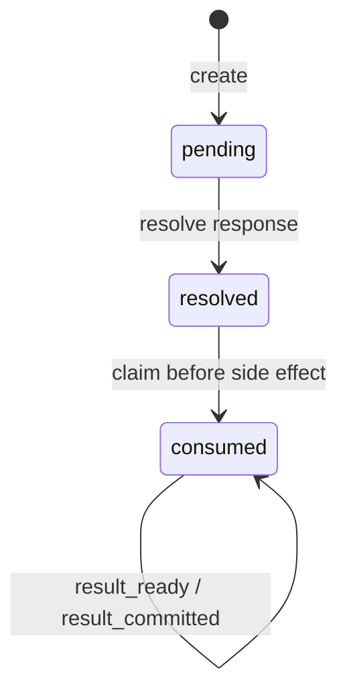

[中文](README.md)

# `iris.hitl`

`iris.hitl` defines the durable human-in-the-loop gate protocol. Permission confirmation and human
questions share a typed request envelope, interaction lifecycle, and compare-and-set storage
contract while retaining different prompt/response semantics.

It does not implement UI, provider calls, tool execution, or ordinary session-message storage.
Hosts render interactions; `AgentRuntime` creates, waits for, and resumes them. `iris chat` is the
current terminal host adapter.

## Model and lifecycle



- `ToolCallSnapshot` binds tool ID, name, arguments, workspace, and a stable SHA-256 fingerprint.
- `PermissionPrompt` and `PermissionInteractionResponse` model approve/reject.
- `QuestionPrompt` and `QuestionInteractionResponse` model a question, options, and free-text answer.
- `HumanInteractionRequest` is the only `tool_call + typed prompt` envelope.
- `InteractionStatus` tracks human response: pending, resolved, consumed.
- `InteractionResumePhase` separately tracks runtime progress: waiting, claimed, result_ready,
  result_committed.

All arguments and checkpoints must be JSON-safe. Model construction may raise Pydantic
`ValidationError`; service operations use stable HITL domain exceptions.

## Service and storage

`HumanInteractionService.create()` is the single creation entry point. `resolve()` is idempotent for
the same response and conflicts for a different one. `claim()` marks a resolved interaction consumed
before side effects. `update_consumed()` requires the caller's `expected_phase` and
`expected_version`; stores compare status, phase, and version without silently refreshing stale
snapshots.

`InMemoryInteractionStore` is suitable for tests and `session.backend: none` but is lost on process
exit. `iris.store.SQLiteStore` persists interactions in `human_interactions` and supports durable
recovery.

## Runtime boundary

When runtime returns `WAITING_HUMAN`, read `pending_interaction`, collect a typed response, and call
`await runtime.resume(interaction_id, response)`.

The terminal adapter uses `[y/N]` for permissions and numbered options or free text for questions.
It resumes multiple gates in runtime order. Ctrl+C/EOF does not reject or cancel an interaction.
SQLite sessions discover pending work on restart; in-memory sessions do not. Claimed or uncleared
continuation state fails closed and is never replayed.

Policy precedes host input: `DENY` cannot be overridden. A human tool produces its question only
under `ALLOW`; `REQUIRE_HUMAN` on a human tool fails closed to avoid nested gates. Ordinary tools
create permission gates only under `REQUIRE_HUMAN`. There is no TUI/Web adapter, timeout/cancel
protocol, or durable authorization rule today.

`AskQuestionTool` belongs to `iris.tools`, not the HITL state machine.

## Public API and maintenance

The top-level package exports its typed models, `InteractionStore`, `InMemoryInteractionStore`,
`HumanInteractionService`, and `make_call_fingerprint()`. Import SQLite storage from `iris.store`.

| Change | Main location | Tests |
| --- | --- | --- |
| JSON-safe models and states | `models.py` | `tests/hitl/test_models.py` |
| Resolve/claim/update transitions | `service.py` | `tests/hitl/test_service.py` |
| CAS storage contract | `store.py`, `in_memory.py` | `tests/hitl/test_store_contract.py` |
| Runtime wait/resume | `../runtime/runtime.py`, `../runtime/resume.py` | runtime HITL tests |

```bash
uv run pytest tests/hitl tests/runtime/test_hitl_waiting.py tests/runtime/test_hitl_resume.py
uv run ruff check src/iris/hitl tests/hitl
```
