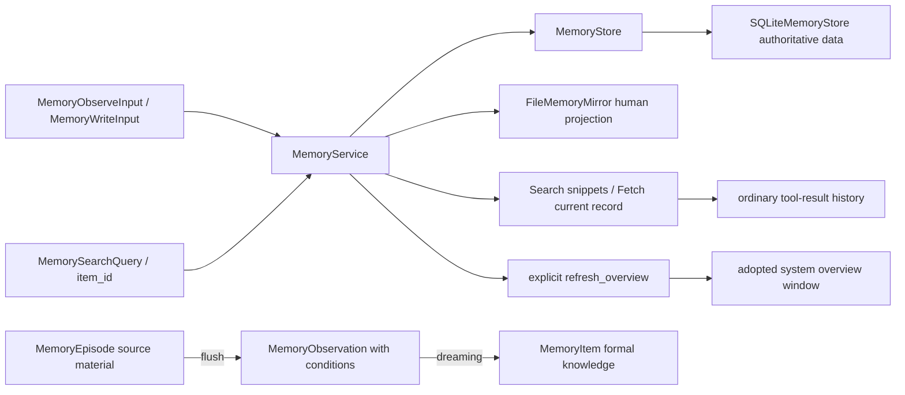

[中文](README.md)

# `iris.memory`

`iris.memory` is Iris's local long-term-memory SDK. It defines project namespaces, immutable Episodes,
evidence-backed Observations, formal MemoryItems, change events, SQLite persistence, human-readable
file projections, generation stages, and memory tools. SQLite is authoritative; Markdown under
`.iris/memory/namespaces/` is a projection for humans. `MemoryService` is the memory-management SDK
for reads, writes, flush, dreaming, projection, and overview generation.

`memory.enabled` defaults to false. Enabling it automatically adds `memory_search` and
`memory_fetch` and lets the Agent adopt published overviews for a new session or after successful
compaction. The model chooses reads based on its overview and the question; ordinary runs never
search items automatically. Agent construction neither calls the model nor generates an overview.
Enable it with:

```yaml
memory:
  enabled: true
```

When enabled, an injected `memory_service` in `AgentRunner.from_config*()` takes precedence over a
configured SQLite service. When disabled, the injected object is neither mounted, called, nor closed.
CLI and child agents share this assembly path. Each child uses its own switch, read range, and
effective workspace without inheriting the parent's Service. Static `context.yaml` memory slots
remain separate.

## Quick start

```python
from pathlib import Path

from iris.memory import (
    MemoryConfig,
    MemorySearchQuery,
    MemoryWriteInput,
    build_memory_service_from_config,
)

workspace = Path(".").resolve()
service = build_memory_service_from_config(
    MemoryConfig(enabled=True),
    workspace,
)
assert service is not None

item = service.remember(
    MemoryWriteInput(
        text="The user prefers concise answers",
        reason="The user stated this explicitly",
    )
)
response = service.search(MemorySearchQuery(query="concise answers"), ["project"])
for hit in response.items:
    print(hit.snippet, hit.is_complete)
current = service.get_item(item.id, ["project"])
```

`build_memory_service_from_config(config, workspace_root, memory_service=...)` is the sole source
resolver. Disabled memory returns `None` without resolving memory paths or creating files. When
enabled, it returns the injected object unchanged or builds a SQLite service if none was supplied.
An injected service keeps its store, mirror, provider/model, and IO mode. Configured memory root and
database paths must resolve inside the caller-supplied workspace. SQLite FTS5 is the only text-search path: initialization
and query errors raise `IrisMemoryError`, and no matches return an empty result without LIKE fallback.
New databases use schema version 5; older versions are rejected at initialization without migration,
version overwrite, or deletion. A SQLite service built by
`build_memory_service_from_config()` runs connection setup, SQL, and result construction in one async worker job, while synchronous methods
still execute on their caller's thread. Directly constructed services and custom stores default to
`MemoryIOExecutionMode.INLINE`, so their thread affinity is not changed implicitly. Independent
`MemoryService` and low-level tool-registration SDK calls do not require the Agent switch.

## Architecture and lifecycle



Each workspace has its own database/service. Items use an opaque `namespace` string, defaulting to
`project`; agents reading that namespace share project memory. Agent, session, and visibility no
longer form a five-field partition. Different workspaces use different databases.

`service.search(MemorySearchQuery(query="..."), ["project", "notes"])` searches allowed namespaces in one
query and applies the limit after global ranking. `get_item(item_id, namespaces)` and
`list_items(namespaces)` also accept a combined read range. Writes and generation operations use one
namespace. An empty read range returns no items.

- `observe()` records an immutable `MemoryEpisode` and `OBSERVE` event, but no long-term item.
- `await flush()` extracts evidence-backed `MemoryObservation` records and advances source cursors.
- `await dream()` reconciles observations and explicit changes into formal Items through additions,
  updates, merges, retirement, or supporting evidence.
- `remember()` explicitly creates a formal Item and `ADD` event without requiring extraction first.
- `update(item_id, namespace, patch, reason=...)` updates an item without changing its ID.
- `search()` returns `MemorySearchResponse(items, has_more)`, with identity fields and a raw snippet per hit.
- `forget()` tombstones rather than physically deleting items.

Episodes contain source `records` with stable IDs. Their content and Observations stay immutable;
the store separately maintains flush cursors and observation processing states. Observation
applicability guides dreaming, while formal Item text includes the conditions needed to use its
knowledge. Search, Fetch, and overviews read only active Items, not Episodes or Observations.

Flush selects information useful for future tasks: preferences, corrections, project conventions,
reusable experience, and important pending work. Chitchat, routine activity, and temporary requests
with no future value may produce no observations. Dreaming checks drafts against original evidence
with roles, timestamps, and metadata, then combines related points into concise Items. Text may omit
secondary details while retaining the subjects and conditions needed to avoid misuse. Dates, versions,
attribution history, and untried alternatives are included when useful; evidence links retain the history.
Compression must not invent facts or strengthen conclusions: one experience does not establish a
general rule, explicit default preferences retain their scope, and unverified does not mean ineffective.
Details the user explicitly asks to remember are retained. The `reason` briefly states the purpose of
recording or consolidating. These are model instructions: JSON schema validation checks structure and
field constraints, not whether the text's conclusions follow from its evidence.

Flush/dream requests use `temperature=0` and `response_format={"type": "json_object"}`; the generation
provider must support both parameters. JSON mode constrains response format; the existing parsing
boundary still checks fields and evidence references. Invalid responses are not committed, and saved
inputs remain available for retry. Low randomness and comparison with original evidence do not
guarantee semantic correctness.

`MemoryEvidenceRef` points to a record span within an Episode or a real explicit-write event.
An Item's `evidence` supports its current text; observation resolutions and MemoryEvents retain the
historical explanation. A semantic text update replaces current support with this write event and
evidence explicitly supplied by this call. Classification or metadata-only updates keep existing
support. Write tools record the actual Agent and call ID without claiming user confirmation.

Omitted patch fields remain unchanged. Use `[]` and `{}` to clear artifacts and metadata; all patch
fields reject explicit `null`. Updates and soft deletes acquire a `BEGIN IMMEDIATE` write lock before
reading current data. Text, current evidence, events, pending changes, and revision commit together.
Changes to different fields from separate connections merge sequentially.

Flush atomically commits observations and source progress, including progress for an empty extraction.
Dreaming reads fixed inputs, related items, and corrections in one snapshot. Model calls run outside
the transaction; the commit compares revisions and applies the entire plan and input resolutions.
The Flush request sends source information and the known run outcome once per Episode, linking excerpts
with short labels. Durable Episode/Record IDs, message boundaries, and block ordinals stay in
the program; tool status and explicit memory targets remain available to the model.
The model receives a compact projection of observations, related items, changed event fields, short
evidence refs, and original excerpts. The program retains durable Episode/Record/Event locators;
request-local record labels and character spans let the model recognize overlapping evidence.
Conflicts leave inputs unconsumed. Capacity-blocked inputs remain available for retry.
`generation_state()` exposes backlog, blocked inputs, and stage results. Configure
`generation_provider`, `generation_model`, and `generation_config` on the service. Standalone SDK
callers can explicitly run `await service.flush("project")` and `await service.dream("project")`.

### Automatic generation and background lifecycle

Reading alone does not enable generation costs. Opt in explicitly:

```yaml
memory:
  enabled: true
  write_namespace: project
  generation:
    enabled: true
    idle_seconds: 300
```

`generation.enabled` defaults to false. Configured services reuse the Agent's resolved provider and
model. Injected services retain their own generation dependencies and budgets. Automatic operation
requires generation provider/model, overview provider/model, and a mirror; constructing the runner
without these dependencies raises `IrisConfigError`.

`AgentRunner` owns one maintenance pipeline for root runs. It registers a source after admission and
before the first new message, then captures committed suffixes at actual compaction and run boundaries.
No maintenance model runs while foreground admission or activation remains alive. After all foreground
work exits and the configured idle interval passes, it processes observations, flushes new material,
dreams, and publishes an overview. New foreground input cancels uncommitted generation. A dispatched
short database commit finishes as one unit. `aclose()` captures remaining committed material and waits
for real IO, retaining pending work for restart. There is no polling, external cron, or daemon.

SQLite lifecycle sources have a persistent UUID and bounded run-message ranges, so restart can capture
missing suffixes without learning fork history twice. InMemory lifecycle can recover only material
already captured in the memory store. Child agents retain reading and explicit writes, but their
internal traces are not automatically collected. BCI, reasoning, and memory readback text are excluded
from new evidence; observations reference stable records and half-open character ranges.
An automatically captured Episode keeps the run ID in top-level `source_id` and the lifecycle source
ID in metadata. Pending-Episode reads use those fields to attach the source's final outcome.

Flush and dream each default to 32,000 input tokens and 4,000 output tokens. Configure these through
`flush_input_budget_tokens`, `flush_output_budget_tokens`, `dream_input_budget_tokens`, and
`dream_output_budget_tokens` under `generation`. Flush splits long records into fixed spans. Dream
budgets complete comparison packages, preserving oversized inputs as blocked while processing
unrelated work. Dependency changes, a rebuilt Agent with a changed budget, or an explicit
`await service.dream(namespace, retry_blocked=True)` make blocked inputs eligible again.

Model failures wait for new activity or restart instead of retrying in a tight loop. Projection failures
do not re-extract consumed material: later maintenance repairs category files by projection revision
and overviews by overview revision. Maintenance usage is stored in `GenerationResult`, separate from
foreground run usage and model steps. `generation_state(namespace)` / `await ageneration_state(namespace)`
reports pending/blocked counts, item/projection/overview revisions, and the latest result per stage.
Flush results expose exact committed spans in `consumed_ranges`.
Dream reports operation counts, `processed_observations`, `processed_changes`, and `unchanged`.
The last count refers to inputs whose target was not added, rewritten, merged, or deleted; supporting
evidence without a text change is included.

The independent SDK can run each stage explicitly without enabling Agent automation or requiring a
mirror:

```python
from pathlib import Path
from iris.memory import MemoryObserveInput, MemoryService, SQLiteMemoryStore

service = MemoryService(
    SQLiteMemoryStore(Path("memory.db")),
    generation_provider=provider,  # The application's configured CompletionProvider.
    generation_model="your-model",
)
service.observe(MemoryObserveInput(text="This project now uses uv for dependencies."))
flushed = await service.flush("project")
dreamed = await service.dream("project")
state = service.generation_state("project")
```

Each call processes one batch; `has_more` reports pending inputs for that stage. Dream does not
implicitly flush. Explicit `refresh_overview()` still requires its own provider/model and mirror.
Background publication does not replace an adopted session window; adoption remains limited to a new
session or successful compaction.

### System overview window

On the first session input and successful compaction, runtime loads published overviews and chooses
full core facts plus knowledge scope, or the complete knowledge scope alone. The selected window is
committed atomically with the session transition. Tool loops, new runs, HITL, and recovery retain the
adopted window; failed compaction does not replace it. The overview belongs in system context,
while Search/Fetch results enter ordinary tool history.

All namespaces, warnings, tool instructions, and wrapping share a budget of
`floor(compaction.input_budget_tokens * memory.overview.system_budget_ratio)`, with a default ratio
of `0.02`. If full content does not fit, runtime tries the complete knowledge scope. If that also
exceeds its budget, it reports a capacity error instead of cutting topics. Selection estimates actual
request tokens and retains the complete system character limit.

Model instructions treat topics absent from the adopted overview as unavailable and do not search
for them. Without an overview, normal chat continues without long-term-memory reads for this window.
An overview covering new topics must be published, then adopted in a new session or
after successful compaction. Already covered topics may still query current database records. This
is a model instruction, not a database topic filter. Search does not require a subsequent Fetch.
Updates and forgetting never rewrite previously saved conversation history.

The switch is fixed at Agent construction; same-session hot switching is not supported. Rebuild the
Agent and start a new session after changing configuration. Disabled requests omit the memory
addendum even if a saved window contains one, without deleting that window, the database, overview
files, or historical tool results. Static memory, ordinary history, and summaries remain intact.
Normal successful compaction may still commit an empty overview window. Re-enabling and reusing an
old session does not force a new overview; start a new session to adopt the current publication.

## Explicit overview generation

The host can call `await service.refresh_overview(namespace)` to summarize all active formal Items in
that namespace, grouped by category/kind, into core facts and knowledge scope. The complete result
is published as `Memory.md` in the canonical namespace directory. Configure `overview_provider`,
`overview_model`, and `overview_config` on the service; the provider follows
`iris.providers.CompletionProvider`. Agent configuration binds the resolved main provider, while
an explicitly injected service keeps its host-supplied configuration. Construction and reads do not
call the model; optional runner maintenance owns automatic generation.

```python
# The service already has its overview provider/model configured.
result = await service.refresh_overview("project")
documents = await service.aload_overviews(["project"])
```

`MemoryOverviewConfig` defaults to a 96,000-token generation input budget and 4,096 output tokens.
An oversized complete snapshot fails without truncation or batching. One normally completed JSON
response must contain `core_facts` and `knowledge_scope`; facts may be empty, scope must not be.
Invalid or incomplete responses and publication errors preserve the previous complete file, with
known model usage attached to error context. An empty active Item snapshot publishes “当前无记忆”
without a model call.
Successful, failed, and cancelled overview attempts persist a separate `GenerationResult` with
their known usage and publication outcome, available through `generation_state()`.

Generation runs outside the publication lock. A short locked source-version comparison prevents an
older generation from replacing a newer overview. A candidate may still publish behind current
items and receive a stale warning. `load_overviews/aload_overviews` accept only the complete new
format; old formats require explicit refresh. A missing file returns a fixed missing-overview
message without scanning items or generating a directory. `MemoryOverviewDocument.navigation`
contains knowledge scope. A service without a mirror returns no documents and rejects refresh as
missing generation dependencies.

Generation budgets are independent of main-request window budgets; `system_budget_ratio=0.02`
controls the system window selection described above.

## Public surface

- Inputs and results: [MemorySearchQuery, MemorySearchHit, and MemorySearchResponse](models.py),
  plus Episode, Record, Observation, Item, EvidenceRef, Event, and write/update models.
- Service and storage: [MemoryService](service.py), [MemoryStore](store.py), and
  [SQLiteMemoryStore](sqlite.py). Synchronous `search/get_item/list_items` remain available for SDK
  reads. `asearch/aget_item/alist_items` adapt each complete operation. Writes, event reads, and the
  extraction SDK remain available.
- Overview: `MemoryOverviewConfig/Content/Document/GenerationResult`, `refresh_overview()`,
  `load_overviews()`, and `aload_overviews()`.
- Configuration: [MemoryConfig](config.py), `build_memory_service_from_config()`, and
  `resolve_memory_path()`.
- Generation: [flush / dream](generation.py), [stage models and configuration](generation_models.py),
  and `generation_state()`.
- File projections: [FileMemoryMirror](mirror.py) and [MemoryFileAccess](files.py).
- Tools: [Search/Fetch and Remember/Update/Forget](tools.py), policy factories, and explicit registration.

The complete export set is [__all__](__init__.py). Private SQL, lexer, and payload helpers are not
SDK extension protocols.

The [memory evaluation report (Chinese)](../../../docs/memory-system-evaluation.md) compares the
retrieval, file-reading, and Search/Fetch approaches. Iris adopts G's required-phrase capability while
keeping SQLite FTS, without adding a vector database or other heavyweight retrieval components.

### Plain-text search

```python
query = MemorySearchQuery(
    query="answer preferences",
    required_terms=["concise"],
    categories=["user", "feedback"],
    kinds=["preference", "correction"],
    limit=8,
)
response = await service.asearch(query, ["project"])
```

`query` is required. `required_terms` defaults to empty, adding no required body phrases.
Categories and kinds default to empty, meaning no filter for that dimension.
The result limit defaults to 8 and accepts `1..100`. Unknown fields are rejected, and namespace is
not part of model input. Storage filters allowed namespaces, categories/kinds, and active status
before ranking by BM25 ascending, then updated_at/id descending. It reads `limit + 1`, returns only
limit hits, and computes `has_more`. Values within one filter dimension are OR; dimensions are AND.
Only `MemoryItem.text` is indexed. Active Items are searchable; Episodes, Observations,
and deleted/superseded items are excluded from results.

Indexing, queries, and raw-text positions use the same lexer: lowercase ASCII letter/digit runs,
adjacent bigrams for Chinese runs, and a single character only for an isolated Chinese character.
Punctuation and underscores separate tokens. Query terms are deduplicated in first-occurrence order
and quoted as literal OR terms. Neither input text nor query terms are truncated; indexing retains
all terms and frequencies. Empty text, zero terms, no matches, or an empty read range returns
`MemorySearchResponse((), False)`, never recent items.

The model or SDK can supply `required_terms` explicitly. The same item's body must match the ordinary
query's OR group and every required phrase. Each phrase uses the same lexer and requires its tokens
to be adjacent and ordered, without deduplicating repetitions. For example:

```text
query="rollback threshold", required_terms=["Clearport", "billing export"]
→ ("rollback" OR "threshold") AND "clearport" AND "billing export"
```

Separate phrases have no relative order or distance requirement; tokens within a phrase do, so
`go go` requires two consecutive `go` tokens. This is token matching, not a literal substring search.
English case is ignored, but Chinese punctuation can change the bigram sequence: “账单-导出” does
not match the phrase “账单导出”. Required phrases have no 64/128-term cap. A phrase with no indexable
tokens is rejected by `MemorySearchQuery`. An ordinary query with no tokens still returns nothing;
required phrases alone are not a browsing API. No conditions are silently removed or relaxed when
there are no matches. This reuses the existing FTS5 index, without a schema or index migration.
Use category/kind filters only when the stored labels are known. A name appearing in a body does not
establish that its facts apply to that entity; callers must check applicability.

Each hit contains exactly `item_id/namespace/category/kind/snippet/is_complete`. Bodies of at most
300 Python Unicode characters are returned in full. For longer bodies, the first matching token's
start h gives `start=max(0,min(h-150,len(text)-300))`; the snippet is the exact 300-character slice,
without ellipses or highlighting. `is_complete` describes body completeness, not verified relevance.
Identical text under different IDs remains separate.
Snippet placement still follows the first ordinary-query hit. A required phrase may lie outside the
snippet; Fetch can supply the remaining body when needed.

## Memory tools

Enabled Agents automatically register the two `READ` tools in Search, Fetch order. Do not declare
`memory.search` or `memory.fetch` in `tools.builtin`: registry assembly rejects those names with
`IrisConfigError` and points to `memory.enabled`. The former `memory.backend` field is rejected at
configuration parsing. `include_tools=False` still omits schemas from that request, with overview
instructions based on the tools actually available.

Low-level `register_memory_tools()` still defaults to no tools and accepts explicit
`memory.search/fetch` selection in SDK code. Only manual Agent read declarations have been removed.
Search directly uses `MemorySearchQuery` as its input and returns `items` and `has_more`. Only when
more candidates exist does it add the hint “还有候选；这不要求继续查询。” Stop when snippets provide
enough evidence; search again only for missing necessary information, not merely to rephrase a
query without a new lead.

Fetch takes one nonblank `item_id`; a known ID can be fetched without a preceding Search. It calls
current `aget_item()` and returns `{"item": item.model_dump(mode="json")}` with every stored field,
including complete text, source, current evidence, metadata, artifact references, status, and timestamps.
Raw evidence and attachments are not opened. Missing, inactive, and out-of-range items report “允许读取范围内未找到有效记忆”. Repeated
Fetch calls are not suppressed. Updating an item after Search means a later Fetch returns its new
value. Ordinary `max_result_chars=50000` and ToolExecutor artifact handling still apply.

Agents that write memory explicitly declare `memory.remember/memory.update/memory.forget`, exposing
`memory_remember/memory_update/memory_forget`. These retain the normal `WRITE` permission, claim,
and result-commit flow and share the SDK service. Agent write declarations require enabled memory;
enabling memory does not register writes automatically. Forget reports whether a soft delete actually
occurred. A stale projection adds a warning while retaining the committed database success. For example:

```yaml
memory:
  enabled: true
  read_namespaces: [project, notes]
  write_namespace: project
tools:
  builtin: [memory.remember]
```

`MemoryAccessPolicy(read_namespaces=[...], write_namespace=...)` binds host-owned read/write ranges,
defaulting to `project`. Its factory runs for every tool call; tool input cannot override namespace.
Policy evaluation stays on the event loop; in THREAD mode, the database operation uses one complete
service worker job. SDK registration selects builtin names with
`register_memory_tools(..., tool_names=("memory.search", "memory.fetch"))`.

## File projections and persistence

`FileMemoryMirror.initialize_layout()` only creates directories. Canonical category documents live
under `namespaces/ns_<base64url of namespace UTF-8>/`, covering User, Feedback, Reference, Tasks,
and Sessions. It does not create `Memory.md` or rewrite legacy root files. Each entry keeps its raw
Markdown first, followed by complete metadata inside `<details>`. These are human-readable views,
not a record parsing or reverse-import protocol. Episodes, Observations, and Events remain in SQLite.

After a committed write, `rebuild_from_store()` uses `publish_projection()` to read a complete active
Item snapshot within a short write transaction and atomically replace each category document. Only
successful publication of every document advances `projection_revision`. `item_revision` advances
with effective formal-knowledge changes in the same transaction as Items, FTS, current evidence,
events, and input processing state;
an unchanged patch does not rewrite the item, event, or revision. A partially failed publication
keeps the database result successful and leaves the projection version behind. Write-tool results
include a warning; ordinary file tools use `MemoryFileAccess` to report freshness from the actual
file source revision. Database queries remain available when publication fails. Explicit rebuild
errors still propagate. Configured SQLite services always maintain these
category projections; a directly constructed SDK service may omit the mirror.
SQLite uses short-lived connections and wraps storage/JSON failures as `IrisMemoryError`.
FTS contains all item states, while Search and Fetch only return active records. Management SDK
`store.list_items(..., include_deleted=True)` can inspect soft-deleted records.
Item/index writes are transactional; `rebuild_index()` can rebuild from the authoritative table.
Public store `list_items()`, `list_events()`, and `list_observations()` calls reject limits outside
`1..100` with `IrisMemoryError` instead of silently clamping them. Only `list_items(limit=None)`
requests a complete mirror projection.

## Current limitations

- no vector database, embeddings, semantic reranker, or remote backend;
- InMemory lifecycle cannot recover uncaptured source text after exit; captured Episodes can still
  be recovered from a persistent memory store;
- namespaces are database-local grouping strings, not a separate management service.

## Maintenance

| Change | Main location | Tests |
| --- | --- | --- |
| SDK lifecycle, namespace reads, and search results | `models.py`, `service.py`, `sqlite.py` | `tests/memory/test_service.py` |
| Concurrent commits, field updates, FTS completeness, and search filters | `sqlite.py`, `_query.py` | `tests/memory/test_sqlite_consistency.py` |
| Async IO, combined tool reads, query terms, and query plans | `service.py`, `tools.py`, `sqlite.py`, `_query.py` | `tests/memory/test_async_io.py`, `tests/memory/test_tools.py`, `tests/memory/test_query.py`, `tests/memory/test_search.py`, `tests/memory/test_sqlite_query_plan.py` |
| Namespace snapshots, projection revisions, and atomic replacement | `mirror.py`, `files.py`, `sqlite.py` | `tests/memory/test_mirror.py`, `tests/memory/test_revisions.py` |
| Explicit overview generation, loading, and versioned publication | `overview.py`, `service.py`, `mirror.py` | `tests/memory/test_overview.py`, `tests/memory/test_async_io.py` |
| Flush / dreaming and atomic input consumption | `generation.py`, `generation_models.py`, `sqlite.py` | `tests/memory/test_generation.py`, `tests/memory/test_generation_store.py` |
| Overview-window adoption, compaction, and recovery | `../runtime/runtime.py`, `../runtime/memory_context.py` | `tests/harness/test_auto_memory.py`, `tests/harness/test_runner_memory.py`, `tests/runtime/test_memory_context.py` |

Run targeted tests from the repository root, using a fresh basetemp for each invocation:

```powershell
$env:UV_CACHE_DIR = "$PWD\tmp\uv-cache"
$memoryTestTemp = "$PWD\tmp\pytest-memory-$((Get-Date).ToString('yyyyMMdd-HHmmss-fff'))"
uv run pytest tests/memory -p no:cacheprovider --basetemp="$memoryTestTemp"
uv run ruff check src/iris/memory tests/memory
```
