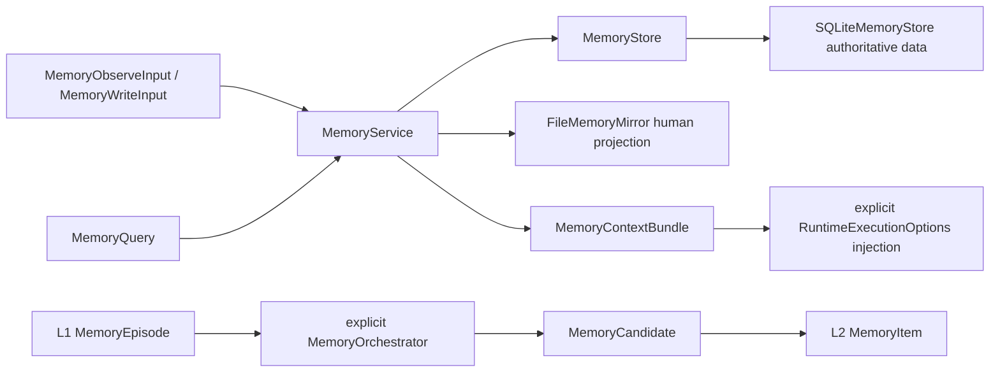

[中文](README.md)

# `iris.memory`

`iris.memory` is Iris's local long-term-memory SDK. It defines isolation scopes, L1 episodes,
candidates, L2 items, audit events, SQLite persistence, human-readable file projections, explicit
orchestration, and read-only model tools. SQLite is authoritative; Markdown/JSON under
`.iris/memory/` is a projection for humans.

Memory is not currently an `AgentConfig` YAML field and runtime never enables or recalls it by
default. Callers must build a `MemoryService`, inject it through `AgentRunner.from_config*()`, and
explicitly pass `RuntimeExecutionOptions.memory_query` or `memory_results` for each run.

## Quick start

```python
from pathlib import Path

from iris.memory import (
    MemoryConfig,
    MemoryQuery,
    MemoryScope,
    MemoryWriteInput,
    build_memory_service_from_config,
)

workspace = Path(".").resolve()
service = build_memory_service_from_config(
    MemoryConfig(backend="sqlite"),
    workspace,
)
assert service is not None

scope = MemoryScope(workspace_id=str(workspace), agent_id="notes-agent")
item = service.remember(
    MemoryWriteInput(
        scope=scope,
        text="The user prefers concise answers",
        reason="The user stated this explicitly",
    )
)
results = service.recall(MemoryQuery(scope=scope, text="answer preference"))
bundle = service.build_context(
    MemoryQuery(scope=scope, text="answer preference"),
    max_chars=1000,
)
```

`backend="none"` returns `None` without filesystem effects. Memory root and database paths must
resolve inside the caller-supplied workspace. SQLite FTS5 is used when available; deterministic
text search handles disabled FTS and missing Unicode matches. A SQLite service built by
`build_memory_service_from_config()` runs async reads as one worker job, while synchronous methods
still execute on their caller's thread. Directly constructed services and custom stores default to
`MemoryIOExecutionMode.INLINE`, so their thread affinity is not changed implicitly.

## Architecture and lifecycle



`MemoryScope` combines workspace, agent, collection, visibility, and optional session. Session
visibility requires a session ID; agent/workspace scopes ignore runtime session IDs so they remain
visible across sessions. `workspace_shared_scope()` uses the stable `__workspace__` / `shared`
convention. Every SQLite operation applies the full scope filter and does not reveal cross-scope
existence.

- `observe()` records an L1 episode and `OBSERVE` event, but no long-term item.
- `remember()` explicitly creates an L2 item and `ADD` event.
- `recall()` returns ranked `MemorySearchResult` objects.
- `forget()` tombstones rather than physically deleting items.
- `MemoryOrchestrator.observe()` uses injected extraction/classification to create candidates.
- `process_candidates()` explicitly accepts, rejects, or promotes candidates; the default no-op
  extractor creates none and no background extraction exists.

Candidate promotion is a single SQLite transaction and is idempotent after success. Item,
candidate, and event IDs are globally unique across scopes.

`MemoryContextBuilder` preserves result order and fits fragments into `max_chars`, truncating only
the first fragment when necessary and counting omissions. Prompt fragments keep semantic metadata
but omit storage source and retrieval score by default.

```python
from iris.harness import (
    AgentRunOptions,
    AgentRunRequest,
    AgentRunner,
    RuntimeExecutionOptions,
)

runner = AgentRunner.from_config_path(
    "agent.yaml",
    memory_service=service,
)
query = MemoryQuery(scope=scope, text="previous task")
result = await runner.start(
    AgentRunRequest(input="Continue the previous task"),
    options=AgentRunOptions(
        runtime=RuntimeExecutionOptions(memory_query=query.model_dump(mode="json"))
    ),
)
```

## Public surface

The large `iris.memory` export surface is grouped as follows:

- models/enums: scope, episode, candidate, item, event, query, search result, and context bundle;
- service/storage: `MemoryService`, `MemoryStore`, and `SQLiteMemoryStore`;
- async read scheduling: `MemoryIOExecutionMode` and the service's `arecall()`, `aget_item()`,
  `alist_items()`, `alist_events()`, and `abuild_context()` counterparts;
- config: `MemoryConfig` and child models, `build_memory_service_from_config()`, and
  `resolve_memory_path()`;
- orchestration: extractor/classifier protocols, policy, orchestrator, and rule/no-op defaults;
- projection: `FileMemoryMirror` and `MemoryContextBuilder`;
- tools: search/list/get tools, access-policy factories, and `register_memory_tools()`.

The exact set is `src/iris/memory/__init__.py::__all__`. Private SQL helpers, mirror markers, and
tool-payload helpers are not extension contracts.

`register_memory_tools()` exposes only `memory_search`, `memory_list`, and `memory_get`, all with
`READ` capability. There are no model-visible remember/forget tools. Tool input cannot override the
scope; `MemoryAccessPolicy` derives read/write scopes from trusted host context and can include the
workspace-shared scope. Tools evaluate that policy on the event loop, then submit the entire
multi-scope read as one service job rather than switching threads once per scope.

`FileMemoryMirror` creates the fixed Memory/User/Feedback/Reference/Tasks/Sessions projection and
can deterministically rebuild active items plus the most recent 100 events for one scope. It is not
an import source or the audit authority. `project_batch()` groups changes by target under an
instance lock, reads and renders each target once while preserving manual text outside markers, and
uses a same-directory temporary file for atomic replacement. Layout initialization is cached only
after success, and projection failures remain visible. SQLite uses short-lived connections and
wraps storage/JSON failures as `IrisMemoryError`.

## Current limitations

- no vector database, embeddings, semantic reranker, or remote backend;
- no automatic extraction from session messages or background tasks;
- `MemoryOrchestratorConfig.enabled` is only a config shape and does not construct an orchestrator;
- write-policy config only describes the current `sdk_only`/`tombstone` contract;
- `WorkingMemoryFrame` is reserved and is not consumed by the active runtime;
- collection is a hard SQLite filter, not a managed business object.

## Maintenance

| Change | Main location | Tests |
| --- | --- | --- |
| SDK lifecycle, audit, scope isolation, SQLite search, and context building | `models.py`, `service.py`, `sqlite.py`, `context.py` | `tests/memory/test_service.py` |
| Async reads, multi-scope tool scheduling, and query plans | `service.py`, `tools.py`, `sqlite.py` | `tests/memory/test_async_io.py`, `tests/memory/test_sqlite_query_plan.py` |
| Batched mirror projection, rebuild, and atomic replacement | `mirror.py` | `tests/memory/test_mirror.py` |
| Runtime injection | `../runtime/runtime.py`, `../runtime/memory_context.py` | `tests/runtime/test_execute.py` |

```bash
uv run pytest tests/memory tests/runtime/test_execute.py
uv run ruff check src/iris/memory tests/memory tests/runtime/test_execute.py
```
