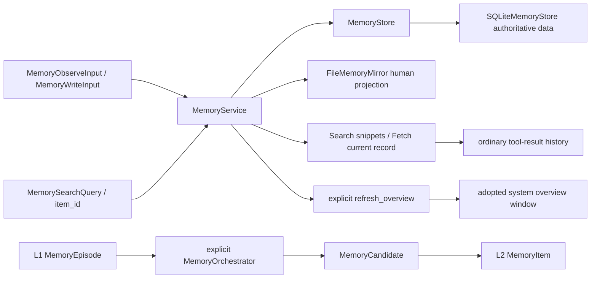

[中文](README.md)

# `iris.memory`

`iris.memory` is Iris's local long-term-memory SDK. It defines project namespaces, L1 episodes,
candidates, L2 items, audit events, SQLite persistence, human-readable file projections, explicit
orchestration, and memory tools. SQLite is authoritative; Markdown under
`.iris/memory/namespaces/` is a projection for humans. `MemoryService` is the memory-management SDK
for reads, writes, promotion, projection, and explicit overview generation.

`memory.enabled` defaults to false. Enabling it automatically adds `memory_search` and
`memory_fetch` and lets the Agent adopt published overviews for a new session or after successful
compaction. The model chooses reads based on its overview and the question; ordinary runs never
search items automatically. Agent construction neither calls the model nor generates an overview.
Enable it with:

```yaml
memory:
  enabled: true
```

When enabled, an injected `memory_service` in `AgentRunner.from_config*()` takes precedence over a
configured SQLite service. When disabled, the injected object is neither mounted, called, nor closed.
CLI and child agents share this assembly path. Each child uses its own switch, read range, and
effective workspace without inheriting the parent's Service. Static `context.yaml` memory slots
remain separate.

## Quick start

```python
from pathlib import Path

from iris.memory import (
    MemoryConfig,
    MemorySearchQuery,
    MemoryWriteInput,
    build_memory_service_from_config,
)

workspace = Path(".").resolve()
service = build_memory_service_from_config(
    MemoryConfig(enabled=True),
    workspace,
)
assert service is not None

item = service.remember(
    MemoryWriteInput(
        text="The user prefers concise answers",
        reason="The user stated this explicitly",
    )
)
response = service.search(MemorySearchQuery(query="concise answers"), ["project"])
for hit in response.items:
    print(hit.snippet, hit.is_complete)
current = service.get_item(item.id, ["project"])
```

`build_memory_service_from_config(config, workspace_root, memory_service=...)` is the sole source
resolver. Disabled memory returns `None` without resolving memory paths or creating files. When
enabled, it returns the injected object unchanged or builds a SQLite service if none was supplied.
An injected service keeps its store, mirror, provider/model, and IO mode. Configured memory root and
database paths must resolve inside the caller-supplied workspace. SQLite FTS5 is the only text-search path: initialization
and query errors raise `IrisMemoryError`, and no matches return an empty result without LIKE fallback.
New databases use schema version 4; older versions are rejected at initialization without migration,
version overwrite, or deletion. A SQLite service built by
`build_memory_service_from_config()` runs connection setup, SQL, and result construction in one async worker job, while synchronous methods
still execute on their caller's thread. Directly constructed services and custom stores default to
`MemoryIOExecutionMode.INLINE`, so their thread affinity is not changed implicitly. Independent
`MemoryService` and low-level tool-registration SDK calls do not require the Agent switch.

## Architecture and lifecycle



Each workspace has its own database/service. Items use an opaque `namespace` string, defaulting to
`project`; agents reading that namespace share project memory. Agent, session, and visibility no
longer form a five-field partition. Different workspaces use different databases.

`service.search(MemorySearchQuery(query="..."), ["project", "notes"])` searches allowed namespaces in one
query and applies the limit after global ranking. `get_item(item_id, namespaces)` and
`list_items(namespaces)` also accept a combined read range. Writes and candidate operations use one
namespace. An empty read range returns no items.

- `observe()` records an L1 episode and `OBSERVE` event, but no long-term item.
- `remember()` explicitly creates an L2 item and `ADD` event.
- `update(item_id, namespace, patch, reason=...)` updates an item without changing its ID.
- `search()` returns `MemorySearchResponse(items, has_more)`, with identity fields and a raw snippet per hit.
- `forget()` tombstones rather than physically deleting items.
- `MemoryOrchestrator.observe()` uses injected extraction/classification to create candidates.
- `process_candidates()` explicitly accepts, rejects, or promotes candidates; the default no-op
  extractor creates none and no background extraction exists.

For partial updates, omitted fields remain unchanged. `confidence` and `importance` accept `null`
to clear a score; use `[]` and `{}` to clear artifacts and metadata. Text, classification, status,
and collection fields do not accept explicit `null`.

Candidate promotion acquires a `BEGIN IMMEDIATE` write transaction before reading candidate
status. Concurrent or repeated promotions return the same item and write only one pair of add and
accept events. Updates and soft deletes also acquire the write lock before reading the current
item, preventing stale overwrites and duplicate deletion events. Changes to different fields from
separate connections merge sequentially. Item, candidate, and event IDs
are globally unique across namespaces within the database.

`process_candidates()` rebuilds the current namespace's mirror once per batch.
`MemoryService.promote_candidates()` accepts a namespace and an iterable of
`(candidate_id, kind, reason)` tuples in processing order. Each store promotion remains atomic;
if a later candidate or policy fails, previously committed items are projected before the error
propagates. Empty batches do not rebuild, and single-item `promote_candidate()` still refreshes
the mirror before returning.

### System overview window

On the first session input and successful compaction, runtime loads published overviews and chooses
full core facts plus knowledge scope, or the complete knowledge scope alone. The selected window is
committed atomically with the session transition. Tool loops, new runs, HITL, and recovery retain the
adopted window; failed compaction does not replace it. The overview belongs in system context,
while Search/Fetch results enter ordinary tool history.

All namespaces, warnings, tool instructions, and wrapping share a budget of
`floor(compaction.input_budget_tokens * memory.overview.system_budget_ratio)`, with a default ratio
of `0.02`. If full content does not fit, runtime tries the complete knowledge scope. If that also
exceeds its budget, it reports a capacity error instead of cutting topics. Selection estimates actual
request tokens and retains the complete system character limit.

Model instructions treat topics absent from the adopted overview as unavailable and do not search
for them. Without an overview, normal chat continues without long-term-memory reads for this window.
The host must explicitly generate an overview covering new topics, then adopt it in a new session or
after successful compaction. Already covered topics may still query current database records. This
is a model instruction, not a database topic filter. Search does not require a subsequent Fetch.
Updates and forgetting never rewrite previously saved conversation history.

The switch is fixed at Agent construction; same-session hot switching is not supported. Rebuild the
Agent and start a new session after changing configuration. Disabled requests omit the memory
addendum even if a saved window contains one, without deleting that window, the database, overview
files, or historical tool results. Static memory, ordinary history, and summaries remain intact.
Normal successful compaction may still commit an empty overview window. Re-enabling and reusing an
old session does not force a new overview; start a new session to adopt the current publication.

## Explicit overview generation

The host can call `await service.refresh_overview(namespace)` to summarize all active L2 items in
that namespace, grouped by category/kind, into core facts and knowledge scope. The complete result
is published as `Memory.md` in the canonical namespace directory. Configure `overview_provider`,
`overview_model`, and `overview_config` on the service; the provider follows
`iris.providers.CompletionProvider`. Agent configuration binds the resolved main provider, while
an explicitly injected service keeps its host-supplied configuration. Construction, ordinary chat,
writes, and reads never trigger generation automatically.

```python
# The service already has its overview provider/model configured.
result = await service.refresh_overview("project")
documents = await service.aload_overviews(["project"])
```

`MemoryOverviewConfig` defaults to a 96,000-token generation input budget and 1,024 output tokens.
An oversized complete snapshot fails without truncation or batching. One normally completed JSON
response must contain `core_facts` and `knowledge_scope`; facts may be empty, scope must not be.
Invalid or incomplete responses and publication errors preserve the previous complete file, with
known model usage attached to error context. An empty active L2 snapshot publishes “当前无记忆”
without a model call.

Generation runs outside the publication lock. A short locked source-version comparison prevents an
older generation from replacing a newer overview. A candidate may still publish behind current
items and receive a stale warning. `load_overviews/aload_overviews` accept only the complete new
format; old formats require explicit refresh. A missing file returns a fixed missing-overview
message without scanning items or generating a directory. `MemoryOverviewDocument.navigation`
contains knowledge scope. A service without a mirror returns no documents and rejects refresh as
missing generation dependencies.

Generation budgets are independent of main-request window budgets; `system_budget_ratio=0.02`
controls the system window selection described above.

## Public surface

- Inputs and results: [MemorySearchQuery, MemorySearchHit, and MemorySearchResponse](models.py),
  plus episode, candidate, item, event, and write/update models.
- Service and storage: [MemoryService](service.py), [MemoryStore](store.py), and
  [SQLiteMemoryStore](sqlite.py). Synchronous `search/get_item/list_items` remain available for SDK
  reads. `asearch/aget_item/alist_items` adapt each complete operation. Writes, event reads, and the
  extraction SDK remain available.
- Overview: `MemoryOverviewConfig/Content/Document/GenerationResult`, `refresh_overview()`,
  `load_overviews()`, and `aload_overviews()`.
- Configuration: [MemoryConfig](config.py), `build_memory_service_from_config()`, and
  `resolve_memory_path()`.
- Explicit extraction: [MemoryOrchestrator](orchestrator.py), extractor/classifier/policy protocols,
  and rule/no-op defaults.
- File projections: [FileMemoryMirror](mirror.py) and [MemoryFileAccess](files.py).
- Tools: [Search/Fetch and Remember/Update/Forget](tools.py), policy factories, and explicit registration.

The complete export set is [__all__](__init__.py). Private SQL, lexer, and payload helpers are not
SDK extension protocols.

### Plain-text search

```python
query = MemorySearchQuery(
    query="answer preferences",
    categories=["user", "feedback"],
    kinds=["preference", "correction"],
    limit=8,
)
response = await service.asearch(query, ["project"])
```

`query` is required. Categories and kinds default to empty, meaning no filter for that dimension.
The result limit defaults to 8 and accepts `1..100`. Unknown fields are rejected, and namespace is
not part of model input. Storage filters allowed namespaces, categories/kinds, and active status
before ranking by BM25 ascending, then updated_at/id descending. It reads `limit + 1`, returns only
limit hits, and computes `has_more`. Values within one filter dimension are OR; dimensions are AND.
Only `MemoryItem.text` is indexed. Active L1/L2 items are searchable; episodes, unpromoted candidates,
and deleted/superseded items are excluded from results.

Indexing, queries, and raw-text positions use the same lexer: lowercase ASCII letter/digit runs,
adjacent bigrams for Chinese runs, and a single character only for an isolated Chinese character.
Punctuation and underscores separate tokens. Query terms are deduplicated in first-occurrence order
and quoted as literal OR terms. Neither input text nor query terms are truncated; indexing retains
all terms and frequencies. Empty text, zero terms, no matches, or an empty read range returns
`MemorySearchResponse((), False)`, never recent items.

Each hit contains exactly `item_id/namespace/category/kind/snippet/is_complete`. Bodies of at most
300 Python Unicode characters are returned in full. For longer bodies, the first matching token's
start h gives `start=max(0,min(h-150,len(text)-300))`; the snippet is the exact 300-character slice,
without ellipses or highlighting. `is_complete` describes body completeness, not verified relevance.
Identical text under different IDs remains separate.

## Memory tools

Enabled Agents automatically register the two `READ` tools in Search, Fetch order. Do not declare
`memory.search` or `memory.fetch` in `tools.builtin`: registry assembly rejects those names with
`IrisConfigError` and points to `memory.enabled`. The former `memory.backend` field is rejected at
configuration parsing. `include_tools=False` still omits schemas from that request, with overview
instructions based on the tools actually available.

Low-level `register_memory_tools()` still defaults to no tools and accepts explicit
`memory.search/fetch` selection in SDK code. Only manual Agent read declarations have been removed.
Search directly uses `MemorySearchQuery` as its input and returns `items` and `has_more`. Only when
more candidates exist does it add the hint “还有候选，可收紧关键词或 categories/kinds 后重试”.

Fetch takes one nonblank `item_id`; a known ID can be fetched without a preceding Search. It calls
current `aget_item()` and returns `{"item": item.model_dump(mode="json")}` with every stored field,
including complete text, source, metadata, artifact references, status, and timestamps. Attachments
are not opened. Missing, inactive, and out-of-range items report “允许读取范围内未找到有效记忆”. Repeated
Fetch calls are not suppressed. Updating an item after Search means a later Fetch returns its new
value. Ordinary `max_result_chars=50000` and ToolExecutor artifact handling still apply.

Agents that write memory explicitly declare `memory.remember/memory.update/memory.forget`, exposing
`memory_remember/memory_update/memory_forget`. These retain the normal `WRITE` permission, claim,
and result-commit flow and share the SDK service. Agent write declarations require enabled memory;
enabling memory does not register writes automatically. Forget reports whether a soft delete actually
occurred. A stale projection adds a warning while retaining the committed database success. For example:

```yaml
memory:
  enabled: true
  read_namespaces: [project, notes]
  write_namespace: project
tools:
  builtin: [memory.remember]
```

`MemoryAccessPolicy(read_namespaces=[...], write_namespace=...)` binds host-owned read/write ranges,
defaulting to `project`. Its factory runs for every tool call; tool input cannot override namespace.
Policy evaluation stays on the event loop; in THREAD mode, the database operation uses one complete
service worker job. SDK registration selects builtin names with
`register_memory_tools(..., tool_names=("memory.search", "memory.fetch"))`.

## File projections and persistence

`FileMemoryMirror.initialize_layout()` only creates directories. Canonical category documents live
under `namespaces/ns_<base64url of namespace UTF-8>/`, covering User, Feedback, Reference, Tasks,
and Sessions. It does not create `Memory.md` or rewrite legacy root files. Each entry keeps its raw
Markdown first, followed by complete metadata inside `<details>`. These are human-readable views,
not a record parsing or reverse-import protocol. Episodes, candidates, and events remain in SQLite.

After a committed write, `rebuild_from_store()` uses `publish_projection()` to read a complete active
L2 snapshot within a short write transaction and atomically replace each category document. Only
successful publication of every document advances `projection_revision`. `item_revision` advances
with effective active L2 changes in the same transaction as the item, FTS, events, and promotion;
an unchanged patch does not rewrite the item, event, or revision. A partially failed publication
keeps the database result successful and leaves the projection version behind. Write-tool results
include a warning; ordinary file tools use `MemoryFileAccess` to report freshness from the actual
file source revision. Database queries remain available when publication fails. Explicit rebuild
errors still propagate, with no background retry. Configured SQLite services always maintain these
category projections; a directly constructed SDK service may omit the mirror.
SQLite uses short-lived connections and wraps storage/JSON failures as `IrisMemoryError`.
FTS contains all item states, while Search and Fetch only return active records. Management SDK
`store.list_items(..., include_deleted=True)` can inspect soft-deleted records.
Item/index writes are transactional; `rebuild_index()` can rebuild from the authoritative table.
Public store `list_items()`, `list_events()`, and `list_candidates()` calls reject limits outside
`1..100` with `IrisMemoryError` instead of silently clamping them. Only `list_items(limit=None)`
requests a complete mirror projection.

## Current limitations

- no vector database, embeddings, semantic reranker, or remote backend;
- no automatic extraction from session messages or background tasks;
- namespaces are database-local grouping strings, not a separate management service.

## Maintenance

| Change | Main location | Tests |
| --- | --- | --- |
| SDK lifecycle, namespace reads, and search results | `models.py`, `service.py`, `sqlite.py` | `tests/memory/test_service.py` |
| Concurrent promotion, field updates, FTS completeness, and search filters | `sqlite.py`, `_query.py` | `tests/memory/test_sqlite_consistency.py` |
| Async IO, combined tool reads, query terms, and query plans | `service.py`, `tools.py`, `sqlite.py`, `_query.py` | `tests/memory/test_async_io.py`, `tests/memory/test_tools.py`, `tests/memory/test_query.py`, `tests/memory/test_search.py`, `tests/memory/test_sqlite_query_plan.py` |
| Namespace snapshots, projection revisions, and atomic replacement | `mirror.py`, `files.py`, `sqlite.py` | `tests/memory/test_mirror.py`, `tests/memory/test_revisions.py` |
| Explicit overview generation, loading, and versioned publication | `overview.py`, `service.py`, `mirror.py` | `tests/memory/test_overview.py`, `tests/memory/test_async_io.py` |
| Candidate batch promotion and partial-failure refresh | `orchestrator.py`, `service.py` | `tests/memory/test_orchestrator.py` |
| Overview-window adoption, compaction, and recovery | `../runtime/runtime.py`, `../runtime/memory_context.py` | `tests/harness/test_auto_memory.py`, `tests/harness/test_runner_memory.py`, `tests/runtime/test_memory_context.py` |

Run targeted tests from the repository root, using a fresh basetemp for each invocation:

```powershell
$env:UV_CACHE_DIR = "$PWD\tmp\uv-cache"
$memoryTestTemp = "$PWD\tmp\pytest-memory-$((Get-Date).ToString('yyyyMMdd-HHmmss-fff'))"
uv run pytest tests/memory -p no:cacheprovider --basetemp="$memoryTestTemp"
uv run ruff check src/iris/memory tests/memory
```
