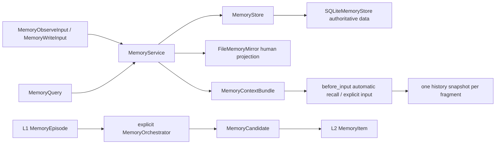

[中文](README.md)

# `iris.memory`

`iris.memory` is Iris's local long-term-memory SDK. It defines project namespaces, L1 episodes,
candidates, L2 items, audit events, SQLite persistence, human-readable file projections, explicit
orchestration, and memory tools. SQLite is authoritative; Markdown/JSON under
`.iris/memory/` is a projection for humans.

`AgentConfig.memory` defaults to a disabled backend. Enabling SQLite in `agent.yaml` enables one
automatic recall per new user run and three read tools for additional model-directed queries.
Dynamic snapshots enter session history for tool loops and recovery. Static `context.yaml` memory
slots remain separate.

```yaml
memory:
  backend: sqlite
  # These defaults can be omitted
  recall_mode: on_turn
  read_namespaces: [project]
  write_namespace: project
  max_query_terms: null
```

`recall_mode: manual` disables automatic recall while keeping tools and explicit SDK queries.
An injected `memory_service` in `AgentRunner.from_config*()` takes precedence over the configured
backend. CLI and child agents use the same assembly path. Each child uses its own memory config
and effective workspace, without copying the parent's dynamic snapshots or explicit query options.

## Quick start

```python
from pathlib import Path

from iris.memory import (
    MemoryConfig,
    MemoryQuery,
    MemoryWriteInput,
    build_memory_service_from_config,
)

workspace = Path(".").resolve()
service = build_memory_service_from_config(
    MemoryConfig(backend="sqlite"),
    workspace,
)
assert service is not None

item = service.remember(
    MemoryWriteInput(
        text="The user prefers concise answers",
        reason="The user stated this explicitly",
    )
)
results = service.recall(MemoryQuery(text="concise answers"))
bundle = service.build_context(
    MemoryQuery(text="concise answers"),
    max_chars=1000,
)
```

`backend="none"` returns `None` without filesystem effects. Memory root and database paths must
resolve inside the caller-supplied workspace. SQLite FTS5 is the only text-search path: initialization
and query errors raise `IrisMemoryError`, and no matches return an empty result without LIKE fallback.
New databases use schema version 2; older versions are rejected at initialization without migration,
version overwrite, or deletion. A SQLite service built by
`build_memory_service_from_config()` runs async IO as one worker job, while synchronous methods
still execute on their caller's thread. Directly constructed services and custom stores default to
`MemoryIOExecutionMode.INLINE`, so their thread affinity is not changed implicitly.

## Architecture and lifecycle



Each workspace has its own database/service. Items use an opaque `namespace` string, defaulting to
`project`; agents reading that namespace share project memory. Agent, session, and visibility no
longer form a five-field partition. Different workspaces use different databases.

`MemoryQuery(namespaces=["project", "notes"], text="...")` searches all allowed namespaces in one
query and applies the limit after global ranking. `get_item(item_id, namespaces)` and
`list_items(namespaces)` also accept a combined read range. Writes and candidate operations use one
namespace. An empty read range returns no items.

- `observe()` records an L1 episode and `OBSERVE` event, but no long-term item.
- `remember()` explicitly creates an L2 item and `ADD` event.
- `update(item_id, namespace, patch, reason=...)` updates an item without changing its ID.
- `recall()` returns ranked `MemorySearchResult` objects.
- `forget()` tombstones rather than physically deleting items.
- `MemoryOrchestrator.observe()` uses injected extraction/classification to create candidates.
- `process_candidates()` explicitly accepts, rejects, or promotes candidates; the default no-op
  extractor creates none and no background extraction exists.

For partial updates, omitted fields remain unchanged. `confidence` and `importance` accept `null`
to clear a score; use `[]` and `{}` to clear artifacts and metadata. Text, classification, status,
and collection fields do not accept explicit `null`.

Candidate promotion acquires a `BEGIN IMMEDIATE` write transaction before reading candidate
status. Concurrent or repeated promotions return the same item and write only one pair of add and
accept events. Updates and soft deletes also acquire the write lock before reading the current
item, preventing stale overwrites and duplicate deletion events. Changes to different fields from
separate connections merge sequentially. Item, candidate, and event IDs
are globally unique across namespaces within the database.

`process_candidates()` rebuilds the current namespace's mirror once per batch.
`MemoryService.promote_candidates()` accepts a namespace and an iterable of
`(candidate_id, kind, reason)` tuples in processing order. Each store promotion remains atomic;
if a later candidate or policy fails, previously committed items are projected before the error
propagates. Empty batches do not rebuild, and single-item `promote_candidate()` still refreshes
the mirror before returning.

`MemoryContextBuilder` preserves result order and fits fragments into `max_chars`, truncating only
the first fragment when necessary and counting omissions. Prompt fragments keep semantic metadata
but omit storage source and retrieval score by default.

Runtime archives dynamic fragments with BCI and user input in `before_input`. Later tool
steps, HITL, and recovery replay that history without another query; ordinary compaction can still
replace the raw fragments with a summary.

Source precedence is `memory_results` (including an empty list), then `memory_query`, then automatic
recall; the two explicit fields are mutually exclusive. Automatic recall uses only the current user
input, not the full transcript. Tool steps, steer input, and recovery do not trigger it again.
Automatic read failures log a WARNING with the run ID and let the conversation continue. Config,
initialization, explicit-call, and rendering failures retain their normal error behavior.

Only automatic recall suppresses a fragment with the same item ID and exactly the same rendered
content already visible as a raw memory message. Summaries, static slots, and tool outputs do not
count as evidence. Result and body budgets apply before deduplication, with no refill query.
There is no global seen set or raw-content pinning; a compacted fragment can be injected again.
Explicit queries/results and tool responses are not suppressed. Updates and forgetting affect
future reads without rewriting historical snapshots.

Use an explicit SDK query to override automatic selection for one run:

```python
from iris.harness import (
    AgentRunOptions,
    AgentRunRequest,
    AgentRunner,
    RuntimeExecutionOptions,
)

runner = AgentRunner.from_config_path(
    "agent.yaml",
    memory_service=service,
)
query = MemoryQuery(text="previous task")
result = await runner.start(
    AgentRunRequest(input="Continue the previous task"),
    options=AgentRunOptions(
        runtime=RuntimeExecutionOptions(memory_query=query.model_dump(mode="json"))
    ),
)
```

## Public surface

The large `iris.memory` export surface is grouped as follows:

- models/enums: episode, candidate, item, event, query, search result, and context bundle;
- service/storage: `MemoryService`, `MemoryStore`, and `SQLiteMemoryStore`;
- async IO: `MemoryIOExecutionMode`, `arecall()`, `aget_item()`, `alist_items()`, `alist_events()`,
  `abuild_context()`, `aremember()`, `aupdate()`, and `aforget()`;
- config: `MemoryConfig` and child models, `build_memory_service_from_config()`, and
  `resolve_memory_path()`;
- orchestration: extractor/classifier protocols, policy, orchestrator, and rule/no-op defaults;
- projection: `FileMemoryMirror` and `MemoryContextBuilder`;
- tools: search/list/get and remember/update/forget tools, `default_memory_access_policy_factory()`, and
  `register_memory_tools()`.

The exact set is `src/iris/memory/__init__.py::__all__`. Private SQL helpers, mirror markers, and
tool-payload helpers are not extension contracts.

`MemoryQuery.limit` or a tool's `limit` determines the result count, independently of the query-term
budget and injected-body budget. Construct orchestrators explicitly; observation and extraction do
not run by default.

### Plain-text search

Index and query preparation share one tokenizer: lowercase ASCII letter/digit runs, adjacent
bigrams for Chinese runs of at least two characters, and a unigram only for an isolated Chinese
character. Query terms are unique quoted literals joined with OR, not advanced FTS syntax. Indexing
retains all terms and their frequencies.

`MemoryQuery.max_query_terms=None` keeps all query terms. An explicit budget B takes floor(B/2)
distinct terms from the start and the remaining quota from the end, then merges without refilling
overlap. Tail selection uses the last occurrence positions. It still scans the full input and may
miss a question in the middle. Empty terms do not return recent items; use `list_items()` for listing.
FTS matches are candidates rather than verified relevance, and lexical search does not guarantee
paraphrase recall.

`MemoryConfig.max_query_terms` applies only to automatic recall. Explicit SDK and tool queries do
not inherit that budget.

`register_memory_tools()` defaults to `memory_search`, `memory_list`, and `memory_get`, all with
`READ` capability. Agents with memory enabled receive these automatically. Agents that manage
memory can opt into write tools through the existing builtin configuration:

```yaml
tools:
  builtin: [memory.remember, memory.update, memory.forget]
```

These expose `memory_remember`, `memory_update`, and `memory_forget` with `WRITE` capability and
the existing permission, claim, and result-commit lifecycle. Writes use one policy-bound namespace
and the same service as SDK calls. Forget returns the actual soft-delete result. Direct SDK tool
registration can select builtin names through `register_memory_tools(..., tool_names=[...])`.

Tool input cannot override the
namespace. `MemoryAccessPolicy(read_namespaces=[...], write_namespace=...)` binds host-owned read and
write ranges, defaulting to `project`; an empty read range returns nothing. The default factory uses
`MemoryConfig.read_namespaces/write_namespace` without partitioning by agent ID. The factory runs
before each tool execution, and `register_memory_tools()` takes `access_policy_factory`.
`MemoryQuery`, `memory_search`, and
`memory_list` all declare a `1..100`
limit. After raw tool input passes that boundary, it is projected to a trusted `MemoryQuery`
without repeating the same range validation. Tools evaluate access policy on the event loop, then
submit one combined query as a single service job. Namespace order does not determine which items
fill the limit. Explicit search tools use the full query without inheriting the automatic-recall budget.

`FileMemoryMirror` creates the fixed Memory/User/Feedback/Reference/Tasks/Sessions projection and
can deterministically rebuild active items plus the most recent 100 events for one namespace. It is not
an import source or the audit authority. `project_batch()` groups changes by target under an
instance lock, reads and renders each target once while preserving manual text outside markers, and
uses a same-directory temporary file for atomic replacement. Layout initialization is cached only
after success. Automatic projection failure after a successful database write logs a warning while
preserving the successful result. Explicit mirror projection or rebuild calls still report errors;
there is no background retry. SQLite uses short-lived connections and
wraps storage/JSON failures as `IrisMemoryError`.
FTS contains all item states, with default queries filtering for active items.
`MemoryQuery(include_deleted=True)` explicitly includes deleted items through the same search path.
Item/index writes are transactional; `rebuild_index()` can rebuild from the authoritative table.
Public store `list_items()`, `list_events()`, and `list_candidates()` calls reject limits outside
`1..100` with `IrisMemoryError` instead of silently clamping them. Only `list_items(limit=None)`
requests a complete mirror projection.

## Current limitations

- no vector database, embeddings, semantic reranker, or remote backend;
- no automatic extraction from session messages or background tasks;
- namespaces are database-local grouping strings, not a separate management service.

## Maintenance

| Change | Main location | Tests |
| --- | --- | --- |
| SDK lifecycle, namespace reads, SQLite search, and context building | `models.py`, `service.py`, `sqlite.py`, `context.py` | `tests/memory/test_service.py` |
| Concurrent promotion, field updates, FTS completeness, and result-count config | `sqlite.py`, `config.py` | `tests/memory/test_sqlite_consistency.py` |
| Async IO, combined tool reads, query terms, and query plans | `service.py`, `tools.py`, `sqlite.py`, `_query.py` | `tests/memory/test_async_io.py`, `tests/memory/test_tools.py`, `tests/memory/test_query.py`, `tests/memory/test_sqlite_query_plan.py` |
| Batched mirror projection, rebuild, and atomic replacement | `mirror.py` | `tests/memory/test_mirror.py` |
| Candidate batch promotion and partial-failure refresh | `orchestrator.py`, `service.py` | `tests/memory/test_orchestrator.py` |
| Automatic recall, deduplication, and history recovery | `../runtime/runtime.py`, `../runtime/memory_context.py` | `tests/harness/test_auto_memory.py`, `tests/harness/test_runner_memory.py`, `tests/runtime/test_memory_context.py` |

```bash
uv run pytest tests/memory tests/runtime/test_execute.py
uv run ruff check src/iris/memory tests/memory tests/runtime/test_execute.py
```
