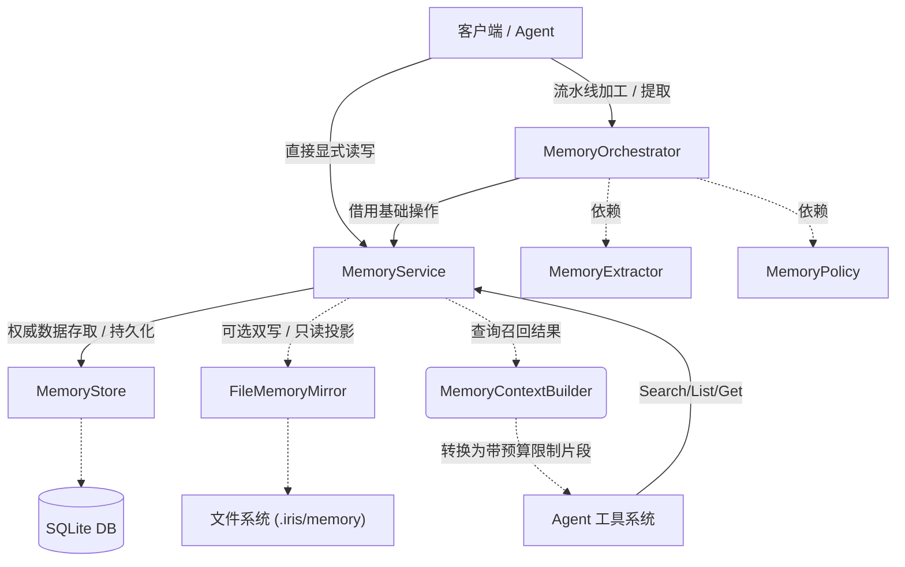

# Iris 记忆系统 (Memory)

长期记忆内核及其 Python SDK 门面。提供具有细粒度隔离范围（Scope）的分层记忆模型，涵盖观察片段（L1）、候选提取和长期知识（L2）的全生命周期管理，支持底层存储与本地文件系统的自动镜像投射（Mirror）和渐进式的记忆编排流程（Orchestrator）。

## 架构设计

记忆模块采用事件溯源（Event Sourcing）与分离责任（CQRS）思想设计，内部采用存储接口契约（Store Protocol）承载权限和防腐设计。包含原始观察记录（L1）和语义提炼总结（L2），并提供一套灵活的编排管道用于自动候选抽取和显式晋升。同时向大模型工具层面仅暴露受限读端访问。



核心流向生命周期：
1. **L1**：`MemoryEpisode` （记录发生过的基础客观事件）。
2. **候选**：经由 `MemoryExtractor` 从 L1 中产生的 `MemoryCandidate` （存疑 / 可信待定态）。
3. **L2**：满足 `MemoryPolicy` 阈值或被明确接受后晋升处理得到的 `MemoryItem` （稳态活跃或已删除状态知识）。

## 快速入门

```python
from pathlib import Path
from iris.memory import (
    MemoryConfig,
    MemoryScope,
    MemoryWriteInput,
    MemoryQuery,
    build_memory_service_from_config
)

# 1. 依据声明式配置及 Workspace 路径安全地创建包含底层存储与镜像的统一 Service
config = MemoryConfig(backend="sqlite", path=".iris/memory/memory.db")
service = build_memory_service_from_config(config, workspace_root=Path("/path/to/project"))

# 2. 划定目标边界作用域
scope = MemoryScope(
    workspace_id="test-workspace",
    agent_id="python-agent",
    visibility="agent"
)

# 3. 显式记录直接形成的长期知识点 (自动关联审计事件)
item = service.remember(
    MemoryWriteInput(
        scope=scope,
        text="代码约定：所有的内部核心组件日志要输出至 stdout",
        reason="用户在 PR review 时提出要求的系统级规范"
    )
)

# 4. 根据相关性或自然语言查询进行搜索
query = MemoryQuery(scope=scope, text="日志输出要求", limit=3)

# 5. 生成供注入 Prompt 的安全截断上下文片段包
context_bundle = service.build_context(query, max_chars=4000)
for fragment in context_bundle.fragments:
    print(f"[{fragment.score}] {fragment.text}")
```

## 重要定义

### 数据流结构与模型
- **`MemoryScope`**: 核心访问与隔离边界。由 `workspace_id`、`agent_id`、`collection`、`visibility` 与规范化后的 `session_id` 共同限定读写范围；工具入参不能覆盖 scope 字段。

| visibility | 含义 | session_id | agent_id |
| ---- | ---- | ---- | ---- |
| session | 当前会话/任务临时记忆 | 必须有 | 执行 agent |
| agent | 某个稳定 agent 的长期记忆 | 必须为 None | 稳定 agent id |
| workspace | 项目共享记忆 | 必须为 None | 建议固定为 __workspace__ |

`MemoryScopeConfig.to_scope()` 会在 `visibility != session` 时忽略运行时 `session_id`，保证 agent/workspace 级记忆不会被会话上下文意外切分。
项目共享记忆使用 `workspace_shared_scope(workspace_id)` 构造，内部固定采用 `agent_id="__workspace__"`、`collection="shared"`、`visibility=workspace`。

`collection` 当前是 scope 内的命名空间字段，用于为未来的用途分区预留隔离边界；它已经参与 SQLite 硬过滤，但还不是一等业务对象。当前不提供 collection registry、collection 管理 API、跨 collection 查询或由工具入参切换 collection 的能力。现阶段建议只使用少量约定值：

| collection | 当前定位 |
| ---- | ---- |
| default | 默认长期记忆 |
| shared | workspace 共享记忆 |
| scratch | 临时工作记忆 / subagent 草稿 |

除非 runtime 或上层策略显式授权，查询默认不跨 collection。

- **`MemoryEpisode`**: 基础观察片段模型（L1）。通常为 LLM 推理响应的快照或工具行为日志。
- **`MemoryCandidate`**: 从基础片段提取出的未确认候选组，携有原始置信度与重要度的评分。需经历判断验证阶段 `pending`/`accepted`/`rejected` 等才能最终变更为真实长期项。
- **`MemoryItem`**: 标准的终态持久化知识条目结构（L2）。具备多状态管控及其相关的事件追溯 `episode_id` 标记。
- **`MemoryEvent`**: 一套伴随系统操作发生记录的操作事件日志实体，提供基于该实体进行的审计。
- **`MemoryQuery`**: 将文本匹配、元数据和限制边界统合到一次请求查询中配置的数据对象结构。
- **`MemoryContextBundle`**: `builder` 基于字符限制预算返回的打包模型。内含包装过的数据段、剩余容量和是否被强制截断等上下文指示。

### 元数据枚举集
- **`MemoryVisibility`**: 可见度分级（`session`, `agent`, `workspace`）。
- **`MemoryActor`**: 操作动作来源（例如：`SDK`）。
- **`MemoryLevel`**: 记忆等级（`l1`：情境与短时；`l2`：语义化知识）。
- **`MemoryItemKind`**: 功能性细分标识（事实 `fact`、偏好 `preference`、笔记 `note`、订正 `correction` 等）。
- **`MemoryCandidateStatus`**: 候选管控流转状态（`pending`, `accepted`, `rejected`, `merged`）。

## API 模块划分

### `iris.memory.MemoryService`
基础与显式的增删查改内核服务，对存储机制执行持久化（双写）并处理所有的审计派发逻辑。
- `observe(input: MemoryObserveInput) -> MemoryEpisode`: 忠实记录不可变更的 L1 事件片段作为发生来源备查验证并发布给投影器。
- `remember(input: MemoryWriteInput) -> MemoryItem`: 单步直写模式，强制产生一条活跃状态的 L2 记忆。
- `promote_candidate(candidate: MemoryCandidate, kind: MemoryItemKind, actor: MemoryActor, reason: str) -> MemoryItem`: 运用事务安全边界将指定的候选体晋级合并入稳定的 L2 项目堆中。
- `recall(query: MemoryQuery) -> list[MemorySearchResult]`: 返回根据参数结构命中的排序记录。
- `forget(item_id: str, scope: MemoryScope, actor: MemoryActor, reason: str) -> None`: 为指定记忆打上删除审计标签及清理标识标记。
- `build_context(query: MemoryQuery, max_chars: int) -> MemoryContextBundle`: 以最安全的姿态集成请求和防暴涨截断控制生成最终的上下文组。

### `iris.memory.MemoryOrchestrator`
基于可注入抽取规则实现的系统智能调度流，对自动化提取与归档候选处理流水线的包装外壳。
- `observe(input: MemoryObserveInput) -> list[MemoryCandidate]`: 首先记录基础 L1 片段，然后依据 `Extractor` 在该请求期直接抽出可能的待处理候选。
- `process_candidates(scope: MemoryScope, limit: int) -> list[MemoryItem]`: 批处理 Pending 队列。依凭指定的自动控制 `Policy` （重要性或信度阈值决断），将允许的数据落盘 L2。

### 配置与构造 (`config.py`)
- **`build_memory_service_from_config(config: MemoryConfig, workspace_root: Path) -> MemoryService | None`**:
  将声明式的纯 Pydantic 参数绑定转换。支持判断存储类型并选择挂载（或关闭）SQLite 以及建立防逃离拦截的文件系统 Mirror。

### Pydantic 数据存储协议 (`MemoryStore`)
系统允许自建 Backend 来适配外部持久服务要求。需实现对实体和相关联的 `Event` 操作审计处理支持。自带 `SQLiteMemoryStore` 并已集成简略版 FTS 全文搜索。

`MemoryItem.id` 与 `MemoryCandidate.id` 作为全局实体 ID 使用；新增 item/candidate 时如果 ID 已存在，SQLite store 会拒绝写入，避免跨 scope 静默覆盖。更新和删除必须通过 `id + scope` 命中目标实体。

SQLite 连接通过 store 内部 helper 管理事务并在退出时显式关闭，避免 Windows 临时数据库文件被连接句柄占用。

### 工具和其它组件 (`tools.py` 与 `context.py`)
- **`MemoryContextBuilder`**: 用于保障不宕机超出 LLM 负载上下文的安全封装生成器。如未超出阈值按原样传递，溢出尾部做预定剪断标记并丢入警示常量。
- **`register_memory_tools(...)`**: 构建并挂载记忆 `Search`、`Get` 及 `List` 读取组件给大语境框架交互体系使用，保持严格沙箱安全仅读操作。
