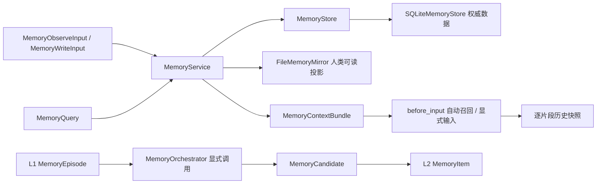

[English](README.en.md)

# `iris.memory`

`iris.memory` 是 Iris 的本地长期记忆 SDK：它定义项目内 namespace、L1 episode、候选记忆、L2
长期条目、审计事件、SQLite 存储、文件镜像、显式编排和记忆工具。SQLite 是权威数据源；
`.iris/memory/` 下的 Markdown/JSON 是便于人工查看的投影。

`AgentConfig.memory` 默认关闭后端。在 `agent.yaml` 中启用 SQLite 后，每个新用户 run 默认
自动召回一次，并提供三个读取工具供模型主动补查。动态快照进入会话历史，工具循环和恢复
继续使用它；静态 `context.yaml` memory 槽位保持独立。

```yaml
memory:
  backend: sqlite
  # 以下是可省略的默认值
  recall_mode: on_turn
  read_namespaces: [project]
  write_namespace: project
  max_query_terms: null
```

`recall_mode: manual` 关闭自动召回，保留工具和显式 SDK 查询。`AgentRunner.from_config*()` 的
显式 `memory_service` 优先于配置后端；CLI 与子 Agent 复用同一装配入口。子 Agent 使用自己的
memory 配置和 effective workspace，不复制父 run 的快照或显式查询选项。

## 运行要求与快速开始

本包随 Iris 安装，使用标准库 SQLite 和 FTS5。FTS5 是唯一文本检索路径；初始化或查询错误
报告 `IrisMemoryError`，无命中返回空，不再降级为 LIKE。新库使用 schema version 2，旧版库
在初始化时明确拒绝，不自动迁移、覆盖版本或删除数据。

```python
from pathlib import Path

from iris.memory import (
    MemoryConfig,
    MemoryQuery,
    MemoryWriteInput,
    build_memory_service_from_config,
)

workspace = Path(".").resolve()
service = build_memory_service_from_config(
    MemoryConfig(backend="sqlite"),
    workspace,
)
assert service is not None

item = service.remember(
    MemoryWriteInput(
        text="用户偏好简洁中文回答",
        reason="用户显式说明",
    )
)
results = service.recall(MemoryQuery(text="回答偏好"))
bundle = service.build_context(
    MemoryQuery(text="回答偏好"),
    max_chars=1000,
)
```

`backend="none"` 返回 `None` 且不创建文件。memory root 和 database path 必须解析在调用方给定
的 workspace 内。由 `build_memory_service_from_config()` 构造的 SQLite service 会让 async
读写在一个 worker job 中完成；同步 `recall()` 等 API 仍在调用线程执行。直接构造
`MemoryService` 或注入自定义 store 时默认 `MemoryIOExecutionMode.INLINE`，不会静默改变其
线程亲和性。

## 架构与数据流


```mermaid
flowchart LR
    Input["MemoryObserveInput / MemoryWriteInput"] --> Service["MemoryService"]
    Service --> Store["MemoryStore"]
    Store --> SQLite["SQLiteMemoryStore 权威数据"]
    Service --> Mirror["FileMemoryMirror 人类可读投影"]
    Episode["L1 MemoryEpisode"] --> Orchestrator["MemoryOrchestrator 显式调用"]
    Orchestrator --> Candidate["MemoryCandidate"]
    Candidate --> Item["L2 MemoryItem"]
    Query["MemoryQuery"] --> Service
    Service --> Context["MemoryContextBundle"]
    Context --> Runtime["before_input 自动召回 / 显式输入"]
    Runtime --> History["逐片段历史快照"]
```

### Namespace 与项目共享

每个 workspace 使用独立数据库/service，条目以普通字符串 `namespace` 分组，默认
`project`。同项目 Agent 读取同一空间即可共享资料；不再要求 Agent ID、session、visibility
等五个字段同时匹配。不同项目使用不同数据库。

`MemoryQuery(namespaces=["project", "notes"], text="...")` 对多个空间做一次联合查询，
全局排序后取 limit。`get_item(item_id, namespaces)` 和 `list_items(namespaces)` 也接受联合
读取范围；写入、更新、删除和候选操作绑定单个 namespace。空读取集合不返回任何条目。

### 记忆生命周期

- `observe()` 保存 L1 `MemoryEpisode` 与 `OBSERVE` 事件，不会直接创建长期条目。
- `remember()` 显式写入 L2 `MemoryItem` 与 `ADD` 事件。
- `update(item_id, namespace, patch, reason=...)` 更新同一条目并记录 `UPDATE`，ID 保持不变。
- `recall()` 返回带排序分数和来源的 `MemorySearchResult`。
- `forget()` 使用 tombstone，不物理删除；默认查询不返回 deleted 条目。
- `MemoryOrchestrator.observe()` 通过可注入 extractor/classifier 生成候选。
- `process_candidates()` 才会按 policy 接受、拒绝或晋升候选；默认
  `NoOpMemoryExtractor` 不产生候选，也不存在后台自动提取。

部分更新中，省略字段表示不修改；`confidence` / `importance` 可用 `null` 清空，
artifacts / metadata 用 `[]` / `{}` 清空。正文、分类、状态和集合字段不接受显式 `null`。

候选晋升在 SQLite 中先取得 `BEGIN IMMEDIATE` 写事务，再读取候选状态；并发或重复晋升
返回同一条目，只写入一组新增和接受事件。更新和软删除也在读取当前条目前取得写锁，避免
旧快照覆盖并发更新或重复记录实际删除。不同连接对同一条目不同字段的修改会依次合并。
条目、候选和事件 ID 在同库所有 namespace
中全局唯一。

`process_candidates()` 每批只为当前 namespace 重建一次镜像。`MemoryService.promote_candidates()`
接收 namespace 与按顺序提供 `(candidate_id, kind, reason)` 的 iterable，仍逐项调用 store 的原子
晋升；后续候选或策略失败时，已成功提交的条目会在异常传播前统一刷新。空批次不重建镜像，
单条 `promote_candidate()` 仍在返回前刷新。

### Context 注入

`MemoryContextBuilder` 保持检索顺序，在 `max_chars` 预算内生成
`MemoryContextBundle.fragments`，必要时只截断首个片段并记录 `omitted_count`。片段保留
category、kind、level、reason、confidence 和 importance，但不会把 store source 或检索
score 默认写进 prompt。

动态片段在 runtime 的 `before_input` 阶段与 BCI/用户输入一起归档，之后的工具循环、
HITL 与恢复重放同一历史，不因不再查询而删除资料。动态原文仍可被普通压缩摘要化。

来源优先级是 `memory_results`（包括空列表）→ `memory_query` → 默认自动召回；两个显式
字段互斥。自动查询只用当前用户输入文本，同一 run 的工具 step、steer 和恢复不再自动检索。
自动读取失败通过带 run_id 的 WARNING 提示后继续对话；配置、初始化、显式调用和渲染错误
正常报告，不把它们当成正常无命中。

自动路径按候选条数和正文预算形成片段，再与当前可见历史的 memory 原文比较：相同 item_id
且实际渲染内容完全相同时跳过，否则追加。摘要、静态 memory 和工具结果不作为去重证据。
不建立全局 seen 表或原文保护，不在去重后补查凑满预算；原文已压缩时可以重新注入。
显式 query/results 和主动工具结果不受自动去重抑制。条目更新或 forget 不回写历史快照。

需要覆盖本轮自动选择时，通过 SDK 显式指定查询：

```python
from iris.harness import (
    AgentRunOptions,
    AgentRunRequest,
    AgentRunner,
    RuntimeExecutionOptions,
)

runner = AgentRunner.from_config_path(
    "agent.yaml",
    memory_service=service,
)
query = MemoryQuery(text="上次任务")
result = await runner.start(
    AgentRunRequest(input="继续上次任务"),
    options=AgentRunOptions(
        runtime=RuntimeExecutionOptions(memory_query=query.model_dump(mode="json"))
    ),
)
```

## 公开接口分组

`iris.memory` 顶层导出较大，按能力分为：

- 模型与枚举：`MemoryEpisode`、`MemoryCandidate`、`MemoryItem`、
  `MemoryEvent`、`MemoryQuery`、`MemorySearchResult`、`MemoryContextBundle` 等；
- 服务与协议：`MemoryService`、`MemoryStore`、`SQLiteMemoryStore`；
- async IO：`MemoryIOExecutionMode`，以及 `arecall()`、`aget_item()`、`alist_items()`、
  `alist_events()`、`abuild_context()`、`aremember()`、`aupdate()`、`aforget()`；
- 配置：`MemoryConfig` 及其子配置、`build_memory_service_from_config()`、
  `resolve_memory_path()`；
- 编排：`MemoryExtractor`、`MemoryClassifier`、`MemoryPolicy`、`MemoryOrchestrator` 及默认
  rule/no-op 实现；
- 投影：`FileMemoryMirror`、`MemoryContextBuilder`；
- 工具：`MemorySearchTool`、`MemoryListTool`、`MemoryGetTool`、`MemoryRememberTool`、
  `MemoryUpdateTool`、`MemoryForgetTool`、
  `default_memory_access_policy_factory()` 与 `register_memory_tools()`。

完整导出集合以 `src/iris/memory/__init__.py` 的 `__all__` 为准。以下内部细节不构成推荐扩展
接口：SQLite 私有 SQL helper、mirror marker 格式和工具 payload helper。

返回数量由 `MemoryQuery.limit` 或工具输入的 `limit` 决定；它与查询词项预算、注入正文预算
分别约束不同内容。编排器仍须显式构造，默认不会运行观察/提炼流程。

### 普通文本检索

索引和 query 使用同一词法：ASCII 英文/数字连续串小写化，连续中文按相邻双字拆分，只有
独立单字才保留单字。例如“中文回答”得到“中文、文回、回答”。查询词项去重并作字面量 OR，
不接受高级 FTS 表达式。索引保留全部词项及频次。

`MemoryQuery.max_query_terms` 默认 `None`，保留全文。显式设为 B 后，超限时选首部
floor(B/2) 项和尾部余下配额的不同项，再合并去重、不回填；尾部按最后出现位置选取。
该上限只约束最终词项数，仍需扫描全文；首尾预算可能漏掉中部问题。空词项不返回最近条目，
列举请调用 `list_items()`。FTS 命中不等于相关性已确认，词法查询也不保证同义改写召回。
`MemoryConfig.max_query_terms` 只用于自动召回，不会给显式 SDK 或工具查询附加隐形预算。

## Memory 工具

`register_memory_tools()` 默认注册 `memory_search`、`memory_list` 与 `memory_get`，三者均为
`READ` 能力。启用 memory 的 Agent 自动获得这三个工具。负责记忆管理的 Agent 再在现有
`tools.builtin` 中选择写工具：

```yaml
tools:
  builtin: [memory.remember, memory.update, memory.forget]
```

它们暴露为 `memory_remember`、`memory_update` 和 `memory_forget`，具有 `WRITE` 能力，沿用
已有权限确认、claim 和结果提交机制。写入绑定 policy 的一个 write_namespace，SDK 与工具
使用同一个 service；forget 返回实际软删除结果，不把未找到条目冒充删除成功。
直接 SDK 注册可用 `register_memory_tools(..., tool_names=[...])` 选择 builtin 名称。

工具输入不能覆盖 namespace。`MemoryAccessPolicy(read_namespaces=[...], write_namespace=...)`
由宿主绑定读写范围；默认读写 `project`，空读取集合不返回任何条目。
默认工厂使用 `MemoryConfig.read_namespaces/write_namespace`，不按 Agent ID 重新分区；
工厂在每次工具执行前调用，`register_memory_tools()` 接收 `access_policy_factory`。
`MemoryQuery`、`memory_search` 与 `memory_list` 的 `limit` 都声明为 `1..100`；工具输入在 raw
边界验证后投影为 trusted `MemoryQuery`，不会重复校验相同范围。
工具先在事件循环取得策略，再以一个 service job 执行联合读取；不逐 namespace 拼接结果，
配置顺序不决定谁先占满 limit。显式搜索工具保持完整 query，不继承自动召回词项预算。

## 文件镜像与持久化

`FileMemoryMirror.initialize_layout()` 创建固定的 `Memory.md`、User、Feedback、Reference、
Tasks、Sessions 等投影结构，不创建数据库。`MemoryService` 在成功写入 store 后同步镜像；
`rebuild_from_store()` 可按 namespace 确定性重建 active 条目和最近 100 条事件。

`project_batch()` 会在实例锁内按目标归组，一次读取并在内存中合并每个目标，保留 marker
之外的手工内容，再通过同目录临时文件原子替换。布局只在成功后记为已初始化；初始化失败
可以重试。数据库成功后自动投影失败只记录 warning，不把成功写入误报为失败；显式调用
镜像投影/重建时仍正常报告错误，不启动后台重试。

镜像不是审计权威，也不应被当作反向导入源。SQLite 保存 episodes、items、candidates、events
以及 FTS index；每次操作使用短连接并把 JSON/SQLite 错误包装为 `IrisMemoryError`。
索引保留全部状态，默认查询过滤为 active；显式 `MemoryQuery(include_deleted=True)` 使用
相同检索路径读取已删除内容。新增/更新与索引在同一事务内完成，`rebuild_index()` 可从权威表重建。
公开 store 的 `list_items()`、`list_events()` 与 `list_candidates()` 对非 `1..100` 的 limit
直接抛出 `IrisMemoryError`，不再静默截断；仅 `list_items(limit=None)` 表示完整 mirror 投影。

## 限制与非目标

- 不提供向量数据库、embedding、语义 reranker 或远程后端。
- 不自动从 session 消息提取记忆，不启动后台任务。
- namespace 只是库内分组，不另建空间管理服务；不同项目不混在同一个库中。

## 维护与验证

| 修改内容 | 主要位置 | 对应测试 |
| --- | --- | --- |
| SDK 生命周期、namespace 范围、SQLite 搜索与 context 构建 | `models.py`, `service.py`, `sqlite.py`, `context.py` | `tests/memory/test_service.py` |
| 并发晋升、字段更新、FTS 完整性与查询数量配置 | `sqlite.py`, `config.py` | `tests/memory/test_sqlite_consistency.py` |
| async IO、工具联合读取、查询词法与计划 | `service.py`, `tools.py`, `sqlite.py`, `_query.py` | `tests/memory/test_async_io.py`, `tests/memory/test_tools.py`, `tests/memory/test_query.py`, `tests/memory/test_sqlite_query_plan.py` |
| mirror 批处理、重建与原子替换 | `mirror.py` | `tests/memory/test_mirror.py` |
| 候选批次晋升与部分失败刷新 | `orchestrator.py`, `service.py` | `tests/memory/test_orchestrator.py` |
| 自动召回、去重与历史恢复 | `../runtime/runtime.py`, `../runtime/memory_context.py` | `tests/harness/test_auto_memory.py`, `tests/harness/test_runner_memory.py`, `tests/runtime/test_memory_context.py` |

```bash
uv run pytest tests/memory tests/runtime/test_execute.py
uv run ruff check src/iris/memory tests/memory tests/runtime/test_execute.py
```
