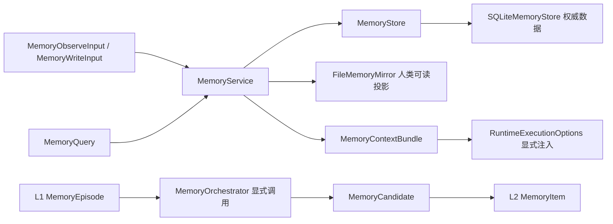

[English](README.en.md)

# `iris.memory`

`iris.memory` 是 Iris 的本地长期记忆 SDK：它定义隔离 scope、L1 episode、候选记忆、L2
长期条目、审计事件、SQLite 存储、文件镜像、显式编排和只读工具。SQLite 是权威数据源；
`.iris/memory/` 下的 Markdown/JSON 是便于人工查看的投影。

Memory 当前不是 `AgentConfig` 的 YAML 字段，也不会被 runtime 自动启用或自动召回。
调用方需要显式构造 `MemoryService`，注入 `AgentRunner.from_config*()`，并在每次运行的
`RuntimeExecutionOptions.memory_query` 或 `memory_results` 中选择要注入的内容。

## 运行要求与快速开始

本包随 Iris 安装，使用标准库 SQLite；FTS5 可用时用于检索，不可用或无 Unicode 命中时回退
到确定性的文本搜索。

```python
from pathlib import Path

from iris.memory import (
    MemoryConfig,
    MemoryQuery,
    MemoryScope,
    MemoryWriteInput,
    build_memory_service_from_config,
)

workspace = Path(".").resolve()
service = build_memory_service_from_config(
    MemoryConfig(backend="sqlite"),
    workspace,
)
assert service is not None

scope = MemoryScope(workspace_id=str(workspace), agent_id="notes-agent")
item = service.remember(
    MemoryWriteInput(
        scope=scope,
        text="用户偏好简洁中文回答",
        reason="用户显式说明",
    )
)
results = service.recall(MemoryQuery(scope=scope, text="回答偏好"))
bundle = service.build_context(
    MemoryQuery(scope=scope, text="回答偏好"),
    max_chars=1000,
)
```

`backend="none"` 返回 `None` 且不创建文件。memory root 和 database path 必须解析在调用方给定
的 workspace 内。

## 架构与数据流


```mermaid
flowchart LR
    Input["MemoryObserveInput / MemoryWriteInput"] --> Service["MemoryService"]
    Service --> Store["MemoryStore"]
    Store --> SQLite["SQLiteMemoryStore 权威数据"]
    Service --> Mirror["FileMemoryMirror 人类可读投影"]
    Episode["L1 MemoryEpisode"] --> Orchestrator["MemoryOrchestrator 显式调用"]
    Orchestrator --> Candidate["MemoryCandidate"]
    Candidate --> Item["L2 MemoryItem"]
    Query["MemoryQuery"] --> Service
    Service --> Context["MemoryContextBundle"]
    Context --> Runtime["RuntimeExecutionOptions 显式注入"]
```

### Scope 与隔离

`MemoryScope` 由 `workspace_id`、`agent_id`、`collection`、`visibility` 与可选
`session_id` 组成。`visibility=session` 必须提供 session ID；agent/workspace scope 会忽略
运行时 session，以保持跨会话可见。

`workspace_shared_scope(workspace_id)` 使用固定的 `agent_id="__workspace__"`、
`collection="shared"` 和 workspace 可见性。SQLite 的 get/list/search/update/delete 都执行
完整 scope 过滤；错误 scope 不会泄露条目是否存在。

### 记忆生命周期

- `observe()` 保存 L1 `MemoryEpisode` 与 `OBSERVE` 事件，不会直接创建长期条目。
- `remember()` 显式写入 L2 `MemoryItem` 与 `ADD` 事件。
- `recall()` 返回带排序分数和来源的 `MemorySearchResult`。
- `forget()` 使用 tombstone，不物理删除；默认查询不返回 deleted 条目。
- `MemoryOrchestrator.observe()` 通过可注入 extractor/classifier 生成候选。
- `process_candidates()` 才会按 policy 接受、拒绝或晋升候选；默认
  `NoOpMemoryExtractor` 不产生候选，也不存在后台自动提取。

候选晋升在 SQLite 中以单事务完成，重复晋升保持幂等；条目、候选和事件 ID 在所有 scope
中全局唯一。

### Context 注入

`MemoryContextBuilder` 保持检索顺序，在 `max_chars` 预算内生成
`MemoryContextBundle.fragments`，必要时只截断首个片段并记录 `omitted_count`。片段保留
category、kind、level、reason、confidence 和 importance，但不会把 store source 或检索
score 默认写进 prompt。

runtime 只有在调用方显式提供 memory 时才执行：

```python
from iris.harness import (
    AgentRunOptions,
    AgentRunRequest,
    AgentRunner,
    RuntimeExecutionOptions,
)

runner = AgentRunner.from_config_path(
    "agent.yaml",
    memory_service=service,
)
query = MemoryQuery(scope=scope, text="上次任务")
result = await runner.start(
    AgentRunRequest(input="继续上次任务"),
    options=AgentRunOptions(
        runtime=RuntimeExecutionOptions(memory_query=query.model_dump(mode="json"))
    ),
)
```

## 公开接口分组

`iris.memory` 顶层导出较大，按能力分为：

- 模型与枚举：`MemoryScope`、`MemoryEpisode`、`MemoryCandidate`、`MemoryItem`、
  `MemoryEvent`、`MemoryQuery`、`MemorySearchResult`、`MemoryContextBundle` 等；
- 服务与协议：`MemoryService`、`MemoryStore`、`SQLiteMemoryStore`；
- 配置：`MemoryConfig` 及其子配置、`build_memory_service_from_config()`、
  `resolve_memory_path()`；
- 编排：`MemoryExtractor`、`MemoryClassifier`、`MemoryPolicy`、`MemoryOrchestrator` 及默认
  rule/no-op 实现；
- 投影：`FileMemoryMirror`、`MemoryContextBuilder`；
- 工具：`MemorySearchTool`、`MemoryListTool`、`MemoryGetTool`、access policy factory 与
  `register_memory_tools()`。

完整导出集合以 `src/iris/memory/__init__.py` 的 `__all__` 为准。以下内部细节不构成推荐扩展
接口：SQLite 私有 SQL helper、mirror marker 格式和工具 payload helper。

## 只读 memory 工具

`register_memory_tools()` 只注册 `memory_search`、`memory_list` 与 `memory_get`，三者均为
`READ` 能力。当前没有模型可见的 remember/forget 工具；写入仍须通过 SDK 或上层策略显式完成。

工具输入不能覆盖 scope。`MemoryAccessPolicy` 由宿主上下文计算写 scope 与可读 scope；默认
可同时读取自身 scope 和约定的 workspace-shared scope，并按 item ID 去重。

## 文件镜像与持久化

`FileMemoryMirror.initialize_layout()` 创建固定的 `Memory.md`、User、Feedback、Reference、
Tasks、Sessions 等投影结构，不创建数据库。`MemoryService` 在成功写入 store 后同步镜像；
`rebuild_from_store()` 可按 scope 确定性重建 active 条目和最近 100 条事件。

镜像不是审计权威，也不应被当作反向导入源。SQLite 保存 episodes、items、candidates、events
以及可选 FTS index；每次操作使用短连接并把 JSON/SQLite 错误包装为 `IrisMemoryError`。

## 限制与非目标

- 不提供向量数据库、embedding、语义 reranker 或远程后端。
- 不自动从 session 消息提取记忆，不启动后台任务。
- `MemoryOrchestratorConfig.enabled` 目前只是配置形状，
  `build_memory_service_from_config()` 不会据此构造 orchestrator。
- `MemoryWritePolicyConfig` 只表达当前 `sdk_only` / `tombstone` 契约，不是通用策略引擎。
- `WorkingMemoryFrame` 是预留数据模型，当前 runtime active path 不消费它。
- `collection` 参与 SQLite 硬隔离，但当前不是独立的业务管理对象。

## 维护与验证

| 修改内容 | 主要位置 | 对应测试 |
| --- | --- | --- |
| SDK 生命周期、审计、scope 隔离、SQLite 搜索与 context 构建 | `models.py`, `service.py`, `sqlite.py`, `context.py` | `tests/memory/test_service.py` |
| runtime 显式注入 | `../runtime/runtime.py`, `../runtime/memory_context.py` | `tests/runtime/test_execute.py` |

`orchestrator.py`、`mirror.py` 和 `tools.py` 当前没有独立测试文件。

```bash
uv run pytest tests/memory/test_service.py tests/runtime/test_execute.py
uv run ruff check src/iris/memory tests/memory/test_service.py tests/runtime/test_execute.py
```
