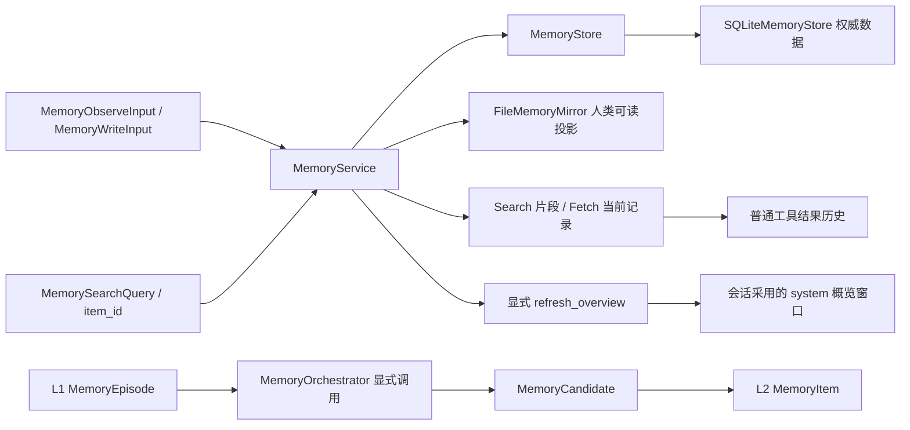

[English](README.en.md)

# `iris.memory`

`iris.memory` 是 Iris 的本地长期记忆 SDK：它定义项目内 namespace、L1 episode、候选记忆、L2
长期条目、审计事件、SQLite 存储、文件镜像、显式编排和记忆工具。SQLite 是权威数据源；
`.iris/memory/namespaces/` 下的 Markdown 是便于人工查看的分类投影。`MemoryService` 就是
记忆管理 SDK，统一提供读写、晋升、投影和显式概览入口。

`memory.enabled` 默认 false。开启后，Agent 自动获得 `memory_search`、`memory_fetch`，并在
新会话或成功压缩后采用已发布概览。模型根据概览和问题按需读取，普通 run 不会自动查询条目；
构建 Agent 不调用模型或生成概览。启用只需：

```yaml
memory:
  enabled: true
```

开启时，`AgentRunner.from_config*()` 注入的 `memory_service` 优先于配置构造的 SQLite 服务；
关闭时，即使注入了对象也不挂载、不调用或关闭它。CLI 与子 Agent 复用同一装配入口，子 Agent
使用自己的开关、读取范围和 effective workspace，不继承父 Agent 的 Service。
静态 `context.yaml` memory 槽位保持独立。

## 运行要求与快速开始

本包随 Iris 安装，使用标准库 SQLite 和 FTS5。FTS5 是唯一文本检索路径；初始化或查询错误
报告 `IrisMemoryError`，无命中返回空，不再降级为 LIKE。新库使用 schema version 4，旧版库
在初始化时明确拒绝，不自动迁移、覆盖版本或删除数据。

```python
from pathlib import Path

from iris.memory import (
    MemoryConfig,
    MemorySearchQuery,
    MemoryWriteInput,
    build_memory_service_from_config,
)

workspace = Path(".").resolve()
service = build_memory_service_from_config(
    MemoryConfig(enabled=True),
    workspace,
)
assert service is not None

item = service.remember(
    MemoryWriteInput(
        text="用户偏好简洁中文回答",
        reason="用户显式说明",
    )
)
response = service.search(MemorySearchQuery(query="回答偏好"), ["project"])
for hit in response.items:
    print(hit.snippet, hit.is_complete)
current = service.get_item(item.id, ["project"])
```

`build_memory_service_from_config(config, workspace_root, memory_service=...)` 是唯一来源解析入口：
关闭直接返回 `None`，不解析 memory 路径或创建文件；开启时原样返回注入对象，未注入才构造
SQLite 服务。注入对象的 store、mirror、provider/model 和 IO 模式保持不变。配置构造时，memory
root 和 database path 必须位于给定 workspace 内。由该工厂构造的 SQLite service 会让 async
读写在一个 worker job 中完成，包含连接、SQL 和结果组装；同步 `search()` 等 API 仍在调用线程执行。直接构造
`MemoryService` 或注入自定义 store 时默认 `MemoryIOExecutionMode.INLINE`，不会静默改变其
线程亲和性。独立 `MemoryService` 和低层工具注册 SDK 不受 Agent 开关控制。

## 架构与数据流


```mermaid
flowchart LR
    Input["MemoryObserveInput / MemoryWriteInput"] --> Service["MemoryService"]
    Service --> Store["MemoryStore"]
    Store --> SQLite["SQLiteMemoryStore 权威数据"]
    Service --> Mirror["FileMemoryMirror 人类可读投影"]
    Episode["L1 MemoryEpisode"] --> Orchestrator["MemoryOrchestrator 显式调用"]
    Orchestrator --> Candidate["MemoryCandidate"]
    Candidate --> Item["L2 MemoryItem"]
    Query["MemorySearchQuery / item_id"] --> Service
    Service --> Result["Search 片段 / Fetch 当前记录"]
    Service --> Overview["显式 refresh_overview"]
    Overview --> Window["会话采用的 system 概览窗口"]
    Result --> History["普通工具结果历史"]
```

### Namespace 与项目共享

每个 workspace 使用独立数据库/service，条目以普通字符串 `namespace` 分组，默认
`project`。同项目 Agent 读取同一空间即可共享资料；不再要求 Agent ID、session、visibility
等五个字段同时匹配。不同项目使用不同数据库。

`service.search(MemorySearchQuery(query="..."), ["project", "notes"])` 对多个空间做一次联合查询，
全局排序后取 limit。`get_item(item_id, namespaces)` 和 `list_items(namespaces)` 也接受联合
读取范围；写入、更新、删除和候选操作绑定单个 namespace。空读取集合不返回任何条目。

### 记忆生命周期

- `observe()` 保存 L1 `MemoryEpisode` 与 `OBSERVE` 事件，不会直接创建长期条目。
- `remember()` 显式写入 L2 `MemoryItem` 与 `ADD` 事件。
- `update(item_id, namespace, patch, reason=...)` 更新同一条目并记录 `UPDATE`，ID 保持不变。
- `search()` 返回 `MemorySearchResponse(items, has_more)`，每个命中只含定位字段和原文片段。
- `forget()` 使用 tombstone，不物理删除；默认查询不返回 deleted 条目。
- `MemoryOrchestrator.observe()` 通过可注入 extractor/classifier 生成候选。
- `process_candidates()` 才会按 policy 接受、拒绝或晋升候选；默认
  `NoOpMemoryExtractor` 不产生候选，也不存在后台自动提取。

部分更新中，省略字段表示不修改；`confidence` / `importance` 可用 `null` 清空，
artifacts / metadata 用 `[]` / `{}` 清空。正文、分类、状态和集合字段不接受显式 `null`。

候选晋升在 SQLite 中先取得 `BEGIN IMMEDIATE` 写事务，再读取候选状态；并发或重复晋升
返回同一条目，只写入一组新增和接受事件。更新和软删除也在读取当前条目前取得写锁，避免
旧快照覆盖并发更新或重复记录实际删除。不同连接对同一条目不同字段的修改会依次合并。
条目、候选和事件 ID 在同库所有 namespace
中全局唯一。

`process_candidates()` 每批只为当前 namespace 重建一次镜像。`MemoryService.promote_candidates()`
接收 namespace 与按顺序提供 `(candidate_id, kind, reason)` 的 iterable，仍逐项调用 store 的原子
晋升；后续候选或策略失败时，已成功提交的条目会在异常传播前统一刷新。空批次不重建镜像，
单条 `promote_candidate()` 仍在返回前刷新。

### System 概览窗口

runtime 在会话首次输入和成功压缩时读取已发布概览，选择完整“核心事实＋知识范围”或仅知识
范围，原子保存为会话窗口。工具循环、新 run、HITL 和恢复沿用已采用窗口；失败的压缩不会
切换它。概览保存在 system 中，Search/Fetch 的结果作为普通工具历史保存。

全部 namespace 的概览、警告、工具指引和包装共同受
`floor(compaction.input_budget_tokens * memory.overview.system_budget_ratio)` 约束，默认比例
为 `0.02`。完整内容放不下时使用完整知识范围；知识范围仍超预算则报容量错误，不切断主题。
窗口选择使用实际请求的 token 估算，并保留完整 system 的字符上限。

模型指引将概览未提及的主题默认视为不存在，不查询这些主题。没有概览时正常聊天，但本窗口
暂不使用长期记忆。新主题须先由宿主显式生成概览，再在新会话或成功压缩后采用；已有主题
仍可查询数据库中的最新条目。主题约束由模型遵循，数据库不增加主题拦截，也不要求每次
Search 都继续 Fetch。更新或忘记条目不会回写已经保存的会话历史。

开关在构建 Agent 时确定，不支持同会话热切换。修改配置后重建 Agent 并开始新会话；关闭时
不会追加已存窗口里的概览 addendum，也不会删除窗口、数据库、概览文件或历史工具结果。
静态 memory、普通历史和摘要保持原样；正常成功压缩仍可提交空概览窗口。重新开启后复用旧
session 不会强制刷新已采用概览，需要当前概览时开始新会话。

## 显式生成概览

宿主可显式调用 `await service.refresh_overview(namespace)`，把该 namespace 的全部 active L2
条目按 category/kind 组织，一次生成“核心事实＋知识范围”，发布到正式目录的 `Memory.md`。
生成依赖由构造器的 `overview_provider`、`overview_model` 和 `overview_config` 绑定；provider
遵循 `iris.providers.CompletionProvider`。配置构造的 Agent 使用已解析的主模型 provider，
显式注入的 service 则保留宿主原配置。构造、聊天、写入、读取都不会自动生成概览。

```python
# service 已通过构造器配置概览 provider/model。
result = await service.refresh_overview("project")
documents = await service.aload_overviews(["project"])
```

`MemoryOverviewConfig` 的生成输入预算为 96,000 tokens、输出为 4,096 tokens。完整输入超预算
就报错，不截断或分批摘要。模型只返回含 `core_facts`、`knowledge_scope` 的 JSON：前者允许
为空，后者必须非空。只有正常完成并解析成功的结果才发布；异常、截断或文件写失败保留旧文件，
已知模型 usage 留在错误上下文中。空 active L2 快照不调用模型，直接发布“当前无记忆”。

生成期间不持发布锁；发布前在短锁中比较来源版本，较旧生成不能覆盖较新概览。条目后来变化
但尚无较新概览时，结果可发布并标为陈旧。`load_overviews/aload_overviews` 只读取完整新格式；
旧格式要求显式 refresh，缺文件只返回“尚未生成概览，知识范围未知”，不扫描条目补目录。
`MemoryOverviewDocument.navigation` 表示知识范围节。无 mirror 的直接 SDK 返回空 documents，
refresh 报生成依赖未配置。

概览生成预算独立于主请求窗口预算；`system_budget_ratio=0.02` 用于上述 system 窗口选择。

历次检索、文件读取和 Search/Fetch 方案的效果与成本见
[Memory 选型实验对比](../../../docs/memory-system-evaluation.md)。当前采用 G 的必要词组能力，
继续复用 SQLite FTS，不引入向量库等重组件。

## 公开接口分组

- 输入与结果：[MemorySearchQuery、MemorySearchHit、MemorySearchResponse](models.py)，以及
  `MemoryEpisode`、`MemoryCandidate`、`MemoryItem`、`MemoryEvent` 和写入/更新模型。
- 服务与存储：[MemoryService](service.py)、[MemoryStore](store.py)、[SQLiteMemoryStore](sqlite.py)。
  同步 `search/get_item/list_items` 保留 SDK 管理读取；`asearch/aget_item/alist_items` 是完整操作
  的 async 适配。写入、事件读取与提炼 SDK 继续可用。
- 概览：`MemoryOverviewConfig/Content/Document/GenerationResult`，以及
  `refresh_overview()`、`load_overviews()`、`aload_overviews()`。
- 配置：[MemoryConfig](config.py)、`build_memory_service_from_config()`、`resolve_memory_path()`。
- 显式提炼：[MemoryOrchestrator](orchestrator.py)、extractor/classifier/policy 及 rule/no-op 实现。
- 文件投影：[FileMemoryMirror](mirror.py)、[MemoryFileAccess](files.py)。
- 工具：[Search/Fetch 与 Remember/Update/Forget](tools.py)、访问策略工厂和显式注册函数。

完整导出以 [__all__](__init__.py) 为准。私有 SQL、词法和 payload helper 不构成 SDK 扩展协议。

### 普通文本检索

```python
query = MemorySearchQuery(
    query="中文回答偏好",
    required_terms=["中文"],
    categories=["user", "feedback"],
    kinds=["preference", "correction"],
    limit=8,
)
response = await service.asearch(query, ["project"])
```

`query` 必填；`required_terms` 默认空，表示不额外要求正文词组；categories/kinds 默认空，表示
不限制该维度；limit 默认为 8，范围 `1..100`。
未知字段报错，模型输入中没有 namespace。store 先按允许 namespace、category/kind 和 active
状态过滤，再按 BM25 升序、updated_at/id 降序取 `limit + 1`，只返回前 limit 条并计算
`has_more`。同一维度的过滤值为 OR，不同维度为 AND。索引只包含 `MemoryItem.text`；active
L1/L2 item 均可搜索，episode、未晋升 candidate、deleted/superseded 不进入结果。

索引、查询和原文定位共用词法：ASCII 字母数字连续串小写化，连续中文取相邻双字，仅孤立
汉字保留单字；标点和下划线分隔词项。查询词项按首次出现顺序去重，以字面量 OR 检索，
不截断 query、不设置词项预算；索引保留完整词项频次。空文本、零词项、无命中或空范围
返回 `MemorySearchResponse((), False)`，不会返回最近条目。

`required_terms` 由模型或 SDK 显式指定，同一条正文必须同时匹配普通 query 的 OR 组与每个
必要词组。每个词组用同一词法转成有序相邻的 FTS phrase，内部不去重。例如：

```text
query="回滚 阈值", required_terms=["澄港", "账单导出"]
→ ("回滚" OR "阈值") AND "澄港" AND "账单 单导 导出"
```

词组之间没有顺序或距离要求；词组内部保留顺序与重复词，如 `go go` 必须有两个连续的 `go`。
这是分词后的匹配，不是逐字子串匹配：英文大小写不影响结果，中文标点可能改变双字词序列，
所以“账单-导出”不等同于“账单导出”。必要词组不引入 64/128 词项上限；空白、纯标点等无法
产生索引词的条件在 `MemorySearchQuery` 校验时报错。普通 query 没有可索引词时仍返回空，
不支持只给必要词组浏览条目。条件不匹配时不会自动去掉它们或回退；是否调整由调用者决定。
这复用现有 FTS5 索引，不增加 schema 版本或索引迁移。category/kind 是存储标签，只在已知时
筛选；正文提及某个名称也不代表其中事实适用于该对象，使用前仍需核对。

命中只含 `item_id/namespace/category/kind/snippet/is_complete`。正文不超过 300 个 Python
Unicode 字符时全文返回；超过时取首个匹配词起点 h，用
`start=max(0,min(h-150,len(text)-300))` 返回连续 300 字符原文，不加省略号或高亮。
`is_complete` 仅说明正文是否完整，不代表命中已经核实。不同 ID 的相同正文分别保留。
片段位置仍由普通 query 的首个命中词确定，必要词组可能在片段之外；需要其他正文时可 Fetch。

## Memory 工具

Agent 开启 memory 后自动按 Search、Fetch 的顺序注册两个 `READ` 工具。无需在
`tools.builtin` 声明它们；手写 `memory.search` 或 `memory.fetch` 会在 registry 装配时报
`IrisConfigError`，提示改用 `memory.enabled`。旧 `memory.backend` 字段在配置解析时拒绝。
`include_tools=False` 仍会让当前请求不发送工具 schema，概览指引也按实际可用工具生成。

低层 `register_memory_tools()` 仍默认空，SDK 可显式选择 `memory.search/fetch`；退出的是
Agent 手工读声明。Search 直接使用 `MemorySearchQuery` 作为工具输入，返回 `items` 和
`has_more`；仅有更多候选时附提示“还有候选；这不要求继续查询。”。片段足以回答时停止查询，
仅在必要信息仍缺失时补查；没有新线索时不只换措辞反复搜索。

Fetch 输入只有非空白 `item_id`，可直接读取已知 ID，不要求先 Search。它调用当前
`aget_item()` 并返回 `{"item": item.model_dump(mode="json")}` 的完整记录，包括正文、来源、
metadata、artifacts 引用和全部状态/时间字段；不会读取附件内容。缺失、非 active 或范围外
条目报告“允许读取范围内未找到有效记忆”。连续 Fetch 不去重；Search 后修改条目再 Fetch
会得到新版。输出仍受普通 `max_result_chars=50000` 和 ToolExecutor artifact 机制约束。

需要写入的 Agent 显式声明 `memory.remember/memory.update/memory.forget`，对应
`memory_remember/memory_update/memory_forget`，沿用 `WRITE` 权限、claim 和结果提交路径。
写工具要求 Agent 已开启 memory，并共享同一 service；开启不会自动注册写工具。
forget 返回是否实际完成软删除，镜像未同步时保留数据库成功结果并附 warning。例如：

```yaml
memory:
  enabled: true
  read_namespaces: [project, notes]
  write_namespace: project
tools:
  builtin: [memory.remember]
```

`MemoryAccessPolicy(read_namespaces=[...], write_namespace=...)` 由宿主绑定读写范围，默认
`project`。工厂在每次工具执行时调用，工具参数不能覆盖 namespace。策略计算留在 event loop，
THREAD 模式下数据库操作通过 service 的一次完整 worker job 执行。SDK 可用
`register_memory_tools(..., tool_names=("memory.search", "memory.fetch"))` 选择 builtin 名称。

## 文件镜像与持久化

`FileMemoryMirror.initialize_layout()` 只创建目录。正式正文位于
`namespaces/ns_<namespace 的 UTF-8 base64url 编码>/`，覆盖 User、Feedback、Reference、
Tasks、Sessions 分类文件。它不创建 `Memory.md`；旧根目录文件保留原状。

每条内容先完整呈现原始 Markdown，再以 `<details>` 折叠展示 ID、来源、时间和其余元数据。
这些文件只用于人工浏览，不承担条目解析或反向导入协议。数据库写入后，service 调用
`rebuild_from_store()`，在 `publish_projection()` 的短写事务内读取完整 active L2 快照，
逐文件原子替换后推进 `projection_revision`。episodes、candidates 和事件仍在 SQLite，
不追加事件镜像。

`item_revision` 随影响 active L2 的实质变更推进，空 patch 不更新正文、事件或版本。
条目、FTS、事件、候选晋升和 revision 使用同一 mutation 事务。所有分类文件成功发布后，
`projection_revision` 才追上条目版本；部分文件失败时数据库结果仍成功，版本差异表明投影
未完整同步。写工具结果附带 warning；通用文件工具通过 `MemoryFileAccess` 读取正式路径和
实际文件来源版本，报告陈旧/未同步状态。数据库检索不依赖镜像发布成功。
显式重建失败仍抛错，不启动后台重试。配置构造的 SQLite service 总是自动维护分类镜像；
直接构造 SDK service 时可以不传 mirror。

镜像不是审计权威，也不应被当作反向导入源。SQLite 保存 episodes、items、candidates、events
以及 FTS index；每次操作使用短连接并把 JSON/SQLite 错误包装为 `IrisMemoryError`。
索引保留全部状态，Search 和 Fetch 只返回 active；管理 SDK 的
`store.list_items(..., include_deleted=True)` 可检查软删除记录。新增/更新与索引在同一事务内
完成，`rebuild_index()` 可从权威表重建。
公开 store 的 `list_items()`、`list_events()` 与 `list_candidates()` 对非 `1..100` 的 limit
直接抛出 `IrisMemoryError`，不再静默截断；仅 `list_items(limit=None)` 表示完整 mirror 投影。

## 限制与非目标

- 不提供向量数据库、embedding、语义 reranker 或远程后端。
- 不自动从 session 消息提取记忆，不启动后台任务。
- namespace 只是库内分组，不另建空间管理服务；不同项目不混在同一个库中。

## 维护与验证

| 修改内容 | 主要位置 | 对应测试 |
| --- | --- | --- |
| SDK 生命周期、namespace 范围和搜索结果 | `models.py`, `service.py`, `sqlite.py` | `tests/memory/test_service.py` |
| 并发晋升、字段更新、FTS 完整性与搜索过滤 | `sqlite.py`, `_query.py` | `tests/memory/test_sqlite_consistency.py` |
| async IO、工具联合读取、查询词法与计划 | `service.py`, `tools.py`, `sqlite.py`, `_query.py` | `tests/memory/test_async_io.py`, `tests/memory/test_tools.py`, `tests/memory/test_query.py`, `tests/memory/test_search.py`, `tests/memory/test_sqlite_query_plan.py` |
| namespace 完整快照、投影版本与原子替换 | `mirror.py`, `files.py`, `sqlite.py` | `tests/memory/test_mirror.py`, `tests/memory/test_revisions.py` |
| 显式概览生成、读回与版本发布 | `overview.py`, `service.py`, `mirror.py` | `tests/memory/test_overview.py`, `tests/memory/test_async_io.py` |
| 候选批次晋升与部分失败刷新 | `orchestrator.py`, `service.py` | `tests/memory/test_orchestrator.py` |
| 概览窗口采用、压缩与恢复 | `../runtime/runtime.py`, `../runtime/memory_context.py` | `tests/harness/test_auto_memory.py`, `tests/harness/test_runner_memory.py`, `tests/runtime/test_memory_context.py` |

在仓库根目录按本次变更选择精准测试；每次使用新的 basetemp：

```powershell
$env:UV_CACHE_DIR = "$PWD\tmp\uv-cache"
$memoryTestTemp = "$PWD\tmp\pytest-memory-$((Get-Date).ToString('yyyyMMdd-HHmmss-fff'))"
uv run pytest tests/memory -p no:cacheprovider --basetemp="$memoryTestTemp"
uv run ruff check src/iris/memory tests/memory
```
