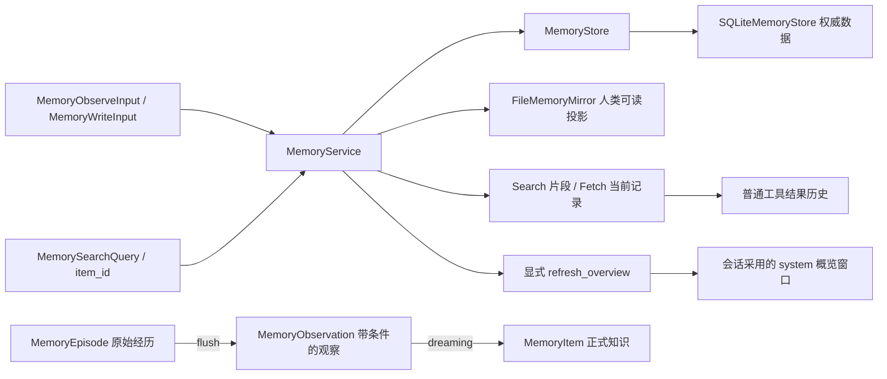

[English](README.en.md)

# `iris.memory`

`iris.memory` 是 Iris 的本地长期记忆 SDK：它定义项目内 namespace、不可变 Episode、带证据的
Observation、正式 MemoryItem、变更事件、SQLite 存储、文件镜像、生成阶段和记忆工具。SQLite 是权威数据源；
`.iris/memory/namespaces/` 下的 Markdown 是便于人工查看的分类投影。`MemoryService` 就是
记忆管理 SDK，统一提供读写、flush、dreaming、投影和概览入口。

`memory.enabled` 默认 false。开启后，Agent 自动获得 `memory_search`、`memory_fetch`，并在
新会话或成功压缩后采用已发布概览。模型根据概览和问题按需读取，普通 run 不会自动查询条目；
构建 Agent 不调用模型或生成概览。启用只需：

```yaml
memory:
  enabled: true
```

开启时，`AgentRunner.from_config*()` 注入的 `memory_service` 优先于配置构造的 SQLite 服务；
关闭时，即使注入了对象也不挂载、不调用或关闭它。CLI 与子 Agent 复用同一装配入口，子 Agent
使用自己的开关、读取范围和 effective workspace，不继承父 Agent 的 Service。
静态 `context.yaml` memory 槽位保持独立。

## 运行要求与快速开始

本包随 Iris 安装，使用标准库 SQLite 和 FTS5。FTS5 是唯一文本检索路径；初始化或查询错误
报告 `IrisMemoryError`，无命中返回空，不再降级为 LIKE。新库使用 schema version 5，旧版库
在初始化时明确拒绝，不自动迁移、覆盖版本或删除数据。

```python
from pathlib import Path

from iris.memory import (
    MemoryConfig,
    MemorySearchQuery,
    MemoryWriteInput,
    build_memory_service_from_config,
)

workspace = Path(".").resolve()
service = build_memory_service_from_config(
    MemoryConfig(enabled=True),
    workspace,
)
assert service is not None

item = service.remember(
    MemoryWriteInput(
        text="用户偏好简洁中文回答",
        reason="用户显式说明",
    )
)
response = service.search(MemorySearchQuery(query="回答偏好"), ["project"])
for hit in response.items:
    print(hit.snippet, hit.is_complete)
current = service.get_item(item.id, ["project"])
```

`build_memory_service_from_config(config, workspace_root, memory_service=...)` 是唯一来源解析入口：
关闭直接返回 `None`，不解析 memory 路径或创建文件；开启时原样返回注入对象，未注入才构造
SQLite 服务。注入对象的 store、mirror、provider/model 和 IO 模式保持不变。配置构造时，memory
root 和 database path 必须位于给定 workspace 内。配置创建的 SQLite 服务使用
`MemoryIOExecutionMode.THREAD`；直接构造 `MemoryService` 默认 `INLINE`，保留宿主的线程选择。
THREAD 的 async 读写每次以一个完整作业完成连接、SQL 和结果组装；同步 `search()` 等 API
仍在调用线程执行。自定义 store 和同步 token 估算器只有在支持跨线程调用时才显式选择 THREAD。
INLINE 的同步操作仍会占用事件循环，后台维护不会覆盖这个选择。
独立 `MemoryService` 和低层工具注册 SDK 不受 Agent 开关控制。

## 架构与数据流


```mermaid
flowchart LR
    Input["MemoryObserveInput / MemoryWriteInput"] --> Service["MemoryService"]
    Service --> Store["MemoryStore"]
    Store --> SQLite["SQLiteMemoryStore 权威数据"]
    Service --> Mirror["FileMemoryMirror 人类可读投影"]
    Episode["MemoryEpisode 原始经历"] -->|flush| Observation["MemoryObservation 带条件的观察"]
    Observation -->|dreaming| Item["MemoryItem 正式知识"]
    Query["MemorySearchQuery / item_id"] --> Service
    Service --> Result["Search 片段 / Fetch 当前记录"]
    Service --> Overview["显式 refresh_overview"]
    Overview --> Window["会话采用的 system 概览窗口"]
    Result --> History["普通工具结果历史"]
```

### Namespace 与项目共享

每个 workspace 使用独立数据库/service，条目以普通字符串 `namespace` 分组，默认
`project`。同项目 Agent 读取同一空间即可共享资料；不再要求 Agent ID、session、visibility
等五个字段同时匹配。不同项目使用不同数据库。

`service.search(MemorySearchQuery(query="..."), ["project", "notes"])` 对多个空间做一次联合查询，
全局排序后取 limit。`get_item(item_id, namespaces)` 和 `list_items(namespaces)` 也接受联合
读取范围；写入、更新、删除和生成操作绑定单个 namespace。空读取集合不返回任何条目。

### 记忆生命周期

- `observe()` 保存不可变 `MemoryEpisode` 与 `OBSERVE` 事件，不会直接创建长期条目。
- `await flush()` 将原文片段提炼为带证据和适用条件的 `MemoryObservation`，同步推进原文游标。
- `await dream()` 将观察和显式改动整理为正式 `MemoryItem`，可以新增、修改、合并、退役或补充支持。
- `remember()` 显式写入正式 `MemoryItem` 与 `ADD` 事件，不要求先执行提取。
- `update(item_id, namespace, patch, reason=...)` 更新同一条目并记录 `UPDATE`，ID 保持不变。
- `search()` 返回 `MemorySearchResponse(items, has_more)`，每个命中只含定位字段和原文片段。
- `forget()` 使用 tombstone，不物理删除；默认查询不返回 deleted 条目。

Episode 保存具有稳定 ID 的 `records`，原文与 Observation 不随整理而改写；flush 位置和观察的
处理状态由 store 单独保存。Observation 的适用条件帮助 dreaming 判断，正式 Item 正文包含使用
该知识所需的条件。Search/Fetch 和概览只读取 active Item，不读取 Episode 或 Observation。

Flush 先筛选对未来有用的信息，保留偏好、纠正、项目约定、可复用经验和重要待办状态；普通闲聊、
操作流水和无后续价值的临时要求可以不生成观察。Dreaming 用带角色、时间、元数据的原始证据核对
提炼稿，再去重、合并为简洁条目。正文允许省略次要细节，只保留防止误用的必要对象和条件；日期、
版本、来源经过与未执行方案按需保留，完整经历通过证据回查。
压缩不得补造事实或增强结论：单次经历不自动成为通用规律，明确默认偏好按声明范围保留，未验证
不写成无效。用户明确要求记录的细节仍需保留；`reason` 只简述保存或整理用途。
这些是模型的生成要求；JSON schema 校验只检查结构与字段约束，不证明正文的推论成立。

Flush/Dream 的指令分别在 [`memory_flush.j2`](../prompts/memory_flush.j2) 和
[`memory_dream.j2`](../prompts/memory_dream.j2) 中维护。`MemoryService.prompt_renderer` 持有
独立的 `iris.utils.TemplateRenderer`，Python 负责准备 schema 和输入数据，模板保留 JSON
中的引号与 `<>&` 原文。模板读取或渲染失败转换为 `IrisMemoryError`。

Flush/dream 请求使用 `temperature=0` 和 `response_format={"type": "json_object"}`，生成 provider
须支持这两个参数。JSON 输出模式约束响应格式，字段与证据引用仍在既有解析边界检查；不合契约
的响应不提交，已保存原文仍可重试。低随机性和原文核对都不能保证语义一定正确。

`MemoryEvidenceRef` 指向 Episode 内的记录片段或真实显式写入事件。Item 的 `evidence` 表示
当前正文的支持依据；Observation 的处理结果与 MemoryEvent 保留历史解释。显式修改正文时，
本次写入事件及本次明确提供的证据替换旧的当前支持；仅改分类或 metadata 时保留原支持。
写工具记录真实 Agent 和 call ID，不将 Agent 写入声明标为用户确认。

部分更新中，省略字段表示不修改，artifacts / metadata 用 `[]` / `{}` 清空；所有 patch 字段
不接受显式 `null`。更新和软删除在读取当前条目前取得 `BEGIN IMMEDIATE` 写锁；正文、当前
证据、事件、待整理改动和 revision 同事务提交。不同连接对同一条目不同字段的修改依次合并。

Flush 原子提交观察和原文进度；空提取也推进已处理区间。Dreaming 在同一快照中读取固定输入、
关联条目与纠正，模型调用位于事务外，提交时比较 revision 并一次应用整批操作及输入处理结果。
Flush 请求每个 Episode 只发送一次来源信息与已知的 run outcome，原文片段用短标签关联；
持久 Episode/Record ID、消息边界计数及块序号留在程序内，工具状态与明确的记忆目标仍提供给模型。
发给模型的是精简投影：观察和相关条目的判断字段、事件的实际字段变化、短证据标签及原文。
Episode/Record/Event 的持久定位由程序保留；原文分组与字符区间帮助模型识别重叠证据。
冲突不消费输入，容量阻塞保留待重试状态。`generation_state()` 可读取积压、阻塞数量与阶段结果。
模型依赖通过 `generation_provider`、`generation_model` 和 `generation_config` 绑定；独立 SDK
可显式 `await service.flush("project")`、`await service.dream("project")`。

### 自动生成与后台生命周期

仅开启读取不会产生生成费用。需要自动生成时显式配置：

```yaml
memory:
  enabled: true
  write_namespace: project
  generation:
    enabled: true
    idle_seconds: 300
```

`generation.enabled` 默认 false。配置构造的服务复用 Agent 已解析的 provider/model，
无需另一套凭据。注入服务保留自己的生成依赖和预算；自动运行要求 generation provider/model、
overview provider/model 和 mirror 均已绑定，否则构造 runner 时报告 `IrisConfigError`。

`AgentRunner` 为 root run 管理唯一后台维护任务。admission 成功后、第一条新原文提交前登记
来源；真实压缩和运行边界捕获新增已提交消息。持续运行的 activation 或 admission 会阻止模型维护；
它们全部退出且安静达到 `idle_seconds` 后，处理观察、flush 新经历、dreaming 并发布概览。
新前台输入取消未提交的生成；已经派发的短数据库提交完整收口。`aclose()` 补捕获并等待真实 IO
完成，保留未处理材料供下次启动。没有轮询、外部 cron 或独立 daemon。

自动维护为 THREAD 服务持有独立的单线程 worker，只有维护 task 的同步工作进入该队列：
后台 IO、提示词模板渲染、flush 选材、dream/overview 请求构造、token 估算和响应解析。前台读写、来源登记和
Capture 仍走原执行路径，不排在后台计算后面；独立 SDK 调用也不隐式创建维护 worker。
`provider.complete()` 保持在当前事件循环异步调用。取消不强杀线程；选材在记录边界检查
取消，旧同步作业实际退出前不启动下一轮维护，迟到结果不发起后续模型请求或提交。
关闭等待真实 IO 和计算完成，然后释放维护 worker。
Capture 每页最多 128 条消息，页间让出事件循环；游标到达完整终点才封源。SQLite 原始行
读取后释放事务和 lifecycle 锁，再解码消息。来源登记和返回前 Capture 仍等待持久化；
专用 worker 隔离后台队列，不消除数据库锁和 CPU 竞争，也不承诺前台零额外延迟。

SQLite lifecycle 用持久 source UUID 和本 run 消息范围补捕获，fork 继承前缀不重新学习；
InMemory lifecycle 只能恢复已写入 memory 库的材料。child 不自动收集内部轨迹，仍可读取和显式写入。
BCI、reasoning 和记忆读回正文不作为新证据；观察引用具体原文记录及半开字符区间。
自动采集的 Episode 以顶层 `source_id` 保存 run ID，metadata 保存 lifecycle 来源 ID；
待处理经历读取用这两个字段关联来源的最终 outcome。

默认 flush/dream 输入预算各为 32,000 tokens，输出各为 4,000 tokens。可在 `generation` 下设置
`flush_input_budget_tokens`、`flush_output_budget_tokens`、`dream_input_budget_tokens`、
`dream_output_budget_tokens`。长记录按固定片段消费；dream 以完整比较材料包为单位，放不下则
保留 blocked 并继续无关输入。依赖知识更新、重建 Agent 后预算改变或显式
`await service.dream(namespace, retry_blocked=True)` 才重新评估受阻输入。

模型失败后等待下一次活动或重启，不紧密重试。已消费输入不会因投影失败而重新生成；后续维护
按 projection revision 补分类文件、按 overview revision 补概览。维护用量保存在独立
`GenerationResult` 中，不计入主 run 的 model steps 或 usage。`generation_state(namespace)` /
`await ageneration_state(namespace)` 返回 pending/blocked 数量、正式/投影/概览版本及每阶段最近结果。
Flush 结果的 `consumed_ranges` 给出实际提交的原文区间。
Dream 结果包含各操作数量、`processed_observations`、`processed_changes` 与 `unchanged`；
后者统计归入未新增/改写/合并/删除条目的输入数量，补充证据也属于不改正文。

独立 SDK 可手动运行各阶段，阶段调用不要求开启 Agent 自动开关或配置 mirror：

```python
from pathlib import Path
from iris.memory import MemoryObserveInput, MemoryService, SQLiteMemoryStore

service = MemoryService(
    SQLiteMemoryStore(Path("memory.db")),
    generation_provider=provider,  # 应用已配置的 CompletionProvider
    generation_model="your-model",
)
service.observe(MemoryObserveInput(text="这个项目以后统一使用 uv 管理依赖。"))
flushed = await service.flush("project")
dreamed = await service.dream("project")
state = service.generation_state("project")
```

每次 flush/dream 处理一批；`has_more` 表示该阶段仍有 pending 输入。`dream()` 不隐式调用 flush，
显式 `refresh_overview()` 仍需配置 overview provider/model 与 mirror。后台发布新概览不会热更新
已采用的会话窗口，仍只在新会话或成功压缩时采用。

### System 概览窗口

runtime 在会话首次输入和成功压缩时读取已发布概览，选择完整“核心事实＋知识范围”或仅知识
范围，原子保存为会话窗口。工具循环、新 run、HITL 和恢复沿用已采用窗口；失败的压缩不会
切换它。概览保存在 system 中，Search/Fetch 的结果作为普通工具历史保存。

全部 namespace 的概览、警告、工具指引和包装共同受
`floor(compaction.input_budget_tokens * memory.overview.system_budget_ratio)` 约束，默认比例
为 `0.02`。完整内容放不下时使用完整知识范围；知识范围仍超预算则报容量错误，不切断主题。
窗口选择使用实际请求的 token 估算，并保留完整 system 的字符上限。

模型指引将概览未提及的主题默认视为不存在，不查询这些主题。没有概览时正常聊天，但本窗口
暂不使用长期记忆。新主题须先发布新概览，再在新会话或成功压缩后采用；已有主题
仍可查询数据库中的最新条目。主题约束由模型遵循，数据库不增加主题拦截，也不要求每次
Search 都继续 Fetch。更新或忘记条目不会回写已经保存的会话历史。

开关在构建 Agent 时确定，不支持同会话热切换。修改配置后重建 Agent 并开始新会话；关闭时
不会追加已存窗口里的概览 addendum，也不会删除窗口、数据库、概览文件或历史工具结果。
静态 memory、普通历史和摘要保持原样；正常成功压缩仍可提交空概览窗口。重新开启后复用旧
session 不会强制刷新已采用概览，需要当前概览时开始新会话。

## 显式生成概览

宿主可显式调用 `await service.refresh_overview(namespace)`，把该 namespace 的全部 active 正式
条目按 category/kind 组织，一次生成“核心事实＋知识范围”，发布到正式目录的 `Memory.md`。
生成依赖由构造器的 `overview_provider`、`overview_model` 和 `overview_config` 绑定；provider
遵循 `iris.providers.CompletionProvider`。配置构造的 Agent 使用已解析的主模型 provider，
显式注入的 service 则保留宿主原配置。构造和读取不调用模型；自动生成由可选的 runner 维护负责。

概览生成指令在 [`memory_overview.j2`](../prompts/memory_overview.j2) 中维护，也通过该 service
的 `prompt_renderer` 读取。修改指令无需调整 Python 的快照准备、预算或响应解析逻辑。

```python
# service 已通过构造器配置概览 provider/model。
result = await service.refresh_overview("project")
documents = await service.aload_overviews(["project"])
```

`MemoryOverviewConfig` 的生成输入预算为 96,000 tokens、输出为 4,096 tokens。完整输入超预算
就报错，不截断或分批摘要。模型只返回含 `core_facts`、`knowledge_scope` 的 JSON：前者允许
为空，后者必须非空。只有正常完成并解析成功的结果才发布；异常、截断或文件写失败保留旧文件，
已知模型 usage 留在错误上下文中。空 active Item 快照不调用模型，直接发布“当前无记忆”。
概览成功、失败或取消均记录独立 `GenerationResult`，保存已知用量和发布结果，可通过
`generation_state()` 查看。

生成期间不持发布锁；发布前在短锁中比较来源版本，较旧生成不能覆盖较新概览。条目后来变化
但尚无较新概览时，结果可发布并标为陈旧。`load_overviews/aload_overviews` 只读取完整新格式；
旧格式要求显式 refresh，缺文件只返回“尚未生成概览，知识范围未知”，不扫描条目补目录。
`MemoryOverviewDocument.navigation` 表示知识范围节。无 mirror 的直接 SDK 返回空 documents，
refresh 报生成依赖未配置。

概览生成预算独立于主请求窗口预算；`system_budget_ratio=0.02` 用于上述 system 窗口选择。

历次检索、文件读取和 Search/Fetch 方案的效果与成本见
[Memory 选型实验对比](../../../docs/memory-system-evaluation.md)。当前采用 G 的必要词组能力，
继续复用 SQLite FTS，不引入向量库等重组件。

## 公开接口分组

- 输入与结果：[MemorySearchQuery、MemorySearchHit、MemorySearchResponse](models.py)，以及
  `MemoryEpisode`、`MemoryRecord`、`MemoryObservation`、`MemoryItem`、`MemoryEvidenceRef`、`MemoryEvent`。
- 服务与存储：[MemoryService](service.py)、[MemoryStore](store.py)、[SQLiteMemoryStore](sqlite.py)。
  同步 `search/get_item/list_items` 保留 SDK 管理读取；`asearch/aget_item/alist_items` 是完整操作
  的 async 适配。写入、事件读取与提炼 SDK 继续可用。
- 概览：`MemoryOverviewConfig/Content/Document/GenerationResult`，以及
  `refresh_overview()`、`load_overviews()`、`aload_overviews()`。
- 配置：[MemoryConfig](config.py)、`build_memory_service_from_config()`、`resolve_memory_path()`。
- 生成：[flush / dream](generation.py)、[阶段模型与配置](generation_models.py)，以及 `generation_state()`。
- 文件投影：[FileMemoryMirror](mirror.py)、[MemoryFileAccess](files.py)。
- 工具：[Search/Fetch 与 Remember/Update/Forget](tools.py)、访问策略工厂和显式注册函数。

完整导出以 [__all__](__init__.py) 为准。私有 SQL、词法和 payload helper 不构成 SDK 扩展协议。

### 普通文本检索

```python
query = MemorySearchQuery(
    query="中文回答偏好",
    required_terms=["中文"],
    categories=["user", "feedback"],
    kinds=["preference", "correction"],
    limit=8,
)
response = await service.asearch(query, ["project"])
```

`query` 必填；`required_terms` 默认空，表示不额外要求正文词组；categories/kinds 默认空，表示
不限制该维度；limit 默认为 8，范围 `1..100`。
未知字段报错，模型输入中没有 namespace。store 先按允许 namespace、category/kind 和 active
状态过滤，再按 BM25 升序、updated_at/id 降序取 `limit + 1`，只返回前 limit 条并计算
`has_more`。同一维度的过滤值为 OR，不同维度为 AND。索引只包含 `MemoryItem.text`；active
Item 均可搜索，Episode、Observation、deleted/superseded 不进入结果。

索引、查询和原文定位共用词法：ASCII 字母数字连续串小写化，连续中文取相邻双字，仅孤立
汉字保留单字；标点和下划线分隔词项。查询词项按首次出现顺序去重，以字面量 OR 检索，
不截断 query、不设置词项预算；索引保留完整词项频次。空文本、零词项、无命中或空范围
返回 `MemorySearchResponse((), False)`，不会返回最近条目。

`required_terms` 由模型或 SDK 显式指定，同一条正文必须同时匹配普通 query 的 OR 组与每个
必要词组。每个词组用同一词法转成有序相邻的 FTS phrase，内部不去重。例如：

```text
query="回滚 阈值", required_terms=["澄港", "账单导出"]
→ ("回滚" OR "阈值") AND "澄港" AND "账单 单导 导出"
```

词组之间没有顺序或距离要求；词组内部保留顺序与重复词，如 `go go` 必须有两个连续的 `go`。
这是分词后的匹配，不是逐字子串匹配：英文大小写不影响结果，中文标点可能改变双字词序列，
所以“账单-导出”不等同于“账单导出”。必要词组不引入 64/128 词项上限；空白、纯标点等无法
产生索引词的条件在 `MemorySearchQuery` 校验时报错。普通 query 没有可索引词时仍返回空，
不支持只给必要词组浏览条目。条件不匹配时不会自动去掉它们或回退；是否调整由调用者决定。
这复用现有 FTS5 索引，不增加 schema 版本或索引迁移。category/kind 是存储标签，只在已知时
筛选；正文提及某个名称也不代表其中事实适用于该对象，使用前仍需核对。

命中只含 `item_id/namespace/category/kind/snippet/is_complete`。正文不超过 300 个 Python
Unicode 字符时全文返回；超过时取首个匹配词起点 h，用
`start=max(0,min(h-150,len(text)-300))` 返回连续 300 字符原文，不加省略号或高亮。
`is_complete` 仅说明正文是否完整，不代表命中已经核实。不同 ID 的相同正文分别保留。
片段位置仍由普通 query 的首个命中词确定，必要词组可能在片段之外；需要其他正文时可 Fetch。

## Memory 工具

Agent 开启 memory 后自动按 Search、Fetch 的顺序注册两个 `READ` 工具。无需在
`tools.builtin` 声明它们；手写 `memory.search` 或 `memory.fetch` 会在 registry 装配时报
`IrisConfigError`，提示改用 `memory.enabled`。旧 `memory.backend` 字段在配置解析时拒绝。
`include_tools=False` 仍会让当前请求不发送工具 schema，概览指引也按实际可用工具生成。

低层 `register_memory_tools()` 仍默认空，SDK 可显式选择 `memory.search/fetch`；退出的是
Agent 手工读声明。Search 直接使用 `MemorySearchQuery` 作为工具输入，返回 `items` 和
`has_more`；仅有更多候选时附提示“还有候选；这不要求继续查询。”。片段足以回答时停止查询，
仅在必要信息仍缺失时补查；没有新线索时不只换措辞反复搜索。

Fetch 输入只有非空白 `item_id`，可直接读取已知 ID，不要求先 Search。它调用当前
`aget_item()` 并返回 `{"item": item.model_dump(mode="json")}` 的完整记录，包括正文、来源、
当前 evidence、metadata、artifacts 引用和全部状态/时间字段；不会展开原始证据或读取附件内容。缺失、非 active 或范围外
条目报告“允许读取范围内未找到有效记忆”。连续 Fetch 不去重；Search 后修改条目再 Fetch
会得到新版。输出仍受普通 `max_result_chars=50000` 和 ToolExecutor artifact 机制约束。

需要写入的 Agent 显式声明 `memory.remember/memory.update/memory.forget`，对应
`memory_remember/memory_update/memory_forget`，沿用 `WRITE` 权限、claim 和结果提交路径。
写工具要求 Agent 已开启 memory，并共享同一 service；开启不会自动注册写工具。
forget 返回是否实际完成软删除，镜像未同步时保留数据库成功结果并附 warning。例如：

```yaml
memory:
  enabled: true
  read_namespaces: [project, notes]
  write_namespace: project
tools:
  builtin: [memory.remember]
```

`MemoryAccessPolicy(read_namespaces=[...], write_namespace=...)` 由宿主绑定读写范围，默认
`project`。工厂在每次工具执行时调用，工具参数不能覆盖 namespace。策略计算留在 event loop，
THREAD 模式下数据库操作通过 service 的一次完整 worker job 执行。SDK 可用
`register_memory_tools(..., tool_names=("memory.search", "memory.fetch"))` 选择 builtin 名称。

## 文件镜像与持久化

`FileMemoryMirror.initialize_layout()` 只创建目录。正式正文位于
`namespaces/ns_<namespace 的 UTF-8 base64url 编码>/`，覆盖 User、Feedback、Reference、
Tasks、Sessions 分类文件。它不创建 `Memory.md`；旧根目录文件保留原状。

每条内容先完整呈现原始 Markdown，再以 `<details>` 折叠展示 ID、来源、时间和其余元数据。
这些文件只用于人工浏览，不承担条目解析或反向导入协议。数据库写入后，service 调用
`rebuild_from_store()`，在 `publish_projection()` 的短写事务内读取完整 active Item 快照，
逐文件原子替换后推进 `projection_revision`。Episode、Observation 和事件仍在 SQLite，
不追加事件镜像。

`item_revision` 随正式知识的实质变更推进，空 patch 不更新正文、事件或版本。
条目、FTS、当前证据、事件、输入处理状态和 revision 使用同一 mutation 事务。所有分类文件成功发布后，
`projection_revision` 才追上条目版本；部分文件失败时数据库结果仍成功，版本差异表明投影
未完整同步。写工具结果附带 warning；通用文件工具通过 `MemoryFileAccess` 读取正式路径和
实际文件来源版本，报告陈旧/未同步状态。数据库检索不依赖镜像发布成功。
显式重建失败仍抛错。配置构造的 SQLite service 总是自动维护分类镜像；
直接构造 SDK service 时可以不传 mirror。

镜像不是审计权威，也不应被当作反向导入源。SQLite 保存 Episodes、Observations、Items、Events、生成进度
以及 FTS index；每次操作使用短连接并把 JSON/SQLite 错误包装为 `IrisMemoryError`。
索引保留全部状态，Search 和 Fetch 只返回 active；管理 SDK 的
`store.list_items(..., include_deleted=True)` 可检查软删除记录。新增/更新与索引在同一事务内
完成，`rebuild_index()` 可从权威表重建。
公开 store 的 `list_items()`、`list_events()` 与 `list_observations()` 对非 `1..100` 的 limit
直接抛出 `IrisMemoryError`，不再静默截断；仅 `list_items(limit=None)` 表示完整 mirror 投影。

## 限制与非目标

- 不提供向量数据库、embedding、语义 reranker 或远程后端。
- InMemory lifecycle 退出后无法补读未捕获原文；已经捕获的 Episode 仍可由持久 memory store 恢复。
- namespace 只是库内分组，不另建空间管理服务；不同项目不混在同一个库中。

## 维护与验证

| 修改内容 | 主要位置 | 对应测试 |
| --- | --- | --- |
| SDK 生命周期、namespace 范围和搜索结果 | `models.py`, `service.py`, `sqlite.py` | `tests/memory/test_service.py` |
| 并发提交、字段更新、FTS 完整性与搜索过滤 | `sqlite.py`, `_query.py` | `tests/memory/test_sqlite_consistency.py` |
| async IO、工具联合读取、查询词法与计划 | `service.py`, `tools.py`, `sqlite.py`, `_query.py` | `tests/memory/test_async_io.py`, `tests/memory/test_tools.py`, `tests/memory/test_query.py`, `tests/memory/test_search.py`, `tests/memory/test_sqlite_query_plan.py` |
| namespace 完整快照、投影版本与原子替换 | `mirror.py`, `files.py`, `sqlite.py` | `tests/memory/test_mirror.py`, `tests/memory/test_revisions.py` |
| 显式概览生成、读回与版本发布 | `overview.py`, `service.py`, `mirror.py` | `tests/memory/test_overview.py`, `tests/memory/test_async_io.py` |
| Flush / dreaming 与原子输入消费 | `generation.py`, `generation_models.py`, `sqlite.py` | `tests/memory/test_generation.py`, `tests/memory/test_generation_store.py` |
| 概览窗口采用、压缩与恢复 | `../runtime/runtime.py`, `../runtime/memory_context.py` | `tests/harness/test_auto_memory.py`, `tests/harness/test_runner_memory.py`, `tests/runtime/test_memory_context.py` |

在仓库根目录按本次变更选择精准测试；每次使用新的 basetemp：

```powershell
$env:UV_CACHE_DIR = "$PWD\tmp\uv-cache"
$memoryTestTemp = "$PWD\tmp\pytest-memory-$((Get-Date).ToString('yyyyMMdd-HHmmss-fff'))"
uv run pytest tests/memory -p no:cacheprovider --basetemp="$memoryTestTemp"
uv run ruff check src/iris/memory tests/memory
```
