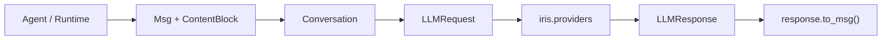

[中文](README.md)

# `iris.message`

`iris.message` defines the provider-neutral contracts exchanged by Iris agents, runtime, tools, and
providers. It owns content blocks, message/conversation snapshots, and LLM request/response models;
it does not own provider wire formats, network calls, tool execution, or session persistence.

## Quick start

The package ships with Iris and requires Python `>=3.12`.

```python
from iris.message import Conversation, Msg

conversation = Conversation(
    messages=[
        Msg.system("You are a concise assistant."),
        Msg.user("Introduce Iris."),
    ]
)
request = conversation.to_llm_request("gpt-4o", temperature=0.2)
```

`to_llm_request()` snapshots the message list; later conversation mutations do not change the
created request.

## Data flow



Provider adaptation happens in `iris.providers`; LiteLLM/OpenAI raw objects do not cross this
package boundary.

## Public API

`iris.message.__all__` contains exactly `Role`, `TextBlock`, `ToolUseBlock`, `ToolResultBlock`,
`ContentBlock`, `Msg`, `Conversation`, `LLMRequest`, and `LLMResponse`.

### Messages and blocks

Use `Msg.system()`, `Msg.user()`, `Msg.assistant()`, and `Msg.tool_result()` to create messages.
`text`, `tool_calls`, `tool_results`, and `has_tool_calls` are convenience projections.

```python
from iris.message import Msg, TextBlock, ToolUseBlock

call = ToolUseBlock(id="call_1", name="search", input={"query": "Iris"})
assistant = Msg.assistant([TextBlock(text="I will search."), call])
result = Msg.tool_result(call.id, "done", name=call.name)
```

Tool-result messages retain `Role.USER` internally; the provider mapper converts them to the
provider's tool-message wire shape. `ToolResultBlock.metadata` keeps supported fields and moves
unknown extensions under `extra`.

### `Conversation`

`Conversation` provides `add()`, `add_many()`, `last`, `turn_count`, `system_prompt`,
`non_system_messages`, `slice_recent()`, `clear()`, `estimate_tokens()`, and `to_llm_request()`.
Token estimation is character-based and is not a model tokenizer.

### `LLMRequest` and `LLMResponse`

Requests include model, messages, sampling options, tools, tool choice, response format, stream,
timeout, provider options, and metadata. The current provider path reads only the explicitly
supported `api_style` and `reasoning_effort` provider options.

Responses contain provider/model identity, content blocks, finish reason, token usage, reasoning,
and metadata. `to_msg()` creates an assistant message and copies provider, model, finish reason,
and usage into message metadata. Parsing a raw provider response is `ProviderClient`'s job, not an
`LLMResponse` method.

## Errors and boundaries

Direct model validation failures raise Pydantic `ValidationError`; `Msg.from_dict()` raises
`ValueError` for an unknown block type. Runtime may normalize such failures at its own execution
boundary, but this package does not wrap them itself.

The package does not map provider messages, make network calls, generate/execute tool schemas,
persist history, or manage context budgets.

## Maintenance

| Change | Main location | Tests |
| --- | --- | --- |
| Blocks, factories, and conversations | `message.py` | `tests/test_message_models.py` |
| Request/response models | `llm.py` | `tests/test_message_models.py`, `tests/test_provider_client.py` |
| Provider wire mapping | `../providers/openai.py` | `tests/test_provider_client.py` |

```bash
uv run pytest tests/test_message_models.py tests/test_provider_client.py
uv run ruff check src/iris/message tests/test_message_models.py
```
