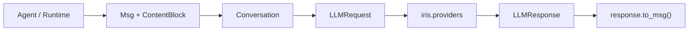

[English](README.en.md)

# `iris.message`

`iris.message` 定义 Iris 在 agent、runtime、工具和 provider 之间传递的厂商无关消息契约。
它负责消息块、会话快照以及一次 LLM 请求/响应的数据形状，不负责 provider wire format、
网络调用、工具执行或 session 持久化。

## 运行要求与快速开始

本包随 Iris 一起安装，要求 Python `>=3.12`。从受支持的顶层入口导入：

```python
from iris.message import Conversation, Msg

conversation = Conversation(
    messages=[
        Msg.system("你是一个简洁的助手。"),
        Msg.user("介绍一下 Iris。"),
    ]
)
request = conversation.to_llm_request("gpt-4o", temperature=0.2)
```

`to_llm_request()` 会复制当前消息列表，因此之后修改 `Conversation` 不会改变已经创建的
`LLMRequest`。

## 数据流



provider 适配发生在 `iris.providers` 内；本包不会保留或暴露 LiteLLM/OpenAI 原始对象。

## 公开接口

`iris.message.__all__` 只包含以下九项：

- `Role`: `system`、`user`、`assistant`、`tool` 角色枚举。
- `TextBlock`: 文本内容块。
- `ToolUseBlock`: 工具调用的 `id`、`name` 与结构化 `input`。
- `ToolResultBlock`: 工具结果的调用 ID、名称、文本、错误标记和元数据。
- `ContentBlock`: 上述三类 block 的联合类型。
- `Msg`: 一条统一消息。
- `Conversation`: 有序消息集合。
- `LLMRequest`: 一次 provider-neutral 模型请求。
- `LLMResponse`: 一次 provider-neutral 模型响应。

### `Msg`

推荐使用 `Msg.system()`、`Msg.user()`、`Msg.assistant()` 和 `Msg.tool_result()` 创建消息。
`text`、`tool_calls`、`tool_results` 与 `has_tool_calls` 提供只读投影视图。

工具结果在 Iris 内部仍使用 `Role.USER`，由 provider mapper 在 wire format 阶段转换成对应的
tool message。不要根据内部 role 自行拼接厂商请求。

```python
from iris.message import Msg, TextBlock, ToolUseBlock

call = ToolUseBlock(id="call_1", name="search", input={"query": "Iris"})
assistant = Msg.assistant([TextBlock(text="我来查询。"), call])
result = Msg.tool_result(call.id, "查询完成", name=call.name)
```

`ToolResultBlock.metadata` 会保留标准字段，并把未知扩展收纳到 `extra`，避免与后续标准字段冲突。

### `Conversation`

`Conversation` 提供 `add()`、`add_many()`、`last`、`turn_count`、`system_prompt`、
`non_system_messages`、`slice_recent()`、`clear()`、`estimate_tokens()` 与
`to_llm_request()`。`estimate_tokens()` 只是按字符数估算，不是模型 tokenizer。

### `LLMRequest`

请求字段包括 `model`、`messages`、采样参数、`tools`、`tool_choice`、
`response_format`、`stream`、`timeout`、`provider_options` 和 `metadata`。
`from_conversation()`、`system_prompt()` 与 `non_system_messages()` 用于构建和读取请求快照。

`provider_options` 只承载少量明确支持的 provider 选项；当前 active provider path 只读取
`api_style` 和 `reasoning_effort`。

### `LLMResponse`

响应字段包括 provider、响应/模型标识、内容块、结束原因、token 用量、reasoning 与 metadata。
`to_msg()` 创建 assistant `Msg`，并把 provider、model、finish reason 与 usage 放入消息元数据。
原始厂商响应到 `LLMResponse` 的解析由 provider client 完成，不属于该模型的方法。

## 错误与边界

这些对象是 Pydantic 模型；直接构造时的字段错误表现为 `pydantic.ValidationError`。
`Msg.from_dict()` 遇到未知内容块类型时抛出 `ValueError`。runtime 会在自己的公开执行边界
归一化运行期错误，但本包不会主动包装模型构造错误。

本包不负责：

- LiteLLM/OpenAI/Anthropic 消息格式映射；
- 网络请求、重试、流式传输或错误映射；
- 工具 schema 生成与执行；
- history 持久化或上下文预算管理。

## 维护与验证

| 修改内容 | 主要位置 | 对应测试 |
| --- | --- | --- |
| 消息块、工厂方法与会话行为 | `message.py` | `tests/test_message_models.py` |
| 请求/响应字段与 `to_msg()` | `llm.py` | `tests/test_message_models.py`, `tests/test_provider_client.py` |
| provider wire mapping | `../providers/openai.py` | `tests/test_provider_client.py` |

```bash
uv run pytest tests/test_message_models.py tests/test_provider_client.py
uv run ruff check src/iris/message tests/test_message_models.py
```
