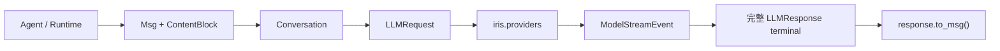

[English](README.en.md)

# `iris.message`

`iris.message` 定义 Iris 在 agent、runtime、工具和 provider 之间传递的厂商无关消息契约。
它负责消息块、会话快照以及一次 LLM 请求/响应的数据形状，不负责 provider wire format、
网络调用、工具执行或 session 持久化。

## 运行要求与快速开始

本包随 Iris 一起安装，要求 Python `>=3.12`。从受支持的顶层入口导入：

```python
from iris.message import Conversation, Msg

conversation = Conversation(
    messages=[
        Msg.system("你是一个简洁的助手。"),
        Msg.user("介绍一下 Iris。"),
    ]
)
request = conversation.to_llm_request("gpt-4o", temperature=0.2)
```

`to_llm_request()` 会复制当前消息列表，因此之后修改 `Conversation` 不会改变已经创建的
`LLMRequest`。

## 数据流


```mermaid
flowchart LR
    App["Agent / Runtime"] --> Msg["Msg + ContentBlock"]
    Msg --> Conversation["Conversation"]
    Conversation --> Request["LLMRequest"]
    Request --> Provider["iris.providers"]
    Provider --> Stream["ModelStreamEvent"]
    Stream --> Response["完整 LLMResponse terminal"]
    Response --> Assistant["response.to_msg()"]
```

provider 适配发生在 `iris.providers` 内；本包不会保留或暴露 LiteLLM/OpenAI 原始对象。

## 公开接口

`iris.message.__all__` 公开以下稳定契约组：

- `Role`: `system`、`user`、`assistant`、`tool` 角色枚举。
- `TextBlock`: 文本内容块。
- `ImageFileRef`、`ImageBlock`: 图片的绝对文件路径、实际 MIME、尺寸，以及 original/model 两份文件引用；不保存 base64 或 provider file ID。
- `DataBlock`: `TextBlock | ImageBlock`，用于有序文字/图片正文。
- `ToolUseBlock`: 工具调用的 `id`、`name` 与结构化 `input`。
- `ToolResultBlock`: 工具结果的调用 ID、名称、`list[DataBlock]` 正文、错误标记和元数据。
- `ContentBlock`: 数据块与工具调用/结果块的联合类型。
- `image_block_from_saved()`: 将图片保存器返回的可信文件信息投影为 `ImageBlock`。
- `Msg`: 一条统一消息。
- `Conversation`: 有序消息集合。
- `LLMRequest`: 一次 provider-neutral 模型请求。
- `ToolSpec`、`ToolChoice`、`ResponseFormat`：工具定义、工具选择与输出格式的逻辑契约。
- `LLMResponse`: 一次 provider-neutral 模型响应。
- `ModelStreamScope`、`ModelBlockRef`、`ModelUsageSnapshot`：一次 provider attempt、
  内容块和 token 用量的稳定标识。
- `ModelResponseStarted`、`ModelBlockStarted`、`ModelBlockDelta`、
  `ModelBlockCompleted`、`ModelUsageUpdated` 与三个 response terminal：
  provider-neutral streaming event models。
- `ModelStreamEvent`：以上事件的 discriminated union，直接包含三种 response 终态。
- `ProviderStreamError`：不含 raw exception、header 或凭据的安全错误 DTO。

### `Msg`

推荐使用 `Msg.system()`、`Msg.user()`、`Msg.assistant()` 和 `Msg.tool_result()` 创建消息。
`text`、`tool_calls`、`tool_results` 与 `has_tool_calls` 提供只读投影视图。

工具结果在 Iris 内部仍使用 `Role.USER`；provider adapter 根据所选协议映射为 Responses
`function_call_output` 或 Chat tool message，并保留调用 ID。不要根据内部 role 自行拼接厂商请求。

```python
from iris.message import Msg, TextBlock, ToolUseBlock

call = ToolUseBlock(id="call_1", name="search", input={"query": "Iris"})
assistant = Msg.assistant([TextBlock(text="我来查询。"), call])
result = Msg.tool_result(tool_use_id=call.id, content="查询完成", name=call.name)
```

`ToolResultBlock.metadata` 会保留标准字段，并把未知扩展收纳到 `extra`，避免与后续标准字段冲突。
工具内核的可信 `ToolResult` 使用 `to_msg()` 直接投影，复用已归一化的元数据；原始消息输入仍由本包解析。

`Msg.tool_result(content=...)` 接收字符串或数据块列表，字符串立即包装为 `TextBlock`。
直接构造 `ToolResultBlock` 和恢复持久化消息时，正文只接受块列表，不接受旧字符串形状。
`Msg.text` 和 `ToolResultBlock.text` 只提取各自正文中的文字，不包含图片内容或文件引用说明。
完整内容应读取 `content`/`blocks`，不能以纯文本投影代替。

`ImageBlock` 的文件处理由 [`iris.utils.images`](../utils/images.py) 完成，消息层只负责引用和
JSON 往返；无需变换时 original/model 可指向同一文件。本阶段提供数据契约，不负责 SDK 图片导入或 provider 图片编码。

### `Conversation`

`Conversation` 提供 `add()`、`add_many()`、`last`、`turn_count`、`system_prompt`、
`non_system_messages`、`slice_recent()`、`clear()`、`estimate_tokens()` 与
`to_llm_request()`。`estimate_tokens()` 只是按字符数估算，不是模型 tokenizer。

### `LLMRequest`

请求字段包括 `model`、`messages`、采样参数、`tools`、`tool_choice`、
`response_format`、`stream`、`timeout`、`provider_options` 和 `metadata`。
`from_conversation()`、`system_prompt()` 与 `non_system_messages()` 用于构建和读取请求快照。

`tools` 使用 `ToolSpec(name, description, input_schema, strict=False)`；注册表直接投影已验证字段。
`tool_choice` 接受 `auto`、`none`、`required` 或 `{"name": "lookup"}`。`response_format`
接受 `text`、`json_object` 或 `{"name": "answer", "schema": {...}, "strict": True}`，其中
`strict` 可省略。协议包装只由 provider adapter 生成。

`provider_options` 只承载 `reasoning_effort` 和 `num_retries` 等调用选项；`ProviderOptions`
拒绝其中的 `api_style`。协议选择属于模型或 `ProviderClient` 构造参数，不在每次请求中覆盖。

### `LLMResponse`

响应字段包括 provider、响应/模型标识、内容块、结束原因、token 用量、reasoning 与 metadata。
`to_msg()` 创建 assistant `Msg`，并把 provider、model、finish reason 与 usage 放入消息元数据。
原始厂商响应到 `LLMResponse` 的解析由 provider client 完成，不属于该模型的方法。

原生 Responses 的 status、item 顺序/ID、phase 和完整 reasoning 保存在专用 metadata 中。
正文和工具参数始终以 typed content 为准，重放时按关联信息重建请求；metadata 不保存第二份
可执行正文。`completed` 无工具映射为 `stop`，有工具映射为 `tool_calls`。

### `ModelStreamEvent`

`streaming.py` 定义 provider raw chunk 离开 `iris.providers` 前必须转换成的 frozen Pydantic
事件。每条事件携带同一个 `ModelStreamScope`、从 1 连续的 provider sequence 和 aware UTC
时间；block delta 同时提供相对 `delta` 与当前 channel 的完整 `snapshot`。

只有 `ModelResponseCompleted` 携带完整 `LLMResponse`。`ModelResponseFailed` 和
`ModelResponseCancelled` 不提供可提交响应；partial event 也不表示 session、checkpoint 或
durable store 已更新。工具参数只有在 provider block 完成后才由 provider 边界解析成最终
`ToolUseBlock`。

```python
from iris.message import ModelBlockDelta, ModelResponseCompleted, ModelStreamEvent


def consume(event: ModelStreamEvent) -> str | None:
    if isinstance(event, ModelBlockDelta) and event.channel == "text":
        return event.delta
    if isinstance(event, ModelResponseCompleted):
        return event.response.to_msg().text
    return None
```

## 错误与边界

这些对象是 Pydantic 模型；直接构造时的字段错误表现为 `pydantic.ValidationError`。
`Msg.from_dict()` 遇到未知内容块类型时抛出 `ValueError`。runtime 会在自己的公开执行边界
归一化运行期错误，但本包不会主动包装模型构造错误。

本包不负责：

- Responses / Chat Completions 请求与响应映射；
- provider raw stream 拉取、网络请求、重试或错误映射；
- 工具参数 JSON Schema 生成与工具执行；
- history 持久化或上下文预算管理。

## 维护与验证

| 修改内容 | 主要位置 | 对应测试 |
| --- | --- | --- |
| 消息构造与 conversation/request 装配 | `message.py`, `../runtime/assembler.py` | `tests/runtime/test_assembler.py` |
| 图片文件引用、工具结果数据块与 JSON 往返 | `message.py` | `tests/message/test_image_blocks.py`, `tests/tools/test_result_projection.py` |
| 请求/响应字段与 `to_msg()` | `llm.py` | `tests/test_provider_client.py` |
| provider-neutral streaming schema | `streaming.py` | `tests/message/test_streaming_models.py` |
| provider wire mapping | `../providers/chat_completions.py`, `../providers/responses.py` | `tests/test_provider_client.py` |

```bash
uv run pytest tests/message/test_streaming_models.py tests/runtime/test_assembler.py tests/test_provider_client.py
uv run ruff check src/iris/message tests/message tests/runtime/test_assembler.py tests/test_provider_client.py
```
