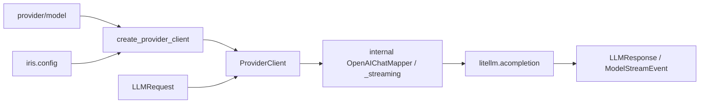

[中文](README.md)

# `iris.providers`

`iris.providers` is Iris's model-call boundary. It maps `iris.message.LLMRequest` to LiteLLM Chat
Completion calls and normalizes responses and failures back into Iris types. The active path
supports both `complete()` and `stream()` for Chat Completion; Responses API, BIDI/realtime,
injectable HTTP clients, historical adapter APIs, and `close()` are not public capabilities.

## Quick start

```python
import asyncio

from iris.message import LLMRequest, Msg
from iris.providers import create_provider_client


async def main() -> None:
    client = create_provider_client("openai/gpt-4o", api_key="sk-...")
    response = await client.complete(
        LLMRequest(model="gpt-4o", messages=[Msg.user("Hello")])
    )
    print(response.to_msg().text)


asyncio.run(main())
```

## Call flow



`OpenAIChatMapper` is internal and is not exported from `iris.providers`.

## Public API

The package exports only frozen `ModelRoute`, `parse_model_route()`,
`create_provider_client()`, and `ProviderClient`.

Built-in Iris provider IDs are `openai`, `anthropic`, and `deepseek`. A custom provider enters the
registry only when initialized `Config.providers` contains its `base_url`; an API key alone does not
register it.

Global `Config` contains only `api_key`, `provider_api_keys`, and `providers`. Set the endpoint via
`providers[name].base_url` or Agent `model.base_url`; set timeout via `model.timeout` or an explicit
client argument, and configure logs through Python `logging`. Global `base_url/timeout/debug`
fields are no longer declared.
`ProviderConfig` declares only `litellm_provider`, `base_url`, and `headers`. Neither it nor Agent
`ModelConfig` exposes `api_style`; the call contract is fixed to Chat Completion.

API-key precedence is explicit argument, `Config.provider_api_keys[provider]`, then generic
`Config.api_key`. The factory never reads environment variables or dotenv files directly; call
`iris.init_config()` first.

```python
import iris
from iris.providers import create_provider_client

iris.init_config(env_file=".env.local")
client = create_provider_client("deepseek/deepseek-chat")
```

For an OpenAI-compatible gateway, configure separate Iris and LiteLLM provider IDs:

```dotenv
IRIS_PROVIDER_API_KEYS__SILICONFLOW=sk-xxx
IRIS_PROVIDERS__SILICONFLOW__LITELLM_PROVIDER=openai
IRIS_PROVIDERS__SILICONFLOW__BASE_URL=https://api.siliconflow.cn/v1
```

```yaml
model:
  provider: siliconflow
  name: deepseek-ai/DeepSeek-V3
```

`siliconflow` performs local lookup; `openai` selects the LiteLLM adapter. Neither provider value is
sent as a request-body field; the gateway receives model `deepseek-ai/DeepSeek-V3`.

`ProviderClient` fields are `provider`, `litellm_provider`, `api_key`, `base_url`, `timeout`, and
`headers`; Pydantic `extra="forbid"` rejects removed `adapter` and `http_client` arguments.
`complete()` maps Iris messages to OpenAI Chat shapes, calls `litellm.acompletion()` with a correctly
prefixed model, and returns `LLMResponse`. `stream()` requires `request.stream=True`, requests the
usage tail, directly pulls the raw async iterator, and yields only `ModelStreamEvent`. After a finish
reason, it accepts a usage-tail placeholder choice only when that choice carries no semantic delta;
later text, thinking, tool-call, or repeated finish-reason data remains a protocol error. At EOF it
emits one completed terminal carrying an `LLMResponse` built directly from accumulated text,
reasoning, parsed tool arguments, and usage. Tool arguments are parsed once at block completion;
response content keeps text first and tools in their first-seen order. The raw
iterator is closed in `finally`; no background producer or intermediate queue is created.

The provider-response raw boundary accepts `Mapping` values or the current LiteLLM/Pydantic v2
`model_dump()` object shape. It does not call the legacy Pydantic v1 `.dict()` API.

```python
from iris.message import LLMRequest, ModelBlockDelta, ModelResponseCompleted, Msg

request = LLMRequest(model="gpt-4o", messages=[Msg.user("Hello")], stream=True)
async for event in client.stream(request):
    if isinstance(event, ModelBlockDelta) and event.channel == "text":
        print(event.delta, end="")
    elif isinstance(event, ModelResponseCompleted):
        final_response = event.response
```

Runtime currently mounts OpenAI Chat function schemas for all providers on this LiteLLM bridge.

## Errors and limitations

- 401/403 or authentication errors become `IrisAuthenticationError`.
- 429 becomes `IrisRateLimitExceededError`.
- 408, connection, and timeout errors become `IrisAPIConnectionError`.
- other provider failures become `IrisProviderError`.
- raw stream protocol/order/tool-JSON failures become a safe failed terminal with
  `PROVIDER_STREAM_PROTOCOL_ERROR`.
- EOF before a finish reason becomes a safe failed terminal with `PROVIDER_STREAM_INTERRUPTED`.
- missing keys become `IrisConfigError`; invalid routes become `IrisValidationError`.

`complete()` rejects `stream=True`; `stream()` rejects `stream=False`; both reject a non-Chat
`api_style` before network I/O. Streaming network/protocol failures are represented by one safe
terminal without raw exception, header, or key details. Local `asyncio.CancelledError` propagates.

## Maintenance

Iris depends directly on LiteLLM and does not call `httpx` or the OpenAI SDK directly. LiteLLM
brings both packages into the dependency graph; removing duplicate direct declarations does not
remove them from the installed environment.

| Change | Main location | Tests |
| --- | --- | --- |
| LiteLLM kwargs, response, and errors | `client.py` | `tests/test_provider_client.py` |
| Raw stream aggregation, terminal, and cleanup | `_streaming.py` | `tests/providers/test_streaming.py` |
| Chat mapping | `openai.py` | `tests/test_provider_client.py` |
| Registry, routing, key precedence, and environment configuration | `factory.py`, `../config.py` | No dedicated tests yet |

```bash
uv run pytest tests/providers/test_streaming.py tests/test_provider_client.py
uv run ruff check src/iris/providers tests/providers tests/test_provider_client.py
```
