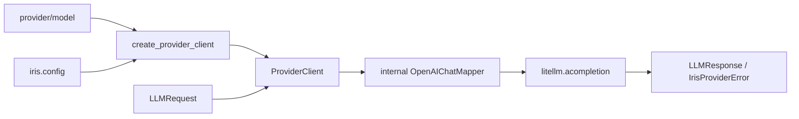

[中文](README.md)

# `iris.providers`

`iris.providers` is Iris's model-call boundary. It maps `iris.message.LLMRequest` to LiteLLM Chat
Completion calls and normalizes responses and failures back into Iris types. The active path is
non-streaming Chat Completion only; Responses API, streaming, injectable HTTP clients, historical
adapter APIs, and `close()` are not public capabilities.

## Quick start

```python
import asyncio

from iris.message import LLMRequest, Msg
from iris.providers import create_provider_client


async def main() -> None:
    client = create_provider_client("openai/gpt-4o", api_key="sk-...")
    response = await client.complete(
        LLMRequest(model="gpt-4o", messages=[Msg.user("Hello")])
    )
    print(response.to_msg().text)


asyncio.run(main())
```

## Call flow



`OpenAIChatMapper` is internal and is not exported from `iris.providers`.

## Public API

The package exports only frozen `ModelRoute`, `parse_model_route()`,
`create_provider_client()`, and `ProviderClient`.

Built-in Iris provider IDs are `openai`, `anthropic`, and `deepseek`. A custom provider enters the
registry only when initialized `Config.providers` contains its `base_url`; an API key alone does not
register it.

API-key precedence is explicit argument, `Config.provider_api_keys[provider]`, then generic
`Config.api_key`. The factory never reads environment variables or dotenv files directly; call
`iris.init_config()` first.

```python
import iris
from iris.providers import create_provider_client

iris.init_config(env_file=".env.local")
client = create_provider_client("deepseek/deepseek-chat")
```

For an OpenAI-compatible gateway, configure separate Iris and LiteLLM provider IDs:

```dotenv
IRIS_PROVIDER_API_KEYS__SILICONFLOW=sk-xxx
IRIS_PROVIDERS__SILICONFLOW__LITELLM_PROVIDER=openai
IRIS_PROVIDERS__SILICONFLOW__BASE_URL=https://api.siliconflow.cn/v1
```

```yaml
model:
  provider: siliconflow
  name: deepseek-ai/DeepSeek-V3
```

`siliconflow` performs local lookup; `openai` selects the LiteLLM adapter. Neither provider value is
sent as a request-body field; the gateway receives model `deepseek-ai/DeepSeek-V3`.

`ProviderClient` fields are `provider`, `litellm_provider`, `api_key`, `base_url`, `timeout`, and
`headers`; Pydantic `extra="forbid"` rejects removed `adapter` and `http_client` arguments.
`complete()` maps Iris messages to OpenAI Chat shapes, calls `litellm.acompletion()` with a correctly
prefixed model, and returns `LLMResponse`. Runtime currently mounts OpenAI Chat function schemas for
all providers on this LiteLLM bridge.

## Errors and limitations

- 401/403 or authentication errors become `IrisAuthenticationError`.
- 429 becomes `IrisRateLimitExceededError`.
- 408, connection, and timeout errors become `IrisAPIConnectionError`.
- other provider failures become `IrisProviderError`.
- missing keys become `IrisConfigError`; invalid routes become `IrisValidationError`.

`stream=True` and `provider_options["api_style"] != "chat"` are rejected before network I/O.

## Maintenance

| Change | Main location | Tests |
| --- | --- | --- |
| LiteLLM kwargs, response, and errors | `client.py` | `tests/test_provider_client.py` |
| Chat mapping | `openai.py` | `tests/test_provider_client.py` |
| Registry, routing, key precedence, and environment configuration | `factory.py`, `../config.py` | No dedicated tests yet |

```bash
uv run pytest tests/test_provider_client.py
uv run ruff check src/iris/providers tests/test_provider_client.py
```
