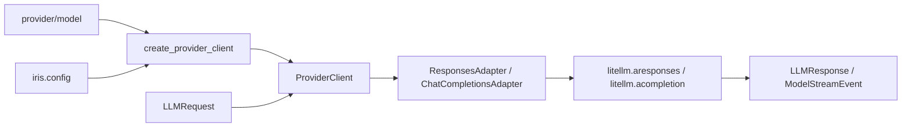

[中文](README.md)

# `iris.providers`

`iris.providers` maps `iris.message.LLMRequest` to LiteLLM Responses or Chat Completions requests
and normalizes responses and failures into Iris types. The client selects one adapter at construction:
`api_style="responses"` by default, or explicit `api_style="chat_completions"`. Complete, streaming,
and local measurement share that adapter. Failures never switch protocols. BIDI/realtime, injectable HTTP clients, historical adapter APIs, and `close()` are
not public capabilities.

Runtime and explicit memory overview generation share `CompletionProvider`, which requires async
`complete()` and synchronous `estimate_input_tokens(request)`. The protocol lives in
[protocols.py](protocols.py); custom providers and test doubles implement the same interface.
Streaming continues to use runtime's independent `StreamingRuntimeProvider` capability.

## Quick start

```python
import asyncio

from iris.message import LLMRequest, Msg
from iris.providers import create_provider_client


async def main() -> None:
    client = create_provider_client("openai/gpt-4o", api_key="sk-...")
    response = await client.complete(
        LLMRequest(model="gpt-4o", messages=[Msg.user("Hello")])
    )
    print(response.to_msg().text)


asyncio.run(main())
```

## Call flow


```mermaid
flowchart LR
    Route["provider/model"] --> Factory["create_provider_client"]
    Config["iris.config"] --> Factory
    Factory --> Client["ProviderClient"]
    Request["LLMRequest"] --> Client
    Client --> Mapper["ResponsesAdapter / ChatCompletionsAdapter"]
    Mapper --> LiteLLM["litellm.aresponses / litellm.acompletion"]
    LiteLLM --> Response["LLMResponse / ModelStreamEvent"]
```

Mappers and adapters are internal and are not exported from `iris.providers`.

## Public API

The package exports frozen `ModelRoute`, `parse_model_route()`, `create_provider_client()`,
`ProviderClient`, and the shared `CompletionProvider` protocol.

Built-in Iris provider IDs are `openai`, `anthropic`, and `deepseek`. A custom provider enters the
registry only when initialized `Config.providers` contains its `base_url`; an API key alone does not
register it.

Global `Config` contains only `api_key`, `provider_api_keys`, and `providers`. Set the endpoint via
`providers[name].base_url` or Agent `model.base_url`; set timeout via `model.timeout` or an explicit
client argument, and configure logs through Python `logging`. Global `base_url/timeout/debug`
fields are no longer declared.
`ProviderConfig` declares only `litellm_provider`, `base_url`, and `headers`. Agent `model.api_style`
is the sole YAML protocol setting: `responses` by default, or `chat_completions`. The SDK equivalent
is `create_provider_client(..., api_style="chat_completions")`. This setting does not enter
`LLMRequest`, `provider_options`, or per-run request overrides.

Responses uses OpenAI transport; logical DeepSeek defaults to `openai` transport to avoid LiteLLM's
Chat bridge. Chat Completions uses `acompletion`, with DeepSeek defaulting to `deepseek` transport.
Both DeepSeek routes default to `https://api.deepseek.com`; credentials always use the logical
provider. Partial overrides retain defaults, and explicit transport and endpoint configuration wins.
Public `base_url` maps to LiteLLM `api_base` for both protocols. Responses rejects non-OpenAI transports before a
request. Direct client construction needs resolved transport and endpoint values; prefer the factory
for built-in defaults.

API-key precedence is explicit argument, `Config.provider_api_keys[provider]`, then generic
`Config.api_key`. The factory never reads environment variables or dotenv files directly; call
`iris.init_config()` first.

```python
import iris
from iris.providers import create_provider_client

iris.init_config(env_file=".env.local")
client = create_provider_client("deepseek/deepseek-flash")
```

A custom gateway must support the selected protocol, tools, and required model capabilities:

```dotenv
IRIS_PROVIDER_API_KEYS__GATEWAY=sk-xxx
IRIS_PROVIDERS__GATEWAY__LITELLM_PROVIDER=openai
IRIS_PROVIDERS__GATEWAY__BASE_URL=https://gateway.example.test/v1
```

```yaml
model:
  provider: gateway
  name: vendor/native-model
  api_style: responses  # Or chat_completions
```

`gateway` performs local lookup; `openai` is the transport provider and `api_style` selects the adapter. The request model
is `vendor/native-model`. This gateway is illustrative, not a verified service.

`ProviderClient` fields are `provider`, `api_style`, `litellm_provider`, `api_key`, `base_url`,
`timeout`, and `headers`; Pydantic `extra="forbid"` rejects removed `adapter` and `http_client`
arguments. Logical requests contain `ToolSpec(name, description, input_schema, strict)` and forced
choice `{name: ...}`. Providers encode the Responses flat schema or Chat function wrapper.
Response format is `text`, `json_object`, or `{name, schema, strict?}`; the selected adapter produces
Responses `text.format` or Chat `response_format`.

Each request sends the full effective history. Responses uses `store=false`, never previous_response_id.
It maps `max_tokens` and `reasoning_effort` to `max_output_tokens` and `reasoning.effort`, and requests
`reasoning.encrypted_content` for stateless replay. Typed blocks own text and tool arguments;
metadata retains item order, ID, status, phase and reasoning items. Ordinary assistant history uses
legal input messages, while native replay retains required output fields. Call IDs remain distinct
from item IDs. Chat metadata only marks the source reasoning field; replay reads the current
`Msg.metadata.reasoning` after persistence, without retaining a stale second copy or interpreting
Responses reasoning as Chat fields.

`stream()` requires `request.stream=True` and consumes protocol events directly, without a producer
or queue. Responses deltas are for display; final response.output supplies the committed result.
Chat accumulates chunks and consumes the usage tail after finish. Only complete stop/tool_calls
results succeed, with the same normalized finish reason in complete and stream. Incomplete, failed,
error and EOF without a valid terminal fail without committing partial tool intentions. Known usage
is retained for existing runtime settlement. Cached/reasoning details are not added again, and raw
iterators close in `finally`; Responses also closes its HTTP response while LiteLLM owns the client pool.

The provider-response raw boundary accepts `Mapping` values or the current SDK/Pydantic v2
`model_dump()` object shape. It does not call the legacy Pydantic v1 `.dict()` API.

`estimate_input_tokens(request)` projects the selected adapter's effective request into the local
tokenizer shape, including calls/results, schemas, tool_choice, and protocol-specific output format. Encrypted reasoning
is excluded. This projection is never sent and does not call a remote token-count endpoint.
It strips only the known outer prefix and preserves inner model namespaces. It does not subtract
cached input. This is a window estimate, not exact billing
or a guarantee against overflow. `provider_options["num_retries"]` is forwarded explicitly, including
zero. Both protocols pass it to LiteLLM; omission preserves LiteLLM's default retry behavior.

Automatic summarization uses the current provider's `complete()` even when the main call uses
`stream()`. Summary requests omit tools and response schemas and set `num_retries=0` to disable
internal transport retries. Runtime retries only the failed summary
batch once for connection, timeout, or rate-limit errors; successful batches are reused. Main
requests keep their existing retry options, and lifecycle records summary usage separately.

```python
from iris.message import LLMRequest, ModelBlockDelta, ModelResponseCompleted, Msg

request = LLMRequest(model="gpt-4o", messages=[Msg.user("Hello")], stream=True)
async for event in client.stream(request):
    if isinstance(event, ModelBlockDelta) and event.channel == "text":
        print(event.delta, end="")
    elif isinstance(event, ModelResponseCompleted):
        final_response = event.response
```

This branch delivers text and tool calls. Image types and image projection await integration from
the image branch. The agreed Chat projection appends user images after the entire tool receipt group,
while durable history retains actual tool results; that behavior is not implemented here yet.

## Errors and limitations

- 401/403 or authentication errors become `IrisAuthenticationError`.
- 429 becomes `IrisRateLimitExceededError`.
- 408, connection, and timeout errors become `IrisAPIConnectionError`.
- other provider failures become `IrisProviderError`.
- raw stream protocol/order/tool-JSON failures become a safe failed terminal with
  `PROVIDER_STREAM_PROTOCOL_ERROR`.
- EOF before a native terminal becomes a safe failed terminal with `PROVIDER_STREAM_INTERRUPTED`.
- missing keys become `IrisConfigError`; invalid routes become `IrisValidationError`.

`complete()` rejects `stream=True`; `stream()` rejects `stream=False`. The logical request boundary
rejects `provider_options["api_style"]`; protocol selection belongs to client construction. Streaming failures are represented by one safe
terminal without raw exception, header, or key details. Local `asyncio.CancelledError` propagates.

## Maintenance

Iris uses LiteLLM for both protocols. OpenAI SDK remains a transitive LiteLLM dependency and is not
declared or called directly by Iris. Locked LiteLLM 1.90.2 may obtain a complete Responses result
and then emit synthetic events for unregistered models. The first delta then waits for the whole
generation, while the endpoint remains `/responses`. Iris accepts this behavior without a second
SDK path or global model registration changes.

| Change | Main location | Tests |
| --- | --- | --- |
| Common options, response, and errors | `client.py`, `responses.py`, `openai.py` | `tests/test_provider_client.py` |
| Raw stream aggregation, terminal, and cleanup | `_streaming.py`, `_chat_streaming.py` | `tests/providers/test_streaming.py`, `test_chat_streaming.py` |
| Responses mapping and replay | `responses.py` | `tests/providers/test_responses_mapping.py` |
| Registry, routing, credentials, and HTTP target | `factory.py`, `../config.py` | `tests/providers/test_responses_routing.py`, `test_api_transport.py` |

```bash
uv run pytest tests/providers/test_streaming.py tests/test_provider_client.py
uv run ruff check src/iris/providers tests/providers tests/test_provider_client.py
```
