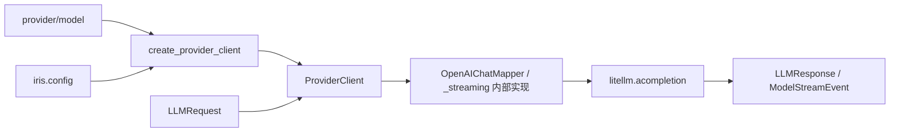

[English](README.en.md)

# `iris.providers`

`iris.providers` 是 Iris 的模型调用边界。它把 `iris.message.LLMRequest` 映射为 LiteLLM
Chat Completion 调用，并把响应与异常归一化回 Iris 类型。runtime、message 和 tools 不需要
了解厂商 wire format。

当前 active path 支持 LiteLLM Chat Completion 的 `complete()` 与 `stream()`；Responses API、
BIDI/realtime、可注入 HTTP client、历史 adapter API 与 `close()` 都不是公开能力。

Runtime 与显式 memory 概览生成共用 `CompletionProvider` 协议，要求异步 `complete()` 和同步
`estimate_input_tokens(request)`。协议定义在 [protocols.py](protocols.py)，自定义 provider 和
测试替身实现同一接口；流式调用仍使用 runtime 的独立 `StreamingRuntimeProvider` 能力。

## 快速开始

```python
import asyncio

from iris.message import LLMRequest, Msg
from iris.providers import create_provider_client


async def main() -> None:
    client = create_provider_client("openai/gpt-4o", api_key="sk-...")
    response = await client.complete(
        LLMRequest(model="gpt-4o", messages=[Msg.user("你好")])
    )
    print(response.to_msg().text)


asyncio.run(main())
```

## 调用链



`OpenAIChatMapper` 是内部实现，不从 `iris.providers` 顶层导出，调用方不应依赖它。

## 公开接口

`iris.providers.__all__` 只导出：

- `ModelRoute(provider, model)`：冻结的路由模型。
- `parse_model_route(model)`：按第一个 `/` 解析 `provider/model`。
- `create_provider_client(...)`：根据路由、配置与显式参数装配 client。
- `ProviderClient`：执行一次完整或流式 Chat Completion。
- `CompletionProvider`：完整响应与输入 token 估算的共同协议。

### 路由与配置

内置 Iris provider id 为 `openai`、`anthropic` 和 `deepseek`。自定义 provider 只有在已初始化
`Config.providers` 且包含 `base_url` 时才进入注册表；只配置 API key 不会注册 provider。

全局 `Config` 只提供 `api_key`、`provider_api_keys` 和 `providers`。Endpoint 使用
`providers[name].base_url` 或 Agent `model.base_url`；timeout 使用 `model.timeout` 或
显式 client 参数，日志通过 Python `logging` 配置。全局不再声明无效的 `base_url/timeout/debug`。
`ProviderConfig` 只声明 `litellm_provider`、`base_url` 和 `headers`；它和 Agent `ModelConfig`
都不提供 `api_style`，调用契约固定为 Chat Completion。

API key 优先级：

1. `create_provider_client(..., api_key=...)`；
2. `Config.provider_api_keys[provider]`；
3. `Config.api_key`。

factory 不直接读取 `os.environ` 或 dotenv 文件。先通过 `iris.init_config()` 初始化：

```python
import iris
from iris.providers import create_provider_client

iris.init_config(env_file=".env.local")
client = create_provider_client("deepseek/deepseek-chat")
```

OpenAI-compatible 中转站使用 Iris provider id 与 LiteLLM provider id 两层配置：

```dotenv
IRIS_PROVIDER_API_KEYS__SILICONFLOW=sk-xxx
IRIS_PROVIDERS__SILICONFLOW__LITELLM_PROVIDER=openai
IRIS_PROVIDERS__SILICONFLOW__BASE_URL=https://api.siliconflow.cn/v1
```

```yaml
model:
  provider: siliconflow
  name: deepseek-ai/DeepSeek-V3
```

`siliconflow` 用于 Iris 本地配置查找；`openai` 选择 LiteLLM adapter。请求体不包含这两个
provider 字段，发送给中转站的 `model` 是 `deepseek-ai/DeepSeek-V3`。

### `ProviderClient`

构造字段为 `provider`、`litellm_provider`、`api_key`、`base_url`、`timeout` 和 `headers`；
Pydantic `extra="forbid"` 会拒绝旧的 `adapter`、`http_client` 等参数。

`complete(request)`：

- 把 Iris 消息映射成 OpenAI Chat message/tool schema 形状；
- 用 `<litellm_provider>/<model>` 调用 `litellm.acompletion()`，并避免重复前缀；
- 只透传当前实现支持的请求选项；
- 返回 provider-neutral `LLMResponse`。

Provider response raw boundary 只接受 `Mapping` 或当前 LiteLLM/Pydantic v2 的
`model_dump()` 对象形态；不再调用 Pydantic v1 `.dict()` 兼容接口。

`estimate_input_tokens(request)` 同步复用发送 mapper 和 LiteLLM token counter，计入消息、
工具调用/结果、工具定义、tool_choice，并单独补计 response_format。它只移除明确的外层
provider 前缀，保留内层模型命名空间；不调用生成 API，不扣缓存命中的输入。返回值是窗口
估算，不是精确账单或绝不超窗的保证。`provider_options["num_retries"]` 显式透传，包含 0；
未设置时保留 LiteLLM 原有重试行为。

自动摘要复用当前 provider 的 `complete()`，即使主请求使用 `stream()`；摘要调用不带工具或
response schema，并设置 `num_retries=0` 关闭当前 LiteLLM async Chat/SDK 内部重试。
runtime 只对当前失败摘要分块的连接、超时或限流错误额外重试一次，成功分块不重跑。
主请求保留原来的重试选项；摘要 usage 由 lifecycle 单独累计。

`stream(request)`：

- 要求 `request.stream=True`，并向 LiteLLM 请求 usage tail；
- 直接拉取 raw async iterator，不建立后台 producer 或中间 queue；
- 在内部 `_streaming.py` 中分配 attempt-local scope、block identity 与连续 sequence；
- 产出 `ModelStreamEvent`，绝不暴露 LiteLLM chunk；
- 收到 finish reason 后继续消费 usage tail；允许 LiteLLM 保留无语义增量的占位 choice，
  但仍拒绝后续文本、thinking、工具调用或重复 finish reason；
- EOF 时生成唯一 completed terminal；
- 完整工具参数在 block completion 边界只解析一次 JSON，结果保存在累计状态中；
- completed terminal 从累计文本、reasoning、工具参数和 usage 直接构造完整 `LLMResponse`，
  保持文本在前、工具按首次出现顺序排列；
- `finally` 关闭支持 `aclose()` 的 raw iterator。

```python
from iris.message import LLMRequest, ModelBlockDelta, ModelResponseCompleted, Msg

request = LLMRequest(model="gpt-4o", messages=[Msg.user("你好")], stream=True)
async for event in client.stream(request):
    if isinstance(event, ModelBlockDelta) and event.channel == "text":
        print(event.delta, end="")
    elif isinstance(event, ModelResponseCompleted):
        final_response = event.response
```

即使 Iris provider id 是 Anthropic 或 DeepSeek，runtime 当前仍挂载 OpenAI Chat function
schema，由 LiteLLM chat bridge 处理。这是 active path 的明确限制。

## 错误映射

- `401` / `403` 或认证类异常 → `IrisAuthenticationError`；
- `429` → `IrisRateLimitExceededError`；
- `408`、连接或超时类异常 → `IrisAPIConnectionError`；
- 其他 provider 异常 → `IrisProviderError`；
- raw stream chunk/order/tool JSON 协议错误 → safe `response.failed`，code 为
  `PROVIDER_STREAM_PROTOCOL_ERROR`；
- finish reason 前 EOF → safe `response.failed`，code 为 `PROVIDER_STREAM_INTERRUPTED`；
- 缺少 API key → `IrisConfigError`；
- 无效 route string → `IrisValidationError`。

`complete()` 拒绝 `stream=True`，`stream()` 拒绝 `stream=False`；两者都在网络调用前拒绝
`provider_options["api_style"] != "chat"`。流式网络/协议失败通过唯一 safe terminal 返回，
不会泄露 raw exception、header 或 key；本地 `asyncio.CancelledError` 原样传播。

## 维护与验证

Iris 直接依赖 LiteLLM，不直接调用 `httpx` 或 OpenAI SDK。二者由 LiteLLM 的依赖关系引入，
不在 Iris 的直接依赖中重复声明；这不意味着安装环境中不再包含它们。

| 修改内容 | 主要位置 | 对应测试 |
| --- | --- | --- |
| LiteLLM kwargs、响应与异常映射 | `client.py` | `tests/test_provider_client.py` |
| raw stream聚合、终态与cleanup | `_streaming.py` | `tests/providers/test_streaming.py` |
| Chat message/tool 映射 | `openai.py` | `tests/test_provider_client.py` |
| provider 注册、路由、密钥优先级与环境配置 | `factory.py`, `../config.py` | 当前无专用测试 |

```bash
uv run pytest tests/providers/test_streaming.py tests/test_provider_client.py
uv run ruff check src/iris/providers tests/providers tests/test_provider_client.py
```
