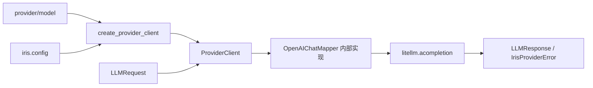

[English](README.en.md)

# `iris.providers`

`iris.providers` 是 Iris 的模型调用边界。它把 `iris.message.LLMRequest` 映射为 LiteLLM
Chat Completion 调用，并把响应与异常归一化回 Iris 类型。runtime、message 和 tools 不需要
了解厂商 wire format。

当前 active path 只支持非流式 Chat Completion；Responses API、streaming、可注入 HTTP
client、历史 adapter API 与 `close()` 都不是公开能力。

## 快速开始

```python
import asyncio

from iris.message import LLMRequest, Msg
from iris.providers import create_provider_client


async def main() -> None:
    client = create_provider_client("openai/gpt-4o", api_key="sk-...")
    response = await client.complete(
        LLMRequest(model="gpt-4o", messages=[Msg.user("你好")])
    )
    print(response.to_msg().text)


asyncio.run(main())
```

## 调用链



`OpenAIChatMapper` 是内部实现，不从 `iris.providers` 顶层导出，调用方不应依赖它。

## 公开接口

`iris.providers.__all__` 只导出：

- `ModelRoute(provider, model)`：冻结的路由模型。
- `parse_model_route(model)`：按第一个 `/` 解析 `provider/model`。
- `create_provider_client(...)`：根据路由、配置与显式参数装配 client。
- `ProviderClient`：执行一次非流式 Chat Completion。

### 路由与配置

内置 Iris provider id 为 `openai`、`anthropic` 和 `deepseek`。自定义 provider 只有在已初始化
`Config.providers` 且包含 `base_url` 时才进入注册表；只配置 API key 不会注册 provider。

API key 优先级：

1. `create_provider_client(..., api_key=...)`；
2. `Config.provider_api_keys[provider]`；
3. `Config.api_key`。

factory 不直接读取 `os.environ` 或 dotenv 文件。先通过 `iris.init_config()` 初始化：

```python
import iris
from iris.providers import create_provider_client

iris.init_config(env_file=".env.local")
client = create_provider_client("deepseek/deepseek-chat")
```

OpenAI-compatible 中转站使用 Iris provider id 与 LiteLLM provider id 两层配置：

```dotenv
IRIS_PROVIDER_API_KEYS__SILICONFLOW=sk-xxx
IRIS_PROVIDERS__SILICONFLOW__LITELLM_PROVIDER=openai
IRIS_PROVIDERS__SILICONFLOW__BASE_URL=https://api.siliconflow.cn/v1
```

```yaml
model:
  provider: siliconflow
  name: deepseek-ai/DeepSeek-V3
```

`siliconflow` 用于 Iris 本地配置查找；`openai` 选择 LiteLLM adapter。请求体不包含这两个
provider 字段，发送给中转站的 `model` 是 `deepseek-ai/DeepSeek-V3`。

### `ProviderClient`

构造字段为 `provider`、`litellm_provider`、`api_key`、`base_url`、`timeout` 和 `headers`；
Pydantic `extra="forbid"` 会拒绝旧的 `adapter`、`http_client` 等参数。

`complete(request)`：

- 把 Iris 消息映射成 OpenAI Chat message/tool schema 形状；
- 用 `<litellm_provider>/<model>` 调用 `litellm.acompletion()`，并避免重复前缀；
- 只透传当前实现支持的请求选项；
- 返回 provider-neutral `LLMResponse`。

即使 Iris provider id 是 Anthropic 或 DeepSeek，runtime 当前仍挂载 OpenAI Chat function
schema，由 LiteLLM chat bridge 处理。这是 active path 的明确限制。

## 错误映射

- `401` / `403` 或认证类异常 → `IrisAuthenticationError`；
- `429` → `IrisRateLimitExceededError`；
- `408`、连接或超时类异常 → `IrisAPIConnectionError`；
- 其他 provider 异常 → `IrisProviderError`；
- 缺少 API key → `IrisConfigError`；
- 无效 route string → `IrisValidationError`。

`stream=True` 或 `provider_options["api_style"] != "chat"` 会在网络调用前被拒绝。

## 维护与验证

| 修改内容 | 主要位置 | 对应测试 |
| --- | --- | --- |
| LiteLLM kwargs、响应与异常映射 | `client.py` | `tests/test_provider_client.py` |
| Chat message/tool 映射 | `openai.py` | `tests/test_provider_client.py` |
| provider 注册、路由、密钥优先级与环境配置 | `factory.py`, `../config.py` | 当前无专用测试 |

```bash
uv run pytest tests/test_provider_client.py
uv run ruff check src/iris/providers tests/test_provider_client.py
```
