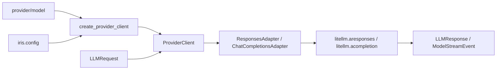

[English](README.en.md)

# `iris.providers`

`iris.providers` 是 Iris 的模型调用边界。它把 `iris.message.LLMRequest` 映射为 LiteLLM
Responses 或 Chat Completions 调用，并把响应与异常归一化回 Iris 类型。runtime、message 和 tools 不需要
了解厂商 wire format。

默认 `api_style="responses"` 发送原生 `/responses`；显式 `api_style="chat_completions"` 使用
Chat Completions。协议在 client 构造时选定，`complete()`、`stream()` 和计量使用同一个 adapter，失败不切换协议。
BIDI/realtime、可注入 HTTP client、历史 adapter API 与 `close()` 都不是公开能力。

Runtime 与显式 memory 概览生成共用 `CompletionProvider` 协议，要求异步 `complete()` 和同步
`estimate_input_tokens(request)`。协议定义在 [protocols.py](protocols.py)，自定义 provider 和
测试替身实现同一接口。可选流式能力 `StreamingProvider` 和 `streaming_provider_for()` 也由
本包提供；`stream(request)` 直接返回 `AsyncIterator[ModelStreamEvent]`，建流结果不另行 await。

## 快速开始

```python
import asyncio

from iris.message import LLMRequest, Msg
from iris.providers import create_provider_client


async def main() -> None:
    client = create_provider_client("openai/gpt-4o", api_key="sk-...")
    response = await client.complete(
        LLMRequest(model="gpt-4o", messages=[Msg.user("你好")])
    )
    print(response.to_msg().text)


asyncio.run(main())
```

## 调用链


```mermaid
flowchart LR
    Route["provider/model"] --> Factory["create_provider_client"]
    Config["iris.config"] --> Factory
    Factory --> Client["ProviderClient"]
    Request["LLMRequest"] --> Client
    Client --> Mapper["ResponsesAdapter / ChatCompletionsAdapter"]
    Mapper --> LiteLLM["litellm.aresponses / litellm.acompletion"]
    LiteLLM --> Response["LLMResponse / ModelStreamEvent"]
```

`responses.py` 与 `chat_completions.py` 按 API 协议命名，分别负责请求编码、LiteLLM 调用、
响应解析、历史重放和计量投影。对应的流式模块处理各自协议事件；`_tool_encoding.py` 共享
工具格式编码，`_stream_utils.py` 共享资源关闭、错误投影和首个事件前的失败终态。
`ResponsesMapper`、`ChatCompletionsMapper` 和两个 adapter 都是内部实现，不从包顶层导出。

## 公开接口

`iris.providers.__all__` 只导出：

- `ModelRoute(provider, model)`：冻结的路由模型。
- `parse_model_route(model)`：按第一个 `/` 解析 `provider/model`。
- `create_provider_client(...)`：根据路由、配置与显式参数装配 client。
- `ProviderClient`：执行选定协议的一次完整或流式调用。
- `CompletionProvider`：完整响应与输入 token 估算的共同协议。
- `StreamingProvider`：独立可选的 typed event stream 协议。
- `streaming_provider_for(provider)`：取得 provider 的流式能力；缺失时返回 `None`。

### 路由与配置

内置 Iris provider id 为 `openai`、`anthropic` 和 `deepseek`。自定义 provider 只有在已初始化
`Config.providers` 且包含 `base_url` 时才进入注册表；只配置 API key 不会注册 provider。

全局 `Config` 只提供 `api_key`、`provider_api_keys` 和 `providers`。Endpoint 使用
`providers[name].base_url` 或 Agent `model.base_url`；timeout 使用 `model.timeout` 或
显式 client 参数，日志通过 Python `logging` 配置。全局不再声明无效的 `base_url/timeout/debug`。
`ProviderConfig` 只声明 `litellm_provider`、`base_url` 和 `headers`。协议配置的唯一 YAML 入口为
Agent `model.api_style`，默认 `responses`，可选 `chat_completions`；Iris Python SDK 使用
`create_provider_client(..., api_style="chat_completions")` 或 `ProviderClient(api_style=...)`。
`api_style` 不进入 `LLMRequest`，也不能放进 `provider_options` 或 run 请求覆盖。

Responses 当前接入 OpenAI 原生路线，以及 DeepSeek 的 OpenAI-compatible 路线：逻辑
`deepseek` 默认使用传输 `openai`。Chat Completions 使用 LiteLLM `acompletion`，逻辑
`deepseek` 默认使用传输 `deepseek`。两者默认地址均为 `https://api.deepseek.com`，凭据始终按
逻辑 `deepseek` 查找。只覆盖 headers 不丢失这些默认值；显式 `litellm_provider` 和 endpoint
覆盖优先。两种协议都把公共 `base_url` 传为 LiteLLM `api_base`。
Responses 尚未接入的非 `openai`
传输在请求前报错，不进入 Chat bridge。直接构造 `ProviderClient` 时须提供已解析的传输与地址；
通常使用 factory 取得完整默认配置。

API key 优先级：

1. `create_provider_client(..., api_key=...)`；
2. `Config.provider_api_keys[provider]`；
3. `Config.api_key`。

factory 不直接读取 `os.environ` 或 dotenv 文件。先通过 `iris.init_config()` 初始化：

```python
import iris
from iris.providers import create_provider_client

iris.init_config(env_file=".env.local")
client = create_provider_client("deepseek/deepseek-flash")
```

自定义网关须支持所选协议、工具调用及所需模型能力。使用两层 provider 配置：

```dotenv
IRIS_PROVIDER_API_KEYS__GATEWAY=sk-xxx
IRIS_PROVIDERS__GATEWAY__LITELLM_PROVIDER=openai
IRIS_PROVIDERS__GATEWAY__BASE_URL=https://gateway.example.test/v1
```

```yaml
model:
  provider: gateway
  name: vendor/native-model
  api_style: responses  # 可改为 chat_completions
```

`gateway` 用于 Iris 本地配置查找；`openai` 是传输 provider，`api_style` 选择 API adapter。
请求体模型名为 `vendor/native-model`；这里的网关与模型是配置示意，不代表已验证的服务。

### `ProviderClient`

构造字段为 `provider`、`api_style`、`litellm_provider`、`api_key`、`base_url`、`timeout` 和 `headers`；
Pydantic `extra="forbid"` 会拒绝旧的 `adapter`、`http_client` 等参数。

`complete(request)`：

- 消费 `ToolSpec(name, description, input_schema, strict)`，强制工具选择仅为 `{name: ...}`；
- Responses 生成扁平 function schema 与 choice，Chat 生成 function 包装；
- Chat 使用 `<litellm_provider>/<model>` 调用 `litellm.acompletion()`；
- Responses 使用 `litellm.aresponses()`，保留模型命名空间；
- 两者每次发送完整有效历史；Responses 设置 `store=false`，不依赖 previous_response_id；
- 只透传当前实现支持的请求选项；
- 返回 provider-neutral `LLMResponse`。

Provider response raw boundary 只接受 `Mapping` 或当前 LiteLLM/Pydantic v2 的
`model_dump()` 对象形态；不再调用 Pydantic v1 `.dict()` 兼容接口。

`response_format` 使用 `text`、`json_object` 或 `{name, schema, strict?}`；Chat 编码为
`response_format`，Responses 编码为 `text.format`。Responses 还将 `max_tokens` 映射为
`max_output_tokens`，`reasoning_effort` 映射为 `reasoning.effort`，并请求 `reasoning.encrypted_content`，供支持它的
模型在无服务端存储模式下重放推理。正文和工具参数始终来自 typed content；metadata 只保存
原生 item 顺序、ID、status、phase 与完整 reasoning items，`call_id` 不与 item.id 混用。
普通 assistant 历史使用合法输入消息；原生输出回放保留必要字段，正文仍来自 typed blocks。
Chat metadata 只标记推理字段的协议来源；回放从当前 `Msg.metadata.reasoning` 取值，
持久化后不会重放另一份旧推理正文，也不把 Responses reasoning 当成 Chat 字段。

`estimate_input_tokens(request)` 从所选 adapter 的有效请求投影本地计量格式，计入消息、
工具调用/结果、工具定义、tool_choice，并单独补计该协议的结构化输出格式；加密 reasoning 不按文本计数。
计量投影不用于发送，也不调用远端 input_tokens 端点。它只移除明确的外层
provider 前缀，保留内层模型命名空间；不调用生成 API，不扣缓存命中的输入。返回值是窗口
估算，不是精确账单或绝不超窗的保证。`provider_options["num_retries"]` 显式透传，包含 0；
两种协议均传给 LiteLLM；未设置时保留 LiteLLM 默认重试。

自动摘要复用当前 provider 的 `complete()`，即使主请求使用 `stream()`；摘要调用不带工具或
response schema，并设置 `num_retries=0` 关闭所选传输的内部重试。
runtime 只对当前失败摘要分块的连接、超时或限流错误额外重试一次，成功分块不重跑。
主请求保留原来的重试选项；摘要 usage 由 lifecycle 单独累计。

`stream(request)`：

- 要求 `request.stream=True`，按选定协议消费 Responses typed events 或 Chat chunks；
- 直接拉取 raw async iterator，不建立后台 producer 或中间 queue；
- 在协议内部流式模块中分配 attempt-local scope、block identity 与连续 sequence；
- 产出 `ModelStreamEvent`，绝不暴露 LiteLLM chunk；
- 文字/thinking/工具参数 delta 用于增量展示；Responses 最终 output、Chat 合法终态的聚合结果才用于提交；
- Responses 仅 completed 成功；Chat 仅完整 stop/tool_calls 成功，均归一化为 stop/tool_calls；
- Chat 保留 finish 后的 usage tail，EOF 缺少合法 finish 时失败；
- incomplete、failed、error 和终态前 EOF 都失败，不提交部分工具调用；
- 已返回 usage 在失败时仍交给 runtime 结算，cached/reasoning 明细不重复加进总数；
- consumer 结束或取消时关闭 raw iterator；Responses 关闭本次 HTTP 响应，连接池由 LiteLLM 管理。

响应与 usage 快照的 token 值仍默认 `0`，但 `model_fields_set` 只包含服务商实际返回的
非 null 计数；真实 `0` 是已知计数，缺失/null 是未知。失败异常的 `context['usage']` 同样
只保留已知字段。快照与响应之间保持这个区别；`complete=True` 表示流式用量收口，不代表
账单完整，也不改变 runtime 既有累计逻辑。

```python
from iris.message import LLMRequest, ModelBlockDelta, ModelResponseCompleted, Msg

request = LLMRequest(model="gpt-4o", messages=[Msg.user("你好")], stream=True)
async for event in client.stream(request):
    if isinstance(event, ModelBlockDelta) and event.channel == "text":
        print(event.delta, end="")
    elif isinstance(event, ModelResponseCompleted):
        final_response = event.response
```

### 图片输入

用户消息和工具结果可包含 `ImageBlock`。两个 mapper 通过 `_images.image_data_url()` 读取
已保存的 `model` 副本，以实际 MIME 编码 data URL，并使用 `detail=high`；不读取 original，
不在请求时重新缩放或压缩。图片处理/保存属于 `utils.images`，provider 只负责编码与投影。

Responses 用户内容使用有序 `input_text/input_image`，工具结果在对应 call_id 的
`function_call_output.output` 内保留相同顺序。Chat 用户内容使用 `text/image_url`；工具回执
保留文字及图片关联说明，在该轮全部回执之后追加包含来源 call ID、工具名和图片的 user 消息。
追加消息位于后续真实消息（包括 steer）之前，仅存在于请求投影，不写入历史或改变 context 引用编号。

两个 adapter 的计量投影都保留图片语义，使用 LiteLLM 本地 high 视觉估算；Chat 来源说明计入文字，
每张图只计算一次，base64 不按正文字符计数。这是窗口预算近似值，实际用量仍取服务端 usage。
complete 与 stream 共用编码；副本不可读时 complete/计量报告 provider 错误，stream 产生失败终态，
不会静默去图、重新读取原始来源或切换协议。模型必须支持所选协议下的视觉和所需工具能力。

LiteLLM 最低版本为 1.103.2。DeepSeek Chat 的图片透传依赖其已登记的视觉能力：当前离线
HTTP/SSE 用例使用 `deepseek-flash`，保留默认 `deepseek` 传输；`deepseek-chat` 等旧文字模型
不因选择 Chat 协议而获得视觉能力。Iris 不增加模型能力目录或自动传输切换。

## 错误映射

- `401` / `403` 或认证类异常 → `IrisAuthenticationError`；
- `429` → `IrisRateLimitExceededError`；
- `408`、连接或超时类异常 → `IrisAPIConnectionError`；
- 其他 provider 异常 → `IrisProviderError`；
- raw stream chunk/order/tool JSON 协议错误 → safe `response.failed`，code 为
  `PROVIDER_STREAM_PROTOCOL_ERROR`；
- 协议终态前 EOF → safe `response.failed`，code 为 `PROVIDER_STREAM_INTERRUPTED`；
- 缺少 API key → `IrisConfigError`；
- 无效 route string → `IrisValidationError`。

`complete()` 拒绝 `stream=True`，`stream()` 拒绝 `stream=False`；
`provider_options["api_style"]` 被逻辑请求边界拒绝。流式网络/协议失败通过唯一 safe terminal 返回，
不会泄露 raw exception、header 或 key；本地 `asyncio.CancelledError` 原样传播。

## 维护与验证

Iris 统一通过 LiteLLM 调用两种协议；OpenAI SDK 是 LiteLLM 的传递依赖，Iris 不单独声明或
直接调用它。锁定 LiteLLM 1.103.2 对未登记模型可能先取得完整 Responses 响应，再模拟流式事件；
此时首个增量需等待整次生成完成，HTTP endpoint 仍是 `/responses`。Iris 沿用该行为，
不增加第二条 SDK 调用路径，也不改变全局模型登记。

| 修改内容 | 主要位置 | 对应测试 |
| --- | --- | --- |
| 公共调用选项、响应与异常映射 | `client.py`, `responses.py`, `chat_completions.py` | `tests/test_provider_client.py` |
| 协议流聚合、终态与资源关闭 | `_responses_streaming.py`, `_chat_completions_streaming.py`, `_stream_utils.py` | `tests/providers/test_responses_streaming.py`, `test_chat_completions_streaming.py` |
| Responses 映射与原生重放 | `responses.py` | `tests/providers/test_responses_mapping.py` |
| provider 注册、路由、密钥与 HTTP 目标 | `factory.py`, `../config.py` | `tests/providers/test_responses_routing.py`, `test_api_transport.py` |

```bash
uv run pytest tests/providers tests/test_provider_client.py tests/harness/test_protocol_adapters.py
uv run ruff check src/iris/providers tests/providers tests/test_provider_client.py
```
