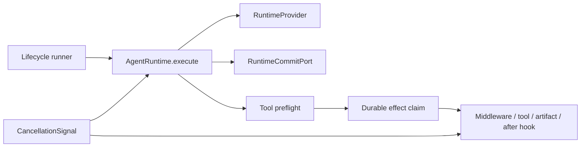
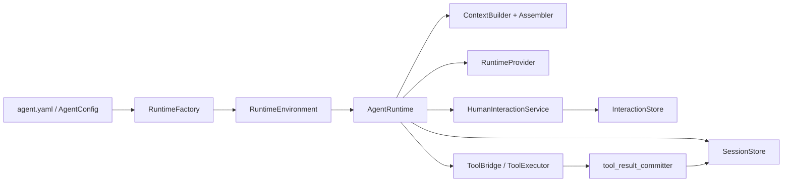
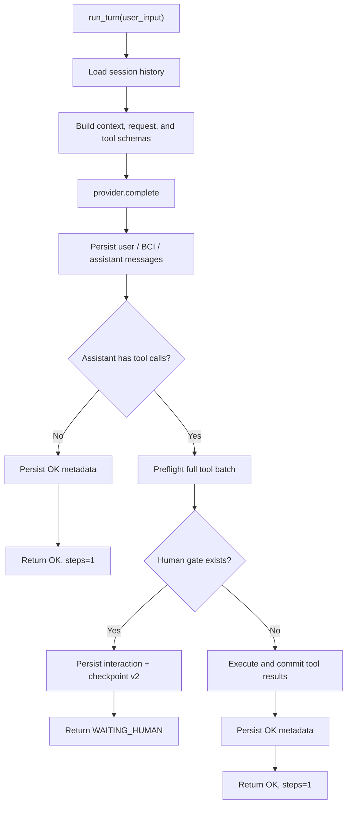
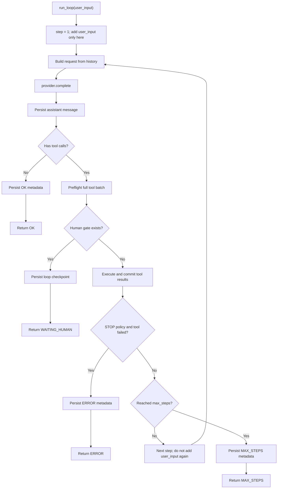
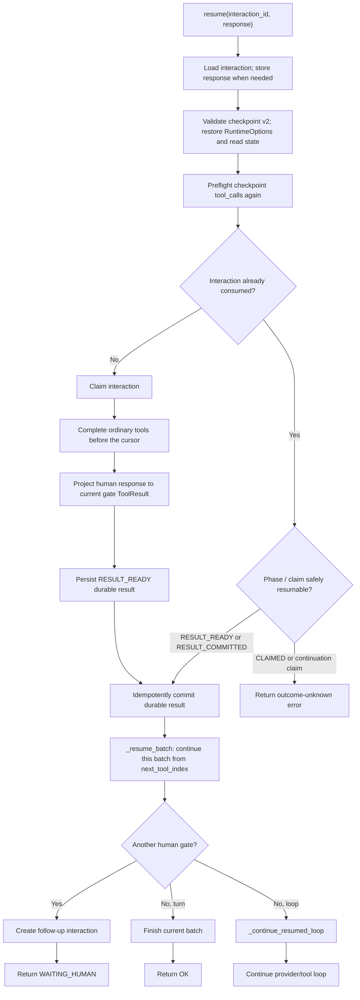
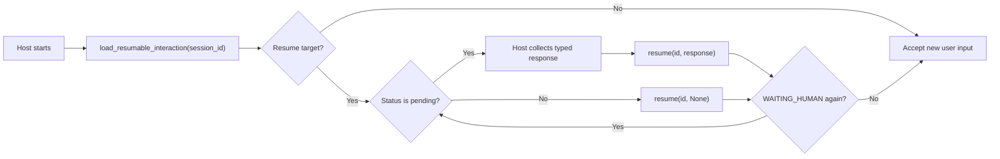

[中文](README.md)

# `iris.runtime`

`iris.runtime` is Iris's single-agent execution orchestration layer. It turns a parsed
`AgentConfig` into a `RuntimeEnvironment` and an `AgentRuntime`, builds provider requests, maintains session history, runs
tools, and persists resumable HITL checkpoints for permission confirmation or `human.ask`.

It does not own provider wire formats, tool business logic, long-term memory storage/retrieval,
graph runtimes, planners, or multi-agent workflows. Those concerns belong to `iris.providers`,
`iris.tools`, `iris.memory`, or the calling application.

## Scope and public entry points

Python 3.12+ is required. Create a runtime with `RuntimeFactory`, then call `run_turn()`,
`run_loop()`, or `resume()`:

```python
import asyncio

from iris.runtime import RuntimeFactory
from iris.runtime.models import BoundedLoopOptions, RuntimeOptions, RuntimeStatus


async def main() -> None:
    runtime = RuntimeFactory.from_config_path("agent.yaml")
    result = await runtime.run_loop(
        "What does the README describe?",
        options=RuntimeOptions(
            session_id="demo",
            loop=BoundedLoopOptions(max_steps=4),
        ),
    )
    if result.status is RuntimeStatus.ERROR and result.error is not None:
        print(f"{result.error.source}:{result.error.code}: {result.error.message}")
    elif result.assistant_message is not None:
        print(result.assistant_message.text)


asyncio.run(main())
```

The package exports `AgentRuntime`, `RuntimeEnvironment`, `RuntimeFactory`, `RuntimeProvider`,
`RuntimeMessageAssembler`, `ToolBridge`, and `normalize_runtime_error`. Import runtime option,
status, and result models from the explicit `iris.runtime.models` submodule;
they are not re-exported at the `iris.runtime` package root. `_resume_batch()` and
`_continue_resumed_loop()` are internal `AgentRuntime` implementation details and are not
application APIs.

`RuntimeFactory.from_config_path()` creates a real provider client by default. Tests and SDK
integrations can inject `provider=`, `session_store=`, `interaction_store=`, or `memory_service=`.
The factory only assembles local dependencies; construction never calls the provider.

Advanced SDK callers can construct an environment explicitly. It holds only live dependencies
shared by one runtime instance; it neither parses process environment variables nor enters a HITL
checkpoint:

```python
from iris.runtime import AgentRuntime, RuntimeEnvironment

environment = RuntimeEnvironment(
    agent_config=config,
    context_input=context_input,
    provider=provider,
)
runtime = AgentRuntime(environment)
result = await runtime.run_turn("Current question")
```

`RuntimeOptions` remains the call-scoped input for session, run, memory, request, and loop
options. It is checkpoint-serializable; `RuntimeEnvironment` is not.
The authoritative `ToolErrorPolicy` used by `BoundedLoopOptions.tool_error_policy` now lives in the
pure-data `iris.lifecycle.models` module. `iris.runtime.models` temporarily imports it under the
same name to preserve the legacy entry point; loop behavior is unchanged.

### Transactional inner engine

The lifecycle runner advances one activation through
`AgentRuntime.execute(activation, *, commits, cancellation)`. `execute()` owns the complete inner
model/tool loop; start, resume, and recover enter the same algorithm through different
`RuntimeCursor` values. It returns a `RuntimeActivationResult` engine fact rather than creating a
complete `RunResult` or choosing a public stop reason.

On this path, session history, model-step reservation/commit, tool claim/result, and HITL suspension
all pass through the required `RuntimeCommitPort`. After current permission revalidation and before
middleware, the tool body, artifact persistence, or after hooks, `ToolEffectGuard` durably claims
the call. Ordinary and human-approved tools share this claim/result path. If a claim exists without
an explicit committable result, the engine returns `outcome_unknown` and never automatically
replays the tool effect.

Resume and recover never infer approval from the activation kind. The lifecycle owner must pass a
validated response through `RuntimeActivationInput.interaction_projection`: an exact `ToolResult`
for a question answer or permission rejection, or
`RuntimeApprovedToolCall(interaction_id, tool_call_id, tool_name, fingerprint)` for approval. Before
any batch effect, the engine binds that projection to the first uncommitted gate. Approval still
undergoes current permission validation and a durable claim, and its `interaction_id` is recorded on
the `RuntimeToolCall`. A mismatched or unconsumable projection is rejected as a conflict; after one
projection is consumed, a later gate in the same batch suspends again. The Phase 4 lifecycle/HITL
owner constructs this pure-data projection from the durable interaction record.

`RuntimeActivationInput`, `RuntimeActivationResult`, `RuntimeActivationOutcome`, `RuntimeCursor`,
`RuntimeApprovedToolCall`, `RuntimeCommitPort`, and its commit DTOs are exported from `iris.runtime`. Callers of `execute()`
must provide a runner-owned commit port and an activation-scoped `CancellationSignal`. The legacy
`run_turn()`, `run_loop()`, and `resume()` entry points remain temporarily during migration, but
they neither wrap `execute()` nor dual-write its new persistence boundary.



## Component relationships



- `RuntimeFactory` assembles a coherent environment, including the tool bridge, HITL service,
  provider, and stores from a YAML path or validated `AgentConfig`.
- `RuntimeEnvironment` holds runtime-instance live dependencies. Tools enter through
  `ToolBridge` and HITL through `HumanInteractionService`, avoiding duplicate sources of truth.
- `AgentRuntime` calls the provider, orchestrates tools/HITL, and writes session state. It is the
  primary application entry point.
- `SessionStore` persists message history, run metadata, and tool events.
- `InteractionStore` persists human interactions and checkpoints. With a SQLite session backend it
  defaults to the same `SQLiteStore` instance as the session.

## `AgentRuntime` execution flows

### `run_turn()`: one provider call

`run_turn(user_input, *, options=None, metadata=None)` makes exactly one provider call. If the
model returns ordinary tool calls, it executes and commits that batch, but **does not** send the
results back to the provider. Use it when the caller controls the next model call.



Preflighting the full batch means that, if an assistant message includes a permission confirmation
or `human.ask` gate, no tool in that batch runs before waiting. The checkpoint retains the full
tool-call batch and the cursor for its next unfinished call.

### `run_loop()`: bounded model/tool loop

`run_loop(user_input, *, options=None, metadata=None)` repeats “call model → run tools”. It passes
`user_input` only at step one; later steps rebuild requests from session history, so the preceding
tool-result messages naturally reach the next provider call.



`RuntimeOptions.loop.max_steps` defaults to 20. `tool_error_policy` defaults to
`return_to_model`, so tool errors are returned to the model as tool results. With `stop`, a tool
error in the current batch returns `RuntimeStatus.ERROR`.

### `resume()`: continue from a durable checkpoint

`resume(interaction_id, response=None)` resumes a `WAITING_HUMAN` interaction. A `response` is
required only while the interaction is `pending`: permission interactions take an approve/reject
response and question interactions take an answer. Pass `None` for an already `resolved` or
`consumed` interaction.



Resume does not re-enter public `run_loop()`: the checkpoint represents an **in-progress tool
batch after a provider response**, including `next_tool_index`, completed results, original
`RuntimeOptions`, and read state. `_resume_batch()` first completes the unfinished calls in that
batch. Only once the batch is complete and `run_mode == "loop"` does it send results back to the
provider for the next loop steps.

Every resumed ordinary tool and provider continuation first writes a `continuation_claim`, then
performs side effects, and clears the claim only after committing results, cursor, and read state.
If the process stops between these persistence points, a later resume returns
`HITL_EXECUTION_OUTCOME_UNKNOWN` rather than risk replaying a tool or provider continuation.

### `load_resumable_interaction()`: read-only recovery discovery

`load_resumable_interaction(session_id)` lets a CLI or another host adapter find the session's
resume target before taking new user input. It primarily reads `latest_run.waiting_human` and
`interaction_id`, falling back to the sole pending interaction during the narrow window after an
interaction is created but before its marker is written.

It does not store a response, claim an interaction, or run a tool. It returns `None` when there is
no target and fails closed when a marker has no target, crosses sessions, or conflicts with another
active pending interaction.



Cross-process recovery requires SQLite for both session and interaction persistence. The in-memory
backend is only valid for the current process.

## Status, results, and persistence

All execution entry points return `RuntimeTurnResult`. Callers should branch on `status`:

| `status` | Meaning | Next caller action |
| --- | --- | --- |
| `ok` | The current turn/loop completed normally | Use `assistant_message` and `tool_results` |
| `waiting_human` | A human request was persisted | Render `pending_interaction`, then call `resume()` |
| `max_steps` | The loop reached `max_steps` | Handle the last message and structured error info |
| `error` | A config, context, provider, tool, memory, session, or runtime error | Read `error.source`, `error.code`, and `error.message` |

`SessionStore` persists messages, run metadata, and tool events. A tool-result event ID is always
`tool_result:{run_id}:{tool_call_id}`; appending the same normalized payload is idempotent. HITL
stores a separate JSON-safe checkpoint whose only `run_mode` values are `turn` and `loop`.

`before_current_input` (when configured as a context slot) is a user-turn snapshot. It is stored
only on the initial step with current input. Later loop steps and HITL resume replay it from
history instead of reinjecting it.

## Configuration and optional capabilities

`RuntimeFactory` consumes the `AgentConfig` fields `model`, `system`/`context`, `tools`,
`permissions`, and `session`:

- `model` selects the provider/model and request-level options; process configuration in
  `iris.config` supplies API keys.
- `system` or `context` builds `ContextBuildInput`; exactly one is required.
- `tools` builds the registry, while `permissions.writes` determines the tool permission policy.
- `session.backend: none` uses `InMemorySessionStore`; `sqlite` uses `SQLiteStore`.

Runtime never recalls memory by default. It injects memory context only when `RuntimeOptions`
explicitly provides `memory_results` or `memory_query`; the latter requires `memory_service` when
the factory is assembled.

Explicit dynamic memory is injected only on the first model step of each logical run; provider
requests caused by later tool-loop steps or HITL resume do not append the same dynamic memory again.
A new user input creates a new run and can inject memory once again. Static memory slots declared in
`context.yaml` are not affected by this rule.

## Maintenance map and verification

| Change | Main location | Tests to extend |
| --- | --- | --- |
| Single-turn/loop orchestration | `runtime.py` | `tests/runtime/test_fake_provider_turn.py`, `test_loop.py` |
| HITL waiting and recovery | `runtime.py`, `checkpoint.py`, `resume.py` | `test_hitl_waiting.py`, `test_hitl_resume.py`, `test_checkpoint.py` |
| Dependency assembly and path resolution | `factory.py` | `tests/runtime/test_factory.py` |
| Result-message and event commit | `tool_result_committer.py`, `tool_results.py` | Corresponding runtime/session tests |

After a change, run checks that match its scope, for example:

```bash
uv run pytest tests/runtime/test_loop.py tests/runtime/test_hitl_waiting.py tests/runtime/test_hitl_resume.py
uv run ruff check src/iris/runtime tests/runtime
```
