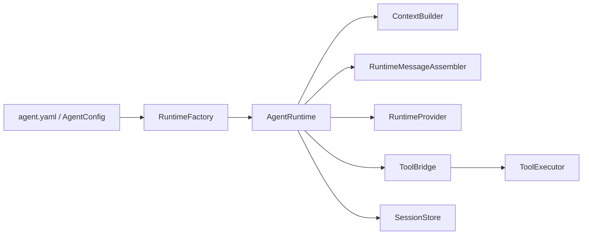

# iris.runtime

`iris.runtime` 提供 Agent 运行时装配入口。它消费 `iris.agents` 解析出的
`AgentConfig`，组合 context、provider、tools、memory 和 session，执行一次
`run_turn()` 或有界 `run_loop()`。

本模块不实现 provider wire format、工具业务逻辑、长期记忆检索或复杂 workflow 编排。
这些职责分别由 `iris.providers`、`iris.tools`、`iris.memory` 和上层应用承担。

## 架构



## 快速入门

```python
import asyncio

from iris.runtime import RuntimeFactory
from iris.runtime.models import BoundedLoopOptions, RuntimeOptions, RuntimeStatus


async def main() -> None:
    runtime = RuntimeFactory.from_config_path("agent.yaml")
    result = await runtime.run_loop(
        "README 里介绍了什么？",
        options=RuntimeOptions(
            session_id="demo",
            loop=BoundedLoopOptions(max_steps=4),
        ),
    )

    if result.status is RuntimeStatus.ERROR and result.error is not None:
        print(f"{result.error.source}:{result.error.code}: {result.error.message}")
        return
    if result.assistant_message is not None:
        print(result.assistant_message.text)


asyncio.run(main())
```

`RuntimeFactory.from_config_path()` 默认创建真实 provider client。OpenAI 配置会读取
`IRIS_OPENAI_API_KEY`，也可以通过 `api_key=` 显式传入。测试时可通过
`provider=` 注入 fake provider。

## 配置示例

```yaml
name: file-agent
model:
  provider: openai
  name: gpt-4o-mini
  api_style: responses
  temperature: 0.2

system: |
  你是一个本地文件助手。回答前优先使用只读工具检查工作区。

tools:
  builtin:
    - file.read
    - file.list
    - file.grep

permissions:
  workspace: .
  writes: deny

session:
  backend: sqlite
  path: .iris/session.db
```

结构化 context 模式继续使用 `agent.yaml` 引用独立 `context.yaml`：

```yaml
name: file-agent
model: openai/gpt-4o-mini
context:
  path: context.yaml
```

`RuntimeFactory` 会在创建 runtime 时读取并校验 `context.yaml`。

## 核心定义

### `RuntimeFactory`

从 `agent.yaml` 或已校验的 `AgentConfig` 创建 `AgentRuntime`。Factory 只做本地依赖装配，
不会在构造阶段调用 provider。

### `AgentRuntime`

运行时编排器，负责构建 context、组装 `LLMRequest`、调用 provider、执行工具桥接并写入
session。

- `run_turn()`：执行一次 provider call，可执行一次工具桥接；工具结果会写回 session
  history，但不会再次调用 provider。
- `run_loop()`：执行有界 tool loop。第一步追加当前用户输入，后续步骤从 session history
  重新组装请求。

### `RuntimeOptions`

调用级选项，常用字段包括：

- `session_id`: 本次运行读取和写入的 session，默认 `"default"`。
- `run_id`: 本次运行标识，默认自动生成。
- `include_tools`: 是否把活动工具 schema 挂到 provider request，默认 `True`。
- `request_options`: 覆盖单次 `LLMRequest` 选项。
- `metadata`: 运行态追踪字段，不直接进入 prompt。
- `memory_query`: 显式触发 memory recall，需要注入 `memory_service`。
- `memory_results`: 调用方预先提供的 memory 结果。
- `memory_max_chars`: memory 注入 context 前的字符预算。
- `loop`: 有界 loop 的步数和工具错误处理配置。

### `RuntimeTurnResult`

runtime 对外返回的结果模型，包含：

- `status`: `ok`、`error` 或 `max_steps`。
- `assistant_message`: 最终 assistant 消息。
- `tool_results`: 程序侧可读取的结构化工具结果。
- `tool_result_messages`: 可回灌给模型的 tool result 消息。
- `steps`: 实际完成的 provider 调用步数。
- `error`: 失败时的结构化错误信息。

### `ToolBridge`

工具桥只做协议转换和执行转发：

1. 从 assistant message 收集 tool calls。
2. 检查工具是否在当前 `ToolRegistryView` 中暴露。
3. 调用 `ToolExecutor.execute_many()`。
4. 把 `ToolResult` 转为 `Msg.tool_result(...)`。
5. 写入 `SessionStore.append_tool_event()`。

工具参数校验、权限策略、artifact、middleware 和具体业务逻辑仍由 `iris.tools` 负责。

## API

### `RuntimeFactory.from_config_path(path, ...)`

读取 `agent.yaml` 并创建 runtime。可选注入 `provider`、`session_store`、
`memory_service`、`api_key` 和 `http_client`。

### `RuntimeFactory.from_config(config, ...)`

从已校验的 `AgentConfig` 创建 runtime，适合 SDK 调用方自行加载配置后接管装配边界。

### `AgentRuntime.run_turn(user_input, *, options=None, metadata=None)`

执行一次 provider 调用并保存当前用户输入与 assistant 回复。若 assistant 返回工具调用，
runtime 会执行一次工具桥接，把工具结果消息写回 session history 并返回工具结果，但不会
把工具结果再次发送给 provider。

### `AgentRuntime.run_loop(user_input, *, options=None, metadata=None)`

执行有界工具循环。assistant 没有工具调用时返回 `RuntimeStatus.OK`；如果每一步都继续
产生工具调用，达到 `RuntimeOptions.loop.max_steps` 后返回 `RuntimeStatus.MAX_STEPS`。

## 与 agent 配置的关系

`RuntimeFactory` 会消费 `AgentConfig` 中的配置：

- `model`: 创建真实 provider client，并把模型选项透传到 `LLMRequest`。
- `system`: 构造简单模式的 `ContextBuildInput`。
- `context`: 读取独立 `context.yaml`。
- `tools`: 通过 `build_tool_registry()` 构建工具注册表。
- `permissions`: 解析 workspace，并创建工具权限策略。
- `session`: 创建 `InMemorySessionStore` 或 `SQLiteSessionStore`。

## 显式 memory

runtime 不做默认自动召回。只有调用方显式传入以下字段之一时，memory 才会被追加到
context：

- `RuntimeOptions.memory_results`
- `RuntimeOptions.memory_query`

`memory_results` 会通过 `MemoryContextBuilder` 裁剪并映射为 `ContextSlot`。
`memory_query` 需要创建 runtime 时注入 `memory_service`，否则返回 `MEMORY_ERROR`。

## Session 写入

runtime 会通过 `SessionStore` 保存三类数据：

- messages：history、current input、assistant message 和 tool result messages。
- run metadata：最近一次运行摘要和历史 runs 列表。
- tool events：每次工具结果的 JSON-safe 事件快照。

默认 `session.backend: none` 使用 `InMemorySessionStore`。配置
`session.backend: sqlite` 后，`RuntimeFactory` 会创建 `SQLiteSessionStore`。

## 错误处理

runtime 边界不会要求调用方解析错误文本。失败会返回
`RuntimeTurnResult(status=RuntimeStatus.ERROR, error=RuntimeErrorInfo(...))`。

常见 `error.source`：

- `config`: `agent.yaml` 或 provider API key 配置错误。
- `context`: `context.yaml`、模板或 context 字符上限错误。
- `provider`: provider 鉴权、限流、HTTP 或响应错误。
- `tool`: 工具桥接协议错误或工具执行失败。
- `memory`: 显式 memory 查询缺少服务或构建失败。
- `session`: session 读写失败。
- `runtime`: 未归类的运行时错误。

## 边界

本模块只负责 runtime 编排。它不做以下事情：

- 不做 graph runtime、planner 或多 agent workflow。
- 不做默认自动 memory recall。
- 不在 runtime 中实现 provider wire format。
- 不在 runtime 中实现工具业务逻辑。
- 不新增持久化 schema；继续复用 `SessionStore`。
