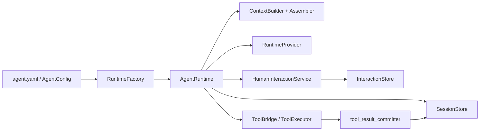
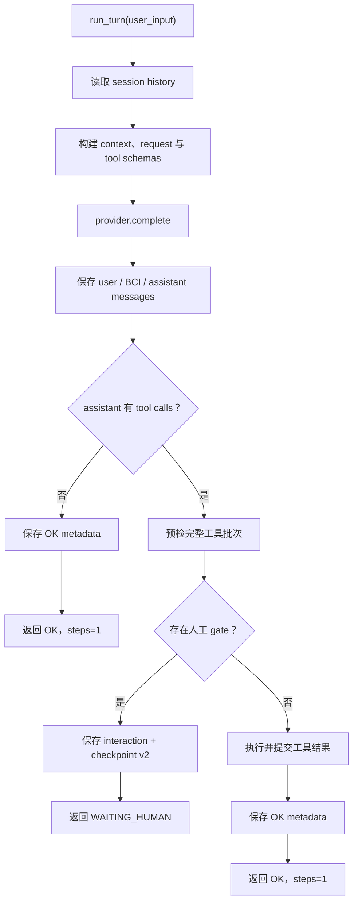
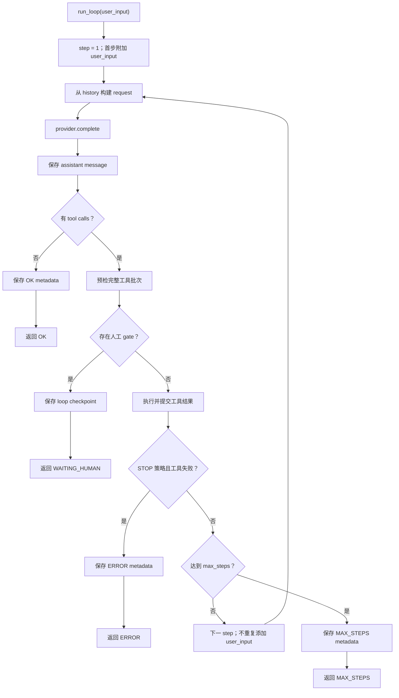
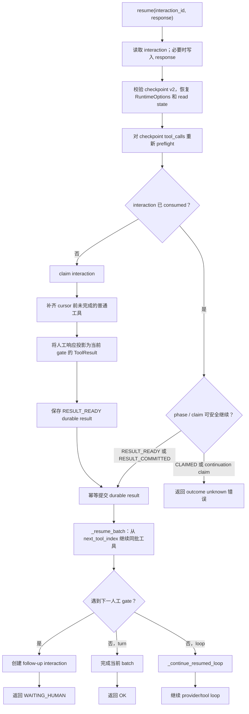
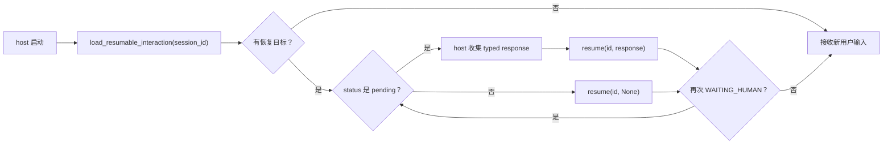

[English](README.en.md)

# `iris.runtime`

`iris.runtime` 是 Iris 的单 Agent 执行编排层：它将已解析的 `AgentConfig` 组装为
`AgentRuntime`，构建 provider 请求、维护 session history、执行工具，并在权限确认或
`human.ask` 时保存可恢复的 HITL checkpoint。

它不负责 provider wire format、工具业务逻辑、长期记忆存储/检索，也不提供 graph runtime、
planner 或多 Agent workflow；这些能力分别属于 `iris.providers`、`iris.tools`、
`iris.memory` 或上层应用。

## 使用边界与公开入口

运行要求是 Python 3.12+。通常从 `RuntimeFactory` 创建 runtime，再调用
`run_turn()`、`run_loop()` 或 `resume()`：

```python
import asyncio

from iris.runtime import RuntimeFactory
from iris.runtime.models import BoundedLoopOptions, RuntimeOptions, RuntimeStatus


async def main() -> None:
    runtime = RuntimeFactory.from_config_path("agent.yaml")
    result = await runtime.run_loop(
        "README 里介绍了什么？",
        options=RuntimeOptions(
            session_id="demo",
            loop=BoundedLoopOptions(max_steps=4),
        ),
    )
    if result.status is RuntimeStatus.ERROR and result.error is not None:
        print(f"{result.error.source}:{result.error.code}: {result.error.message}")
    elif result.assistant_message is not None:
        print(result.assistant_message.text)


asyncio.run(main())
```

`iris.runtime` 包级导出：`AgentRuntime`、`RuntimeFactory`、`RuntimeProvider`、
`RuntimeMessageAssembler`、`ToolBridge` 与 `normalize_runtime_error`。
`_resume_batch()`、`_continue_resumed_loop()` 等下划线方法是 `AgentRuntime` 的内部实现，
不应被应用直接调用。

`RuntimeFactory.from_config_path()` 默认创建真实 provider client；可在测试或 SDK 集成时通过
`provider=`、`session_store=`、`interaction_store=`、`memory_service=` 注入依赖。Factory
只做本地装配，构造时不会发起 provider 请求。

## 组件关系


```mermaid
flowchart LR
    Config["agent.yaml / AgentConfig"] --> Factory["RuntimeFactory"]
    Factory --> Runtime["AgentRuntime"]
    Runtime --> Context["ContextBuilder + Assembler"]
    Runtime --> Provider["RuntimeProvider"]
    Runtime --> Bridge["ToolBridge / ToolExecutor"]
    Runtime --> Session["SessionStore"]
    Runtime --> HITL["HumanInteractionService"]
    HITL --> Store["InteractionStore"]
    Bridge --> Commit["tool_result_committer"]
    Commit --> Session
```

- `RuntimeFactory`：从 YAML 路径或已校验的 `AgentConfig` 装配 runtime、工具注册表、
  权限策略、provider 与存储。
- `AgentRuntime`：调用 provider、编排工具/HITL、写入 session，是应用侧的主要入口。
- `SessionStore`：持久化消息 history、run metadata 和 tool events。
- `InteractionStore`：持久化人工交互及其 checkpoint；使用 SQLite session backend 时默认与
  session 共用同一个 `SQLiteStore`。

## `AgentRuntime` 执行流程

### `run_turn()`：一次 provider 调用

`run_turn(user_input, *, options=None, metadata=None)` 只执行一次 provider 调用。若模型返回
普通工具调用，它会执行并提交这一批工具结果，但**不会**把结果再发回 provider。适用于上层
自己决定何时进行下一轮模型调用的场景。


```mermaid
flowchart TD
    A["run_turn(user_input)"] --> B["读取 session history"]
    B --> C["构建 context、request 与 tool schemas"]
    C --> D["provider.complete"]
    D --> E["保存 user / BCI / assistant messages"]
    E --> F{"assistant 有 tool calls？"}
    F -->|否| G["保存 OK metadata"] --> H["返回 OK，steps=1"]
    F -->|是| I["预检完整工具批次"]
    I --> J{"存在人工 gate？"}
    J -->|是| K["保存 interaction + checkpoint v2"] --> L["返回 WAITING_HUMAN"]
    J -->|否| M["执行并提交工具结果"] --> N["保存 OK metadata"] --> O["返回 OK，steps=1"]
```

“预检完整批次”意味着，只要当前 assistant message 内有一个权限确认或 `human.ask` gate，
该批次在等待前不会执行任何工具；checkpoint 会保留整批 tool calls 和下一条未完成调用的
cursor。

### `run_loop()`：有界 model/tool 循环

`run_loop(user_input, *, options=None, metadata=None)` 会重复“调用模型 → 执行工具”。
只有第一步传入 `user_input`；后续步骤从 session history 重新组装请求，前一步写入的
tool-result message 因而自然进入下一次 provider 请求。


```mermaid
flowchart TD
    A["run_loop(user_input)"] --> B["step = 1；首步附加 user_input"]
    B --> C["从 history 构建 request"]
    C --> D["provider.complete"]
    D --> E["保存 assistant message"]
    E --> F{"有 tool calls？"}
    F -->|否| G["保存 OK metadata"] --> H["返回 OK"]
    F -->|是| I["预检完整工具批次"]
    I --> J{"存在人工 gate？"}
    J -->|是| K["保存 loop checkpoint"] --> L["返回 WAITING_HUMAN"]
    J -->|否| M["执行并提交工具结果"]
    M --> N{"STOP 策略且工具失败？"}
    N -->|是| O["保存 ERROR metadata"] --> P["返回 ERROR"]
    N -->|否| Q{"达到 max_steps？"}
    Q -->|否| R["下一 step；不重复添加 user_input"] --> C
    Q -->|是| S["保存 MAX_STEPS metadata"] --> T["返回 MAX_STEPS"]
```

`RuntimeOptions.loop.max_steps` 默认是 20；`tool_error_policy` 默认
`return_to_model`，即将工具错误也作为 tool result 回灌模型。设为 `stop` 时，当前批次
出现工具错误会返回 `RuntimeStatus.ERROR`。

### `resume()`：从持久化 checkpoint 恢复

`resume(interaction_id, response=None)` 恢复某个 `WAITING_HUMAN` interaction。`response`
只在 interaction 仍是 `pending` 时需要：权限 interaction 接受批准/拒绝，问题 interaction
接受回答；已经 `resolved` 或 `consumed` 的 interaction 必须传 `None`。


```mermaid
flowchart TD
    A["resume(interaction_id, response)"] --> B["读取 interaction；必要时写入 response"]
    B --> C["校验 checkpoint v2，恢复 RuntimeOptions 和 read state"]
    C --> D["对 checkpoint tool_calls 重新 preflight"]
    D --> E{"interaction 已 consumed？"}
    E -->|否| F["claim interaction"]
    F --> G["补齐 cursor 前未完成的普通工具"]
    G --> H["将人工响应投影为当前 gate 的 ToolResult"]
    H --> I["保存 RESULT_READY durable result"]
    E -->|是| J{"phase / claim 可安全继续？"}
    J -->|RESULT_READY 或 RESULT_COMMITTED| K["幂等提交 durable result"]
    J -->|CLAIMED 或 continuation claim| X["返回 outcome unknown 错误"]
    I --> K
    K --> L["_resume_batch：从 next_tool_index 继续同批工具"]
    L --> M{"遇到下一人工 gate？"}
    M -->|是| N["创建 follow-up interaction"] --> O["返回 WAITING_HUMAN"]
    M -->|否，turn| P["完成当前 batch"] --> Q["返回 OK"]
    M -->|否，loop| R["_continue_resumed_loop"] --> S["继续 provider/tool loop"]
```

恢复不会重新调用公开 `run_loop()`：checkpoint 已经指向**某一个已得到 provider 响应的
中途工具批次**，包含 `next_tool_index`、已完成结果、原始 `RuntimeOptions` 和 read state。
`_resume_batch()` 先把这批尚未完成的工具按 cursor 补齐；只有 batch 完成且
`run_mode == "loop"` 时，才会将结果回灌 provider 继续后续 loop。

每个恢复后的普通工具和 provider continuation 都会先写 `continuation_claim`，再执行有
副作用的工作，并在提交结果、游标和 read state 后清除 claim。进程在这两个持久化点之间
中断时，后续恢复返回 `HITL_EXECUTION_OUTCOME_UNKNOWN`，而不是冒险重放工具或 provider
continuation。

### `load_resumable_interaction()`：只读恢复发现

`load_resumable_interaction(session_id)` 供 CLI 或其他 host adapter 在读取新用户输入前查找
当前 session 的恢复目标。它优先读取 `latest_run.waiting_human` 与 `interaction_id`，并以
唯一 pending interaction 覆盖刚创建 interaction 但尚未写 marker 的窄窗口。

该方法不写 response、不 claim interaction，也不执行工具。找不到目标时返回 `None`；marker
缺失目标、跨 session 或与另一个 active pending interaction 冲突时会 fail closed。


```mermaid
flowchart LR
    A["host 启动"] --> B["load_resumable_interaction(session_id)"]
    B --> C{"有恢复目标？"}
    C -->|否| D["接收新用户输入"]
    C -->|是| E{"status 是 pending？"}
    E -->|是| F["host 收集 typed response"] --> G["resume(id, response)"]
    E -->|否| H["resume(id, None)"]
    G --> I{"再次 WAITING_HUMAN？"}
    H --> I
    I -->|是| E
    I -->|否| D
```

跨进程恢复需要 session 与 interaction 使用 SQLite backend；内存 backend 只适用于当前进程。

## 状态、结果与持久化

所有运行入口都返回 `RuntimeTurnResult`，调用方应根据 `status` 处理：

| `status` | 含义 | 调用方下一步 |
| --- | --- | --- |
| `ok` | 当前 turn/loop 正常结束 | 使用 `assistant_message`、`tool_results` |
| `waiting_human` | 已持久化人工请求 | 渲染 `pending_interaction`，随后调用 `resume()` |
| `max_steps` | loop 达到 `max_steps` | 处理最后消息与结构化错误信息 |
| `error` | 配置、context、provider、tool、memory、session 或 runtime 错误 | 读取 `error.source`、`error.code`、`error.message` |

`SessionStore` 保存 messages、run metadata 和 tool events。每个 tool result 的事件 ID 固定为
`tool_result:{run_id}:{tool_call_id}`；同一规范化 payload 的重复追加是幂等的。HITL
interaction 另外保存 JSON-safe checkpoint，其中 `run_mode` 只有 `turn` 与 `loop` 两种。

`before_current_input`（若 context 配置了该 slot）属于用户 turn 级快照：仅首步且有当前输入时
写入 session；loop 后续 step 和 HITL resume 从 history 重放它，避免重复注入。

## 配置与可选能力

`RuntimeFactory` 消费 `AgentConfig` 的 `model`、`system`/`context`、`tools`、`permissions`
与 `session` 字段：

- `model` 决定 provider/model 和请求级参数；API key 由 `iris.config` 的进程配置提供。
- `system` 或 `context` 生成 `ContextBuildInput`；二者必须二选一。
- `tools` 构建 registry；`permissions.writes` 决定工具权限策略。
- `session.backend: none` 使用 `InMemorySessionStore`；`sqlite` 使用 `SQLiteStore`。

runtime 不会默认自动召回 memory。只有在 `RuntimeOptions` 显式给出 `memory_results` 或
`memory_query` 时才会注入 memory context；后者要求 factory 装配时传入 `memory_service`。

## 维护定位与验证

| 需求 | 主要位置 | 应补测试 |
| --- | --- | --- |
| 单轮/loop 编排行为 | `runtime.py` | `tests/runtime/test_fake_provider_turn.py`、`test_loop.py` |
| HITL 等待与恢复 | `runtime.py`、`checkpoint.py`、`resume.py` | `test_hitl_waiting.py`、`test_hitl_resume.py`、`test_checkpoint.py` |
| 依赖装配与路径解析 | `factory.py` | `tests/runtime/test_factory.py` |
| 结果消息与事件提交 | `tool_result_committer.py`、`tool_results.py` | 相应 runtime / session tests |

修改后可运行与变更范围相符的测试；例如：

```bash
UV_CACHE_DIR=/private/tmp/iris-uv-cache uv run pytest tests/runtime/test_loop.py tests/runtime/test_hitl_waiting.py tests/runtime/test_hitl_resume.py
UV_CACHE_DIR=/private/tmp/iris-uv-cache uv run ruff check src/iris/runtime tests/runtime
```
