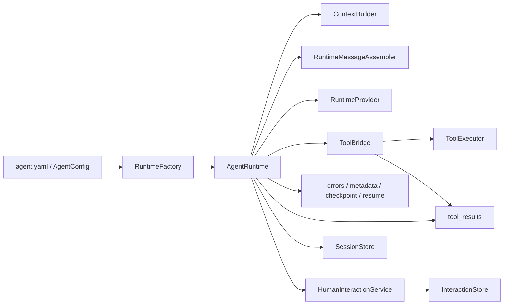

# iris.runtime

`iris.runtime` 提供 Agent 运行时装配入口。它消费 `iris.agents` 解析出的
`AgentConfig`，组合 context、provider、tools、memory 和 session，执行一次
`run_turn()` 或有界 `run_loop()`。

本模块不实现 provider wire format、工具业务逻辑、长期记忆检索或复杂 workflow 编排。
这些职责分别由 `iris.providers`、`iris.tools`、`iris.memory` 和上层应用承担。

## 架构


```mermaid
flowchart LR
    Config["agent.yaml / AgentConfig"] --> Factory["RuntimeFactory"]
    Factory --> Runtime["AgentRuntime"]
    Runtime --> Context["ContextBuilder"]
    Runtime --> Assembler["RuntimeMessageAssembler"]
    Runtime --> Provider["RuntimeProvider"]
    Runtime --> Bridge["ToolBridge"]
    Runtime --> Helpers["errors / metadata / checkpoint / resume"]
    Runtime --> Projection["tool_results"]
    Bridge --> Executor["ToolExecutor"]
    Bridge --> Projection
    Runtime --> Session["SessionStore"]
    Runtime --> HITL["HumanInteractionService"]
    HITL --> InteractionStore["InteractionStore"]
```

## 快速入门

```python
import asyncio

from iris.runtime import RuntimeFactory
from iris.runtime.models import BoundedLoopOptions, RuntimeOptions, RuntimeStatus


async def main() -> None:
    runtime = RuntimeFactory.from_config_path("agent.yaml")
    result = await runtime.run_loop(
        "README 里介绍了什么？",
        options=RuntimeOptions(
            session_id="demo",
            loop=BoundedLoopOptions(max_steps=4),
        ),
    )

    if result.status is RuntimeStatus.ERROR and result.error is not None:
        print(f"{result.error.source}:{result.error.code}: {result.error.message}")
        return
    if result.assistant_message is not None:
        print(result.assistant_message.text)


asyncio.run(main())
```

`RuntimeFactory.from_config_path()` 默认创建真实 provider client。环境变量和 `.env` 文件
由 `iris.config.init_config()` 解析；`IRIS_PROVIDER_API_KEYS__OPENAI` 这类 nested env 会进入
`Config.provider_api_keys`，provider factory 只消费已解析的配置。也可以通过 `api_key=`
显式传入，测试时可通过 `provider=` 注入 fake provider。

OpenAI-compatible 中转站需要在进程配置中注册 provider：

```env
IRIS_PROVIDER_API_KEYS__SILICONFLOW=sk-xxx
IRIS_PROVIDERS__SILICONFLOW__LITELLM_PROVIDER=openai
IRIS_PROVIDERS__SILICONFLOW__BASE_URL=https://api.siliconflow.cn/v1
```

`agent.yaml` 只声明使用哪个 Iris provider id 和模型名：

```yaml
model:
  provider: siliconflow
  name: deepseek-ai/DeepSeek-V3
```

在这个配置中，`siliconflow` 只作为 Iris provider id 参与本地 registry / API key
查找。`litellm_provider=openai` 让 LiteLLM 走 OpenAI Chat Completions adapter，并把
`base_url` 指向中转站；中转站收到的请求体不包含 `provider` 字段，`model` 会是
`deepseek-ai/DeepSeek-V3`。

## 配置示例

```yaml
name: file-agent
model:
  provider: openai
  name: gpt-4o-mini
  temperature: 0.2

system: |
  你是一个本地文件助手。回答前优先使用只读工具检查工作区。

tools:
  builtin:
    - file.read
    - file.list
    - file.grep

permissions:
  workspace: .
  writes: deny

session:
  backend: sqlite
  path: .iris/session.db
```

结构化 context 模式继续使用 `agent.yaml` 引用独立 `context.yaml`：

```yaml
name: file-agent
model: openai/gpt-4o-mini
context:
  path: context.yaml
```

`RuntimeFactory` 会在创建 runtime 时读取并校验 `context.yaml`。

## 核心定义

### `RuntimeFactory`

从 `agent.yaml` 或已校验的 `AgentConfig` 创建 `AgentRuntime`。Factory 只做本地依赖装配，
不会在构造阶段调用 provider。

### `AgentRuntime`

运行时编排器，负责构建 context、组装 `LLMRequest`、调用 provider、执行工具桥接并写入
session。

- `run_turn()`：执行一次 provider call，可执行一次工具桥接；工具结果会写回 session
  history，但不会再次调用 provider。
- `run_loop()`：执行有界 tool loop。第一步追加当前用户输入，后续步骤从 session history
  重新组装请求。
- 两个入口都会先预检完整工具批次。遇到第一个权限确认或 `human.ask` 时，runtime 会保存
  checkpoint v2 与统一 `HumanInteractionRequest`，并返回等待状态；该批次不会执行任何工具。

`AgentRuntime` 保留依赖所有权和公开编排。稳定的内部职责按领域拆分：`errors.py` 负责错误
分类与结果归一化，`metadata.py` 负责 run snapshot 构建和 resume metadata 同步，
`checkpoint.py` 负责 checkpoint v2 构建与身份校验，`resume.py` 负责恢复目标发现、typed
response 投影和 result-ready 提交，`tool_results.py` 负责唯一的工具结果消息/事件投影。这些
helper 不反向依赖 `runtime.py`，也不属于 `iris.runtime` 顶层公共 API。

### `RuntimeOptions`

调用级选项，常用字段包括：

- `session_id`: 本次运行读取和写入的 session，默认 `"default"`。
- `run_id`: 本次运行标识，默认自动生成。
- `include_tools`: 是否把活动工具 schema 挂到 provider request，默认 `True`。
- `request_options`: 覆盖单次 `LLMRequest` 选项。
- `metadata`: 运行态追踪字段，不直接进入 prompt。
- `memory_query`: 显式触发 memory recall，需要注入 `memory_service`。
- `memory_results`: 调用方预先提供的 memory 结果。
- `memory_max_chars`: memory 注入 context 前的字符预算。
- `loop`: 有界 loop 的步数和工具错误处理配置。

### `RuntimeTurnResult`

runtime 对外返回的结果模型，包含：

- `status`: `ok`、`error`、`max_steps` 或 `waiting_human`。
- `assistant_message`: 最终 assistant 消息。
- `tool_results`: 程序侧可读取的结构化工具结果。
- `tool_result_messages`: 可回灌给模型的 tool result 消息。
- `steps`: 实际完成的 provider 调用步数。
- `error`: 失败时的结构化错误信息。
- `pending_interaction`: 仅 `waiting_human` 时存在的持久化人工请求；它不会伪装成
  provider-visible 的 user/tool 消息。

### `ToolBridge`

工具桥只做协议转换和执行转发：

1. 从 assistant message 收集 tool calls。
2. 检查工具是否在当前 `ToolRegistryView` 中暴露。
3. 调用 `ToolExecutor.execute_many()`。
4. 通过 `tool_results.py` 把 `ToolResult` 投影为 `Msg.tool_result(...)` 与统一事件。
5. 用 event 自带的稳定 `event_id` 调用 `SessionStore.append_tool_event(session_id, event)`。

工具参数校验、权限策略、artifact、middleware 和具体业务逻辑仍由 `iris.tools` 负责。
runtime 当前通过 LiteLLM Chat Completion 调用 provider，因此挂载到 `LLMRequest.tools`
的活动工具 schema 始终使用 OpenAI Chat 工具格式。

## API

### `RuntimeFactory.from_config_path(path, ...)`

读取 `agent.yaml` 并创建 runtime。可选注入 `provider`、`session_store`、
`interaction_store`、`memory_service` 和 `api_key`。SQLite session 默认同时作为
interaction store；无 session 后端或自定义 session store 未传 interaction store 时，使用
非持久化的 `InMemoryInteractionStore`。

### `RuntimeFactory.from_config(config, ...)`

从已校验的 `AgentConfig` 创建 runtime，适合 SDK 调用方自行加载配置后接管装配边界。

### `AgentRuntime.run_turn(user_input, *, options=None, metadata=None)`

执行一次 provider 调用并保存当前用户输入与 assistant 回复。若 assistant 返回工具调用，
runtime 会执行一次工具桥接，把工具结果消息写回 session history 并返回工具结果，但不会
把工具结果再次发送给 provider。若预检遇到人工 gate，则先持久化 interaction/checkpoint，
返回 `RuntimeStatus.WAITING_HUMAN`。

### `AgentRuntime.resume(interaction_id, response=None)`

恢复已等待的 interaction。权限批准只覆盖对应 tool call；拒绝回灌
`USER_REJECTED`，问题回答回灌 answer 文本。已领取但未保存结果的 interaction 会以
`HITL_EXECUTION_OUTCOME_UNKNOWN` fail-closed，已准备或已提交结果则通过稳定 event ID
幂等提交；提交前会校验 `pending_result` 与 interaction tool call 及完整结果列表身份一致，
损坏 checkpoint 不会产生消息或 event。`run_turn()` 恢复当前工具批次但不会额外调用 provider；
`run_loop()` 恢复后会将结果回灌 provider，并在下一 gate 或 loop 终态返回。
checkpoint 的 `next_tool_index` 指向下一条未完成调用，因此 gate 前尚未执行的工具会按原始
顺序补齐；恢复后的普通工具结果同样写入 session，并继续遵守 `tool_error_policy`。

首次 gate 与同批次 follow-up gate 复用同一个 interaction 创建 helper；`resume()` 主流程
只消费工具结果，permission approve/reject 与 question answer 的差异集中在
`resume.resolve_interaction_result()`。
Checkpoint 固定为 v2，调用 fingerprint 只保存在 `interaction.request.tool_call`，不再在
checkpoint 重复存储；v1 checkpoint 会被明确拒绝。

Crash 恢复按 interaction phase 处理：`waiting` 需要 response，`claimed` 且无结果拒绝
重放，`result_ready` 重试消息/event 提交，`result_committed` 从安全边界继续。
`result_committed` 后的每条普通工具会先写入 typed `continuation_claim`，工具结果、游标与
read state 通过同一次 CAS 提交后才清除；恢复后的 provider/tool loop 由一个整体 claim
保护。进程在 claim 与清除之间退出时，后续恢复返回
`HITL_EXECUTION_OUTCOME_UNKNOWN`，宁可停止也不重放可能已发生的副作用。该兼容字段仍属于
checkpoint v2，不增加 interaction phase 或 SQLite 列。

每次 `resume()` 返回前都会为同一个 `run_id` 追加新的 run snapshot 并替换
`latest_run`。后续 gate 会写入新的 `interaction_id`；`ok`、`max_steps` 和 `error` 终态会
移除 waiting marker。若 metadata 保存失败，`resume()` 返回 `session` 错误，不会先向调用方
报告成功。

### `AgentRuntime.load_resumable_interaction(session_id)`

为 host adapter 查询当前 session 可交给 `resume()` 的 interaction。查询以
`latest_run.waiting_human` 和 `latest_run.interaction_id` 为主索引，因此能返回 `pending`、
`resolved` 或 `consumed` lifecycle；唯一 pending interaction 只用于覆盖新 gate 已创建但
marker 尚未写入的窄窗口。

该方法只读取 session/interaction 状态，不 resolve response、不 claim interaction，也不执行
工具。marker 缺失目标、指向其它 session，或与另一个 active pending interaction 冲突时会
fail closed。

Host adapter 可在读取新用户输入前执行启动恢复：

```python
from collections.abc import Callable

from iris.hitl import (
    HumanInteraction,
    HumanInteractionResponse,
    InteractionStatus,
)
from iris.runtime import AgentRuntime
from iris.runtime.models import RuntimeStatus, RuntimeTurnResult


async def recover_on_start(
    runtime: AgentRuntime,
    session_id: str,
    collect_response: Callable[[HumanInteraction], HumanInteractionResponse],
) -> RuntimeTurnResult | None:
    interaction = runtime.load_resumable_interaction(session_id)
    if interaction is None:
        return None

    response = (
        collect_response(interaction)
        if interaction.status is InteractionStatus.PENDING
        else None
    )
    result = await runtime.resume(interaction.interaction_id, response)
    while result.status is RuntimeStatus.WAITING_HUMAN:
        pending = result.pending_interaction
        assert pending is not None
        result = await runtime.resume(
            pending.interaction_id,
            collect_response(pending),
        )
    return result
```

`iris chat` 使用这一路径作为首个 terminal host adapter：启动恢复的 provider trace 标记为
turn 0，普通输入仍从 turn 1 开始。adapter 只为 `pending` 收集新 response；`resolved` 和
`consumed` 必须传 `None`，避免重复响应。Ctrl+C/EOF 发生在人工 prompt 时不会调用
`resume()`，所以不等价于 reject/cancel。

跨进程恢复要求 session 与 interaction 共用 SQLite backend。内存 backend 只适合当前进程；
`claimed` 或未清除的 `continuation_claim` 都表示 outcome unknown，恢复会 fail closed，
不会自动重放工具或 provider continuation。

### `AgentRuntime.run_loop(user_input, *, options=None, metadata=None)`

执行有界工具循环。assistant 没有工具调用时返回 `RuntimeStatus.OK`；如果每一步都继续
产生工具调用，达到 `RuntimeOptions.loop.max_steps` 后返回 `RuntimeStatus.MAX_STEPS`。人工
gate 同样返回 `RuntimeStatus.WAITING_HUMAN`，并保留已完成步骤的工具结果。

## 与 agent 配置的关系

`RuntimeFactory` 会消费 `AgentConfig` 中的配置：

- `model`: 创建真实 provider client，并把模型选项透传到 `LLMRequest`。
- `system`: 构造简单模式的 `ContextBuildInput`。
- `context`: 读取独立 `context.yaml`。
- `tools`: 通过 `build_tool_registry()` 构建工具注册表。
- `permissions`: 解析 workspace，并创建工具权限策略。
- `session`: 创建 `InMemorySessionStore` 或 `iris.store.SQLiteStore`。
- `interaction_store`: SQLite backend 时复用同一个 `SQLiteStore`；其它默认装配为
  `InMemoryInteractionStore`，用于保存 `human.ask` 与权限确认请求。

## 显式 memory

runtime 不做默认自动召回。只有调用方显式传入以下字段之一时，memory 才会被追加到
context：

- `RuntimeOptions.memory_results`
- `RuntimeOptions.memory_query`

`memory_results` 会通过 `MemoryContextBuilder` 裁剪并映射为 `ContextSlot`。
`memory_query` 需要创建 runtime 时注入 `memory_service`，否则返回 `MEMORY_ERROR`。
runtime 侧的适配逻辑位于 `src/iris/runtime/memory_context.py`，它不拥有长期记忆存储或检索。

## Session 写入

runtime 会通过 `SessionStore` 保存三类数据：

- messages：history、current input、assistant message 和 tool result messages。
- run metadata：最近一次运行摘要和历史 runs 列表。
- tool events：每次工具结果的 JSON-safe 事件快照。

工具事件由 `tool_results.build_tool_result_event()` 统一构造，字段包含 `event_id`、`type`、
`tool_call_id`、`tool_name`、`status`、`error`、`artifact`、`run_id`、`step_index`、
`agent_id` 和 `metadata`。`event_id` 固定为 `tool_result:{run_id}:{tool_call_id}`。

人工等待时 session metadata 会附加 `waiting_human=true` 和 `interaction_id`；interaction
及其 JSON-safe runtime checkpoint 由 interaction store 保存。

默认 `session.backend: none` 使用 `InMemorySessionStore`。配置
`session.backend: sqlite` 后，`RuntimeFactory` 会创建 `SQLiteStore`。

## 错误处理

runtime 边界不会要求调用方解析错误文本。失败会返回
`RuntimeTurnResult(status=RuntimeStatus.ERROR, error=RuntimeErrorInfo(...))`。

常见 `error.source`：

- `config`: `agent.yaml` 或 provider API key 配置错误。
- `context`: `context.yaml`、模板或 context 字符上限错误。
- `provider`: provider 鉴权、限流、HTTP 或响应错误。
- `tool`: 工具桥接协议错误或工具执行失败。
- `memory`: 显式 memory 查询缺少服务或构建失败。
- `session`: session 读写失败。
- `runtime`: 未归类的运行时错误。

## 边界

本模块只负责 runtime 编排。它不做以下事情：

- 不做 graph runtime、planner 或多 agent workflow。
- 不做默认自动 memory recall。
- 不在 runtime 中实现 provider wire format。
- 不在 runtime 中实现工具业务逻辑。
- 不新增持久化 schema；继续复用 `SessionStore`。
