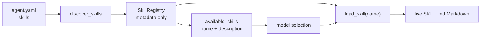

[中文](README.md)

# `iris.skill`

`iris.skill` is an optional project-level extension. It discovers `SKILL.md` files inside the
current Agent workspace, puts only names and descriptions in system context, and exposes Markdown
through the on-demand `load_skill` tool. The current implementation supports only the
`PROJECT` scope and model-driven selection. It does not execute Skill bodies, mount scripts, or
provide user-level, built-in, cross-project, hot-reload, or search-based Skills.

## Flow



The factory takes one discovery snapshot per runtime construction. Bodies are not retained in the
registry or context. Only a non-empty catalog adds the `available_skills` slot and a `load_skill`
tool backed by the same registry. The runtime does not refresh that snapshot.

## Layout and configuration

The default layout is inside `permissions.workspace`:

```text
<permissions.workspace>/
└── .agents/
    └── skills/
        └── my-skill/
            └── SKILL.md
```

Discovery scans first-level directories only. The directory name is the stable Skill key and must
use lowercase kebab-case. The entry file must be named exactly `SKILL.md`.

```yaml
skills:
  enabled: true
  root: .agents/skills
  require:
    - my-skill
```

- `enabled` defaults to `false`; disabled configuration bypasses discovery, catalog construction,
  and loader registration exactly.
- `root` defaults to `.agents/skills`, resolves relative to `permissions.workspace`, and becomes an
  `IrisConfigError` if its real path escapes the workspace.
- `require` defaults to empty. Names must use lowercase kebab-case, and every required Skill must
  be discovered or configuration fails.
- A missing root or an invalid/unreadable candidate produces a warning diagnostic while other
  valid Skills remain available. `require` can promote a missing entry to a configuration error.

If future discovery uses multiple roots, the earlier declared root wins a duplicate name and a
collision diagnostic is emitted. Automatic integration currently supplies one `PROJECT` root.

## `SKILL.md` format

```markdown
---
name: legacy-name
description: Review a Python change with the project's local conventions.
allowed-tools:
  - read_file
disable-model-invocation: true
version: 1
---

# Review instructions

Read the relevant files, then report concrete findings.
```

`description` is required, must be non-blank, and becomes catalog text. Values longer than 1024
characters are truncated with a `DESCRIPTION_TRUNCATED` warning. The directory always determines
the actual name; a different frontmatter `name` produces only a `NAME_MISMATCH` warning. Unknown
fields such as `allowed-tools`, `disable-model-invocation`, and `version` are preserved in
`extra_frontmatter` without active semantics. Discovery does not retain or execute the body after
parsing it; body text is returned to the model only when `load_skill` is called.

## Catalog and on-demand loading

The default catalog is an ordinary system slot named `available_skills` at order `900`. Each item
contains only `name` and `description`. After selecting an entry, the model calls:

```json
{"name": "my-skill"}
```

`load_skill` returns up to 1000 lines of the current live `SKILL.md` Markdown and revalidates that
the file is still inside both its Skill root and the workspace. The model does not need `file.read` for Skill bodies.
The tool reads text only: it never executes body content, invokes commands automatically, or turns
a Skill into a mounted tool set.

Stable tool error codes are `SKILL_NOT_FOUND`, `SKILL_PATH_ERROR`, and `SKILL_READ_ERROR`.

### Custom system templates

The custom-template branch does not call the default XML renderer. A template must consume the
catalog explicitly by slot name:

```jinja2

<available_skills count="{{ slot["attributes"]["count"] }}"
                  usage="{{ slot["attributes"]["usage"] }}">

  <item>
    <item name="description">{{ skill["description"] }}</item>
    <item name="name">{{ skill["name"] }}</item>
  </item>

</available_skills>

```

The Jinja environment enables XML autoescape. The factory warns when Skills are enabled, discovery
is non-empty, and a custom system template is used. If the template ignores this slot, the catalog
is invisible to the model even though `load_skill` remains registered.

## Limits and compatibility

| Layer | Current limit |
| --- | --- |
| Discovery | No Skill-count or `SKILL.md` file-size limit; first-level directories only |
| Description | At most 1024 catalog characters; longer text is truncated with a warning |
| Context | `system.max_chars` is a hard post-render limit; overflow raises `IrisContextError` without omitting entries |
| Provider | The provider's total context window still applies |
| File read | `WorkspaceFileService` returns at most 1000 lines |
| Tool result | `load_skill` defaults to `max_result_chars=50000`; the executor stores a larger non-error result as an artifact and returns a preview |

There is no user-level shared directory. A temporary workaround is to set `permissions.workspace`
to a common parent of several projects and point `skills.root` to a shared path below it. This also
broadens the workspace boundary for every file tool and must be treated as a security tradeoff.

Adding `AgentConfig.skills` changes the config schema: an old checkpoint can fail closed once on a
new environment fingerprint even with `enabled: false`. When enabled, catalog or description
changes also alter the fingerprint. Restart long-running `iris chat` processes after changing
configuration or Skill metadata. No provider-cache hit behavior is guaranteed.

If multiple scopes are added, bare names may evolve into `scope:name`; callers and `require` should
not assume a bare name stays unique across scopes forever. A third search/deferred level should be
considered only after real scale exceeds tens of Skills.

## Public API

The package-level public surface is exactly:

- `CATALOG_SLOT_NAME`
- `DEFAULT_SKILLS_ROOT`
- `LoadSkillTool`
- `SkillCatalog`
- `SkillDiagnostic`
- `SkillDiscoveryOptions`
- `SkillDiscoveryResult`
- `SkillMetadata`
- `SkillRegistry`
- `SkillScope`
- `discover_skills`
- `resolve_skills_root`

Frontmatter helpers, internal regular expressions, and `LoadSkillInput` are implementation details.

## Maintenance and verification

| Change | Main location | Tests |
| --- | --- | --- |
| Metadata/frontmatter | `models.py`, `frontmatter.py` | `tests/skill/test_skill_models.py`, `tests/skill/test_skill_frontmatter.py` |
| Paths, scanning, priority | `discovery.py`, `registry.py` | `tests/skill/test_skill_discovery.py`, `tests/skill/test_skill_registry.py` |
| Catalog and on-demand load | `catalog.py`, `tool.py` | `tests/skill/test_skill_catalog.py`, `tests/skill/test_skill_tool.py` |
| Config/factory integration | `../agents/config/base.py`, `../runtime/factory.py` | `tests/agents/test_skill_config.py`, `tests/runtime/test_factory_skills.py` |

```powershell
$env:UV_CACHE_DIR = "$PWD\tmp\uv-cache"
uv run pytest tests/skill tests/agents/test_skill_config.py tests/runtime/test_factory_skills.py -p no:cacheprovider
uv run ruff check src/iris/skill tests/skill
uv run mypy src/iris/skill
```
