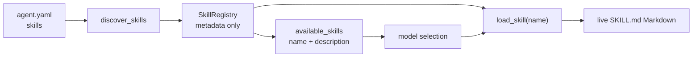

[English](README.en.md)

# `iris.skill`

`iris.skill` 是可选的项目级 Skill 扩展：它从当前 Agent workspace 中发现 `SKILL.md`，只把
名称和描述放进 system context，并通过 `load_skill` 按需读取 Markdown。当前只支持
`PROJECT` scope 和模型自行选择；它不执行 Skill 正文、不挂载脚本，也不提供 user-level、
builtin、跨项目、热刷新或检索式 Skill。

## 工作方式



Factory 每次构造 runtime 时只发现一次，各候选目录只枚举一次。正文不常驻 registry 或 context；
名称、描述与路径保留为构造时的目录快照；`load_skill` 每次读取登记路径的当前文本。catalog 非空时，
`RuntimeFactory` 才会把 `available_skills` slot 和共享同一 registry 的 `load_skill` 注册到
context/tool 链路中。当前 runtime 不自动刷新这份快照。

## 目录与配置

默认目录位于 `permissions.workspace` 内：

```text
<permissions.workspace>/
└── .agents/
    └── skills/
        └── my-skill/
            └── SKILL.md
```

只扫描 root 的第一层子目录。目录名就是稳定 Skill key，必须是小写 kebab-case；入口文件名
必须精确为 `SKILL.md`。

```yaml
skills:
  enabled: true
  root: .agents/skills
  require:
    - my-skill
```

- `enabled` 默认为 `false`。关闭时完全绕过发现、catalog 和 `load_skill` 注册。
- `root` 默认为 `.agents/skills`，相对 `permissions.workspace` 解析，resolve 后越出 workspace
  会作为 `IrisConfigError` 拒绝。
- `require` 默认为空。名称必须是小写 kebab-case；任何必需 Skill 未发现都会使配置失败。
- root 不存在、单个候选格式错误或不可读等普通扫描问题会产生 warning diagnostic；不会让
  其他有效 Skill 失效。非空 `require` 可把缺失项提升为配置错误。

直接调用 `discover_skills()` 时，`SkillDiscoveryOptions.roots` 可声明多个 workspace 内的目录；
同名 Skill 由声明顺序靠前的目录提供，并产生冲突诊断。Agent YAML 自动装配使用一个 `PROJECT` root。

## `SKILL.md` 格式

```markdown
---
name: legacy-name
description: Review a Python change with the project's local conventions.
allowed-tools:
  - read_file
disable-model-invocation: true
version: 1
---

# Review instructions

Read the relevant files, then report concrete findings.
```

`description` 必须存在、是非空字符串，并作为 catalog 文案；超过 1024 字符会截断并产生
`DESCRIPTION_TRUNCATED` warning。目录名始终是实际名称；frontmatter 的 `name` 不一致只产生
`NAME_MISMATCH` warning。`allowed-tools`、`disable-model-invocation`、`version` 等未知字段仅原样
保存在 metadata 的 `extra_frontmatter` 中，当前不执行其语义。discovery 解析后不会保留或执行
正文；正文只在 `load_skill` 调用时返回给模型。

## Catalog 与按需加载

默认 catalog 是 order `900` 的普通 system slot `available_skills`，每项只包含 `name` 和
`description`。模型看到合适条目后调用：

```json
{"name": "my-skill"}
```

Catalog 使用指引读取项目 `prompts.root` 下的 `skill_catalog_usage.j2`，默认目录为
`.iris/prompts`。runner 初始化只补齐缺少的[默认模板](../prompts/skill_catalog_usage.j2)，保留
已有正文。`SkillCatalog(registry, *, prompt_snapshot=...)` 显式接收构造期项目快照，后续 slot
投影复用指引；新 runner 才采用提示修改。写入默认 XML 的 `usage` 属性时由
`ContextXmlRenderer` 转义，模板失败使用 `IrisSkillError`。这不刷新 Skill registry，
已登记 Skill 的正文仍按下面的 `load_skill` 规则读取。来源约定见 [prompts](../prompts/README.md)。

`load_skill` 返回当前 `SKILL.md` 含 frontmatter 的前 1000 行，不重新解析 frontmatter。Discovery 负责配置 root
与扫描目录边界；实际加载时会重新校验文件仍位于原 Skill 目录内，并由共享文件服务复核
workspace 边界。模型无需、也不应改用 `file.read` 获取正文。该工具只读取文本：不会执行正文、
自动调用其中命令或把 Skill 转换成一组工具。完整文本与文件观测在单个 worker 中从同一次
打开读取，再截取输出；成功的 `ReadFileRecord` 在事件循环合并，worker 不修改共享读取状态。

稳定工具错误码为 `SKILL_NOT_FOUND`、`SKILL_PATH_ERROR` 和 `SKILL_READ_ERROR`。
文件删除或无法读取仍返回读取错误；单纯编辑不会拒绝加载。

### 自定义 system template

自定义 template 分支不会调用默认 XML renderer；template 必须按 slot 名显式消费 catalog：

```jinja2


<available_skills count="{{ slot["attributes"]["count"] }}"
                  usage="{{ slot["attributes"]["usage"] }}">

  <item>
    <item name="description">{{ skill["description"] }}</item>
    <item name="name">{{ skill["name"] }}</item>
  </item>

</available_skills>


```

Jinja 默认关闭自动转义；上例通过模板内的 `autoescape` 块显式启用 XML 转义。
启用 Skill、发现结果非空且使用自定义 system template 时，
Factory 会记录 warning；若 template 忽略该 slot，catalog 对模型不可见，但 `load_skill` 仍已注册。

## 限制与兼容性

| 层 | 当前限制 |
| --- | --- |
| Discovery | 不设 Skill 数量或 `SKILL.md` 文件大小上限；只扫描第一层 |
| Description | catalog 最多 1024 字符；超长时截断并 warning |
| Context | `system.max_chars` 是完整渲染后的硬上限；超限抛 `IrisContextError`，不省略条目 |
| Provider | 仍受 provider 的总 context window 限制 |
| File read | 读取当前完整文本，`load_skill` 返回含 frontmatter 的前 1000 行 |
| Tool result | `load_skill` 默认 `max_result_chars=50000`；超长非错误结果由 executor 落为 artifact 并返回 preview |

Skill 目录必须位于 workspace 内，不提供 user-level 共享目录。多个项目使用共同父目录作为
`permissions.workspace` 时，可以让 `skills.root` 指向其中的共享目录；所有文件工具的可访问
范围也随 workspace 一同扩大。

同一 run 或同一 runner 的后续 run 都可读到编辑后的文件；catalog 描述仍是构造时快照，
可以与当前文件的新 frontmatter 不同。新增、重命名或刷新 catalog 需要重新构造 runtime，
或重启长期运行的 `iris chat`。关闭 Skill 时不读取目录或正文，不扫描 workspace 中的其他文件。
当前不承诺 provider cache 保持命中。

`SkillScope` 只有 `PROJECT`；`require` 和 `load_skill` 使用目录的 kebab-case 名称。
Catalog 展示已发现的全部 Skill，不提供 Skill 检索或 deferred catalog。

## 公共 API

`iris.skill` 包级公开符号严格为：

- `CATALOG_SLOT_NAME`
- `DEFAULT_SKILLS_ROOT`
- `LoadSkillTool`
- `SkillCatalog`
- `SkillDiagnostic`
- `SkillDiscoveryOptions`
- `SkillDiscoveryResult`
- `SkillMetadata`
- `SkillRegistry`
- `SkillScope`
- `discover_skills`
- `resolve_skills_root`

frontmatter helper、内部正则和 `LoadSkillInput` 都是实现细节。

目录扫描是 Skill name regex 与 description 规范化/截断的唯一 owner；`SkillMetadata` 是扫描结果
的 trusted projection，配置的 `max_description_chars` 会直接决定截断上限。`SkillDiagnostic` 是
仅在发现流程内传递的 frozen slots dataclass。

## 维护与验证

| 修改内容 | 主要位置 | 对应测试 |
| --- | --- | --- |
| metadata/frontmatter | `models.py`, `frontmatter.py` | `tests/skill/test_skill_discovery.py`, `tests/skill/test_skill_frontmatter.py` |
| 路径、扫描、优先级 | `discovery.py`, `registry.py` | `tests/skill/test_skill_discovery.py`, `tests/skill/test_skill_registry.py` |
| catalog 与按需加载 | `catalog.py`, `tool.py` | `tests/skill/test_skill_catalog.py`, `tests/skill/test_skill_tool.py` |
| config/factory 集成 | `../agents/config/base.py`, `../runtime/factory.py` | `tests/agents/test_skill_config.py`, `tests/runtime/test_factory_skills.py` |

```powershell
uv run pytest tests/skill tests/agents/test_skill_config.py tests/runtime/test_factory_skills.py
uv run ruff check src/iris/skill tests/skill
uv run mypy src/iris/skill
```

使用与设计：[Skill 与子 Agent](../../../docs/cookbook/skills-subagents.md) · [方法复用与委派](../../../docs/design/delegation.md)。
