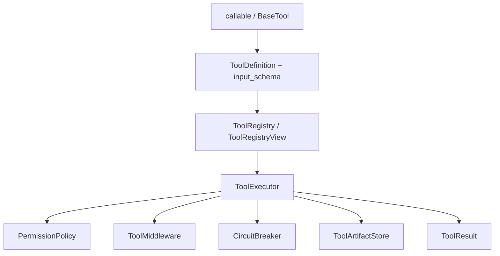
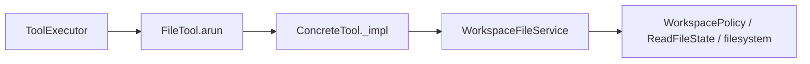

[中文](README.md)

# `iris.tools`

`iris.tools` is Iris's tool kernel. It adapts Python callables or `BaseTool` subclasses into
model-visible schemas and centralizes input validation, permission checks, execution, result
normalization, large-output artifacts, middleware, and circuit breaking.

## Architecture



## Quick start

```python
from pathlib import Path

from iris.message import ToolUseBlock
from iris.tools import ToolExecutionContext, ToolExecutor, ToolRegistry, tool


@tool(description="Create a greeting")
def greet(name: str) -> str:
    return f"Hello, {name}"


registry = ToolRegistry()
registry.register_function(greet)
executor = ToolExecutor(registry)

result = await executor.execute_one(
    ToolUseBlock(id="call_1", name="greet", input={"name": "Iris"}),
    ToolExecutionContext(workspace_root=Path(".")),
)
```

## Definitions, registry, and schemas

`ToolDefinition` holds the validated name, description, object JSON schema, capabilities, group,
aliases, deferred flag, output limits, and metadata. `ToolExecutionContext` carries call, workspace,
session, agent, permission, metadata, shared read-state information, and a shared live
`cancellation` signal that serialization excludes. `ToolResult` is the single result boundary;
`model_content` produces model-facing text and `to_block_metadata()` keeps the supported metadata
subset.

`BaseTool` defines `validate_input()`, read/destructive/concurrency classification, and async
`arun()`. `CallableTool` derives a schema from signatures, annotations, docstrings, or an explicit
Pydantic model and normalizes strings, `None`, JSON-compatible values, and exceptions. Preset kwargs
are hidden from schema and callers cannot override them.

`ToolRegistry` registers tools/functions, resolves names and aliases, creates filtered views, exports
active schemas, and searches deferred definitions. Deny filters override allow filters. Deferred
tools are hidden unless explicitly allowed. Schema helpers support Iris-native, OpenAI Chat,
OpenAI Responses, and Anthropic wrapper shapes; runtime's active provider path currently mounts the
OpenAI Chat shape.

`@tool` only attaches metadata; it does not register or wrap the function. Schema extraction supports
the documented Python/Pydantic types and Google-style docstring argument descriptions. Unsupported
parameter types produce validation errors.

## Execution and HITL preflight

`execute_one()` always returns `ToolResult`, mapping not-found, validation, permission, execution,
middleware, and open-circuit failures to stable error codes. `execute_many()` runs consecutive
read-only concurrency-safe calls concurrently and serializes writes or unsafe calls while preserving
result order and shared file read state. Classification failure conservatively falls back to serial.

`prepare_many()` performs registry lookup, validation, and policy checks without running middleware,
the breaker, artifact persistence, or tool side effects. It returns `PreparedToolCall` objects and a
human request where required. `execute_prepared()` begins a new stage, revalidates current state,
accepts an approval only for the exact tool-call ID, and optionally accepts a `ToolEffectGuard`.
Historical approval never overrides current deny, schema, workspace, or stale-read checks.

Preflight precedence is: deny returns `PERMISSION_ERROR`; a human tool under allow creates its own
question; a human tool under require-human fails closed to prevent nested gates; only an ordinary
require-human call creates a permission prompt.

After approval, execution checks the circuit breaker, cancellation, the effect guard, and
cancellation again before entering middleware `before_call`, tool `arun`, artifact handling,
middleware after hooks, and breaker accounting. A guard failure starts no tool effect. Cancellation
after a claim propagates as control flow to runtime instead of becoming a normal tool error.
Low-level executor callers may omit the guard; lifecycle execution requires it through
`ToolBridge`. Parallel context copies preserve identity for both shared read state and cancellation,
and `CallableTool` never normalizes cooperative cancellation.

## Built-in file tools

`register_file_tools()` registers, in stable order, `read_file`, `list_files`, `grep_search`,
`write_file`, and `edit_file`, injecting one shared `WorkspaceFileService`.



- reads may include `L0001 |` line numbers and update `ReadFileState`;
- list/grep recursively inspect UTF-8 regular files, skip `.iris`, binary failures, and escaping
  symlinks;
- overwriting/editing an existing file requires a prior unchanged read;
- edit requires exactly one match;
- resolved parent/symlink escapes are rejected;
- successful paths use workspace-relative `/` separators.

Large non-error output is stored at `.iris/tool-results/{session_id}/{call_id}.txt` with sanitized
identifiers, and the result becomes a preview plus artifact metadata. Default permissions do not
directly allow writes; configure `DefaultPermissionPolicy(write_mode="allow")` or let runtime host
the confirmation gate.

## Human tool, middleware, breaker, and discovery

YAML name `human.ask` registers model-visible `ask_question`. `AskQuestionTool` converts validated
input to `QuestionPrompt` and refuses direct `arun()`; runtime owns the interaction.

`ToolMiddleware` supports before, after, error, and legacy `after_execute` hooks. Middleware failures
become `MIDDLEWARE_ERROR`. `CircuitBreaker` tracks consecutive failures by tool name and returns
`CIRCUIT_OPEN` during cooldown.

`DeferredToolIndex` uses a local BM25-like ranker over name, tags, group, and description, with CJK
bigrams, low-weight single characters, query coverage, and stable sorting. `ToolSearchTool` exposes
`tool_search` and returns matching definitions without activating them.

## Public surface and boundaries

The exact top-level API is `src/iris/tools/__init__.py::__all__`, covering models, base/adapters,
registry/view, executor/preflight, permission/artifact/middleware/breaker types, file/human tools,
deferred discovery, schema helpers, and `tool`. Protected `_impl()` hooks and executor private
lifecycle methods are internal.

The package does not run provider loops, persist ordinary session data, render host UI, or provide
MCP implementations merely because `ToolCapability.MCP` exists.

## Maintenance

| Change | Main location | Tests |
| --- | --- | --- |
| Models and callable/schema adaptation | `base.py`, `schema.py` | schema/executor tests |
| Registry and deferred search | `registry.py`, `discovery.py` | registry/discovery tests |
| Lifecycle and HITL preflight | `executor.py`, `permissions.py` | executor/preflight tests |
| File safety | `builtin/file.py` | file tool/registry tests |

```bash
uv run pytest tests/tools
uv run ruff check src/iris/tools tests/tools
```
